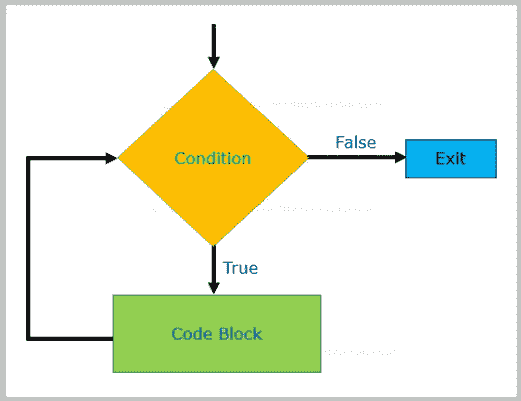

# Java | Java 教程中的 While 循环

> 原文:[https://www.softwaretestingmaterial.com/while-loop-in-java/](https://www.softwaretestingmaterial.com/while-loop-in-java/)

在上一个教程中，我们学习了循环 的 *[和循环](https://www.softwaretestingmaterial.com/for-loop-in-java/)* 的 [*增强，在本教程中我们将讨论 while 循环。*](https://www.softwaretestingmaterial.com/enhanced-for-loop/)



当特定条件为真时，while 语句连续执行语句块。

语法:

```java
while (expression) {
     // statement(s)
}
```

如果 while 语句的表达式计算结果为 true，则执行 while 块中的语句。while 语句继续测试表达式并执行其块，直到表达式的计算结果为 false。

```java
package ClassThreeControlFlowStatements;

public class WhileLoop {

	public static void main(String[] args) { 
            int i = 1; 
            while (i<=10){ 
                 System.out.println("Value of i is "+i); 
                 i++; 
            } 
        }

}
```

> 必读: [Java 教程](https://www.softwaretestingmaterial.com/java-tutorial/)