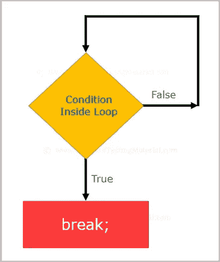

# Java 中的 Break 语句及示例

> 原文:[https://www . software testing material . com/break-statement-in-Java/](https://www.softwaretestingmaterial.com/break-statement-in-java/)

Java 中的 Break 语句用于中断 loop 语句或 switch 语句。Break 语句在指定条件下中断当前流。



注意:在内部循环的情况下，它只中断内部循环。

**语法:**

```java
package ClassThreeControlFlowStatements;

public class BreakStatement {

	public static void main(String[] args) {

		for (int i=1; i<=10; i++)
		{			
			if (i==4)
	        {
				break;
	        }

	        System.out.println("Value of i is "+i);

		}

	}

}
```

**开关案例中的中断语句:**

请参考 Switch Case 语句。

带有内部循环的 Break 语句:

```java
package ClassThreeControlFlowStatements;

public class BreakStatementInnerLoop {

	public static void main(String[] args) {

		for (int x=1; x<=4; x++)
		{			
			for (int y=1; y<=4; y++){

				if (x==2 && y==2)
		        {
					System.out.println("Value of x is "+x+" and Value of y is "+y);
					break;
		        }

				System.out.print(x);
		        System.out.println(y);

			}

		}

	}

}
```

> 必读: [Java 教程](https://www.softwaretestingmaterial.com/java-tutorial/)