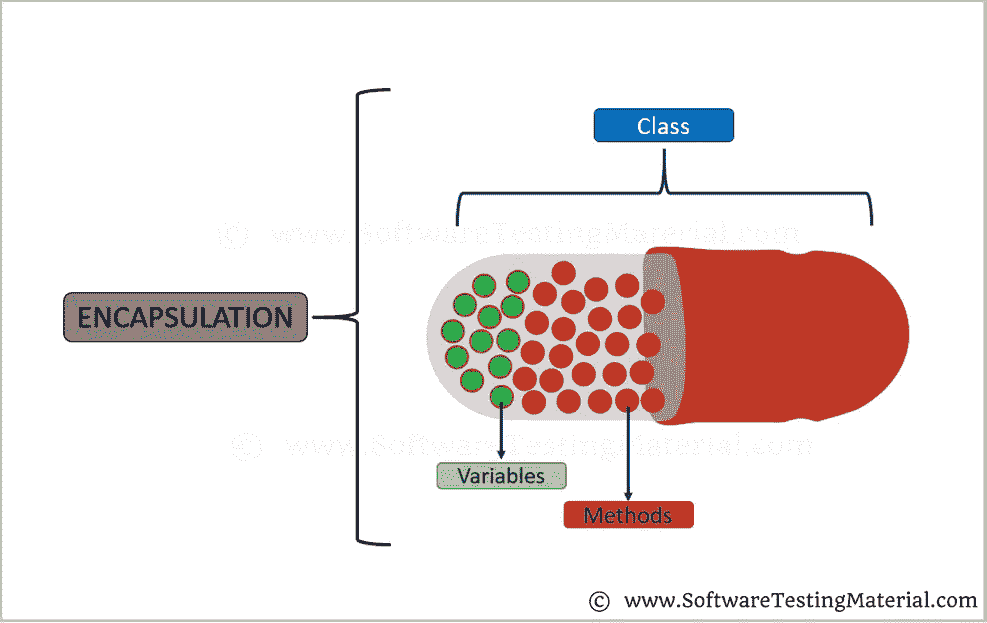

# Java 封装| Java 教程

> 原文:[https://www . software testing material . com/encapsulation-in-Java/](https://www.softwaretestingmaterial.com/encapsulation-in-java/)

封装是一种将代码和数据绑定在一个单元中的机制。我们举个胶囊的例子。不同的粉末或液体药物被封装在胶囊内。同样，在封装中，所有的方法和变量都包装在一个类中。

[T2】](https://www.softwaretestingmaterial.com/wp-content/uploads/2018/03/Encapsulation.png)

在与封装相关的文章中，我们将会看到一些关于封装的示例程序的详细解释。

让我们看看如何实现封装。将实例变量设置为 private，这样其他类就不能直接访问这些私有变量。将该类的 getter 和 setter 方法设置为 public，这样我们就可以设置和获取字段的值。

```
package encapsulationClass;

public class EncapsulationClassTwo {

	public static void main(String [] args){

		EncapsulationClassOne obj = new EncapsulationClassOne();
                // Setting values of the variables
		obj.setAge(25);
		obj.setName("Rajkumar");

		System.out.println("My name is "+ obj.getName());
		System.out.println("My age is "+ obj.getAge());

	}

}
```

输出:

```
My name is Rajkumar
My age is 25
```

在上面的例子中，你可以发现所有的数据成员(变量)都被声明为私有的。如果数据成员是私有的，这意味着它只能在同一个类中被访问。没有其他类可以访问其他类的私有变量。为了从其他类访问这些私有变量，我们使用了公共的 getter 和 setter 方法，比如 getAge()、getName()、setAge()、setName()。因此，当我们可以将变量设置为私有并对其他类隐藏它们的实现时，就可以通过公共方法访问数据。这种方式我们称封装为数据隐藏。

> 必读: [Java 教程](https://www.softwaretestingmaterial.com/java-tutorial/)