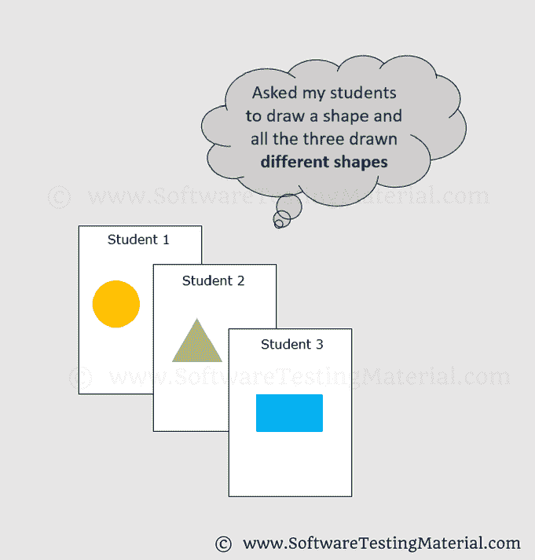
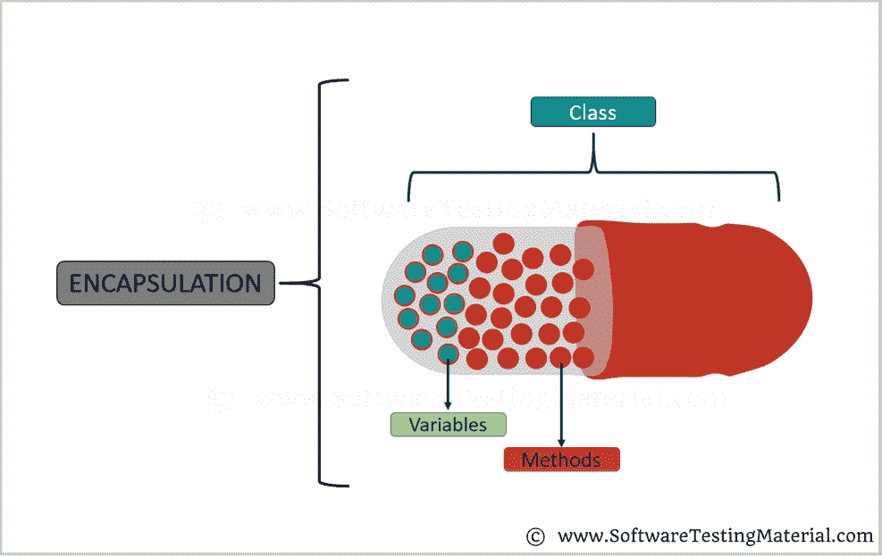

# 2022 年前 40+ Java 面试问答

> 原文:[https://www . software testing material . com/Java-interview-questions/](https://www.softwaretestingmaterial.com/java-interview-questions/)


在本帖中，我们看到了面向新生和有经验者的核心 Java 面试问题。这篇文章也涵盖了 Selenium 自动化测试人员的核心 Java 面试问题。这篇关于 Java 面试问题的文章是用 Java 的基本和重要概念准备的，并附有例子，便于你理解。

> 不要错过 [Java 测验](https://www.softwaretestingmaterial.com/java-quiz/)

**相关帖子:**

*   [硒面试问题](https://www.softwaretestingmaterial.com/selenium-interview-questions/)
*   [测试自动化框架面试问题](https://www.softwaretestingmaterial.com/test-automation-framework-interview-questions/)
*   [如何在面试中解释测试自动化框架](https://www.softwaretestingmaterial.com/explain-test-automation-framework/)
*   [你为什么选择软件测试作为你的职业](https://www.softwaretestingmaterial.com/choose-software-testing-as-a-career/)
*   [说说你自己](https://www.softwaretestingmaterial.com/6-important-interview-questions/)
*   [你的优势是什么](https://www.softwaretestingmaterial.com/what-are-your-strengths/)

## **最常见的 Java 面试问题**

让我们继续，看看这个最重要和最常见的基本和高级 Java 编程面试问题及其答案的综合列表。

### **1。解释 Java Main 方法 public static void Main(String[]args)**

当你开始[学习 Java](https://www.softwaretestingmaterial.com/java-tutorial/) 的时候，你遇到的第一个方法就是***public static void main(String[]args)***。任何 Java 程序的起点都是 main()方法。它是 Java 的重要方法之一。从技术上讲，main 方法是 Java 程序开始执行的起点。JVM 总是寻找这个方法签名来开始运行应用程序。[勾选此项，了解详细解释](https://www.softwaretestingmaterial.com/java-main-method/)。

```
public class MyClass {
  public static void main(String args[]) {
    System.out.println("Hello World!");
  }
}
```

### **3。提一下 Java 的一些特性？**

对 java 的普及起重要作用的一些特性如下:

*   简单:Java 很好学。尽管 Java 是基于 C++的，但它是通过消除 C++糟糕的编程实践而开发出来的。
*   面向对象:Java 是一种面向对象的编程语言。Java 中的一切都是对象。

点击此处了解更多信息。

*   **可移植:** Java 运行时环境使用字节码验证过程来确保通过网络加载的代码不会违反 Java 安全约束。
*   **平台无关:** Java 是平台无关的。Java 是一种一次编写，随处运行的语言。不需要任何修改，我们可以在不同的平台上使用一个程序。
*   **安全:** Java 以安全著称。它提供无病毒系统。
*   **高性能:** Java 通过使用 JIT(实时)编译器来实现高性能
*   **多线程:** Java 的多线程特性允许我们编写可以同时执行多项任务的程序。Java 的多线程概念共享一个公共内存区域。它不会为每个线程占用内存。

### **4。Java 是 100%面向对象的语言吗？**

Java 不是一种纯面向对象的语言，因为它支持基本数据类型，如字节、布尔、字符、双精度、浮点、整数、长整型、短整型。这些原始数据类型不是面向对象的。这就是 Java 不是 100%面向对象语言的原因。

### **5。面向对象的编程语言和基于对象的编程语言有什么区别？**

面向对象的语言和基于对象的语言是有区别的。

**面向对象语言:**

*   一些面向对象的语言是 Java，C#，VB。网络、闲聊等。,
*   这些语言支持 OOPs 的所有概念。
*   这些语言没有内置的对象。

**基于对象的语言:**

*   一些基于对象的语言是 JavaScript，VBScript 等。,
*   这些语言支持 OOPs 的所有概念，如继承和多态。
*   这些语言有内置的对象，比如 JavaScript 有窗口对象。

### **6。Java 中声明和定义的区别？**

**声明:**如果你只是声明了一个类或方法/函数或变量，而没有提及任何关于那个类或方法/函数或变量看起来像什么的东西，这在 Java 中被称为声明。

定义:如果你定义了一个类或方法/函数或变量是如何实现的，那么它在 Java 中被称为定义。

当我们创建一个接口或抽象类时，我们只是声明一个方法/函数，而不是定义它。

为了更清楚地理解，请查看下图


### 7 .**。什么是 JRE，为什么需要它？**

JRE 代表“Java 运行时环境”。它由 JVM (Java 虚拟机)、Java 平台类和支持库组成。使用 JRE，我们只能执行已经开发的应用程序。我们不能开发新的应用程序或修改现有的应用程序。
顾名思义，JRE 只提供运行时环境。

### **8。什么是 JDK，为什么需要它？**

JDK 代表 Java 开发工具包。它是 JRE (Java 运行时环境)的超集。使用 JDK，我们可以开发、编译和执行(运行)新的应用程序，也可以修改现有的应用程序。我们需要在开发人员的机器上安装 JDK，在那里我们要开发新的应用程序或修改现有的应用程序。
JDK 包括 JRE 和开发工具(开发、调试和监控 Java 程序的环境)。

### **9。什么是 JVM，为什么需要它？**

JVM 代表 Java 虚拟机。JVM 驱动 java 代码。使用 JVM，我们可以通过将 java 字节码转换成当前的操作系统机器语言来运行它们。它使 Java 成为一种可移植的语言(编写一次，在任何地方运行)

### 10。Java 中的对象是什么？

对象是一个类的实例。对象有状态(变量)和行为(方法)。

例如:狗是动物类的对象。狗有它的状态，如颜色，名字，品种，和行为，如吠叫，进食，摇尾巴。

```
public class MyClass{    //Class name (MyClass) declaration
    public static void main(String[] args){ 
        MyClass obj = new MyClass(); //Object Creation
    }
}
```

### **11。Java 中的类是什么？**

一个类可以被定义为对象的集合。它是描述对象状态和行为的蓝图或模板。

```
public class MyClass{    //Class name (MyClass) declaration
int a = 9;   // Variable declaration
int b = 99;
    public void myMethod(){ //Method (myMethod) declaration
        int sum=a+b;
    }
}
```

### **12。Java 中的构造函数是什么？**

Java 中的构造函数用于创建作为类实例的对象。构造函数名应该与类名相同。它看起来像一个方法，但它不是一个方法。它不会返回任何值。我们已经看到方法可能会返回值。如果类中没有构造函数，编译器会自动创建一个默认的构造函数。

### 13。什么是局部变量和实例变量？

**局部变量:**

局部变量是我们在方法内部声明的变量。方法通常会将其临时状态存储在局部变量中。

它只能在块、函数或构造函数内部访问。

```
public void website() {
String websiteName;
double websiteLoadTime;
int webisteAge;
}
```

String websiteName、double websiteLoadTime、int websiteAge 是上面示例中的局部变量。

**实例变量(非静态):**

实例变量是在类内部但在方法外部声明的变量。我们不把这个变量声明为静态的，因为这些变量是非静态变量。

该类中的所有方法都可以访问它。

```
class website() {
public String websiteName;
public double websiteLoadTime;
public int webisteAge;
}
```

在上面的例子中，websiteName，websiteLoadTime，websiteAge 是实例变量。

在这里阅读更多关于 Java 中[变量的信息](https://www.softwaretestingmaterial.com/variables-in-java/)

### **14。哎呀概念是什么？**

OOPS 代表面向对象编程系统。它包括抽象、封装、继承、多态、接口等。,

阅读更多关于 Java 中 [OOPs 概念的内容](https://www.softwaretestingmaterial.com/oops-concept/)

### 15。Java 中的继承是什么？

继承是一个类继承另一个类的属性(方法和字段)的过程。[在此阅读更多内容](https://www.softwaretestingmaterial.com/inheritance-in-java/)


### 16。什么是多态性？

多态性允许我们以多种方式执行一项任务。让我们打破单词多态性，看看它，'聚'的意思是'许多'和'形态'的意思是'形状'。[在此阅读更多内容](https://www.softwaretestingmaterial.com/polymorphism-in-java/)



假设我们有四个学生，我们让他们画一个形状。这四个人都可以画出不同的形状，比如圆形、三角形和矩形。

### **17。多态性的类型有哪些？**

Java 中有两种类型的多态性

1.编译时多态性(静态绑定)——方法重载
2。运行时多态性(动态绑定)-方法覆盖

我们可以通过“方法重载”和“方法覆盖”来执行多态性

### 18。什么是方法重载？

一个类包含多个同名但参数不同的方法称为方法重载

霸王法有三种方式。

*   不同数据类型的参数
*   具有不同数据类型序列的参数
*   不同数量的参数

阅读更多关于 Java 中[方法重载的内容](https://www.softwaretestingmaterial.com/method-overloading-in-java/)

### **19。什么是方法重写？**

在子类中声明一个已经存在于父类中的方法称为方法重写。

简而言之，覆盖意味着覆盖现有方法的功能。

在这种情况下，如果我们调用带有子类对象的方法，那么就会调用子类方法。要调用父类方法，我们必须使用 **super** 关键字。

阅读更多关于[方法覆盖](https://www.softwaretestingmaterial.com/method-overriding-in-java/)的内容

### 20。Java 中的抽象是什么？

抽象是隐藏内部细节的实现并向用户显示功能的方法。


比如:手机。

一个使用手机的门外汉不知道手机内部是如何工作的，但他可以打电话。

### **21。Java 中的抽象类是什么？**

我们可以很容易地识别一个类是否是抽象类。声明中包含抽象关键字的类是抽象类。

语法:

```
abstract class <class-name>{}
```

要记住的几点:

*   抽象类可能包括也可能不包括抽象方法
*   如果一个类被声明为抽象的，那么它就不能被实例化。
*   如果一个类有抽象方法，那么我们必须声明这个类为抽象类
*   当抽象类被子类化时，子类通常为其父类中的所有抽象方法提供实现。然而，如果没有，那么子类也必须被声明为抽象的。

### **22。什么是抽象方法？**

抽象方法是声明时没有实现的方法(没有大括号，后跟分号)，如下所示:

```
abstract void myMethod();
```

为了使用抽象方法，您需要在子类中覆盖该方法。

### **23。Java 中的接口是什么？**

Java 中的接口看起来类似于类，但是接口和类是两个不同的概念。一个接口可以有方法和变量，就像类一样，但是在接口中声明的方法在默认情况下是抽象的。我们可以用接口在 Java 中实现 100%的抽象和多重继承。阅读 Java 中关于[接口的更多内容。](https://www.softwaretestingmaterial.com/interface-in-java/)

### **24。Java 中的封装是什么？**

封装是一种将代码和数据绑定在一个单元中的机制。我们举个胶囊的例子。不同的粉末或液体药物被封装在胶囊内。同样，在封装中，所有的方法和变量都包装在一个类中。阅读更多关于 Java 封装的内容



### **25。Java 中的 String 是什么？**

Java 中的字符串是表示字符序列的对象。字符数组的工作方式与 Java 字符串相同。Java 中的 String 是一个不可变(不能增长)的对象，这意味着它是常量，一旦创建就不能更改。

**例如:**

char[] c={'S '，' T '，' M ' }；

### **26。为什么 Java 中的字符串是不可变的？**

在 Java 中，字符串是不可变的，以确保字符串值不会改变。字符串通常在多个客户端之间共享。如果字符串的值改变(从“stm”到“STM”)，它将影响所有的引用变量，并导致严重的差异。因此，字符串在 Java 中是不可变的。使字符串不可变增强了应用程序的安全性、缓存、同步和性能。

### **27。Java 中 equals()方法和双等号运算符(==)有什么区别？**

**等于()方法**

*   这个方法是在 Java 的 Object 类中定义的。
*   它用于检查由业务逻辑定义的两个对象之间的内容是否相等。
*   public boolean equals(Object o)是 Object 类提供的方法。

**双等运算符(==)**

*   它是 Java 中的二元运算符。
*   它用于比较地址(或引用)，即检查两个对象是否指向同一个内存位置。
*   默认实现使用双等号运算符==来比较两个对象。

### **28。Java 中如何把整数转换成字符串？**

```
package softwareTestingMaterial;

public class STM {

	public static void main(String[] args) {
		int x = 123;
                int y = 456;
                String s1 = Integer.toString(x);
                String s2 = Integer.toString(y);
		System.out.println(""String s1 = "" + s1);
		System.out.println(""String s2 = "" + s2); 
	}	
}
```

### **29。Java 中如何把字符串转换成整数？**

```
package softwareTestingMaterial;

public class STM {

	public static void main(String[] args) {
		String str = ""100"";
                // Integer.parseInt()
                System.out.println( Integer.parseInt( str ));
	}	
}
```

### 三十岁。Java 中如何把 Char 转换成 Integer？

```
package softwareTestingMaterial;

public class STM {

	public static void main(String[] args) {
                // Initializing a character(ch)
		char c = '9';
                // Converting the character to an interger value
                int number = Integer.parseInt(String.valueOf(c));
                System.out.println(number);
	}	
}
```

### 31。编写一个程序来打印下面给出的图案

```
1 
1 2 
1 2 3 
1 2 3 4 
1 2 3 4 5
```

Here is the program to print the pattern mentioned above

```
package softwareTestingMaterial;

public class NumberPattern {

	public static void main(String[] args) {
		for (int x = 1; x <= 5; x++) {
			for (int y = 1; y <= x; y++) {
			System.out.print(y+" ");
			}
		System.out.println();
		}
	}	
}
```

### 32。 **写一个程序打印下面给出的图案(左三角星形图案)**

```
* 
* * 
* * * 
* * * * 
* * * * *
```

Here is the program to print the pattern mentioned above

```
package softwareTestingMaterial;

public static void main(String args[]) 
{ 
//x for rows, y for columns, and row denotes the number of rows to print 
int x, y, row=5; 
//outer loop for rows 
for(x=0; x<row; x++) 
{ 
//inner loop for columns 
for(y=0; y<=x; y++) 
{ 
//To prints stars 
System.out.print("* "); 
} 
//Cursor goes to the new line after printing each line. 
System.out.println(); 
} 
}	
}
```

### 33。 **写一个程序打印下面给出的图案(直角三角形星形图案)**

```
        * 
      * * 
    * * * 
  * * * * 
* * * * *
```

Here is the program to print the pattern mentioned above

```
package softwareTestingMaterial;

public static void main(String args[]) 
{ 
//x for rows, y for columns, and row denotes the number of rows to print 
int x, y, row=5; 
//outer loop for number of rows 
for(x=0; x<row; x++) 
{ 
//inner loop for columns 
for(y=2*(row-x); y>=0; y--) 
{ 
//To prints spaces
System.out.print(" "); 
}
//Inner loop for columns
for(y=0; y<=x; y++)
{
//To prints stars
System.out.print("* ");
}
//Cursor goes to the new line after printing each line
System.out.println();
} 
}	
}
```

### 34。 **写一个程序打印下面给出的图案(金字塔星形图案)**

```
    * 
   * * 
  * * * 
 * * * * 
* * * * *
```

Here is the program to print the pattern mentioned above

```
public static void main(String args[]) 
{ 
//x for rows, y for columns, and row denotes the number of rows to print
int x, y, row = 5; 
//Outer loop for rows 
for (x=0; x<row; x++) 
{ 
//inner loop for space 
for (y=row-x; y>1; y--) 
{ 
//To print space between two stars 
System.out.print(" "); 
} 
//inner loop for columns 
for (y=0; y<=x; y++ ) 
{ 
//To print star 
System.out.print("* "); 
} 
//Cursor goes to the new line after printing each line.
System.out.println(); 
} 
}
```

### 35。写一个程序来打印斐波那契数列直到计数 10。

```
package softwareTestingMaterial;

public class FibonacciSeries {

	public static void main(String args[]) {
		int a = 0, b = 1, c, i, count = 10;
		// To print 0 and 1
		System.out.print(a + " " + b);
		// loop starts from 2\. We have already printed 0 and 1 in the previous step
		for (i = 2; i < count; i++) {
			c = a + b;
			System.out.print(" " + c);
			a = b;
			b = c;
		}
	}
}
```

### 36。如何在 Java 中反转一个字符串？

```
package softwareTestingMaterial;

public class ReverseString {

	public static void main(String[] args) {
	// Using StringBuffer class
	StringBuffer a = new StringBuffer("Software Testing Material");
	// use reverse() method to reverse string
	System.out.println(a.reverse());
	}

}
```

**Another method:**

```
package softwareTestingMaterial;

public class ReverseString {

	public static void main(String[] args) {
		String input="Software Testing Material";
		StringBuilder input1 = new StringBuilder();
		input1.append(input);
		input1=input1.reverse(); 
		for (int i=0;i<input1.length();i++)
		System.out.print(input1.charAt(i));
	}

}
```

[Check this for other methods we use to reverse a String in Java](https://www.softwaretestingmaterial.com/reverse-a-string-in-java/)

### 37。如何从给定的数组中找出最大值？

```
package softwareTestingMaterial;

public class LargestValue {

	public static void main(String[] args){

		int[] arr={28,3,15,9,17,4,23,2};

		int val=arr[0];

		for(int i=0; i<arr.length; i++){
			if(arr[i] > val){
				val=arr[i];
			}
		}
		System.out.println("Largest value in the Given Array is "+ val);
	}
}
```

### 38。如何显示 1 到 100 之间的所有质数

只能被 1 和它本身整除的数称为质数。例如，2，3，5，7，11…是质数。

```
package softwareTestingMaterial;

public class PrimeNumbersOneToHundred {
   public static void main (String[] args){		
       int i =0;
       int num =0;
       String  primeNumbers = "";

       for (i = 1; i <= 100; i++){ 		  	  
          int counter=0; 	  
          for(num =i; num>=1; num--){
             if(i%num==0){
            	 counter = counter + 1;
             }
          }
		  if (counter ==2){
		     primeNumbers = primeNumbers + i + " ";
		  }	
       }	
       System.out.println("Prime numbers from 1 to 100 are :");
       System.out.println(primeNumbers);
   }
}
```

### 39。如何显示 1 到 n 之间的所有质数(n 是数字，由用户输入)

```
package softwareTestingMaterial;

import java.util.Scanner;

public class PrimeNumbersOneToN {
   public static void main (String[] args){		
      Scanner scanner = new Scanner(System.in);
      int i =0;
      int num =0;
      String  primeNumbers = "";
      System.out.println("Enter the value of n :");
      int n = scanner.nextInt();
      scanner.close();
      for (i = 1; i <= n; i++)  	   
      { 		 		  
         int counter=0; 		  
         for(num =i; num>=1; num--)
         {
	    if(i%num==0)
	    {
		counter = counter + 1;
	    }
	 }
	 if (counter ==2)
	 {
	    primeNumbers = primeNumbers + i + " ";
	 }	
      }	
      System.out.println("Prime numbers from 1 to n are :");
      System.out.println(primeNumbers);
   }
}
```

### 40。如何通过用户的输入判断给定的数是否是质数

```
package softwareTestingMaterial;

import java.util.Scanner;

public class PrimeNumberVerification {
    public static void main(String args[])
    {       
        int i, j, flag = 0;
        System.out.print("Enter any number which you want to verify whether it is a prime number or not :");
        Scanner s = new Scanner(System.in);
        j = s.nextInt();
        for( i = 2; i < j; i++){
            if(j % i == 0){
                flag = 0;
                break;
            }
            else
            {
                flag = 1;
            }
         }
         if(flag == 1){
             System.out.println(j+" is a prime number.");
         }
         else{
             System.out.println(+j+" is not a prime number.");
         }           
    }
}
```

### 41。写一个程序打印斐波那契数列

**方法一:**

```
package softwareTestingMaterial;

public class FibonacciSeries {

	public static void main(String args[]) {
		int a = 0, b = 1, c, i, count = 10;
		// To print 0 and 1
		System.out.print(a + " " + b);
		// loop starts from 2\. We have already printed 0 and 1 in the previous step
		for (i = 2; i < count; i++) {
			c = a + b;
			System.out.print(" " + c);
			a = b;
			b = c;
		}
	}
}
```

**方法二:**

```
package softwareTestingMaterial;

import java.util.Scanner;

public class FibonacciSeriesOne {
	public static void main(String[] args){
		System.out.println("Enter Iteration to print Fibonacci Series");
		FibonacciCheck.checkFibonacci(new Scanner(System.in).nextInt());
	}
}

class FibonacciCheck {
	public static void checkFibonacci(int number){
		int first=0,second=1;
		int third=0;
		int i=1;
		System.out.print("Fibonacci Series upto: "+number+" is ");
		System.out.print(first+","+second+",");
		while(i<=number){
			third=first+second;
			System.out.print(third+",");
			first=second;
			second=third;
			++i;
		}
	}
}
```

### **42。如何用 Java 逐行读取一个文件？**

在 Java 中，我们可以用两种方法逐行读取一个文件。

1.BufferedReader 类
2。扫描仪类别

**使用 BufferedReader 类:**

BufferedReader 类属于 java.io 包，它提供 readLine()方法在 java 中逐行读取文件。

```
package softwareTestingMaterial;

import java.io.BufferedReader;
import java.io.FileReader;
import java.io.IOException;

public class ReadLineByProgram {

public static void main(String[] args) {
BufferedReader reader;
try {
reader = new BufferedReader(new FileReader(
"/Users/Rajkumar/Downloads/STM.txt"));
String line = reader.readLine();
while (line != null) {
System.out.println(line);
// read next line
line = reader.readLine();
}
reader.close();
} catch (IOException e) {
e.printStackTrace();
}
}
}
```

**使用扫描仪类别:**

Java Scanner 类提供了 nextLine()方法来一行一行地显示文件内容。

```
package softwareTestingMaterial;

import java.io.File;
import java.io.FileNotFoundException;
import java.util.Scanner;

public class ReadLineByProgram {

public static void main(String[] args) {
try {
Scanner scanner = new Scanner(new File("/Users/Rajkumar/Downloads/STM.txt"));
while (scanner.hasNextLine()) {
System.out.println(scanner.nextLine());
}
scanner.close();
} catch (FileNotFoundException e) {
e.printStackTrace();
}
}
}
```

### **43。** **数组和 ArrayList 的区别？**

| 排列 | 数组列表 |
| --- | --- |
| 数组是静态的 | 数组列表是动态的 |
| 数组的大小应该在数组声明时给出。创建数组后，我们不能更改它的大小 | 可能不需要阵列的大小。它动态地改变大小。每当我们向数组列表中添加元素时，数组列表的容量就会自动增加 |
| 数组可以包含原始数据类型和对象 | ArrayList 不能包含基元数据类型。它只包含对象 |
| 数组是多维的 | 数组列表总是一维的 |

### **44。Java 中 ArrayList 和 HashSet 的区别？**

| 数组列表 | HashSet |
| --- | --- |
| ArrayList 实现列表接口 | HashSet 实现 Set 接口 |
| 数组列表允许重复 | HashSet 不允许重复 |
| ArrayList 是一个有序的集合，维护元素的插入顺序 | HashSet 是一个无序的集合，不保持插入顺序 |
| ArrayList 由一个数组支持 | HashSet 由 HashMap 实例支持 |
| 数组列表是基于索引的 | HashSet 是基于对象的 |
| 在 ArrayList 中，我们可以通过调用 get()方法来检索对象，或者通过调用 remove()方法来删除对象 | 在 HashSet 中，我们无法实现 get()方法 |

通过示例程序了解更多关于[数组](https://www.softwaretestingmaterial.com/arrays-in-java/)和[数组列表](https://www.softwaretestingmaterial.com/arraylist-in-java/)

### **45。Java 中有哪些不同的访问修饰符？**

访问修饰符细分为四种类型，如默认、公共、私有、受保护


**default:** 默认访问修饰符的范围仅限于包。如果我们没有提到任何访问修饰符，那么它就像一个默认的访问修饰符。

**private:**private 访问修饰符的作用域只在类内。

注意:类或接口不能声明为私有

**protected:**protected 访问修饰符的作用域在包内，也可以通过继承在包外。

注意:类不能声明为受保护的

**public:**public access 修饰符的范围无处不在。它没有任何限制。声明为公共的数据成员、方法和类可以从任何地方访问。

[参见一些访问修饰符的示例程序](https://www.softwaretestingmaterial.com/access-modifiers-in-java/)

### **46。静态绑定和动态绑定的区别？**

1.静态绑定也称为早期绑定，而动态绑定也称为晚期绑定。
2。在编译时确定对象的类型是静态绑定，而在运行时确定对象的类型是动态绑定
3。Java 对重载方法使用静态绑定，对重写方法使用动态绑定。

要了解更多这方面的知识，你必须经历[方法重载](https://www.softwaretestingmaterial.com/method-overloading-in-java/)和[方法覆盖](https://www.softwaretestingmaterial.com/method-overriding-in-java/)。

### **47。抽象类和接口的区别？**

| 抽象类 | 连接 |
| --- | --- |
| 要声明抽象类，我们必须使用抽象关键字 | 要声明接口，我们必须使用接口关键字 |
| 在抽象类中，关键字 Abstract 是将方法声明为抽象所必需的 | 在接口中，关键字 abstract 是可选的，用于将方法声明为抽象。默认情况下，编译器将所有方法视为抽象方法 |
| 抽象类包含抽象方法和具体方法(带主体的方法) | 一个接口只能有抽象方法 |
| 抽象类提供部分抽象 | 接口提供了完全的抽象 |
| 抽象类可以有公共的和受保护的抽象方法 | 一个接口只能有公共抽象方法 |
| 抽象类可以有带任何访问修饰符的静态、最终或静态最终变量 | 一个接口只能有公共静态最终变量 |
| 抽象类可以扩展一个类或一个抽象类 | 一个接口可以扩展任意数量的接口 |
| 抽象类不支持多重继承 | 接口支持多重继承 |

### **48。什么是多重继承？**

如果一个类实现了多个接口，或者一个接口扩展了多个接口，这就是多重继承。

### 49。Java 中 throw 和 throws 有什么区别？

**抛出关键词**

*   throw 关键字用于在函数或代码块中显式抛出程序中的异常。
*   检查到的异常不能仅通过 throw 进行传播。
*   throw 关键字后跟一个实例。
*   throw 关键字在方法中使用。
*   不能引发多个异常。

**抛出关键词**

*   throws 关键字在方法签名中用于声明一个异常，该异常可能在执行代码时被函数抛出。
*   被检查的异常可以用抛出来传播
*   throws 关键字后跟 class。
*   throws 关键字与方法签名一起使用。
*   可以声明多个异常，例如 public void method()抛出 IOException、SQLException。

我们将尽快更新这篇文章“Selenium 测试人员的 Java 面试问题”。继续访问。

如果你喜欢这篇文章，分享给你的朋友。

用示例程序学习 Java

**相关帖子:**

*   [硒面试问题](https://www.softwaretestingmaterial.com/selenium-interview-questions/)
*   [测试自动化框架面试问题](https://www.softwaretestingmaterial.com/test-automation-framework-interview-questions/)
*   [如何在面试中解释测试自动化框架](https://www.softwaretestingmaterial.com/explain-test-automation-framework/)
*   [你为什么选择软件测试作为你的职业](https://www.softwaretestingmaterial.com/choose-software-testing-as-a-career/)
*   [说说你自己](https://www.softwaretestingmaterial.com/6-important-interview-questions/)
*   [你的优势是什么](https://www.softwaretestingmaterial.com/what-are-your-strengths/)

> 不要错过 [Java 测验](https://www.softwaretestingmaterial.com/java-quiz/)

**相关帖子:**

*   [硒面试问题](https://www.softwaretestingmaterial.com/selenium-interview-questions/)
*   [测试自动化框架面试问题](https://www.softwaretestingmaterial.com/test-automation-framework-interview-questions/)
*   [如何在面试中解释测试自动化框架](https://www.softwaretestingmaterial.com/explain-test-automation-framework/)
*   [你为什么选择软件测试作为你的职业](https://www.softwaretestingmaterial.com/choose-software-testing-as-a-career/)
*   [说说你自己](https://www.softwaretestingmaterial.com/6-important-interview-questions/)
*   [你的优势是什么](https://www.softwaretestingmaterial.com/what-are-your-strengths/)