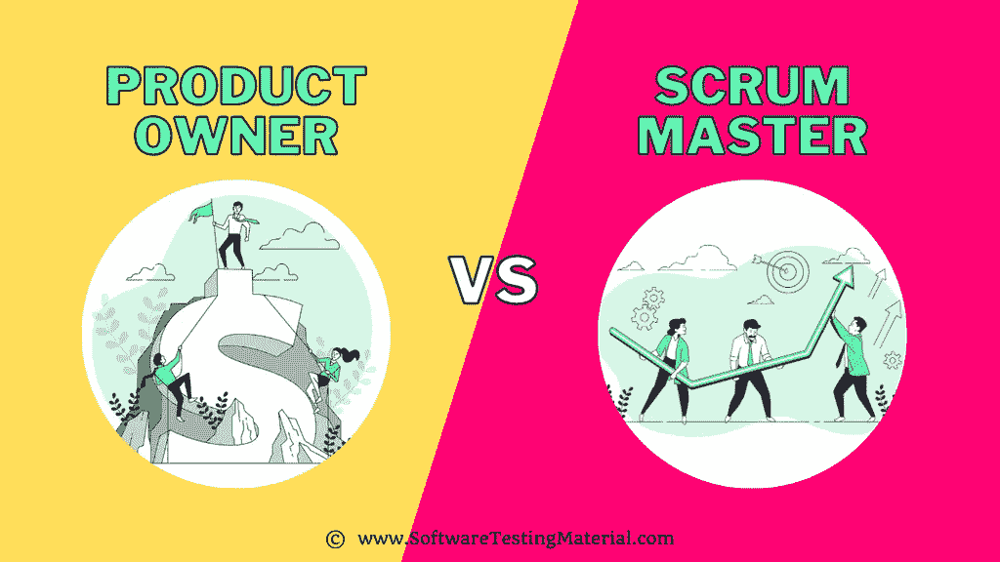

# 产品负责人 vs Scrum 大师:你应该知道的一切

> 原文:[https://www . software testing material . com/product-owner-vs-scrum-master/](https://www.softwaretestingmaterial.com/product-owner-vs-scrum-master/)

对于一个敏捷新手来说，Scrum Master 和产品负责人的角色可能大部分是重叠的。然而，必须注意两者之间的差异。

人们不仅应该认识到产品经理和 scrum master 的任务可能重叠，还应该认识到他们在任何给定的大型项目中是如何互补的。

## 谁是产品负责人？

产品所有者是产品的关键决策者，并对产品的成功负责。产品所有者是一个个体，而不是一个团体。

他们负责产品策略、路线图，确保产品满足用户的需求，并通过 Scrum 团队的工作最大化产品的价值。

许多涉众的需求可能由产品所有者来代表。那些想要修改产品积压的人可能会试图说服产品所有者。

产品负责人通常具有产品管理或相关领域的背景。

产品负责人需要能够做出艰难的决定，并且能够优先考虑产品的开发。

## 谁是 Scrum 大师？

Scrum 大师是使用敏捷项目管理带领团队完成项目过程的专业人士。

Scrum Master 是一个 Scrum 团队的推动者和领导者。

Scrum Master 负责建立 Scrum 指南中定义的 Scrum。他们通过帮助团队和整个公司的每个人理解和应用 Scrum 理论和实践来实现这一点。Scrum 团队的有效性由 Scrum 主管负责。

Scrum Master 还负责跟踪团队的进展，并确保他们达到他们的冲刺目标。在每个冲刺阶段结束时，Scrum Master 会回顾团队的工作，并帮助确定需要改进的地方。Scrum Master 在任何 Scrum 团队中都是一个至关重要的角色，团队的成功很大程度上取决于 Scrum Master 的促进和领导能力。

## **产品负责人技能**

*   产品负责人可以是任何人，市场营销人员或工程师，但他们需要拥有广泛的技能来掌握这一角色。
*   了解他们所处的行业将使他们能够理解市场是如何运作的。
*   产品负责人必须很好地掌握 ROI、技术技能、最终用户视角等概念，并且必须致力于愿景。
*   产品负责人将与业务部门保持持续的沟通，这给了他们一个在信任的基础上建立良好关系的机会。从长远来看，这种能力有助于产品的成功。

## **Scrum 大师技能**

*   众所周知，scrum 大师对敏捷方法有深入的了解。
*   他/她非常擅长沟通，可以成为导师。
*   如果团队内部对任务和时间表有任何模糊不清的地方，scrum master 应该证明任务的合理性并解释其相关性。
*   从管理人员的角度来看，scrum masters 也是高度组织化的。
*   有了内在的领导素质，他们需要和团队一起努力，为队友实现目标。
*   保持团队成员的积极性，防止团队走捷径，是成为 scrum 大师的另一项关键技能。

## **产品负责人职责**

*   创建和维护产品积压。
*   与产品经理合作
*   创建产品愿景和路线图。
*   与 Scrum Master 合作，确保产品的开发与最初的提议一致。
*   确保产品待定项得到更新，并对整个团队可见。
*   跨部门工作
*   分清任务的轻重缓急
*   评估整个产品开发过程的进展。

## **Scrum Master 职责**

*   与 Scrum 开发团队一起计划和执行敏捷方法。
*   监控冲刺的进程
*   消除产品开发中的障碍。
*   与产品负责人合作，确保产品积压是最新的。
*   向开发团队传达产品待办事项中的变更。
*   激励开发团队按时完成任务。
*   报道短跑的成功
*   进行冲刺回顾，安排冲刺计划会议。

## **产品负责人平均工资**

*   根据工资标准，印度产品负责人的平均工资是₹1,577,459。
*   根据薪级表，美国产品负责人的平均工资为 89，254 美元。

## **Scrum Master 的平均工资**

*   根据工资等级，印度认证 ScrumMaster (CSM)的平均工资是₹1,350,484。
*   根据薪级表，美国认证 ScrumMaster (CSM)的平均工资为 93，724 美元。

## **谁是更好的产品负责人或 Scrum 大师**

这个事情众说纷纭，最终还是要看具体情况和团队动态。但是，有一些关键的考虑因素可以帮助您决定哪个角色最适合您的团队。

首先要问的问题是你的团队更关注产品还是过程。如果团队更专注于产品，那么产品负责人在指导开发过程中扮演更积极的角色是有意义的。另一方面，如果团队更关注过程，那么 Scrum 大师在指导开发过程中扮演更积极的角色是有意义的。

另一个关键的考虑因素是团队的规模。如果团队很小，那么产品负责人兼任 Scrum Master 可能更有意义。然而，如果团队很大，那么让产品负责人和 Scrum Master 有不同的角色可能更有意义。这样，每个人都可以专注于各自的责任领域。

## 产品负责人可以成为 Scrum 大师吗？

理论上，产品负责人和 Scrum Master 角色可以由同一个人来完成。但是，通常不建议这样做，因为这会导致利益冲突。

产品负责人负责确保产品待办事项得到优先处理，并且团队正在处理最重要的项目。Scrum 主管负责确保团队遵循 Scrum 流程，并消除任何阻碍他们前进的障碍。

如果同一个人同时负责两个角色，就很难保持客观性。例如，如果团队进度落后，产品负责人可能倾向于将他们自己的工作放在团队的工作之前。或者，如果团队在某个特定的问题上挣扎，Scrum Master 可能倾向于暂停他们自己的工作来帮助团队。

为了保持明确的责任分工，产品负责人和 Scrum Master 有不同的角色是很重要的。这将有助于确保团队能够专注于他们的工作，并向客户交付最大的价值。

## Scrum 大师可以成为产品负责人吗？

是的，Scrum 大师可以是产品所有者。Scrum Master 负责确保产品 backlog 得到更新，并且可供开发团队使用。产品负责人负责确定待办事项的优先级，并确保开发出正确的功能。如果 Scrum Master 也是产品所有者，他们将需要同时扮演这两个角色。

## **你需要一个产品负责人和 Scrum Master**

不，你当然不需要既有产品负责人又有 Scrum 大师。事实上，许多组织发现他们只需要一个或另一个就可以了。关键是理解每个角色需要什么，以及它们如何互补以帮助 scrum 团队成功。

产品所有者负责产品积压，并确保它满足涉众的需求。他们与 Scrum Master 紧密合作，以确保团队总是致力于最有价值的项目。

Scrum 大师负责简化 scrum 过程，并确保团队专注于他们的冲刺目标。他们与产品负责人密切合作，以确保团队拥有成功所需的一切。

这两个角色对于 scrum 团队的成功都是必不可少的，但是你需要哪一个取决于你的组织的具体需求。

## Scrum Master 和产品负责人是同一个人吗？

简单的答案是否定的。Scrum Master 负责确保团队遵守 Scrum 流程，并对团队的成败负责。产品负责人负责确保产品待办事项得到优先处理，并负责向团队传达产品愿景。虽然在一些组织中，Scrum 主管和产品负责人可能是同一个人，但是让两个人分别担任这两个角色通常被认为是最佳实践。

Scrum Master 负责确保团队遵守 Scrum 流程，并对团队的成败负责。产品负责人负责确保产品待办事项得到优先处理，并负责向团队传达产品愿景。

## **产品负责人&和 Scrum 大师有什么区别？**

**Scrum Master vs 产品负责人-对比表**

| 参数 | 产品所有者 | Scrum 大师 |
| --- | --- | --- |
| 工作说明 | 产品负责人应该
定义项目范围
收集需求
估计时间
管理预算
确定所需资源
报告项目进度
分配任务并确定功能优先级
确保质量
管理供应商和风险 | scrum master 应该
消除障碍并保持项目在正轨上
鼓励合作
有良好的沟通
成为一个好的倾听者
准备好灵活应对任何变化
与 PO 有良好的合作关系
具备领导素质 |
| 技能 | 产品负责人可以是任何人，曾经是营销人员或工程师，但他们需要拥有广泛的技能来掌握这一角色。了解他们所处的行业将使他们能够理解市场是如何运作的。
·产品负责人必须很好地掌握 ROI、技术技能、最终用户视角等概念，并致力于实现愿景。
产品负责人将与业务部门保持持续沟通，这让他们有机会在信任的基础上建立良好的关系。
从长远来看，这种能力有助于产品的成功。 | 众所周知，scrum 大师对敏捷方法有深入的了解。他/她非常善于沟通，可以成为导师。如果团队内部对任务和时间表有任何模糊不清的地方，scrum master 应该证明任务的合理性并解释其相关性。
人们也期望 scrum 大师在管理人员方面有高度的组织性。
他们具有天生的领导素质，需要与团队一起努力，为队友实现目标。
保持团队成员的积极性，防止团队走捷径是成为 scrum 大师的另一项关键技能。 |
| 责任 | 产品负责人的职责如下:
创建和维护产品待办事项列表。
与产品经理
合作，创建产品愿景和路线图。
与 Scrum Master 合作，确保产品的开发与最初的提议一致。
确保产品待办事项得到更新，并对整个团队可见。
跨部门工作
区分任务优先级
评估整个产品开发过程的进度。 | 产品负责人的职责如下:
与 Scrum 开发团队一起计划和执行敏捷方法。
监控冲刺的进度
清除产品开发中的障碍。
与产品负责人合作，确保产品积压是最新的。
向开发团队传达产品待办事项中的变更。
·激励开发团队按时完成任务。
报告冲刺的成功
进行冲刺回顾，安排冲刺计划会议。 |
| 敏捷中的角色 | 产品负责人在敏捷中的角色是将更新传达给相关员工。 | 在 nn 敏捷中，Scrum Master 的角色是领导敏捷开发团队，并在所有阶段支持它。 |
| 例子 | 在给定的冲突情况下，产品所有者必须凭直觉做出正确的判断，理解不同利益相关者的需求，并创建一个产品 backlog，以找到平衡，安抚所有利益相关者。 | 在一个特定的冲突情况下，Scrum master 必须使用领导素质来领导，并作为一个合作者，这样任何出现的障碍都可以被有效地处理。 |

**相关帖子:**

*   [30 大敏捷测试面试问题](https://www.softwaretestingmaterial.com/agile-testing-interview-questions/)
*   软件开发中的敏捷 Scrum 方法论
*   [最佳探索性测试工具](https://www.softwaretestingmaterial.com/exploratory-testing-tools/)
*   [敏捷与 Scrum:你需要知道的一切](https://www.softwaretestingmaterial.com/agile-vs-scrum/)
*   [Scrum vs 瀑布:你需要知道的一切](https://www.softwaretestingmaterial.com/scrum-vs-waterfall/)