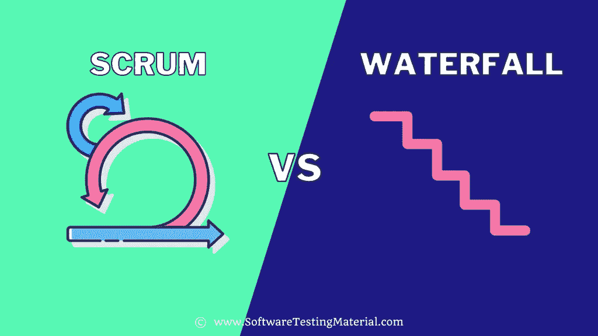

# Scrum vs 瀑布:你需要知道的一切

> 原文:[https://www.softwaretestingmaterial.com/scrum-vs-waterfall/](https://www.softwaretestingmaterial.com/scrum-vs-waterfall/)

在上一篇文章中，我们学习了敏捷和瀑布的区别，在这篇文章中，我们将学习 Scrum 和瀑布的区别，以及下面的内容

*   什么是 Scrum？
*   [什么是瀑布法？](#h-what-is-waterfall-method)
*   [Scrum&瀑布有什么区别？](#h-what-is-the-difference-between-scrum-waterfall)

## 什么是 Scrum？

Scrum 是最流行的敏捷方法，这就是为什么它经常和敏捷混淆的原因。

Scrum 是项目管理和软件开发的增量迭代方法。它的目标是尽可能快速有效地交付软件产品，同时减少麻烦。它描述了一组会议、工具和角色来帮助团队有效地管理他们的工作。

Scrum 基于三大支柱，即透明、检查和适应。

| 参数 | 混乱 | 瀑布 |
| --- | --- | --- |
| 定义 | 在 Scrum 中，团队成员被鼓励以沟通为关键来检查可操作性。

在 Scrum 中安排会议，也称为事件。

所以用外行人的话来说，我们可以说，成员需要通过开会和计划来关注哪些是有效的，哪些是无效的。 | 当团队遵循瀑布模型/方法时，项目管理方法在结构上通常是线性的。

这一切都始于利益相关者和客户需求的收集，随后是为了适应这些需求而创建的顺序项目计划。

由于项目的每一个阶段都像瀑布一样层叠到下一个阶段，因此得名。 |
| 原则/事件 | 我们上面提到的事件如下:
Scrum 会议
Sprint 计划会议
Sprint 回顾 | 瀑布模型主要基于三个原则:
低客户参与度
强文档化，
顺序结构。
记录所有客户要求。
只有在最终产品准备交付后，才安排下一次会议 |
| 用途/纸板 | 团队完成的工作，由个人分担，以称为冲刺的短时间间隔计算。 | 团队完成的工作分为几个阶段，etam 密切合作。 |
| 业主 | scrum 板通常归一个 Scrum 团队所有。scrum 董事会是由一个叫做“Scrum Master”的人管理的，他也是一个领导者。

scrum 团队还有一个特点。scrum 团队是一个跨职能的团队，为了完成 sprint 中的所有任务，他们拥有所需的技能。 | 瀑布方法中没有 Scrum 那样的板子。

也和 scrum 不一样，团队中没有 Scrum master。

瀑布团队紧密合作，将客户拒之门外，直到结果出来。

在大多数情况下，权力被移交给项目经理，以决定预算和使用资源。 |
| 到期日交付时间表 | 如前所述，在 Scrum 中，任务可交付性主要由 sprints 决定。

又称定期，一套工作必须完成并准备好接受审查。

Scrum 中的生产度量是通过使用冲刺速度的概念。 | 在瀑布中没有冲刺的概念，但是，工作是完全紧密绑定的阶段。

遵循跨团队的直接向下流程。

瀑布式交付方法在流程开始时就非常详细地定义了产品。

因此，可交付成果的基准和开始或结束日期以及里程碑计划提前完成。

团队的工作能力和进度跟踪是以一种容易得多的方式完成的。 |
| 优化 | Scrum 使用“拉动系统”。在这种方法中，每次迭代(即“sprint ”)都会拉出一个完整的批次。 | 前面提到的瀑布方法遵循一个线性的、连续的和直接的方法。 |
| 修改/变更 | 在处理 Scrum 的时候，在 sprint 中强烈反对任何改变或修改。 | 在处理瀑布时，任何变更或修改只在需求收集阶段，即第一阶段受到欢迎。 |
| 最佳应用 | Scrum 最适合拥有相对稳定的优先级以及那些不随时间变化太大的团队。

由于这种能力，适应不断的变化要容易得多。

此外，短距离冲刺和定期反馈对整体交付也很有帮助。 | 瀑布方法最适合在开发之初就记录和批准产品需求的团队。因此，瀑布法最适用于可预测的产品，也适用于规模较小的产品。致力于交付一组特定特性的瀑布方法团队发现这种方法非常有用。 |
| 赞成的意见 | 使用 scrum 的一些好处列举如下，
即使团队成员中途离开团队，项目计划也不会受到太大的干扰。使用 Scrum 公司可以有效地节省时间和金钱。 | 下面列出了使用 scrum 的一些好处，团队的共识是开发人员和客户对将在开发生命周期早期交付的产品达成一致。这实现了一种简单的方法。
由于工作的整个范围是预先决定的，因此很容易测量进度的跟踪。 |
| 骗局 | 在日常工作中，参加日常会议有时会让团队成员感到沮丧。 | 瀑布方法看起来很简单，但也有一些挑战，不允许回到瀑布方法的前一阶段。如果失败发生在瀑布过程的后期阶段，那么整个项目将从头开始。
记录客户需求的每一项功能和必要信息可能会耗费大量时间。
由于顾客只有在工作完成后才能得到产品，因此顾客不满意的风险很高。 |

**相关帖子:**

*   [敏捷 vs 瀑布:你需要知道的一切](https://www.softwaretestingmaterial.com/agile-vs-waterfall/)
*   [敏捷与 Scrum:你需要知道的一切](https://www.softwaretestingmaterial.com/agile-vs-scrum/)
*   [软件开发生命周期的瀑布模型](https://www.softwaretestingmaterial.com/waterfall-model-in-sdlc/)
*   [Scrum vs 看板:你需要知道的一切](https://www.softwaretestingmaterial.com/scrum-vs-kanban/)