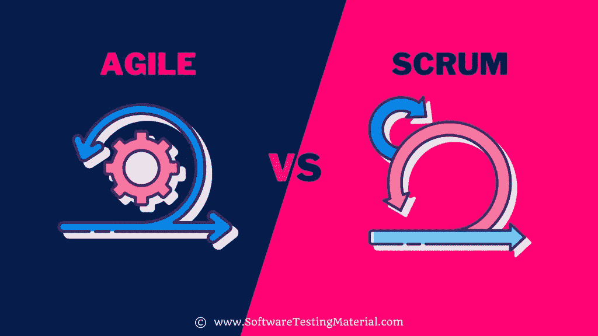

# 敏捷与 Scrum:你需要知道的一切

> 原文:[https://www.softwaretestingmaterial.com/agile-vs-scrum/](https://www.softwaretestingmaterial.com/agile-vs-scrum/)

在上一篇文章中，我们学习了敏捷和 DevOps 之间的差异，在今天的文章中，我们将学习敏捷和 Scrum 之间的差异，以及以下内容

<button class="kb-table-of-contents-title-btn kb-table-of-contents-toggle" aria-expanded="false" aria-label="Expand Table of Contents">Table of Contents</button>

*   [什么是敏捷？](#h-what-is-agile)
*   什么是 Scrum？
*   [敏捷& Scrum 有什么区别？](#h-what-is-the-difference-between-agile-scrum)

Scrum 和敏捷的区别是什么？它们是一样的吗？还是他们在很多方面都不一样？

尽管听起来很相似，但它确实会导致混淆。

简而言之，敏捷和 Scrum 因为几个原因而不同，要了解它们，请继续阅读。

## 什么是 Scrum？

Scrum 是最流行的敏捷方法，这就是为什么它经常和敏捷混淆的原因。

Scrum 是项目管理和软件开发的增量迭代方法。它的目标是尽可能快速有效地交付软件产品，同时减少麻烦。它描述了一组会议、工具和角色来帮助团队有效地管理他们的工作。

Scrum 基于三大支柱，即透明、检查和适应。

## **敏捷& Scrum 有什么区别？**

| 参数 | 混乱 | 敏捷 |
| --- | --- | --- |
| 定义 | 在 Scrum 中，团队成员被鼓励以沟通为关键来检查可操作性。

在 Scrum 中安排会议，也称为事件。

所以用外行人的话来说，我们可以说，成员需要通过开会和计划来关注哪些是有效的，哪些是无效的。 | 敏捷是一个超集，其中包含了各种各样的其他项目管理方法，它们之间有额外的差异。然而，敏捷是一个用来描述项目管理方法的术语。

敏捷的核心目标是将大型复杂项目分解成更小但可管理的任务块。 |
| 原则/事件 | 我们上面提到的事件如下:

；Scrum 会议
；Sprint 计划会议
；Sprint 回顾 | 敏捷中的原则因方法的不同而不同，这些方法将实际用于处理项目。这里要注意的关键点是，在敏捷中，保持沟通是关键，允许迭代开发。 |
| 用途/纸板 | 团队所做的工作以称为冲刺的短时间间隔计算。 | 在 agile 中，不支持对正在进行的工作进行可视化检查。 |
| 业主 | scrum 板通常归一个 Scrum 团队所有。scrum 董事会是由一个叫做“Scrum Master”的人管理的，他也是一个领导者。

scrum 团队还有一个特点。scrum 团队是一个跨职能的团队，为了完成 sprint 中的所有任务，他们拥有所需的技能。 | 当谈到敏捷时，由于它是一个超集，根据项目管理方法的类型，所有者的位置发生变化。 |
| 到期日交付时间表 | 如前所述，在 Scrum 中，任务可交付性主要由 sprints 决定。

又称一组工作必须完成并准备接受审查的一段时间。

Scrum 中的生产度量是通过使用冲刺速度的概念。 | 对于敏捷，团队致力于在 15 天到一个月的时间内交付工作系统。所以主要目的是限制时间尺度。 |
| 授权&
优先级排序 | Scrum 使用“拉动系统”。在这种方法中，每次迭代(即“sprint ”)都会拉出一个完整的批次。 | 因为它是敏捷的，所以有一个系统的工作流程可以遵循。这允许团队在以前的任务完成后选择并处理新的任务。委托和优先级进一步依赖于用来实现敏捷的方法的类型。 |
| 修改/变更 | 在处理 Scrum 的时候，在 sprint 中强烈反对任何改变或修改。 | 被认为是使用敏捷的最大优势之一是在项目过程中的任何时候都很容易适应和接受变化。随着计划周期的缩短，团队总是有机会细化和重新安排待办事项的优先级。

此外，它帮助团队在短时间内引入项目变更。 |
| 最佳应用 | Scrum 最适合拥有相对稳定的优先级以及那些不随时间变化太大的团队。

由于这种能力，适应不断的变化要容易得多。

此外，短距离冲刺和定期反馈对整体交付也很有帮助。 | 对于最终目标没有确定的项目，敏捷是一种有益的策略。

考虑到项目的进展，开发同样可以跟随和适应。
根据产品所有者的要求，这种情况再次发生。 |
| 赞成的意见 | 使用 scrum 的一些好处列举如下，即使一个团队成员中途离开了团队，项目计划也不会受到太大的干扰。使用 Scrum 公司可以有效地节省时间和金钱。 | 使用敏捷的一些优点列举如下，在较短的计划周期中，适应项目任何时间的变更并不困难。
·由于团队定期相互交流，人们能够承担责任并拥有项目的一部分。
从用户和团队成员那里获得建设性的反馈提供了有用的经验，并在各个方面增强了未来的迭代。 |
| 骗局 | 在日常工作中，参加日常会议有时会让团队成员感到沮丧。 | 在敏捷中，像冲刺计划这样的会议会占用团队的时间。 |

**相关帖子:**

*   [敏捷与开发运维:你需要知道的一切](https://www.softwaretestingmaterial.com/agile-vs-devops/)
*   软件开发中的敏捷 Scrum 方法论
*   [30 大敏捷测试面试问题](https://www.softwaretestingmaterial.com/agile-testing-interview-questions/)
*   [每个组织都需要回答的 8 个 DevOps 面试问题，以有效实施 DevOps](https://www.softwaretestingmaterial.com/devops-interview-questions/)