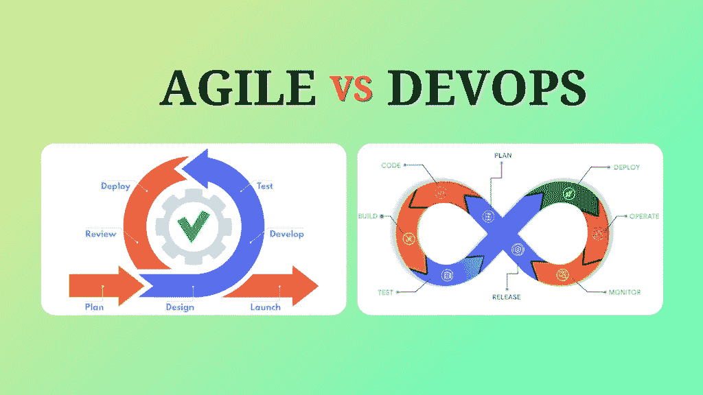

# 敏捷 Vs. DevOps:你需要知道的一切

> 原文:[https://www.softwaretestingmaterial.com/agile-vs-devops/](https://www.softwaretestingmaterial.com/agile-vs-devops/)

在上一篇文章中，我们学习了 QAOPs 和 DevOps 之间的[差异](https://www.softwaretestingmaterial.com/qaops-vs-devops/)，在今天的文章中，我们将学习敏捷和 DevOps 之间的**差异**以及以下内容

*   [什么是敏捷？](#h-what-is-agile)
*   [什么是 DevOps？](#h-what-is-devops)
*   [敏捷和 DevOps 的区别？](#h-difference-between-agile-and-devops)

敏捷和 DevOps 都是软件开发方法，旨在尽可能快速有效地发布软件产品。在过去的几年中，大多数公司都在采用这两个过程来帮助缩短软件生命周期，并且提高发布的软件产品的质量。

> 也可以阅读:[敏捷 vs Scrum](https://www.softwaretestingmaterial.com/agile-vs-scrum/)

## **什么是敏捷？**

敏捷是传统瀑布方法的替代方法，它强调持续学习、持续计划、持续交付和团队协作。敏捷提供了接受变更需求的能力，以使开发与客户需求保持一致。在这里，软件测试是开发过程中不可避免的一部分。

在这里了解更多关于[敏捷方法](https://www.softwaretestingmaterial.com/agile-scrum-methodology/)的信息，并浏览我们关于[如何在软件开发中成功成为敏捷 QA 的指南](https://www.softwaretestingmaterial.com/how-to-succeed-as-agile-qa/)。

它促进了完全自动化的 CI/CD(持续集成和持续部署)管道，以实现快速和频繁的发布。

不要错过我们关于实施成功开发运维转型的[最佳策略的指南](https://www.softwaretestingmaterial.com/best-strategies-to-implement-a-successful-devops-transformation/)。

## **敏捷和 DevOps 的区别？**

这里我们将详细介绍 DevOps 和敏捷的区别。

| 敏捷 | Devops |
| --- | --- |
| 敏捷关注协作、小规模发布和客户反馈。 | DevOps 专注于将开发和运营团队聚集在一起。 |
| 敏捷是为更快的生产和即时交付而开发的。 | DevOps 是为更快的生产和即时交付而开发的。 |
| 敏捷通常将大模块分解成小模块来实现目标。 | DevOps 结合了工具和文化实践来提供更快的交付。 |
| 敏捷关注持续的变化。它解决了客户需求、开发和测试团队之间的差距。 | DevOps 专注于持续的测试和交付。它解决了开发、测试和操作之间的差距。 |
| 每个团队成员都应该能够了解项目进展的要求。在敏捷中，所有的团队成员应该拥有同等的技能。 | 开发团队和运营团队在 DevOps 中是不同的。不同的团队在 DevOps 中有不同的技能组合。 |
| 敏捷团队通常规模较小。敏捷团队以最少的人员和最低的复杂性快速前进。 | DevOps 认为越大越好。许多团队在 DevOps 一起工作。 |
| 它相信不断的反馈和每日的团队会议能使团队更有生产力和效率。 | 它遵循现代文档方法与所有团队成员交流，而不是召开每日会议。 |
| 敏捷采用迭代的方法进行软件开发。 | DevOps 以端到端业务解决方案为目标。 |
| 敏捷不相信自动化。 | 自动化是 DevOps 的核心。几乎一切自动化。 |
| 它的目标是解决客户需求和开发&测试团队之间的差距。 | 它的目标是解决 Dev(开发和测试)和 Ops(运营)之间的差距。 |
| 一些被广泛使用的工具有 JIRA，Kanboard，Bugzilla。 | 一些广泛使用的工具有 Puppet、Ansible、Chef、AWS、TeamCity OpenStack。 |
| 仅在开发中具有敏捷性。 | 开发和运营的敏捷性。 |
| 参与敏捷 Scrum、敏捷看板等。, | 涉及持续集成(CI)、持续开发(CD)、持续测试(CT)等。, |
| 优先考虑的是及时性。 | 及时性和质量是重中之重。 |
| 它有助于管理复杂的项目。 | 它有助于管理端到端的工程流程。 |
| 它允许不断的变化。 | 它允许持续的测试和交付。 |
| 重点是功能性和非功能性就绪性。 | 重点是运营和业务就绪性。 |
| 它支持[左移](https://www.softwaretestingmaterial.com/what-is-shift-left-testing/)原则。 | 它支持左移和右移原则。 |
| 敏捷的目标领域是快速交付和端到端业务解决方案。 | DevOps 的目标领域是软件开发。 |
| 敏捷团队是跨职能的。 | DevOps 有独立的开发和运营团队，不能跨职能。 |
| 由于每天的 scrum 会议，交流变得容易。 | 与敏捷相比，沟通是复杂的。 |

**相关帖子:**

*   [每个组织都需要回答的 8 个 DevOps 面试问题，以有效实施 DevOps](https://www.softwaretestingmaterial.com/devops-interview-questions/)
*   [最佳开发工具](https://www.softwaretestingmaterial.com/devops-tools/)
*   [devo PS 测试的 19 个最佳连续测试工具](https://www.softwaretestingmaterial.com/continuous-testing-tools/)
*   [QAOps Vs. DevOps:你需要知道的一切](https://www.softwaretestingmaterial.com/qaops-vs-devops/)
*   [2022 年值得关注的 11 大软件测试趋势](https://www.softwaretestingmaterial.com/software-testing-trends/)