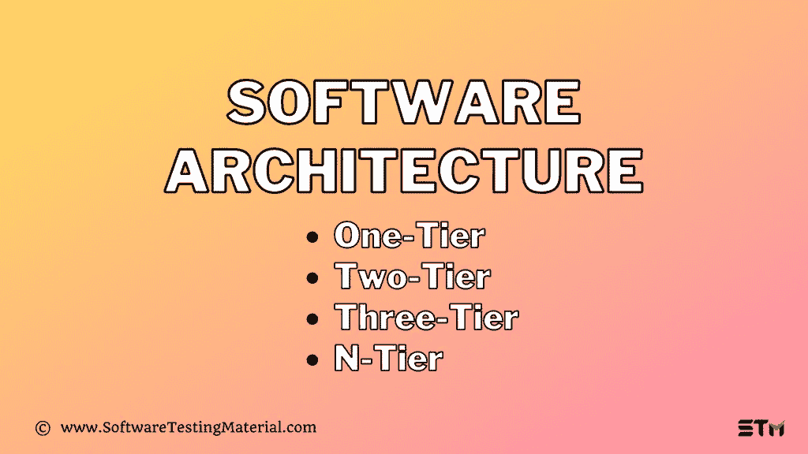

# 软件架构:一层、两层、三层、N 层

> 原文:[https://www . software testing material . com/software-architecture/](https://www.softwaretestingmaterial.com/software-architecture/)

在本软件架构教程中，我们将学习以下内容

<button class="kb-table-of-contents-title-btn kb-table-of-contents-toggle" aria-expanded="false" aria-label="Expand Table of Contents">Table of Contents</button>

*   [软件架构](#h-software-architecture)
    *   [#1。表示层](#h-1-presentation-layer)
    *   [#2。应用层](#h-2-application-layer)
    *   [#3。数据层](#h-3-data-layer)
*   [软件架构的类型:](#h-types-of-software-architecture)
    *   [#1。一层架构:](#h-1-one-tier-architecture)
    *   [#2。两层架构:](#h-2-two-tier-architecture)
    *   [#3。三层架构:](#h-3-three-tier-architecture)

## **软件架构**

软件体系结构包括一层、两层、三层和多层体系结构。

“层”也可以称为“层”。

应用程序涉及三层，即表示层、业务层和数据层。让我们详细看看每一层:

查看下面的视频，了解“软件架构”

[https://www.youtube.com/embed/ccOzcjHQVos](https://www.youtube.com/embed/ccOzcjHQVos)

请耐心等待。视频将在一段时间后加载。

如果你喜欢这个视频，那么请订阅我们的 YouTube 频道以获得更多的视频教程。

### **#2。应用层**

也称为业务逻辑层，也称为逻辑层。按照 Gmail 登录页面的例子，一旦用户点击登录按钮，应用层就与数据库层交互，并将所需的信息发送到表示层。它通过执行详细的处理来控制应用程序的功能。这一层充当表示层和数据库层之间的中介。完整的业务逻辑将在这一层编写。

简单来说，就是对应用进行操作。

### **#3。数据层**

数据存储在这一层。应用层与数据库层通信以检索数据。它包含连接数据库和执行所需操作的方法，例如:插入、更新、删除等。

简单来说，就是共享和检索数据。

> 必读:[手动测试完整教程](https://www.softwaretestingmaterial.com/manual-testing-tutorial/)

## **软件架构的类型:**

### **#1。一层架构:**

一层应用程序，也称为独立应用程序

一层架构在一个软件包中包含了所有的层，如表示层、业务层、数据访问层。处理所有三层的应用程序(如 MP3 播放器、MS Office)属于一层应用程序。数据存储在本地系统或共享驱动器中。

> 必读:[最受欢迎的软件测试面试问题](https://www.softwaretestingmaterial.com/100-software-testing-interview-questions/)

### **#2。两层架构:**

两层应用程序，即客户端-服务器应用程序

双层架构分为两个部分:

1.客户端应用程序(客户端层)2。数据库(数据层)

客户机系统处理表示层和应用层，服务器系统处理数据库层。它也被称为客户端-服务器应用程序。通信发生在客户端和服务器之间。客户端系统向服务器系统发送请求，服务器系统处理该请求并将数据发送回客户端系统

必读: [SQL for Software Testers 完整教程](https://www.softwaretestingmaterial.com/sql-tutorial-complete/)

### **#3。三层架构:**

三层应用程序，即基于 Web 的应用程序

三层架构分为三个部分:

1.表示层(客户端层)
2。
应用层(业务层)2。数据库层(数据层)

客户机系统处理表示层，应用服务器处理应用层，服务器系统处理数据库层。

**注:**另一层是 N 层应用。n 层应用程序又称分布式应用程序。它类似于三层体系结构，但是应用程序服务器的数量增加了，并且在各个层中表示，以便分布业务逻辑，这样逻辑将被分布。