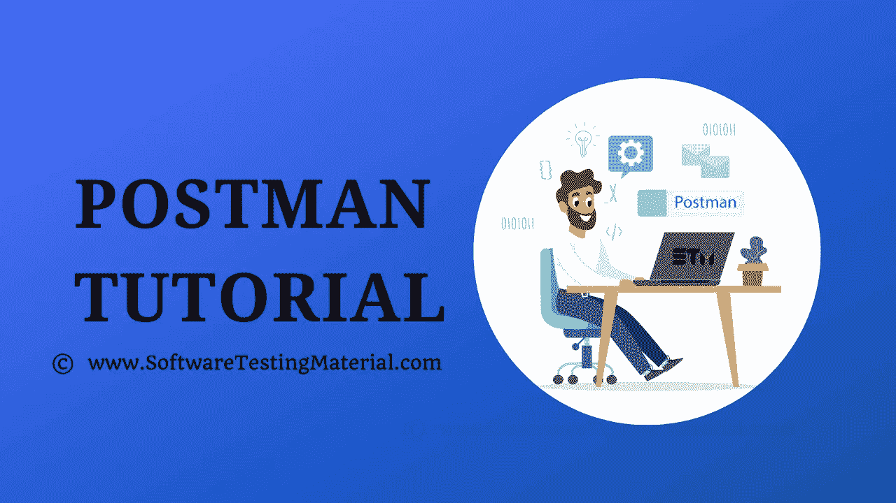

# Postman 初学者教程:使用 Postman 进行 API 测试

> [https://www . software sprinkmaterial . com/post man-tutorial/](https://www.softwaretestingmaterial.com/postman-tutorial/)



<button class="kb-table-of-contents-title-btn kb-table-of-contents-toggle" aria-expanded="false" aria-label="Expand Table of Contents">Table of Contents</button>

*   [什么是 API？](#h-what-is-api)
*   [什么是 Postman？](#h-what-is-postman)
*   [为什么是 Postman？](#h-why-postman)
*   [Postman 安装:](#h-postman-installation)
*   [Postman 功能:](#h-postman-features)
*   [如何使用 Postman](#h-how-to-use-postman)
*   [邮差积木:](#h-building-blocks-of-postman)
*   [测试获取请求:](#h-testing-get-requests)
*   [测试发布请求:](#h-testing-post-requests)
*   [如何参数化请求:](#h-how-to-parameterize-requests)
*   [如何创建 Postman 测试:](#h-how-to-create-postman-tests)
*   [如何使用收款运行程序运行收款:](#h-how-to-run-collections-using-collection-runner)
*   [如何使用 Newman 运行收藏:](#h-how-to-run-collections-using-newman)
*   [高级 Postman 教程](#h-advanced-postman-tutorial)


在这个 **Postman** 教程中，我们将回顾我们如何通过 Postman 为日常工作中的任何给定 URL 进行 API 测试。

Postman 最初是一个 Chrome 浏览器插件，现在用 Mac 和 Windows 的原生版本扩展了它的解决方案。


### **什么是 API？**

API 是一个首字母缩写词，它代表**一个**应用 **P** 编程 **I** 接口。API 是一组用于构建软件应用程序的例程、协议和工具。API 指定了一个软件程序应该如何与其他软件程序交互。

简单来说，API 代表**一个**应用 **P** 编程 **I** 接口。API 充当两个软件应用程序之间的接口，并允许这两个软件应用程序相互通信。API 是可以由另一个软件程序执行的软件功能的集合。

使用 Postman 工具，我们可以向服务发送 HTTP/s 请求，并获得它们的响应。通过这样做，我们可以确保服务正常运行。

Postman 最初是一个 Chrome 浏览器插件，现在用 Mac 和 Windows 的原生版本扩展了他们的解决方案。

### **为什么是 Postman？**

Postman 已经成为超过 800 万用户的首选工具。

*   **免费:**任何规模的团队都可以免费下载使用。
*   **简单:**只需下载并在几分钟内发送您的第一个请求。
*   **API 支持:**您可以进行任何种类的 API 调用(REST、SOAP 或普通 HTTP ),甚至可以轻松检查最大的响应。
*   **可扩展:**你可以用 Postman API 根据自己的需求定制。
*   **集成:**您可以使用 Newman(命令行收集运行程序)轻松地将测试套件集成到您首选的 CI/CD 服务中
*   **社区&支持:**它有一个巨大的社区论坛

### **Postman 安装:**

[点击这里查看](https://www.softwaretestingmaterial.com/install-postman/)

我们已经成功安装了邮差 app。现在让我们开始用 Postman 测试 API。

对于那些不想在与开发人员使用相同语言的集成开发环境中处理编码的人来说，Postman 是 API 测试的一个好选择。

### **Postman 功能:**

Postman 工具提供的一些功能如下。

*   易于使用的 REST 客户端
*   丰富的界面使其易于使用
*   可用于手动和自动 API 测试
*   可以在 Mac、Windows、Linux 和 Chrome 应用程序上运行
*   有很多集成，比如支持 Swagger 和 RAML 格式
*   具有运行、测试、记录和监控功能
*   不需要学习一门新语言
*   使用户能够轻松地与团队分享知识，因为他们可以打包所有的请求和预期的响应，然后发送给他们的同事。
*   可以与 Jenkins、TeamCity 等 CI-CD 工具集成。,
*   附带了详细的 API 文档
*   API 开发和自动化 API 测试执行

网址:[https://www.getpostman.com/](https://www.getpostman.com/)

**定价:免费——21 美元/用户/月**

它是一个免费增值工具。它的免费版本对于实现 API 测试的基本要求绰绰有余。

### **如何使用 Postman**

Postman 工具中的所有组件都有其自身的重要性。现在让我们来看看邮差工作区的不同选项。


1.New:创建一个新的请求、集合或环境。
2。导入:就是导入一个集合或者环境。您还可以找到其他选项，如从文件、文件夹、链接或粘贴原始测试导入。
3。Runner:我们可以使用 Collection Runner 来执行自动化测试。
4。打开新的:我们可以打开 Postman 窗口或 Postman 窗口
5。我的工作空间:这是你的工作空间。您可以使用它创建一个新的工作区。工作区是构建和使用 API 的共享上下文。它允许团队内部和团队之间的实时协作。
6。邀请:是邀请你的团队成员在一个工作空间上协作。
7。历史:自动保存历史中的请求和响应，这有助于您轻松跟踪您过去的行动。
8。集合:它组织并跟踪相关的请求。
9。请求选项卡:您正在处理的请求的标题。默认情况下，它被命名为“无标题请求”。
10。HTTP 请求:可以看到 GET、POST、COPY、DELETE 等请求。
11。请求 URL:这里我们提到 API 将与之通信的链接。它也被称为端点。
12。保存:保存请求或更新现有请求。
13。Params:我们提到请求所需的参数(键值)。
14。授权:API 使用授权来确保客户端请求安全地访问数据。我们提到了授权细节，如用户名、密码、不记名令牌等。，这里。
15。头:一些 API 要求你发送特定的头，比如 JSON，JavaScript 等。以及请求，通常是为了提供有关您正在执行的操作的附加元数据。您可以在此设置这些内容
16。Body:它允许您指定需要随请求一起发送的数据。您可以发送各种不同类型的主体数据来适应您的 API。
17。请求前脚本:请求前脚本是用 JavaScript 编写的，在发送请求之前运行。这对于在请求头中包含时间戳或者在 URL 参数中发送随机的字母数字字符串这样的用例来说是完美的。
18。测试:测试是在请求过程中执行的脚本。测试允许您确保您的 API 按预期工作，确定服务之间的集成运行可靠，并验证新的开发没有破坏任何现有的功能。

### **邮差积木:**

在测试一个 API 之前，首先我们将看到 Postman 工具的一些构建块，它们对于每个 Postman 操作都是必不可少的。

1.  要求
2.  收集
3.  环境

#### **1。请求:**

请求是 URL、HTTP 头、主体或有效负载的组合。在 postman 工具中，您可以保存您的请求，并在将来根据您的需要使用它们。

点击 ***新建——请求***


您可以在 Postman 中向 API 发出请求。API 请求允许您从数据源检索数据，或者发送数据。API 运行在 web 服务器上，并公开端点来支持客户端应用程序用来提供其功能的操作。

每个 API 请求都使用一个 HTTP 方法。

#### **什么是 HTTP？**

HTTP 代表超文本传输协议。HTTP 支持客户端和服务器之间的通信。客户端通常是网络浏览器，服务器通常是云上的计算机。

如果客户端向服务器提交一个 HTTP 请求，那么服务器会向客户端返回一个响应。服务器发送的响应包含关于请求和所请求内容的状态信息。

**最常用的 HTTP 方法如下:**

1.GET: GET 方法用于从 API 中检索数据。
2。POST: POST 方法用于向 API
3 发送新数据。PUT: PUT 方法用于更新现有数据
4。PATCH: PATCH 方法用于更新现有数据
5。DELETE : DELETE 方法用于删除现有数据。

现在让我们看看如何使用 Postman 应用程序创建一个简单的请求，并看看请求及其响应的各个组成部分。

注意:这里我使用这个[假的在线 REST API 进行测试和原型制作](http://dummy.restapiexample.com/api/v1/employees)

#### **2。收藏:**

集合是一组保存的请求，您可以将它们组织到文件夹中。我们可以称之为存储库来保存我们的请求。

**如何在 Postman 中创建收藏:**

点击 ***新建——收藏***


输入集合名称和描述，然后单击创建以创建新集合


您可以在集合中添加任意数量的请求。您可以通过两种方式在 Postman 中运行收藏。1.使用收集转轮& 2。利用纽曼。在结束这篇文章之前，我们将看到使用 Collection runner 和 Newman 运行集合。

现在，让我们看看第三个组成部分，即环境。

#### **3。环境:**

Postman 中的环境允许我们针对不同的数据集运行请求和收集。我们可以有不同的开发、质量保证和生产环境。每个环境都有不同的配置，如 URL、令牌的 id 和密码、API 密钥等。，环境是变量的键值对。每个变量名代表它的键。所以每当我们引用一个变量名时，它就允许我们访问它对应的值。

为了创建一个新的环境，我们做如下工作

点击 ***新建——环境***


在了解了如何测试 get 请求和 post 请求之后，让我们来看看如何参数化请求

### **测试获取请求:**

我们必须使用 GET 请求从给定的 URL 中检索信息。对于 Get 请求，端点不会受到任何影响。

打开 Postman 应用程序

我建议您登录 Postman 应用程序，以保存您的所有操作，如请求、收藏等。，以备将来使用。如果未登录，请使用适当的登录凭据登录。

这是 Postman 界面的初始屏幕。

**步骤 1:** 单击一个**新建**选项卡来创建一个新的请求。


**步骤 2:** 为 REST API 端点创建 GET 请求

1.  将您的 HTTP 请求设置为 **GET**
2.  在请求中输入链接**URL**(https://jsonplaceholder.typicode.com/users)
3.  点击**发送**来执行对托管端点的服务器的请求
4.  您可以在下面的截图中看到 200 OK 消息，因为我们的请求成功了。在某些情况下，GET 请求可能由于无效的请求 URL 或不正确的身份验证而不成功。

https://jsonplaceholder.typicode.com/users

在服务器响应后，您应该能够在 Body 部分看到响应周围的各种数据

在上面请求标题下的截图中，我们可以看到响应状态代码、请求完成所用的时间、有效负载的大小

将鼠标悬停在响应时间和响应大小上，我们可以找到它们的详细信息。

**响应时间:**我们可以看到单个组件，如连接时间、套接字时间、DNS 查找等。,


**响应大小:**我们可以看到单个组件，比如实际的响应大小、头的大小等等。,


**cookie:**我们可以在服务器返回的 cookie 中找到会话相关信息。


**Response header:** 在这里，我们可以找到关于已处理请求的信息。


### **测试发布请求:**

Post 请求用于通过向端点添加数据来进行数据操作。现在，让我们在应用程序中添加一个用户。为此，我们需要向应用程序发送数据。我们使用 POST 请求来发送数据。在 POST 请求中，我们在请求体中发送数据，API 返回一些数据来响应 POST 请求，以验证用户已经被创建。我们使用在 GET 请求中使用的相同数据来添加新用户。

1.  将您的 HTTP 请求设置为 **POST**
2.  在请求中输入链接**URL**(https://jsonplaceholder.typicode.com/users)
3.  点击 **Body** 选项卡并选择“ **Raw** ”单选按钮–选择**JSON**–从之前的 get 请求中复制并粘贴一个用户结果，如下图所示。

    T0】
4.  点击**发送**来执行对托管端点的服务器的请求

注意:您可以使用 [Jsonformatter](https://jsonformatter.curiousconcept.com/) 来检查您尝试发布的数据的格式是否正确。


1.  您可以在下面的截图中看到 **201 创建的消息**，因为我们的请求成功了。
2.  你可以在正文中看到发布的数据。


同样，我们将测试其他请求 PUT、PATCH 和 DELETE

**注意:**对于每个请求，您需要检查预期结果、状态代码、响应时间。另外，不要忘记进行负面测试来验证 API 是否正确响应

### **如何参数化请求:**

如果我们想要参数化 postman 请求，我们需要做如下的事情。

数据参数化是 Postman 最有用的特性之一。

很多时候，我们对不同的数据多次使用相同的请求。通过使用参数化，我们可以使用带参数的变量。我们可以将数据保存在环境变量或数据文件中。

在 Postman 中，参数是通过使用双花括号创建的，比如“{{test}}”

例如，我有一个 **base URL** 比如说**并且我已经存储在一个名为 ***base_url*** 的变量中。在这种情况下，我使用 ***{{base_url}}*** 在我的请求中引用它。向该基本 URL 发送请求(即，***https://stm.org***)为了获取新客户列表，我使用 ***{{base_url}}/get？**客户=新*。该请求将由 Postman 发送到***https://stm.org/get?customers=new***。**

**1.设置 HTTP 请求以获取并输入 URL**

****

**2.将 URL 替换为参数，如 ***{{url}}*** 。请求 URL 应该是***{ { URL } }/用户*** 。**

****

**3.现在我们需要设置环境变量来设置参数。为此，单击眼睛图标，然后单击编辑，将变量设置为全局环境变量，以便在所有集合中使用它**

****

**4.在变量中，将名称设置为 url，即 https://jsonplaceholder.typicode.com，然后单击保存。**

****

**注意:如果看到下一个屏幕，请单击“关闭”**

**5.返回获取请求，然后单击发送。**

****

### ****如何创建 Postman 测试:****

**Postman 测试允许您确保您的 API 按预期工作。这是为了在服务之间建立可靠运行的集成，并验证新的开发没有破坏任何现有的功能。它帮助您验证结果，如成功或失败状态、预期结果的比较等。,**

**让我们从一些基本的测试开始。**

**1.转到我们之前创建的 GET 请求。并切换到测试选项卡。从片段部分，点击“状态代码:代码是 200”。脚本将自动填充。**

****

**2.点击发送。将显示结果。**

****

**3.让我们添加另一个测试。在这个测试中，我们将预期结果与实际结果进行比较。为此，在 snippets 部分点击“响应体:JSON 值检查”。让我们检查一下符晓薇·格拉汉姆是否有用户标识 1。**

****

**4.为了准确地指定我们想要测试的测试名称，只需将代码中的“您的测试名称”替换为“检查符晓薇·格拉汉姆是否拥有用户 id 1”。还要用 jsonData[0].name .替换 jsonData.value 以获取路径(它在前面的 GET result 的主体中)。由于“符晓薇·格拉汉姆”的用户 id 是 1，所以 jsonData 出现在第一个应该从 0 开始的结果中。要获得第二个结果，对后续结果使用 jsonData[1]等等。**

****

```java
pm.test("Check if user with id1 is Leanne Graham", function () {
    var jsonData = pm.response.json();
    pm.expect(jsonData[0].name).to.eql("Leanne Graham");
});
```

**5.单击发送。**

****

**我们可以根据自己的需求创建测试。通过尝试不同的测试来探索这些工具。**

### ****如何使用收款运行程序运行收款:****

**让我们使用集合运行器来运行集合**

**1.单击位于导入按钮旁边的转轮按钮。**

****

**2.应该会出现收款员页面**

****

*   **1.您最近的所有跑步记录**
*   **2.如果您正在使用特定的环境，那么您需要选择该环境**
*   **3.你必须根据你想要迭代的次数来设置这个数字**
*   **4.没有延迟的测试可能会导致错误，因此设置延迟时间**
*   **5.说明您希望如何记录回复**
*   **6.选择您的数据文件**
*   **7.要运行收集**

**3.您可以在此添加选择集合。如果有可用的子文件夹，您必须选择该子文件夹。通过将迭代次数设置为 2，延迟时间设置为 2500 毫秒，并单击 Run Postman Test 按钮来运行 Postman 测试集合**

****

**4.您可以在测试执行后看到测试状态。这里我们添加了 GET 和 POST 请求，但是没有 POST 请求。因此，您会看到一条关于 POST 请求的消息，显示为“该请求没有任何测试”。**

****

### ****如何使用 Newman 运行收藏:****

**要使用 Newman 运行我们的集合，请执行以下操作。**

**1.使用这个[链接](http://nodejs.org/download/)安装 node.js**

**2.打开命令行，输入 ***npm install -g 纽曼*T3】****

**3.纽曼安装完成后，进入邮差工作区。在 collections 框中，单击三个点并选择 Export。**

****

 **4。选择将集合导出为集合 v2.1(推荐)，然后单击导出。**

****

 **5。选择您想要的位置，然后单击保存。建议为您的 Postman 测试创建一个特定的文件夹。收藏现在应该导出到您选择的本地目录。**

**6.我们还需要输出我们的环境。单击全局环境下拉列表旁边的眼睛图标，选择下载为 JSON。选择您想要的位置，然后单击保存。建议将环境与您的集合放在同一个文件夹中。**

****

****

 **7。环境现在应该导出到与集合相同的本地目录中。**

**8.现在返回命令行，将目录更改为保存集合和环境的位置。**

*****CD C:\ Users \ Asus \ Desktop \ Postman 教程*****

**9.使用以下命令运行您的收集:**

*****纽曼运行 post mantest collection . postman _ collection . JSON-e testing . postman _ globals . JSON*T3】****

**现在应该会出现运行结果。**

****结论:****

**在这本针对初学者的邮差教程中，我们已经涵盖了最重要的主题。我希望你已经学会了如何安装 postman，创建简单的请求，检查响应时间和其他细节，还学会了如何使用 Collection Runner & Newman 运行集合。在下一篇文章中，我们将讨论邮差工具的高级主题。**

### ****高级 Postman 教程****

**我们还讨论了 Postman 工具进行 API 测试的高级主题。**

*   #### **[**API 测试用例在 Postman 中使用 JavaScript**](https://www.softwaretestingmaterial.com/api-test-cases-in-postman-using-javascript/)T5】**

*   **[**如何在请求中生成随机/动态数据**](https://www.softwaretestingmaterial.com/generate-random-dynamic-data-in-postman-requests/)**
*   **[**如何从响应中提取数据&链接请求**](https://www.softwaretestingmaterial.com/extracting-data-from-responses-chaining-requests/)**
*   **[**在 Postman**测试 OAuth2 授权](https://www.softwaretestingmaterial.com/testing-oauth2-authorization-in-postman/)**
*   **[**如何发送 JSON Web Token (JWT)作为头**](https://www.softwaretestingmaterial.com/how-to-send-jwt-token-as-header/)**
*   **[**JSON 模式验证在 Postman**T3】](https://www.softwaretestingmaterial.com/json-schema-validation-in-postman/)**
*   **[**Postman**](https://www.softwaretestingmaterial.com/data-driven-testing-in-postman/) 中的数据驱动测试**
*   **[**在 Postman**中监控集合](https://www.softwaretestingmaterial.com/monitor-collections-in-postman/)**
*   **[**如何在邮差**](https://ttps://www.softwaretestingmaterial.com/how-to-run-collections-remotely-in-postman/) 中远程(带 URL)运行收款**
*   **[**如何从詹金斯**](https://www.softwaretestingmaterial.com/how-to-run-collections-from-jenkins/) 运行收款**
*   ****[如何在邮差](https://www.softwaretestingmaterial.com/how-to-debug-collection-run-in-postman/)中调试集合运行****
*   **[**如何生成纽曼关于詹金斯的报告**](https://www.softwaretestingmaterial.com/generate-newman-reports-on-jenkins/)**
*   **[**如何使用纽曼**](https://www.softwaretestingmaterial.com/generate-advanced-html-reports-while-using-newman/) 生成高级 HTML 报表**
*   **[**如何修复 Postman**](https://www.softwaretestingmaterial.com/how-to-fix-common-errors-in-postman/) 常见错误**
*   **Postman 中的 GUID**
*   #### **[**API document**](https://www.softwaretestingmaterial.com/api-documentation/)**

    **in postman**

****相关帖子:****

*   **[API 测试教程](https://www.softwaretestingmaterial.com/api-testing/)**
*   **[API 测试面试问题](https://www.softwaretestingmaterial.com/api-testing-interview-questions/)**
*   **[Selenium 教程](https://www.softwaretestingmaterial.com/selenium-tutorial/)**
*   **[Selenium 面试问题](https://www.softwaretestingmaterial.com/selenium-interview-questions/)**
*   **[如何在面试中解释框架](https://www.softwaretestingmaterial.com/explain-test-automation-framework/)**
*   **[手动测试教程](https://www.softwaretestingmaterial.com/manual-testing-tutorial/)**
*   **[人工测试面试问题](https://www.softwaretestingmaterial.com/100-software-testing-interview-questions/)**
*   **[量角器教程](https://www.softwaretestingmaterial.com/protractor-testing-tutorial/)**
*   **[量角器面试问题](https://www.softwaretestingmaterial.com/protractor-interview-questions-softwaretestingmaterial-updated-2018/)**