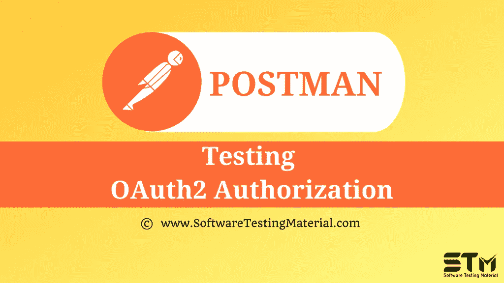

# 在 Postman 中测试 OAuth2 授权

> 原文:[https://www . software testing material . com/testing-oauth 2-authorization-in-postman/](https://www.softwaretestingmaterial.com/testing-oauth2-authorization-in-postman/)

在之前关于 [Postman 教程](https://www.softwaretestingmaterial.com/postman-tutorial/)的文章中，我们已经介绍了从响应中提取数据的[和链接请求的](https://www.softwaretestingmaterial.com/extracting-data-from-responses-chaining-requests/)

在这篇“在 Postman 中测试 OAuth2 授权”的文章中，我将演示如何实现这个概念并牢牢把握住它。

在 OAuth 2.0 中，我们首先检索 API 的访问令牌，然后使用该令牌对请求进行身份验证。访问令牌主要用于确保用户被批准访问数据。

1.从请求的授权选项卡的类型下拉列表中选择 OAuth 2.0 选项。

2.填写接收访问令牌所需的所有凭据。我们以 imgur 网站为例。[https://api.imgur.com/oauth2/addclient](https://api.imgur.com/oauth2/addclient)

3.我们将收到一个**客户 ID** 和**客户秘密**。

4.在 Postman 应用中，打开**授权**标签。

5.从**类型**下拉框中选择 **OAuth 2.0** 授权

6.点击**获取新的访问令牌**

7.填写**获取新访问令牌**窗口中的所有详细信息

8.点击**请求令牌**按钮。输入您的 **imgur 证书**

9.单击允许按钮。然后，我们将收到访问令牌

10.点击**使用令牌**，然后从下拉列表中选择**邮递员令牌**

11.我们现在有了**访问令牌**

12.令牌值自动输入到**标题**选项卡中

13.点击 API 后观察响应。我们获得了正确的状态、响应，并观察到数据为零，这意味着我们已经成功地通过 Postman 访问了我们的帐户信息。因此，我们被授权使用 OAuth 2.0

**下一步:**

在下一篇教程中学习“ [**如何发送 JWT 令牌作为报头**](https://www.softwaretestingmaterial.com/how-to-send-jwt-token-as-header/) ”。

**相关帖子:**

*   [邮递员教程](https://www.softwaretestingmaterial.com/postman-tutorial/)
*   [API 测试教程](https://www.softwaretestingmaterial.com/api-testing/)
*   [API 测试面试问题](https://www.softwaretestingmaterial.com/api-testing-interview-questions/)