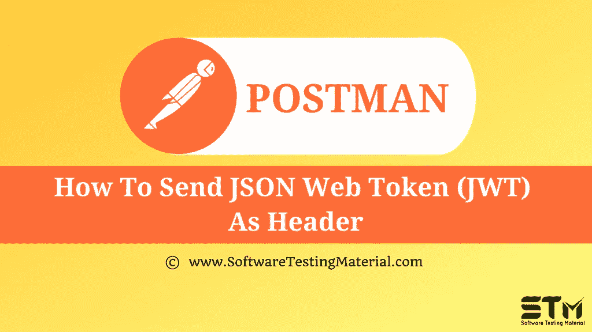

# 如何将 JWT 令牌作为报头发送

> 原文:[https://www . software testing material . com/how-to-send-jwt-token-as-header/](https://www.softwaretestingmaterial.com/how-to-send-jwt-token-as-header/)



在之前关于 [Postman 教程](https://www.softwaretestingmaterial.com/postman-tutorial/)的文章中，我们已经介绍了“[在 Postman](https://www.softwaretestingmaterial.com/testing-oauth2-authorization-in-postman/) 中测试 OAuth2 授权”

在这篇“如何将 JWT 令牌作为标题发送”的文章中，我将演示如何实现这个概念并牢牢把握住它。

JSON Web 令牌基本上是一个行业标准，它基本上描述了如何在各方之间发送数据。


当我们提交这个请求时，我们得到一个 JSON 令牌作为响应。


转到 jwt.io，在编辑器中粘贴令牌值。


JSON web token 分为三个部分。每个部分都由一个点符号分隔。

1.  第一部分讨论这是什么类型的令牌以及使用了什么加密算法，以便接收方能够知道这是一个 jwt 令牌，并且已经使用了这个特定的加密算法。
2.  第二部分是有效载荷。这部分说，拥有此令牌的人是 John smith，他在中的电子邮件地址不是管理员，此外，它还有一个过期日期，因此此令牌不是永远有效，而是只在有限的一段时间内有效。
3.  第三部分是令牌的重要部分。是签名本身和服务器生成了这个签名，这个令牌基本上接受了报头、有效载荷和一个很长的秘密生成了一个签名。

对该有效载荷的任何改变都将是可见的，因为整个消息的签名将是不同的，并且任何拥有该密钥的人都将能够知道该消息有效载荷已经被操纵。

此外，该字符串是 base64 编码的，这只是对该数据进行编码的一种方式，但该数据是经过签名的，而不是加密的。

我们可以将这个令牌发送到其他端点。这很容易做到。我们必须在我们的请求中添加一个授权头，这将是一个不记名令牌。


为了避免手动复制粘贴 JWT 令牌，我们可以使用变量在生成令牌的 API 请求的 Tests 选项卡中添加一个脚本。

```java
const response = pm.response.json();
pm.globals.set(“jwt_token”, response.token);
```

在需要此令牌的请求中，将授权头的值编辑为{{jwt_token}}

**下一步:**

在下一个教程中学习邮差 中的 [**JSON 模式验证。**](https://www.softwaretestingmaterial.com/json-schema-validation-in-postman/)

**相关帖子:**

*   [邮递员教程](https://www.softwaretestingmaterial.com/postman-tutorial/)
*   [API 测试教程](https://www.softwaretestingmaterial.com/api-testing/)
*   [API 测试面试问题](https://www.softwaretestingmaterial.com/api-testing-interview-questions/)