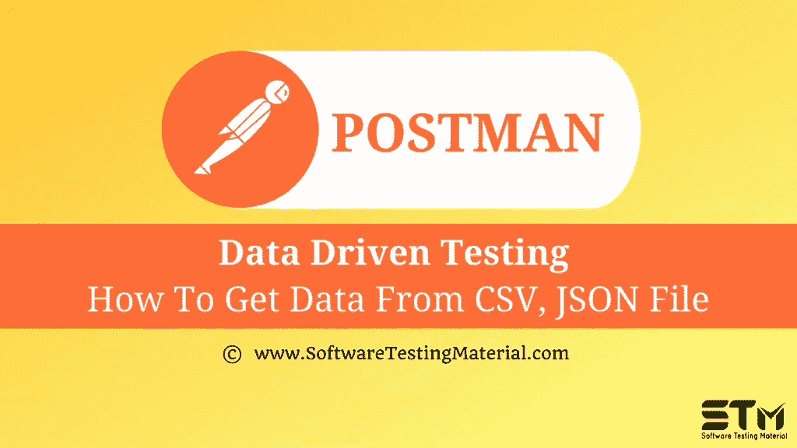

# Postman 中的数据驱动测试

> 原文:[https://www . software testing material . com/data-driven-testing-in-postman/](https://www.softwaretestingmaterial.com/data-driven-testing-in-postman/)



在之前关于 [Postman 教程](https://www.softwaretestingmaterial.com/postman-tutorial/)的文章中，我们已经涵盖了“[Postman](https://www.softwaretestingmaterial.com/json-schema-validation-in-postman/)中的 JSON 模式验证”

在这篇“邮差中的数据驱动测试”的文章中，我将展示如何实现这个概念并牢牢把握住它。

数据驱动测试是指我们用不同的数据变量多次运行一个测试。这是很有用的，例如，如果我们的名字中支持一定范围的字符，就可以确保所有这些字符在不同的测试中都得到支持。

```java
{
    "email": "{{email}}",
    "password": "{{password}}"
}
```

**在测试选项卡中添加测试:**


```java
{
pm.test("Status code is 201" , function(){
    pm.response.to.have.status(201);
});

var em = pm.variables.get("email");
var pwd = pm.variables.get("password");

pm.test("Check email " +em, function () {
    var jsonData = pm.response.json();
    pm.expect(jsonData.email).to.eql(em);
});

pm.test("Check password " +pwd, function () {
    var jsonData = pm.response.json();
    pm.expect(jsonData.password).to.eql(pwd);
});
```

**使用 CSV 文件:**

1.创建一个 CSV 文件。
2。在 CSV 文件
3 的列中添加电子邮件、密码。添加电子邮件和密码的可能测试用例。


4.创建一个名为数据驱动测试
5 的集合。要从 CSV 文件中获取变量，请在 Runner 上运行此集合，单击运行按钮


6.将出现收集转轮窗口。


7.迭代是 CSV 文件
8 中的数据行数。在数据选项中添加 CSV 文件。预览按钮将显示 CSV 文件
9 的预览。点击蓝色的运行按钮
10。将显示结果窗口


使用 JSON 文件:

1.创建一个 JSON 文件。
2。在 JSON 文件中添加邮件、密码，用逗号
分隔 3。添加电子邮件和密码的可能测试用例。


4.创建一个名为数据驱动测试的集合。
5。要从 JSON 文件中获取变量，请在 runner 上运行这个集合，单击 Run 按钮


6.将出现收集转轮窗口。


7.迭代是 JSON 文件中的数据行数。
8。在数据选项中添加 JSON 文件。预览按钮将显示 JSON 文件的预览。
9。点击蓝色的运行按钮。
10。将显示结果窗口。


**下一步:**

在下一个教程中学习邮差 中的 [**监控收藏。**](https://www.softwaretestingmaterial.com/monitor-collections-in-postman/)

**相关帖子:**

*   [邮递员教程](https://www.softwaretestingmaterial.com/postman-tutorial/)
*   [API 测试教程](https://www.softwaretestingmaterial.com/api-testing/)
*   [API 测试面试问题](https://www.softwaretestingmaterial.com/api-testing-interview-questions/)