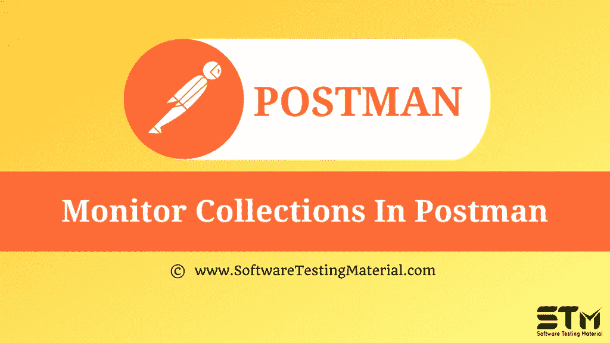

# 在 Postman 中监控收藏

> 原文:[https://www . software testing material . com/monitor-collections-in-postman/](https://www.softwaretestingmaterial.com/monitor-collections-in-postman/)

在之前关于 [Postman 教程](https://www.softwaretestingmaterial.com/postman-tutorial/)的文章中，我们已经介绍了“[Postman](https://www.softwaretestingmaterial.com/data-driven-testing-in-postman/)中的数据驱动测试”

在这篇“在 Postman 中监视集合”的文章中，我将演示如何实现这个概念并牢牢把握住它。

### **邮递员中的班长是什么？**

一个邮差监视器在邮差云上运行我们的集合。它是一个 web 客户端，允许我们向我们创建的已部署 API 发送预定的 API 调用。Monitor 允许我们获得 API 性能的统计数据。

### **创建监视器:**

我们可以使用 3 种方法创建监视器:

1.  用右上角的**新建**按钮创建一个监视器—*点击新建>监视器*
2.  通过单击省略号来浏览集合本身。
3.  单击要监控的集合旁边的箭头按钮

*   假设我们选择了创建监视器的方法 2，即通过集合创建一个监视器。它填充该集合中的信息。

*   如果我们单击“Back”按钮，会出现选择现有集合或创建新集合的选项。

*   选择要监视的集合后，输入监视器名称、环境名称。那么邮差监视器的重要部分就是监视运行频率。这允许我们选择像一个小时计时器或一个星期计时器。我们可以通过监控运行频率来安排 API 的执行。

*   然后我们有了区域选项，允许我们选择从哪里调用我们的 API。您需要升级计划以使用手动选择区域选项。

*   最后，在附加首选项下，我们有一些其他的东西。

*   我们有关于运行失败/错误的电子邮件通知。如果任何测试失败，我们将收到电子邮件通知。
*   如果运行失败，我们会重试。只有在前一次运行成功的情况下，才会重试失败的监视器运行。
*   我们的请求超时了。如果 API 花费太长时间来响应，它将自动超时请求，这将是一个失败。
*   我们有一个请求延迟。如果我们的集合中有多个请求，那么下一个请求的执行就会延迟这么多时间。
*   然后我们有不跟随重定向。如果我们有一个特定的 API 调用，我们希望得到一个重定向返回，这个选项将有所帮助，这样我们就可以看到我们正在接收重定向。
*   最后，我们禁用了 SSL 验证。它允许我们关闭 SSL 验证，例如，如果我们没有在服务器上放置证书，它将不会检查 SSL 是否打开，因为否则，如果它打开了，它将发送一个失败。

**结果:**

Web dashboard 显示了我们可以查看统计数据和结果的监视器。在这个图的左边，我们有它执行的秒数，然后在底部，我们有这些调用执行的时间。这些是以块为单位的，这条线是响应时间的平均值或总和。当我们将鼠标悬停在这些块上时，它会给出失败百分比和平均响应时间。

我们可以使用各种选项过滤掉我们的请求，例如请求名称、请求类型、运行结果。

如果我们希望看到所有的请求被不同的行分开，我们可以使用请求分割选项。

如果我们想看到更多的数据，比如哪些测试通过了，哪些测试失败了，以及在这次运行中执行了什么，我们可以单击条形图并获得所有的细节。绿色表示通过测试。红色表示测试失败。

右边是 HTTP 状态代码、响应时间和响应大小。此外，我们可以通过控制台日志看到更多关于实际发送了什么以及我们获得了什么的信息。单击测试结果选项卡右侧的控制台日志选项卡。

我们从邮递员监视器那里收到一封关于错误的电子邮件，即哪些测试失败了。

我们从邮递员监视器那里收到一封电子邮件，总结了我们所有的执行情况。

**下一步:**

在下一个教程中学习“ [**(带 URL)**](https://www.softwaretestingmaterial.com/how-to-run-collections-remotely-in-postman/) ”如何远程运行收藏。

**相关帖子:**

*   [邮递员教程](https://www.softwaretestingmaterial.com/postman-tutorial/)
*   [API 测试教程](https://www.softwaretestingmaterial.com/api-testing/)
*   [API 测试面试问题](https://www.softwaretestingmaterial.com/api-testing-interview-questions/)