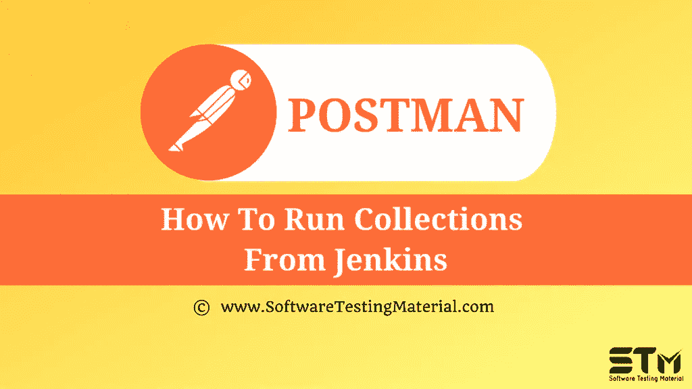

# 如何从 Jenkins 收集数据

> 原文:[https://www . software testing material . com/how-to-run-collections-from-Jenkins/](https://www.softwaretestingmaterial.com/how-to-run-collections-from-jenkins/)

在之前关于 [Postman 教程](https://www.softwaretestingmaterial.com/postman-tutorial/)的文章中，我们已经涵盖了“[如何在 Postman](https://www.softwaretestingmaterial.com/how-to-run-collections-remotely-in-postman/) 中远程(用 URL)运行收藏”

在这篇“如何从 Jenkins 运行集合”的文章中，我将演示如何实现这个概念并牢牢把握住它。

按照步骤在 Jenkins 中创建新的作业，并从 Jenkins 运行Postman收集。

2.输入任意名称并选择**自由式项目**并点击确定。

3.现在我们必须对此进行配置。在**构建环境**选项卡下，我们将转到**构建**部分并添加一个构建步骤。对于 windows 机，选择**执行 Windows 批处理命令**。对于 Mac 或 Linux，选择**执行 shell**

4.现在我们必须发出命令来运行邮差收集。

**C:\ Users \ Test \ AppData \ Roaming \ NPM \ Newman run https://www.getpostman.com/collections/8daaf8118386c8fce5ef**

点击保存。

5.进入**主页**页面，点击最左侧的**管理詹金斯**选项。然后点击**配置系统**。现在在**全局属性**部分下，点击**环境变量**并添加**名称:路径**，**值:C:\Program Files\Nodejs**

6.在 **Shell** 部分下，在 Shell 可执行字段中添加**C:\ Windows \ System32 \ cmd . exe**。点击**保存**。

7.现在使用选项**立即构建**运行作业。将开始新的构建。

8.我们还可以看到控制台输出。我们得到 Unicode 字符，所以我们可以把它看作纯文本。我们现在可以看到我们的Postman被处决，我们也得到关于詹金斯的报告。

**下一步:**

在下一个教程中学习“ [**如何调试邮差**](https://www.softwaretestingmaterial.com/how-to-debug-collection-run-in-postman/) 中的集合运行”。

**相关帖子:**

*   [Postman教程](https://www.softwaretestingmaterial.com/postman-tutorial/)
*   [API 测试教程](https://www.softwaretestingmaterial.com/api-testing/)
*   [API 测试面试问题](https://www.softwaretestingmaterial.com/api-testing-interview-questions/)