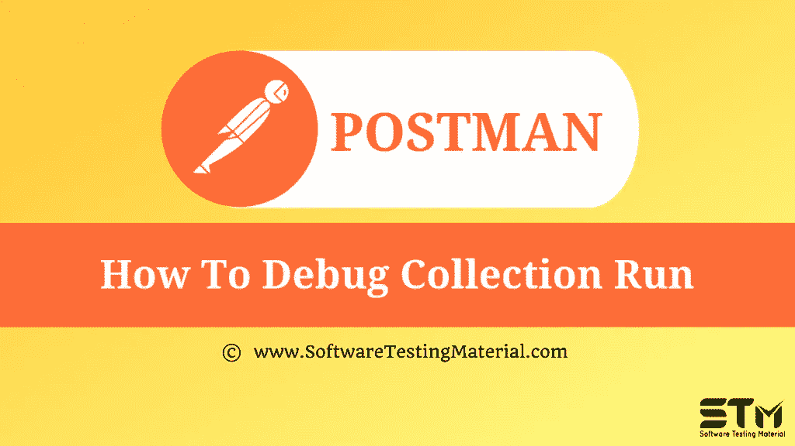

# 如何在 Postman 中调试收集运行

> 原文:[https://www . software testing material . com/how-to-debug-collection-run-in-postman/](https://www.softwaretestingmaterial.com/how-to-debug-collection-run-in-postman/)

在之前关于[邮差教程](https://www.softwaretestingmaterial.com/postman-tutorial/)的文章中，我们已经介绍了“[如何运行来自 Jenkins 的集合](https://www.softwaretestingmaterial.com/how-to-run-collections-from-jenkins/)

在这篇“如何调试 Postman 中的集合运行”的文章中，我将演示如何实现这个概念并牢牢掌握它。

为了调试收集/请求，Postman 提供了 Postman 控制台特性。

2.此外，我们在底部有一个Postman控制台的图标。点击图标。它将打开Postman控制台窗口。

3。现在，无论我们运行什么请求，它都将被记录在控制台窗口中。发送 API 请求。检查控制台窗口中的日志。所有请求头、正文、响应头、响应正文、状态代码、响应大小以及所有脚本输出都将记录在控制台窗口中。如果请求中使用了任何变量，它们的实际值也会显示在控制台窗口中。

4.展开响应头、网络、请求头和正文以查看数据。

5.我们也可以从右边的选项中选择 raw 格式和 pretty 格式。

6.我们也可以从控制台窗口单独访问 ***错误/信息/警告/日志*** 。有一个 Clear too 选项可以清除显示的日志。

7.同样，我们可以使用 ***console.log()*** ， ***console.info()*** ， ***console.warn()*** ，***console . error()***语句在预请求脚本或测试脚本中登录到 Postman 控制台。

**下一步:**

在下一个教程中学习“ [**生成纽曼对詹金斯的报告**](https://www.softwaretestingmaterial.com/generate-newman-reports-on-jenkins/) ”。

**相关帖子:**

*   [Postman教程](https://www.softwaretestingmaterial.com/postman-tutorial/)
*   [API 测试教程](https://www.softwaretestingmaterial.com/api-testing/)
*   [API 测试面试问题](https://www.softwaretestingmaterial.com/api-testing-interview-questions/)