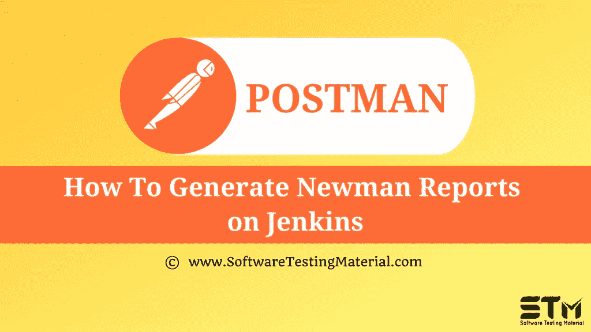

# 生成关于詹金斯的纽曼报告

> 原文:[https://www . software testing material . com/generate-Newman-reports-on-Jenkins/](https://www.softwaretestingmaterial.com/generate-newman-reports-on-jenkins/)

在之前关于 [Postman 教程](https://www.softwaretestingmaterial.com/postman-tutorial/)的文章中，我们已经介绍了“[如何在 Postman](https://www.softwaretestingmaterial.com/how-to-debug-collection-run-in-postman/) 中调试集合运行”

在这篇“如何在 Postman 中生成关于 Jenkins 的 Newman 报告”的文章中，我将演示如何实现这个概念并牢牢把握住它。

## **如何生成关于詹金斯的纽曼报告**

要生成关于 Jenkins 的 Newman 报告，请编辑 Build 部分中的命令。

**C:\ Users \ Test \ AppData \ Roaming \ NPM \ Newman run https://www.getpostman.com/collections/8daaf8118386c8fce5ef–记者 cli，junit**

报告将在 Jenkins 目录下的工作区内自动创建。这些报告可以从 Jenkins 工作区选项卡中查看，也可以从 Jenkins 下载到我们系统中时创建的工作区文件夹中查看。

我们可以打开文件，看到测试结果是 XML 格式的。

由于这个报告是 XML 格式的，我们可以选择在 Jenkins 中发布报告。发布报告是后期生成操作的一部分。我们基本上是在构建后的操作中编写命令来发布我们的报告。

1.转到配置部分。转到后期生成操作。

2.单击发布 Junit 测试结果报告

3.在测试报告 XML 中输入文件的路径。保存更改。要再次构建项目，请单击“立即构建”按钮。

4.从“生成历史记录”部分，打开生成结果。点击测试结果。

5.我们现在可以看到容易理解的测试结果。我们可以看到有多少测试用例失败/通过。失败的测试将以红色显示。我们甚至可以看到测试名称及其状态和持续时间。

**下一步:**

在下一个教程中学习“ [**生成高级 HTML 报告，同时使用纽曼**](https://www.softwaretestingmaterial.com/generate-advanced-html-reports-while-using-newman/) ”。

**相关帖子:**

*   [Postman教程](https://www.softwaretestingmaterial.com/postman-tutorial/)
*   [API 测试教程](https://www.softwaretestingmaterial.com/api-testing/)
*   [API 测试面试问题](https://www.softwaretestingmaterial.com/api-testing-interview-questions/)