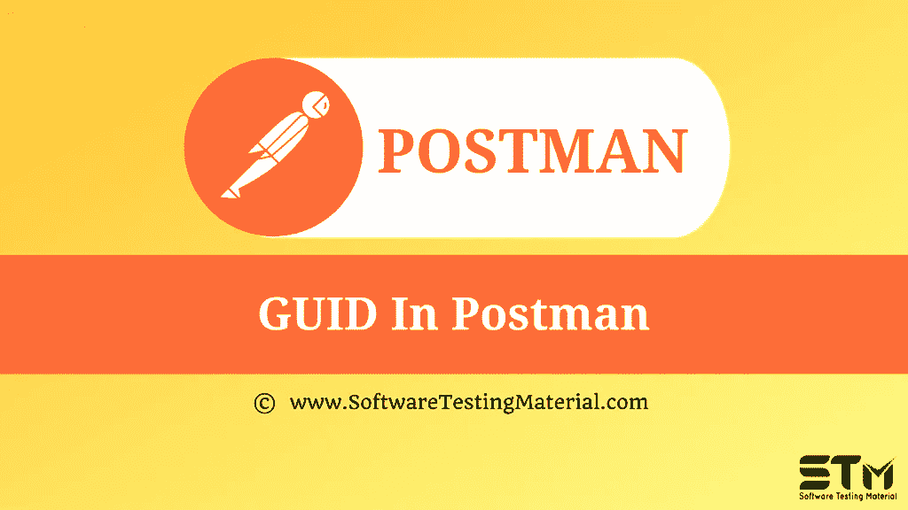

# 邮递员|邮递员教程中的 GUID

> 原文:[https://www.softwaretestingmaterial.com/guid-in-postman/](https://www.softwaretestingmaterial.com/guid-in-postman/)

在之前关于 [Postman 教程](https://www.softwaretestingmaterial.com/postman-tutorial/)的文章中，我们已经涵盖了“[如何修复 Postman](https://www.softwaretestingmaterial.com/how-to-fix-common-errors-in-postman/) 中的常见错误”

在这篇“Postman 中的 GUID”文章中，我将演示如何实现这个概念并牢牢把握住它。

## **什么是 GUID？**

GUID 代表全球唯一标识符。它基本上是由连字符分隔的十六进制数字。GUID 解决了唯一性的目的。

**结构:**

GUID 是 128 位的值。它遵循 RFC4122 中定义的结构。

基本结构是:xxxxxxxx-xxxx-Mxxx-Nxxx-xxxxxxxxxxxx 其中 M 定义版本，N 定义变体

例如，b 3d 27 F9 b-d21d-427 c-164 e-7fb 6776 f 87 b 0 guid 是版本 4

为 guid 定义了各种版本:

版本 1:使用日期时间和 MAC 地址

版本 2:使用 DCE 安全性

版本 3:使用 MD5 哈希和名称空间

版本 4:生成随机数字来创建 GUID

版本 5:使用 SHA-1 哈希和命名空间

**优点:**

*   每次都产生独特的价值。因此，重复值的可能性很小或没有。
*   GUIDs 可以手动生成。
*   GUID 可以用作数据库中的主键
*   当我们有多个独立的系统时，使用 GUIDs

**缺点:**

*   占用了很多空间
*   不能执行排序来排列特定数据中的数据

**下一步:**

在下一个教程中学习“ [**API 文档**](https://www.softwaretestingmaterial.com/api-documentation/) ”。