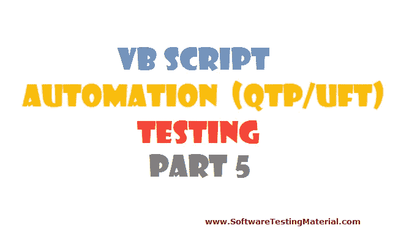

# 用于自动化(QTP/UFT)测试的 VBScript–第 5 部分

> 原文:[https://www . software testing material . com/VBScript-for-automation-qtp-uft-testing-part 5/](https://www.softwaretestingmaterial.com/vbscript-for-automation-qtp-uft-testing-part5/)

在 VBScript–第 5 部分中，我们来看看以下主题:

[如何处理 Excel 文件](#HOWTOHANDLEEXCELFILES)
[如何处理文件&文件夹(文件系统对象)](#FILESYSTEMOBJECT)

## [T2】](https://www.softwaretestingmaterial.com/wp-content/uploads/2016/01/VBScript-Part5.png)

## 如何处理 EXCEL 文件:

让我们看看一些重要的 Excel 处理函数的语法和示例:

[用于自动化(QTP/UFT)测试的 VBScript–第 1 部分](https://www.softwaretestingmaterial.com/vbscript-for-automation-qtpuft-testing-part-1)

[用于自动化(QTP/UFT)测试的 VBScript–第二部分](https://www.softwaretestingmaterial.com/vbscript-automation-qtpuft-testing-part-2/)

[用于自动化(QTP/UFT)测试的 VBScript–第三部分](https://www.softwaretestingmaterial.com/vbscript-automation-qtpuft-testing-part-3/)

[用于自动化(QTP/UFT)测试的 VBScript–第四部分](https://www.softwaretestingmaterial.com/vbscript-for-automation-qtp-uft-testing-part4/)

[用于自动化(QTP/UFT)测试的 VBScript–第 5 部分](https://www.softwaretestingmaterial.com/vbscript-for-automation-qtp-uft-testing-part5/)