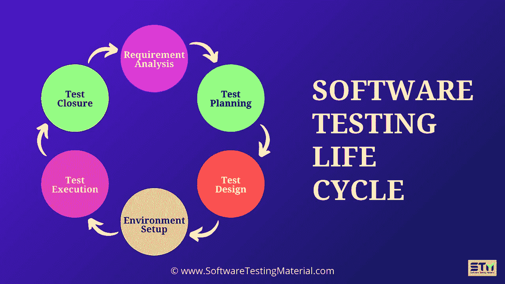

# 什么是软件测试生命周期(STLC)和 STLC 阶段

> 原文:[https://www . software testing material . com/stlc-software-testing-life-cycle/](https://www.softwaretestingmaterial.com/stlc-software-testing-life-cycle/)

## 

在这篇文章中，我们将带你了解你需要知道的关于软件测试生命周期(STLC)的一切。在之前的帖子中，我们已经了解了什么是软件测试和软件开发生命周期。

我们将从 STLC 的定义、STLC 阶段和以下内容开始。

## **什么是 STLC？**

软件测试生命周期( **STLC** )确定了执行什么测试活动以及何时完成这些测试活动。尽管不同组织之间的测试不同，但是有一个测试生命周期。

**不要错过:** [手动测试完整教程](https://www.softwaretestingmaterial.com/manual-testing-tutorial/)

请耐心等待。视频将在一段时间后加载。

## **STLC 的阶段**

软件测试生命周期模型(STLC 模型)的不同阶段是:

1.  需求分析
2.  测试计划
3.  测试设计
4.  测试环境设置
5.  测试执行
6.  测试结束

STLC(软件测试生命周期)的每个阶段都有明确的进入和退出标准。

### **1。需求分析**

此阶段的进入标准是 BRS(业务需求规范)文档。在这个阶段，测试团队从测试的角度研究和分析需求。

这个阶段有助于识别需求是否可测试。如果任何需求都是不可测试的，测试团队可以在这个阶段与各种涉众(客户、业务分析师、技术领导、系统架构师等)交流，以便可以计划缓解策略。

**进入标准:** BRS(业务需求规范)

**可交付成果:**所有可测试需求的列表，自动化可行性报告(如果适用)

> **必读:** [考试策略深度讲解](https://www.softwaretestingmaterial.com/test-strategy/)

### **2。测试计划:**

测试计划是测试过程的第一步。

在这个阶段，测试经理/测试主管通常会决定整个项目的工作量和成本估计。测试计划的准备将基于需求分析来完成。

资源规划、确定角色和职责、工具选择(如果自动化)、培训需求等活动。，在此阶段进行。

这个阶段的可交付成果是测试计划和工作量评估文档。

**参赛标准:**需求文档

**可交付成果:**测试策略、测试计划和测试工作量评估文档。

> **必读:** [如何写好测试计划](https://www.softwaretestingmaterial.com/test-plan-template/)

### **3。测试设计:**

测试团队从这个阶段的测试用例开发活动开始。测试人员准备测试用例、测试脚本(如果是自动化的话)和测试数据。

一旦测试用例准备好了，那么这些测试用例将由同级成员或团队领导进行评审。

同样，测试团队准备了[需求跟踪矩阵(RTM)](https://www.softwaretestingmaterial.com/requirements-traceability-matrix/) 。RTM 将需求追踪到测试用例，这些测试用例是验证需求是否被满足所需要的。这个阶段的可交付成果是测试用例、测试脚本、测试数据、需求跟踪矩阵

**进入标准:**需求文档(不清楚或缺失需求的更新版本)

**可交付成果:**测试用例，测试脚本(如果自动化的话)，测试数据。

在这个阶段，Selenium 将是最流行的工具。然而，它的复杂性和 Python 或 C#所需的编程经验肯定会给你的手动问答和自动化新手带来问题。

在这里，Katalon Studio 将是您的首选，它通过无代码自动化、内置关键字和测试套件的预定义工件模板来简化 Selenium 的基本功能。

> **必读:** [如何写测试用例](https://www.softwaretestingmaterial.com/test-case-template-with-explanation/)

### **4。测试环境设置:**

这个阶段可以与测试设计阶段并行开始。

测试环境的设置基于硬件和软件需求列表。在某些情况下，测试团队可能不参与这个阶段。开发团队或客户提供测试环境。

同时，测试团队应准备好[冒烟测试用例](https://www.softwaretestingmaterial.com/smoke-testing-vs-sanity-testing/)，以检查给定测试环境的准备情况。

**进入标准:**测试计划，冒烟测试用例，测试数据

**可交付成果:**测试环境。烟雾测试结果。

### **5。测试执行:**

测试团队开始基于计划的测试用例执行测试用例。如果一个测试用例结果是通过/失败，那么同样的结果应该在测试用例中更新。

应该为失败的测试用例准备缺陷报告，并且应该通过用于修复缺陷的[缺陷跟踪工具](https://www.softwaretestingmaterial.com/popular-defect-tracking-tools/)报告给开发团队。

一旦缺陷被修复，将进行重新测试。点击这里查看 [Bug 生命周期](https://www.softwaretestingmaterial.com/bug-life-cycle/)。

**进入标准:**测试计划文档，测试用例，测试数据，测试环境。

**交付成果:**测试用例执行报告，缺陷报告， [RTM](https://www.softwaretestingmaterial.com/requirements-traceability-matrix/)

> **必读:** [如何写一份有效的缺陷报告](https://www.softwaretestingmaterial.com/bug-report-template/)

### **6。测试结束:**

最后一个阶段，我们准备测试结束报告，测试度量。

测试团队将被召集开会，评估基于测试覆盖、质量、时间、成本、软件、商业目标的周期完成标准。

测试团队分析[测试工件](https://www.softwaretestingmaterial.com/test-deliverables/)(比如测试用例、缺陷报告等。，)来确定未来必须实施的策略，这将有助于消除即将到来的项目中的过程瓶颈。

将根据上述标准准备测试指标和测试结束报告。

**进入标准:**测试用例执行报告(确保没有高严重性的缺陷打开)，缺陷报告

**可交付成果:**测试结束报告，测试指标

> **必读:** [测试指标](https://www.softwaretestingmaterial.com/test-metrics/)

## **STLC 阶段(进入和退出标准)**

| STLC 阶段 | 入围标准 | 退出标准 | 可交付成果 |
| --- | --- | --- | --- |
| 需求分析 | 需求规格文件，
验收标准文件，
应用架构文件 | 签署 RTM，签署自动化可行性报告 | 所有可测试需求的列表，自动化可行性报告(如果适用) |
| 测试计划 | 需求文件，
自动化可行性报告 | 批准的测试计划文档、批准的测试策略文档、签署的工作量评估文档 | 测试策略、测试计划和测试工作量评估文档。 |
| 测试设计 | 需求文档(不清楚或缺失的需求的更新版本)，RTM，测试计划，测试评估文档，自动化分析报告 | 审查并批准测试用例、测试脚本、测试数据 | 测试用例，测试脚本(如果自动化)，测试数据。 |
| 测试环境设置 | 测试计划、测试环境设置计划、冒烟测试案例、测试数据 | 工作测试环境设置、有效测试数据设置、成功的冒烟测试 | 测试环境。烟雾测试结果。 |
| 测试执行 | 测试计划文档，测试用例，测试脚本，测试数据，测试环境。 | 执行所有计划的测试用例，记录所有发现的缺陷 | 测试用例执行报告，缺陷报告，RTM |
| 测试结束 | 测试已经完成，测试用例执行报告(确保没有高严重性缺陷打开) | 签署的测试结束报告 | 测试结束报告，测试指标 |

## 【STLC 与 SDLC 的区别

**查看本详细指南关于**[SDLC&STLC](https://www.softwaretestingmaterial.com/sdlc-vs-stlc/)之间的区别

**结论:**

软件测试生命周期是一种执行测试的系统方法。它提供了更好的产品质量，快速的错误修复结果，以及有效和高效的测试结果。

喜欢这个帖子，请分享给你的朋友。如有疑问，请在下方评论。

**相关帖子:**

*   [软件开发生命周期(SDLC)](https://www.softwaretestingmaterial.com/sdlc-software-development-life-cycle/)
*   [Bug 生命周期(缺陷生命周期)](https://www.softwaretestingmaterial.com/bug-life-cycle/)
*   [测试指标](https://www.softwaretestingmaterial.com/test-metrics/)
*   [需求可追溯性度量(RTM)](https://www.softwaretestingmaterial.com/requirements-traceability-matrix/)
*   [测试工件/测试可交付物](https://www.softwaretestingmaterial.com/test-deliverables/)
*   [如何编写测试策略](https://www.softwaretestingmaterial.com/test-strategy/)
*   [如何编写测试计划](https://www.softwaretestingmaterial.com/test-plan-template/)

