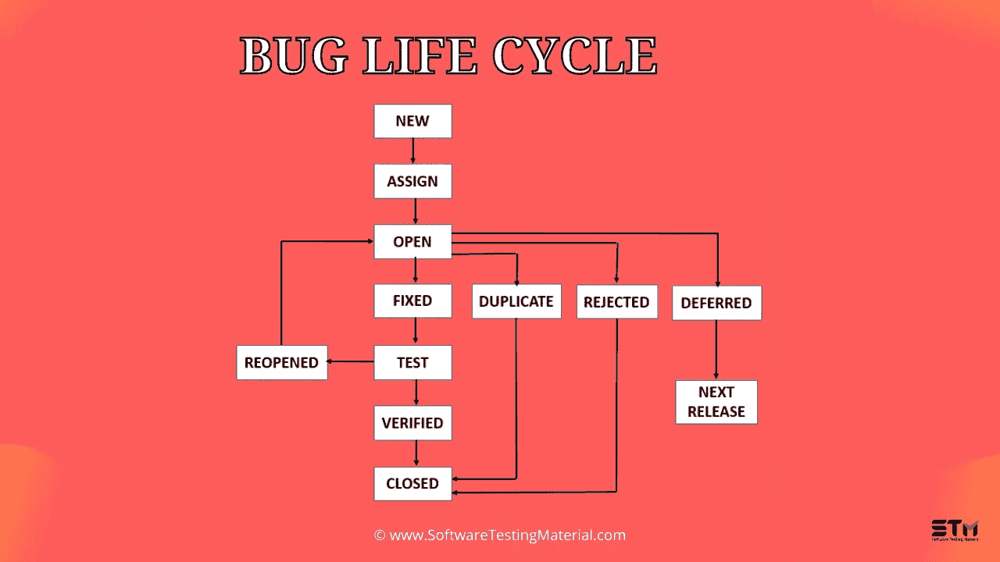

# 什么是软件测试中的缺陷生命周期，缺陷生命周期的不同阶段

> 原文:[https://www.softwaretestingmaterial.com/bug-life-cycle/](https://www.softwaretestingmaterial.com/bug-life-cycle/)

## 

在这篇文章中，我们将带你了解你需要知道的关于 Bug 生命周期(缺陷生命周期)的一切。在之前的帖子中，我们已经了解了什么是[软件测试](https://www.softwaretestingmaterial.com/software-testing/)，软件生命周期如 [SDLC](https://www.softwaretestingmaterial.com/sdlc-software-development-life-cycle/) 和 [STLC](https://www.softwaretestingmaterial.com/stlc-software-testing-life-cycle/) 。

我们将从 Bug 生命周期的定义以及缺陷生命周期的不同状态开始。

## **定义 Bug 生命周期**

**bug 生命周期**也被称为**缺陷生命周期**。在软件开发过程中，bug 是有生命周期的。bug 应该经过生命周期才会被关闭。bug 生命周期因工具(QC、JIRA 等)而异。，)以及组织中遵循的流程。

## 什么是软件 Bug？

软件缺陷可以定义为软件的异常行为。bug 在发现缺陷时开始，在确保缺陷不再重现后，在缺陷关闭时结束。

如果你喜欢这个视频，那么请订阅我们的 [YouTube 频道](https://www.youtube.com/channel/UCIJGI_3XgnfUaSNQD8D2IMQ)以获得更多视频教程。

## **缺陷生命周期状态**

**软件缺陷生命周期(sblc)中缺陷的不同状态如下:**

### **#1。新**

当测试人员发现一个新的缺陷时。他应该向开发团队提供适当的缺陷文档，以重现和修复缺陷。在这种状态下，由测试人员发布的缺陷的状态是“新的”

### **#2。已分配**

处于新状态的缺陷将被批准(如果有效)并由测试领导/项目领导/项目经理分配给开发团队。一旦缺陷被分配，那么 bug 的状态就会变为“已分配”

### **#3。打开**

开发团队开始分析并致力于缺陷修复

### **#4。固定**

当开发人员进行必要的代码更改并验证该更改时，错误的状态将更改为“已修复”,并将错误传递给测试团队。

### **#5。测试**

如果状态是“测试”，这意味着缺陷已被修复，并准备好进行测试，无论它是否被修复。

### **#6。已验证**

测试人员在开发人员修复 bug 后重新测试它。如果在软件中没有检测到 bug，那么这个 bug 就被修复了，分配的状态是“已验证”

### **#7。关闭**

验证修复后，如果错误不再存在，则错误的状态将被指定为“已关闭”

### **#8。重新打开**

如果缺陷在重新测试后仍然相同，那么测试人员使用缺陷重新测试文档发布缺陷，并将状态更改为“重新打开”。bug 再次通过生命周期被修复。

### **#9。重复**

如果缺陷重复了两次，或者缺陷对应于相同的 bug 概念，那么开发团队会将状态更改为“复制”。

### **#10。延期**

在某些情况下，项目经理/主管可能会将 bug 状态设置为延期。

*   如果在发布结束时发现了 bug，并且 bug 很小或者不重要，需要立即修复。
*   如果 bug 与当前版本无关。
*   如果它有望在下一个版本中得到修复。
*   客户正在考虑改变需求。
*   在这种情况下，状态将被更改为“延迟”,并在下一个版本中修复。

### **#11。被拒绝**

如果系统按照规范工作，而错误仅仅是由于一些误解(比如引用旧的需求或者额外的特性)，那么团队领导或者开发人员可以将这些错误标记为“拒绝”

其他一些状态包括:

### **#12。无法修复**

技术不支持，产品问题的根源，修复 bug 的成本更高

### **#13。不可再现**

平台不匹配、不适当的缺陷文档、数据不匹配、构建不匹配、不一致的缺陷

### **#14。需要更多信息**

如果开发人员无法按照测试人员提供的步骤重现 bug，那么开发人员可以将状态更改为“需要更多信息”。在这种情况下，测试人员需要添加详细的复制步骤，并将错误分配给开发团队进行修复。如果测试人员写了一个好的缺陷文档，这就不会发生。

## **结论**

这都是关于软件错误生命周期/缺陷生命周期的。一些公司使用 [RTM(需求跟踪矩阵)](https://www.softwaretestingmaterial.com/requirements-traceability-matrix/)中的 bugs in 来映射[测试用例](https://www.softwaretestingmaterial.com/test-case-template-with-explanation/)。

**推荐阅读:**

*   [8 种需要自动化的测试用例](https://www.softwaretestingmaterial.com/test-cases-to-be-automated/)
*   [8 种不被自动化的测试用例](https://www.softwaretestingmaterial.com/test-cases-not-to-be-automated/)
*   [如何写好 Bug 报告或缺陷文档](https://www.softwaretestingmaterial.com/write-good-bug-report/)
*   [软件测试中的缺陷分类过程](https://www.softwaretestingmaterial.com/defect-triage-meeting/)
*   [软件测试中的测试可交付成果](https://www.softwaretestingmaterial.com/test-deliverables/)
*   [软件架构中的质量属性是什么](https://www.softwaretestingmaterial.com/quality-attributes-in-software-architecture/)