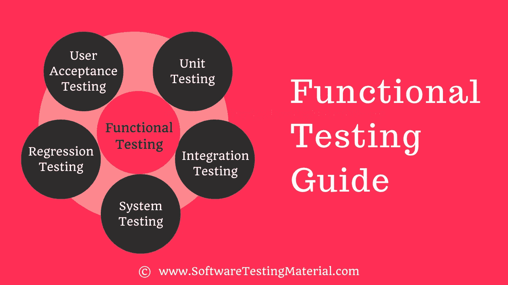

# 功能测试:初学者完全指南

> 原文:[https://www.softwaretestingmaterial.com/functional-testing/](https://www.softwaretestingmaterial.com/functional-testing/)

在这篇文章中，我们将会看到功能测试的细节。

我们知道每个项目都有三个重要方面，如质量、成本和时间。任何项目的目标都是获得高质量的产出，同时控制完成项目所需的成本和时间。

当你读完这篇博文后，你会了解到以下内容。

### **单元测试**

单元测试也称为模块测试或组件测试。这样做是为了检查源代码的单个单元或模块是否工作正常。它是由开发者在开发者的环境中完成的。

### **集成测试**

集成测试是测试两个软件单元之间接口的过程。集成测试由多种方法完成，如大爆炸方法、自顶向下方法、自底向上方法和混合集成方法。

### **系统测试**

测试完全集成的应用程序以评估系统是否符合其指定的需求被称为系统测试，也称为端到端测试。验证完整的系统，以确保应用程序是否按预期工作。

### **回归测试**

修改后对已测试的程序进行重复测试，以发现由于被测软件或其他相关或不相关软件组件的变化而引入或发现的任何缺陷。

### **用户验收测试**

它也被称为生产前测试。这由最终用户和测试人员一起完成，以验证应用程序的功能。验收测试成功后。为确定应用程序是否按照要求开发而进行的正式测试。它允许客户接受或拒绝申请。验收测试的类型有α、β和γ。

### **黑盒测试**

黑盒测试是一种[软件测试](https://www.softwaretestingmaterial.com/software-testing/)方法，测试人员在不查看内部代码结构的情况下评估被测软件的功能。这可以应用于软件测试的每一个层次，比如单元、集成、系统和验收测试。

## **功能测试技术**

功能测试可以通过以下方法完成。

### **基于需求的测试**

基于需求的测试包含了所有的功能规范，这些规范构成了所有测试用例的基础。

### **基于业务场景的测试**

基于业务场景的测试包含了从业务流程的角度来看系统将如何被感知的信息。

## **功能测试与非功能测试**

前面我们已经讨论了功能测试和非功能测试之间的差异。查看这篇文章的详细解释。

## **功能测试工具**

### **[硒](https://www.softwaretestingmaterial.com/selenium-tutorial)**

Selenium 可能是 Web 应用程序最流行的开源测试自动化框架。Selenium 起源于 21 世纪，经过十年的发展，已经成为 Web 自动化测试人员的自动化框架选择，尤其是那些拥有高级编程和脚本技能的人。Selenium 已经成为其他开源测试自动化工具的核心框架，例如 Katalon Studio、Watir、量角器和 Robot Framework。

Selenium 支持多种系统环境(Windows、Mac、Linux)和浏览器(Chrome、Firefox、IE 和 Headless 浏览器)。它的脚本可以用各种编程语言编写，比如 Java、Groovy、Python、C#、PHP、Ruby 和 Perl。虽然测试人员可以灵活地使用 Selenium，并且他们可以编写复杂和高级的测试脚本来满足各种级别的复杂性，但是它需要高级的编程技能和努力来为特定的测试需求构建自动化框架和库。

### 空气/QTP

UFT 是一个商业工具，它是一个非常用户友好的微焦点功能测试工具。

### watir

Watir 是一个基于 Ruby 库的 web 自动化测试的开源测试工具。Watir 支持[跨浏览器测试](https://www.softwaretestingmaterial.com/what-is-cross-browser-testing/)包括 Firefox、Opera、headless browser 和 IE。它还支持数据驱动的测试，并与 RSpec、Cucumber 和 Test/Unit 等 BBD 工具集成。

查看这篇文章，获得[功能测试工具](https://www.softwaretestingmaterial.com/functional-testing-tools/)的详细列表

在这里，我精心挑选了几个帖子，可以帮助你了解更多与面试相关的东西:

*   [硒教程](https://www.softwaretestingmaterial.com/selenium-tutorial/)
*   [手动测试教程](https://www.softwaretestingmaterial.com/manual-testing-tutorial/)
*   [软件测试人员 SQL 教程](https://www.softwaretestingmaterial.com/sql-tutorial-complete/)
*   [性能测试教程](https://www.softwaretestingmaterial.com/performance-testing-tutorial/)
*   [安全测试教程](https://www.softwaretestingmaterial.com/security-testing-tutorial/)
*   [API 测试教程](https://www.softwaretestingmaterial.com/api-testing/)