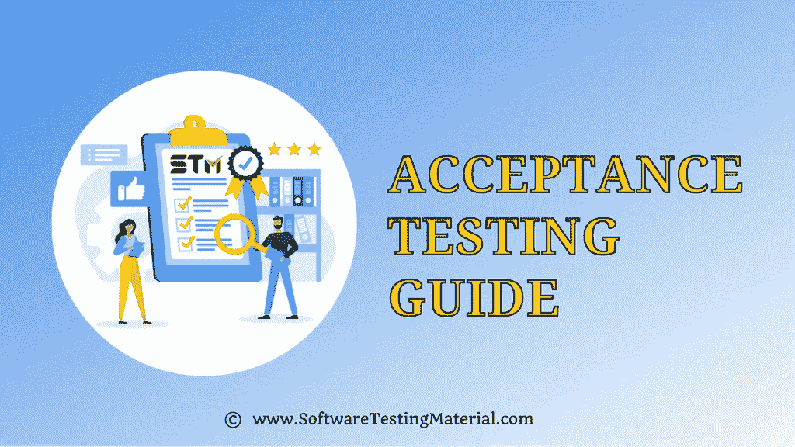

# 验收测试|完整指南

> 原文:[https://www.softwaretestingmaterial.com/acceptance-testing/](https://www.softwaretestingmaterial.com/acceptance-testing/)

前面我们已经详细学习了[系统测试](https://www.softwaretestingmaterial.com/integration-testing/)，在本文中，我们将学习验收测试和以下概念

<button class="kb-table-of-contents-title-btn kb-table-of-contents-toggle" aria-expanded="false" aria-label="Expand Table of Contents">Table of Contents</button>

*   什么是验收测试？
*   何时进行验收测试？
*   谁执行验收测试？
*   [验收标准的属性](#h-attributes-of-acceptance-criteria)
*   [验收测试的类型](#h-types-of-acceptance-testing)
    *   [#1。用户验收测试(UAT)](#h-1-user-acceptance-testing-uat)
    *   [#2。业务验收测试(BAT)](#h-2-business-acceptance-testing-bat)
    *   [#3。合同验收测试](#h-3-contract-acceptance-testing-cat)
    *   [#4。法规/合规验收测试(RAT)](#h-4-regulations-compliance-acceptance-testing-rat)
    *   [#5。运行验收测试](#h-5-operational-acceptance-testing)
    *   [#6。阿尔法测试](#h-6-alpha-testing)
    *   [#7。测试版测试](#h-7-beta-testing)
*   [验收测试的使用:](#h-use-of-acceptance-testing)
*   [进入&验收测试退出标准](#h-entry-exit-criteria-of-acceptance-testing)
    *   [参赛标准](#h-entry-criteria)
    *   [退出标准:](#h-exit-criteria)
*   [验收测试计划的属性](#h-attributes-of-acceptance-test-plan)
*   [验收测试报告属性](#h-attributes-of-acceptance-test-report)

## 什么是验收测试？

验收测试也称为生产前测试。

它是在系统测试之后完成的，是软件测试过程的最后一个阶段。

这是一种[黑盒测试](https://www.softwaretestingmaterial.com/black-box-test-design-techniques/)技术，由最终用户和测试人员一起验证应用程序的功能，以确保产品符合指定的验收标准。

验收测试环境应该类似于生产环境。我们称之为转移环境或 UAT 环境或生产前环境或故障切换环境。

成功验收测试环境后。为确定应用程序是否按照要求开发而进行的正式测试。它允许客户接受或拒绝申请。

## 何时进行验收测试？

验收测试是第四级测试，在以下条件下进行

*   系统测试完成后完成
*   在产品投入实际使用之前完成

## 谁执行验收测试？

验收测试由客户、客户的客户、来自组织的测试人员、业务分析师和主题专家执行。

## **验收标准的属性**

通常，验收测试来源于用户故事。验收测试基于验收标准。以下是验收标准的属性

*   功能的正确性和完整性
*   数据完整性和转换
*   保密性和可用性
*   可安装性和升级性
*   可用性
*   表演
*   可量测性
*   文件
*   及时

## **验收测试的类型**

以下是验收测试的类型

1.  用户验收测试(UAT)
2.  业务验收测试(BAT)
3.  合同验收测试
4.  法规/合规验收测试(RAT)
5.  操作验收测试
6.  阿尔法测试
7.  Beta 测试

所有这些类型的验收测试都是为了获得对产品的信心，并确保产品可以在生产中发布。

### **#1。用户验收测试(UAT)**

用户验收测试是软件测试的最后一步，它验证软件是否按照用户的要求实现了最初的目标。

最终用户经常使用的需求大多是为了测试目的而挑选出来的。在 UAT，术语“用户”意味着最终用户，因此这种测试也称为最终用户测试。

> 必读:[用户验收测试完整指南](https://www.softwaretestingmaterial.com/user-acceptance-testing-uat/)

### **#2。业务验收测试(BAT)**

执行业务验收测试是为了验证产品是否符合业务需求和要求。执行 BAT 的测试人员应该关注用户故事以及终端用户行为，并且应该对客户的业务和领域有清晰的理解。

### **#3。合同验收测试**

在合同验收测试中，在合同中提到的合同期内，用所有验收测试用例对产品进行测试(服务水平协议(SLA))。只有当产品通过所有验收用例时，客户才会向公司付款。

### **#4。法规/合规验收测试(RAT)**

法规验收测试也称为合规验收测试。

这种类型的验收测试是为了确保产品不违反由产品发布的特定国家的管理机构制定的任何规则和条例。通常，世界各地的产品都应该进行这种测试，因为不同的国家有不同的管理机构制定的规则和规定。

### **#5。运行验收测试**

在 STLC 中，**运行测试**或**运行验收测试(OAT)** 用于在软件应用程序发布到生产环境之前评估其运行准备情况。它确保系统在其标准操作环境(SOE)中平稳运行。它主要关注兼容性、恢复、可靠性、可维护性等。，也称为产品验收测试。

> 点击此处查看我们关于[操作验收测试](https://www.softwaretestingmaterial.com/operational-acceptance-testing/)的详细指南

### **#6。阿尔法测试**

Alpha 测试由开发组织之外的用户在开发人员的测试环境中现场完成。

> 点击这里查看我们关于 [Alpha 测试](https://www.softwaretestingmaterial.com/alpha-testing/)的详细指南

### **#7。测试版测试**

Beta 测试由开发组织之外的真实用户或客户在客户端完成。

> 点击这里查看我们关于测试版测试的详细指南

## **验收测试的使用:**

*   找出功能测试阶段遗漏的问题。
*   来发现产品开发得有多好。
*   从最终用户那里获得反馈，以改善用户体验和产品性能。
*   最小化或消除生产后发现问题的风险。

## **进入&验收测试退出标准**

像软件测试的每个其他阶段一样，验收测试也有进入和退出标准。

### **参赛标准**

在进行验收测试之前，我们必须验证以下内容

*   用户故事应该是可用的和可理解的
*   [系统测试](https://www.softwaretestingmaterial.com/system-testing/)是否完成？
*   是否所有的主要错误都已修复？
*   是否所有主要的 bug 都重新测试并关闭了？
*   [需求追溯矩阵](https://www.softwaretestingmaterial.com/requirements-traceability-matrix/)是否更新？
*   验收试验台应该可用。
*   系统测试签署批准进入验收阶段。

### **退出标准:**

在签署验收测试之前，我们必须完成以下工作

*   应执行并通过所有验收测试。
*   所有的关键或主要问题都应该被修复并重新测试。
*   获得所有利益相关者的签字批准。

## **验收测试计划的属性**

以下是验收测试计划的属性

*   介绍
*   验收测试类别
*   操追境
*   测试用例 ID
*   测试用例标题
*   测试用例目标
*   检查法
*   试验进度表
*   资源

## **验收测试报告属性**

以下是验收测试报告的属性。

1.报告 ID
2。每个测试不符合项的结果汇总
3。每次测试失败的结果汇总
4。测试日志位置
5。测试人员姓名和测试时间
6。待办事项汇总
7。批准决定

**相关帖子:**

*   [用户验收测试(UAT) |完整指南](https://www.softwaretestingmaterial.com/user-acceptance-testing-uat/)
*   [阿尔法测试指南](https://www.softwaretestingmaterial.com/alpha-testing/)
*   [测试指南](https://www.softwaretestingmaterial.com/beta-testing-a-detailed-guide/)
*   [运行验收测试(OAT)](https://www.softwaretestingmaterial.com/operational-acceptance-testing/)
*   [测试级别|软件测试材料](https://www.softwaretestingmaterial.com/levels-of-testing/)
*   [自动化测试与手动测试|你必须知道的重要区别](https://www.softwaretestingmaterial.com/automation-testing-vs-manual-testing/)
*   功能测试:初学者完全指南