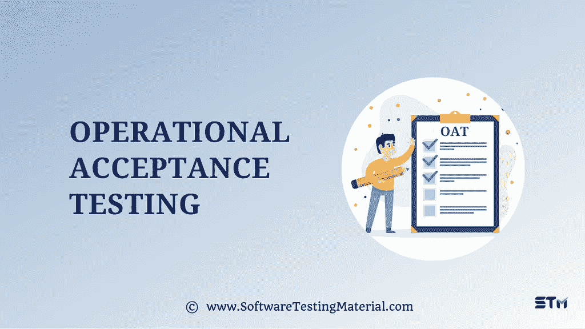

# 什么是操作验收测试(OAT)

> 原文:[https://www . software testing material . com/operational-acceptance-testing/](https://www.softwaretestingmaterial.com/operational-acceptance-testing/)

在本帖中，我们将详细了解**操作验收测试**。

严重的软件错误或缺陷会导致任何服务或产品的商业失败。软件产品中的缺陷使最终用户感到沮丧，并使他们离开软件而不再使用它。为了克服这些问题，全面而准确地进行操作测试是很重要的。

## 什么是运营测试？

在 STLC 中，**运行测试**或**运行验收测试(OAT)** 用于在发布到生产之前评估软件应用程序的运行准备情况。它确保系统在其标准操作环境(SOE)中平稳运行。

它的主要焦点是模拟生产环境。

操作测试是[非功能验收测试](https://www.softwaretestingmaterial.com/non-functional-testing/)的一种。在 STLC 的最后阶段(即在[用户验收测试(UAT)](https://www.softwaretestingmaterial.com/user-acceptance-testing-uat/) 阶段之后)进行。它确认产品、系统、服务或流程满足操作要求，如性能、安全性、可靠性、可访问性、稳定性、可维护性、可访问性、互操作性、备份和恢复。

它在类似于生产环境的测试环境中执行。

它验证软件是否按照预期的方式运行，而不中断业务流程。

## 运行验收测试有哪些类型？

运行验收测试的类型有

*   SLA(服务水平协议)监控测试
*   操作文件审查
*   代码分析
*   安装测试
*   端到端测试环境操作测试
*   性能试验
*   负载测试
*   安全测试
*   备份和恢复测试
*   故障转移测试
*   恢复测试

## 运营测试的优势是什么？

运行测试的优势如下:

*   它允许功能交互
*   它提供备份和恢复工具、灾难恢复、操作支持等等
*   它检查软件的安全漏洞。
*   它通过在向公众发布之前验证软件的各个方面来确保最佳的用户体验。

**结论:**

操作验收测试验证产品质量并确保更好的用户体验。

**相关帖子:**

*   [什么是确认测试](https://www.softwaretestingmaterial.com/confirmation-testing/)
*   [什么是用户验收测试](https://www.softwaretestingmaterial.com/user-acceptance-testing-uat/)
*   [质量保证与质量控制](https://www.softwaretestingmaterial.com/quality-assurance-vs-quality-control/)
*   [非功能测试 vs 功能测试](https://www.softwaretestingmaterial.com/functional-testing-vs-non-functional-testing/)