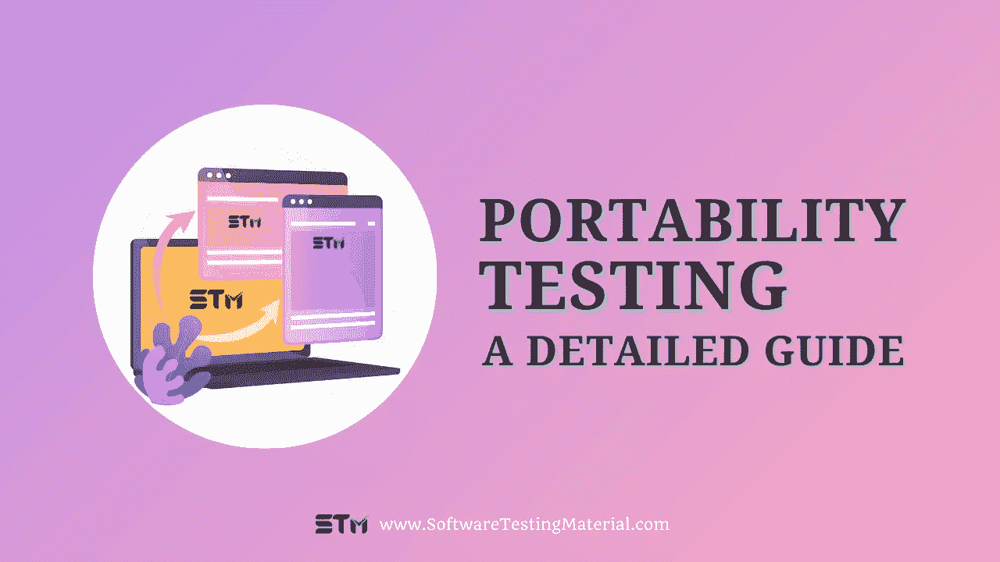

# 什么是软件测试中的可移植性测试

> 原文:[https://www . software testing material . com/portability-testing/](https://www.softwaretestingmaterial.com/portability-testing/)

在这篇文章中，我们将会看到什么是软件测试中的可移植性测试

## **什么是可移植性测试**

软件可移植性测试是确定软件应用程序的行为方式是否与另一个系统、环境或设备兼容的过程。

可移植性测试的目的是确认应用程序可以移植到另一个平台。

它在整个 [SDLC](https://www.softwaretestingmaterial.com/sdlc-software-development-life-cycle/) 中以迭代和增量的方式定期执行。

*   我们开发的应用程序应该可以在 Windows 操作系统和 Macintosh 操作系统上运行。
*   我们开发的应用程序应该兼容 Google Chrome、IE 和 Mozilla Firefox。
*   我们开发的应用程序应该可以在 iOS 和 Android 手机上运行。
*   我们设计的应用程序应该运行在 Windows MySQL 服务器和 Macintosh Oracle 数据库上。
*   在各种操作系统中安装和卸载软件。

这种[类型测试](https://www.softwaretestingmaterial.com/types-of-software-testing/)的主要目的是确保应用程序没有重大缺陷，并且在另一个操作系统或硬件架构上执行时不会导致任何故障或崩溃。

这将有助于提高当代码必须跨不同平台转移以供执行时的成功机会，即兼容性。

移植软件既费钱又费时。需要进行测试，以避免在不同平台上执行期间的进一步成本和失败。当应用程序需要跨硬件和软件平台移植时，这个方面变得更加重要。

测试还验证应用程序是否可以在特定的硬件、操作系统和计算机网络上运行，而没有任何兼容性问题。

例如，一个流行的操作系统的未来版本可能会有一个明显不同于其前身的界面设计。如果这个新操作系统与当前操作系统并行安装，那么就要进行健壮性测试，以评估当前版本与两个版本的操作系统的兼容程度。

> **不要错过:** [模拟器 vs 仿真器 vs 真实设备测试](https://www.softwaretestingmaterial.com/simulator-vs-emulator-vs-real-device-testing/)

## **可移植性测试属性**

可移植性测试的属性如下

1.  可安装性
2.  适应性
3.  替换性
4.  共存或兼容

### **#1。可安装性**

可安装性是为了验证在目标环境中成功安装软件的能力。

它包括以下内容

*   操作系统和浏览器要求
*   先决条件验证
*   RAM 或内存要求
*   安装程序
*   安装中断
*   初始化和卸载程序

### **#2。适应性**

适应性是为了验证软件适应目标环境的能力。

它包括以下内容

*   硬件和软件依赖性。
*   标准语言。
*   跨不同系统的依赖性。

### **#3。可更换性**

可替换性是为了验证在相同的环境中，出于相同的目的，使用软件来代替另一个指定产品的能力。

将取代当前正在使用的软件的软件必须在所有目标平台上提供与旧软件相同的结果。

### **#4。兼容性**

兼容性是为了验证软件在公共环境中与其他独立软件一起工作的能力，而不会对彼此的行为产生不利影响。

这种类型的测试在有许多子系统的大型系统中特别有用。理想情况下，子系统应该使用相同的堆栈区域和内存。因此，一个子系统的故障可能会迅速蔓延到另一个子系统，导致整个应用程序崩溃。

改变一个已经存在的组件是一项困难的任务，特别是如果它是一个已经建立的系统。未通过兼容性测试的组件会对整个系统产生重大影响，因此，必须彻底测试它们对共享资源的影响。

## **便携性测试清单**

该清单包含将在可移植性测试期间测试的标准。

*   可移植性测试应该满足可移植性要求。
*   在多种浏览器类型和浏览器版本中测试应用程序的外观。
*   检查各种操作系统上的应用程序。
*   对于[连续回归测试](https://www.softwaretestingmaterial.com/regression-testing-tools/)，它可以是自动化的。

## **不同类型的可移植性测试**

### **功能可移植性测试**

这种类型的测试评估软件在不同平台上执行特定任务的能力。主要目的是检查应用程序是否能按预期执行所有功能。它验证应用程序是否已经成功移植到另一个平台。在这种方法中，重点主要放在确保产品不会因为从一个平台移植到另一个平台而出现任何功能错误。功能可移植性测试有助于减少由于兼容性和可配置性相关问题而在后期阶段发现的缺陷数量。测试主要关注通过减少迭代次数和测试工作量来节省时间。这种类型的测试在开箱即用的发布过程中非常理想。

> **不要错过:** [如何进行功能测试](https://www.softwaretestingmaterial.com/functional-testing/)

### **性能可移植性测试**

这种测试的目的是确定一个软件应用程序在另一个平台上是否运行良好。测试团队评估应用程序在另一个环境中执行时完成任务的速度。换句话说，如果一个应用程序运行得比预期慢，或者有性能优化问题，那么它就不能通过测试。性能可移植性测试有助于发现由于硬件兼容性问题可能导致后期故障的缺陷。

> **不要错过:** [如何进行性能测试](https://www.softwaretestingmaterial.com/performance-testing-tutorial/)

### **软件可用性可移植性测试**

它测试不同环境中的用户在 UI 特性、用户交互等方面浏览应用程序的难易程度。该测试的目的是确保产品可以成功地跨不同平台移植，而不会牺牲可用性。这仅仅意味着一个应用程序应该能够在所有平台上工作，具有相同的可用性特征。

> **不要错过:** [如何进行可用性测试](https://www.softwaretestingmaterial.com/usability-testing/)

### **软件可靠性可移植性测试**

这种测试侧重于评估应用程序在降级条件下的性能。换句话说，该测试验证应用程序是否如预期那样工作，即使它遇到硬件和软件错误。如何处理严重的系统故障？如果程序由于不可预知的情况而失败，会发生什么？这些是在可移植性测试期间需要通过确保软件可靠性来确定的一些问题。

> **不要错过:** [如何进行可靠性测试](https://www.softwaretestingmaterial.com/reliability-testing/)

### **压力可移植性测试**

开发一个无压力的使用体验对于任何成功的应用都是至关重要的。这种类型的测试评估软件在不同负载条件下的性能，以确定即使在涉及大量数据集的情况下，软件是否能够为用户顺利运行。

> **不要错过:** [如何进行压力测试](https://www.softwaretestingmaterial.com/stress-testing/)

### **数据迁移可移植性测试**

它验证应用程序在平台间数据传输过程中的表现。在这个过程中，重点主要是评估程序在没有任何问题的情况下跨不同平台移动数据的效率。例如，如果需要将测试数据转移到生产环境中，那么运行这个测试有助于识别潜在的问题，这些问题可能会因为后期的不兼容性而暴露出来。

### **功能可移植性测试**

这种类型的测试验证诸如伸缩性、高可用性等特性。，超出正常的业务场景。这种测试的目的是确保产品即使在受到大量数据或大量交易的影响时也不会降级。进行这种类型的测试是为了确定产品是否可以成功地移植到另一个平台上，而不会损害关键的功能。

### **错误处理可移植性测试**

它验证应用程序在异常情况下的表现。检查优雅系统如何失败，以便确定是否遵循了适当的回退机制。例如，如果一个程序包含安全特性，那么它应该能够阻止黑客通过漏洞获得访问权限。如果相同的功能在异常情况下失败，那么它会危及整个安全机制。为了解决这个问题，进行了错误处理可移植性测试。

### **兼容性可移植性测试**

进行软件兼容性测试是为了确保应用程序可以跨不同平台成功移植，而不会出现任何兼容性或性能问题。

> **不要错过:** [如何进行兼容性测试](https://www.softwaretestingmaterial.com/software-compatibility-testing/)

### **软件安装可移植性测试**

它验证程序在其他设备上的安装情况。在很多情况下，由于不兼容，软件无法完全安装。该测试验证程序是否能在所有类型的硬件环境中正确安装。

### **操作性能可移植性测试**

这种类型的测试确定特定的进程是否可以在另一个平台上顺利运行。测试确定产品是否符合要求的质量标准。例如，如果制造商将其生产线转移到其他地方，那么操作性能测试可确保不会因不兼容的条件而出现制造缺陷。

### **性能指标评测可移植性测试**

软件基准测试是为了确定一个产品在不同环境下的运行速度。

> **不要错过:** [如何进行基准测试](https://www.softwaretestingmaterial.com/benchmark-testing/)

## **利弊**

可移植性测试有几个优点和缺点。让我们来看看每一个。

### **优点**

*   进行可移植性测试是为了找到各种组件之间的依赖关系。
*   当我们在大型系统上执行测试时，它是首选的，因为大型系统有许多相互作用的子系统。
*   当您的客户端使用多个操作系统和浏览器版本时，就会出现这种情况。
*   它用于查找在单元和集成测试中未被发现的错误。
*   它用于测试应用程序在各种操作系统和浏览器上的响应能力和性能。
*   它用于在各种操作系统和浏览器上测试应用程序的外观。
*   软件的安装和卸载也可以作为可移植性测试的一部分进行测试。

### cons

*   因为测试需要多种配置，如各种操作系统和浏览器，所以需要巨大的时间和金钱投入。
*   有期限的时候不建议。
*   托管环境可能成本高昂。

## **结论**

软件测试是一个巨大的领域。有许多不同类型的测试可以做，也有许多方法来做。我们在这篇博文中看到的类型——可移植性测试——是在软件发布时测试软件的一种方法。

可移植性测试是一种软件测试，它确保被测试的应用程序能够在具有不同硬件和操作系统的不同类型的计算机上运行。如您所见，可移植性测试是确保您的应用程序准备好发布给公众的一个重要部分。