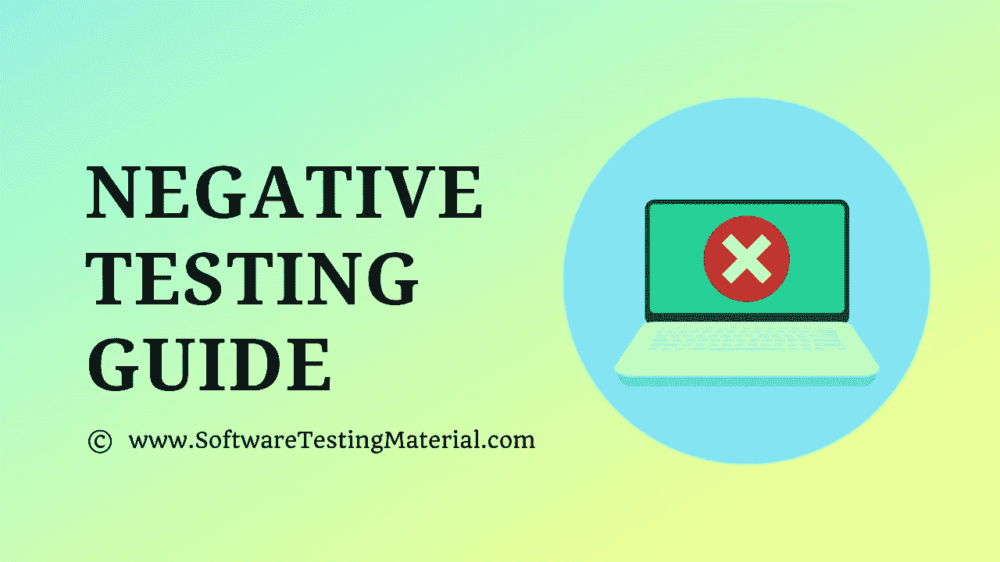

# 负面测试指南——用实时例子解释

> 原文:[https://www.softwaretestingmaterial.com/negative-testing/](https://www.softwaretestingmaterial.com/negative-testing/)

在本文中，我们将通过一些负面测试场景的例子来了解什么是负面测试。该文章包含以下部分:

*   [什么是带例子的阴性测试？](#h-what-is-negative-testing-with-examples)
*   [负面测试的例子(负面测试场景):](#h-examples-of-negative-testing-negative-testing-scenarios)
    *   [例 1。电话号码字段的测试。](#h-example-1-testing-of-a-phone-number-field)
    *   [例 2。年龄字段的测试。](#h-example-2-testing-of-age-field)
    *   [例 3。邮政编码字段的测试。](#h-example-3-testing-of-the-zip-code-field)
    *   [例 4。对于必填字段](#h-example-4-for-mandatory-fields)
    *   [例 5。对于数据界限和限制](#h-example-5-for-data-bounds-and-limits)
*   什么时候进行阴性测试？
*   [阳性检测中使用的技术](#h-techniques-used-in-positive-testing)
    *   [边界值分析:](#h-boundary-value-analysis)
    *   [等价划分:](#h-equivalence-partitioning)
*   [阳性检测&阴性检测](#h-what-is-the-difference-between-positive-testing-negative-testing)有什么区别

[软件测试](https://www.softwaretestingmaterial.com/software-testing/)中的两种主要测试策略:[积极测试](https://www.softwaretestingmaterial.com/positive-testing/)和消极测试。

## **什么是带例子的阴性测试？**

从软件测试人员的角度来看，验证软件按照需求执行其基本功能是非常重要的，但验证软件能够优雅地处理任何异常情况或无效输入也同样重要，这有助于确定软件的稳定性。执行负面测试是为了发现软件可能崩溃的情况。

这是一种消极的方法，测试人员试图设计测试用例来发现应用程序的消极方面，并验证无效输入。否定测试也称为失败测试或错误路径测试。应用程序的功能可靠性只能通过设计的负面场景来衡量。

### **例 3。邮政编码字段的测试。**

不同国家的邮政编码格式不同。在这种场景中的否定测试用例可以为美国、印度输入字母数字值，为加拿大、英国输入数字值。超过邮政编码字段中的字符数也是一个负面的测试用例。

### **例 4。对于必填字段**

跳过所需的数据输入进行测试，并尝试继续。

### **例 5。对于数据界限和限制**

输入较大的值来测试字段的大小。

## 什么时候进行阴性测试？

负面测试是在对构建进行功能测试时执行的，因为可能会出现意外情况。可以由专业人士来执行。

## **阳性检测中使用的技术**

用于阴性测试的技术有:

### **边界值分析:**

它与您的输入测试数据范围中的无效分区有关。系统应该拒绝无效输入的值。无效的分区将有两个边界-下边界和上边界。如果输入测试数据范围是 A-B，那么应该为 A-1 和 B+1 设计阴性测试用例。

**例#1:** 对于日期字段(1-31)，无效的分区下边界(在日期字段中输入 0)和无效的上边界(在日期字段中输入 32)被考虑用于阴性测试用例。

**示例#2:** 对于具有 6-10 个字符规格的用户名字段，无效分区下边界(5 个字符)和无效分区上边界(11 个字符)被认为是负面测试情况。

**例#3:** 对于浮点值，让系统接受 0.2 到 0.8 的值，带一个小数位。无效的分区下边界(输入 0.1)和无效的上边界(输入 0.9)被认为是负面测试用例。

在这里阅读更多关于[边界值分析测试用例设计技术](https://www.softwaretestingmaterial.com/boundary-value-analysis-testing-technique/)

### **等价划分:**

在这种技术中，输入测试数据被划分成多个分区。对于否定测试，如果您从无效分区中选取一个值，系统应该拒绝该值。

**例#1:** 对于日期字段(1-31)，输入任何无效值如 0 和负整数值，系统应拒绝该值。

**示例#2:** 对于规格为 6-10 个字符的用户名字段，输入无效分区中的任何值，即 0-5 或 11、12、13…并测试系统的行为。在这种情况下，系统应该拒绝这些值并显示错误。

**示例#3:** 对于除 60-65 岁以外的 18-80 岁年龄字段，输入无效分区中的任何值，即 0-17 或 60-65 或 81、82、83…并测试系统的行为。

在这里阅读更多关于[等价测试用例设计技术](https://www.softwaretestingmaterial.com/equivalence-partitioning-testing-technique/)的内容

## **阳性检测&阴性检测**有什么区别

## 阳性测试与阴性测试

| 阳性测试 | 阴性测试 |
| --- | --- |
| 它是通过传递有效的测试数据来执行的 | 它是通过传递无效的测试数据来执行的 |
| 它被执行来验证已知的一组测试条件 | 执行它是为了用一组未知的测试条件来中断应用程序 |
| 它只涵盖有效的情况 | 它涵盖了所有可能的情况，包括无效的情况 |
| 它花费更少的时间 | 这需要更多的时间 |
| 它验证是否满足所有要求 | 它验证需求中没有提到的工作流 |
| 它确保软件按预期工作 | 它确保软件没有缺陷 |