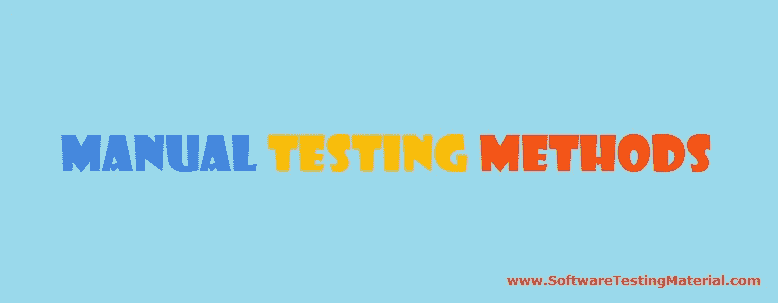

# 手动测试方法

> 原文:[https://www . software testing material . com/manual-testing-methods/](https://www.softwaretestingmaterial.com/manual-testing-methods/)

在这篇文章中，我们将看到手动测试方法。手动测试方法分类如下:

*   1.[黑盒测试](/manual-testing-methods/#BLACK-BOX-TESTING)
*   1.1.[黑盒测试技术](/manual-testing-methods/#Black-Box-Testing-Techniques)
*   1.2.[黑盒测试的类型](/manual-testing-methods/#Types-of-Black-Box-Testing)
*   2.[白盒测试](/manual-testing-methods/#WHITE-BOX-TESTING)
*   2.1.[白盒测试技术](/manual-testing-methods/#White-Box-Testing-Techniques)
*   3.[灰箱测试](/manual-testing-methods/#GREY-BOX-TESTING)

让我们看看下面所有三种类型的手动测试方法:

> 必读:[手工测试教程](https://www.softwaretestingmaterial.com/manual-testing-tutorial/)

### **黑盒测试:**

黑盒测试是一种[软件测试](https://www.softwaretestingmaterial.com/software-testing/)方法，测试人员在不查看内部代码结构的情况下评估被测软件的功能。这可以应用于软件测试的每一个层次，比如单元、集成、系统和验收测试。

测试人员只对应用程序的功能部分进行测试，以确保软件的行为符合预期。因此，它也被称为基于行为的测试。

测试仪传递输入数据，以确保实际输出是否与预期输出相匹配。因此，这就是所谓的输入输出测试。

在这个过程中，测试人员没有义务了解源代码。

#### **黑盒测试技术:**

*   [等价划分](https://www.softwaretestingmaterial.com/equivalence-partitioning-testing-technique/)
*   [边界值分析](https://www.softwaretestingmaterial.com/boundary-value-analysis-testing-technique/)
*   [决策表](https://www.softwaretestingmaterial.com/decision-table-test-design-technique/)
*   [状态转换测试](https://www.softwaretestingmaterial.com/state-transition-test-design-technique/)

#### **黑盒测试的类型:**

**功能测试:**简单来说，系统实际做的就是功能测试。验证软件应用程序的每个功能都符合需求文档中的规定。通过提供适当的输入来测试所有功能，以验证实际输出是否与预期输出相匹配。它属于黑盒测试的范围，测试人员不需要关心应用程序的源代码。

**非功能性测试:**简单来说，系统执行的有多好就是非功能性测试。非功能测试指的是软件的各个方面，如性能、负载、压力、可伸缩性、安全性、兼容性等。的主要目的是改善用户体验，提高系统响应请求的速度。

> 必读: [100 多种软件测试](https://www.softwaretestingmaterial.com/types-of-software-testing/)

### **白盒测试:**

白盒测试基于应用程序内部代码结构。在白盒测试中，系统的内部视角以及编程技巧被用来设计测试用例。这种测试通常在单元级完成。它又名玻璃箱、透明箱、结构测试、开口箱、透明箱。

#### **白盒测试技术:**

*   报表覆盖范围
*   分支覆盖
*   路径覆盖

### **灰箱测试:**

灰盒是白盒测试和黑盒测试的结合。从事这类测试的测试人员需要访问设计文档。这有助于在这个过程中创建更好的测试用例。

相关帖子:

*   [什么是软件测试](https://www.softwaretestingmaterial.com/software-testing/)
*   [详细了解 SDLC](https://www.softwaretestingmaterial.com/sdlc-software-development-life-cycle/)
*   [详细学习 STLC](https://www.softwaretestingmaterial.com/stlc-software-testing-life-cycle/)
*   [软件开发生命周期中的 PDCA 循环](https://www.softwaretestingmaterial.com/pdca-cycle/)
*   [你为什么选择软件测试作为职业](https://www.softwaretestingmaterial.com/choose-software-testing-as-a-career/)
*   [实时软件测试面试问题](https://www.softwaretestingmaterial.com/100-software-testing-interview-questions/)