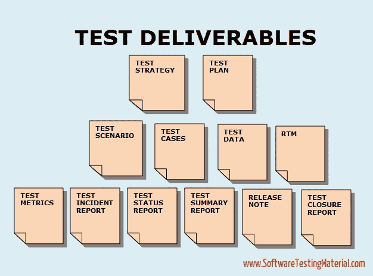

# 软件测试中的测试交付——详细解释

> 原文:[https://www.softwaretestingmaterial.com/test-deliverables/](https://www.softwaretestingmaterial.com/test-deliverables/)

**测试可交付成果**是在 [SDLC(软件开发生命周期)](https://www.softwaretestingmaterial.com/sdlc-software-development-life-cycle/)期间交给软件项目干系人的测试工件。遵循 SDLC 的软件项目在交付给客户之前会经历不同的阶段。在这个过程中，每个阶段都会有一些可交付成果。一些可交付成果在测试阶段开始前提供，一些在测试阶段提供，其余的在测试阶段完成后提供。

> 不要错过:[手动测试完整教程](https://www.softwaretestingmaterial.com/manual-testing-tutorial/)

每个软件应用都要经历 SDLC 和 STLC 的不同阶段。在软件应用程序开发的过程中，测试团队准备不同的文档来改善团队成员和其他利益相关者之间的交流。这些文档也被称为测试可交付物，因为它们是与软件应用程序的最终产品一起交付给客户的。

### 测试可交付成果信息图:

**面试问题:**什么是测试可交付成果，列出你在 STLC 过程中遇到的测试可交付成果？
这是大一新生最重要的问答面试问题之一。

查看下面的视频，查看“测试交付内容”

[https://www.youtube.com/embed/I487PqpIgc4?rel=0](https://www.youtube.com/embed/I487PqpIgc4?rel=0)

在下一部分，我们将详细讨论上面提到的重要的测试可交付成果。

### 以下是测试可交付成果的列表:

软件测试过程中准备的测试成果如下

1.[测试策略:](https://www.softwaretestingmaterial.com/test-strategy/)测试策略是一个高级文档(静态文档)，通常由项目经理开发。这是一份记录了我们如何着手测试产品并实现目标的方法的文件。它通常来源于业务需求规范(BRS)。像测试计划这样的文档是以这个文档为基础来准备的。[点击此处了解更多详情](https://www.softwaretestingmaterial.com/test-strategy/)。

2.测试计划(Test Plan):测试计划文档是一个包含所有测试活动的计划的文档，这些测试活动是为了交付一个高质量的产品而进行的。测试计划文档来源于产品描述、SRS 或者项目所有未来活动的用例文档。它通常由测试主管或测试经理准备。[点击这里了解更多详情。](https://www.softwaretestingmaterial.com/test-plan-template/)

> [测试策略和测试计划之间的差异](https://www.softwaretestingmaterial.com/test-strategy-vs-test-plan/)

3.工作评估报告:在这个报告中，通常测试团队会提到测试团队为完成测试过程所付出的努力。

4.测试场景:测试场景给出了我们要测试什么的想法。测试场景就像一个高级测试用例。

> [测试场景和测试用例之间的差异](https://www.softwaretestingmaterial.com/test-scenario-vs-test-case/)

5.[测试用例](https://www.softwaretestingmaterial.com/test-case-template-with-explanation/)/脚本:测试用例是一个测试场景的肯定和否定的可执行步骤的集合，该测试场景有一组前置条件、测试数据、预期结果、后置条件和实际结果。[点击这里了解更多详情。](https://www.softwaretestingmaterial.com/test-case-template-with-explanation/)

6.测试数据:测试数据是测试人员用来运行测试用例的数据。当运行测试用例时，测试人员需要输入一些输入数据。为此，测试人员准备测试数据。可以手动准备，也可以使用工具准备。

例如，测试具有用户 id、密码字段的基本登录功能。我们需要在用户 id 和密码字段中输入一些数据。所以我们需要收集一些测试数据。

7.[需求可追溯矩阵(RTM)](https://www.softwaretestingmaterial.com/requirements-traceability-matrix/) :需求可追溯矩阵(RTM)用于将需求追溯到验证需求是否被满足所需的测试。需求跟踪矩阵又名跟踪矩阵或交叉引用矩阵。[点击这里了解更多详情。](https://www.softwaretestingmaterial.com/requirements-traceability-matrix/)

8.[缺陷报告/Bug 报告](https://www.softwaretestingmaterial.com/bug-report-template/):使用缺陷报告模板或 Bug 报告模板的目的是传达详细信息(如环境细节、重现步骤等。，)关于 bug 给开发者。它允许开发人员很容易地复制 bug。[点击这里了解更多详情。](https://www.softwaretestingmaterial.com/bug-report-template/)

9.测试执行报告:它包含测试结果和测试执行活动的总结。

10.图表和[度量](https://www.softwaretestingmaterial.com/test-metrics/):软件测试度量是为了监控过程和产品。这有助于推动项目朝着我们计划的目标无偏差地前进。度量回答不同的问题。决定你想要什么问题的答案是很重要的。[点击此处了解更多详情](https://www.softwaretestingmaterial.com/test-metrics/)。

11.测试总结报告:它包含了测试活动和最终测试结果的总结。

12.测试事件报告:它包含所有事件，例如在测试软件时发现的已解决或未解决的事件。

13.测试结束报告:它给出了对软件中发现的错误、移除的错误和发现的差异的详细分析。

14.发布说明:发布说明将与构建一起发送给客户、顾客或涉众。它包含了一个新版本和错误修复的列表。

15.安装/配置指南:本指南帮助安装或配置组成系统的组件及其硬件和软件要求。

16.用户指南:本指南帮助最终用户访问软件应用程序。

17.测试状态报告:用于跟踪测试状态。它是定期或每周编制的。它包含到目前为止已完成的工作和未完成的工作。

18.每周状态报告(项目经理对客户):它类似于测试状态报告，但是每周生成。

在此下载上述测试成果。

[Download](http://bit.ly/ResourceDownload) 

*   [人工测试面试问题](https://www.softwaretestingmaterial.com/100-software-testing-interview-questions/)
*   [手动测试教程](https://www.softwaretestingmaterial.com/manual-testing-tutorial/)
*   我为什么选择软件测试作为职业？