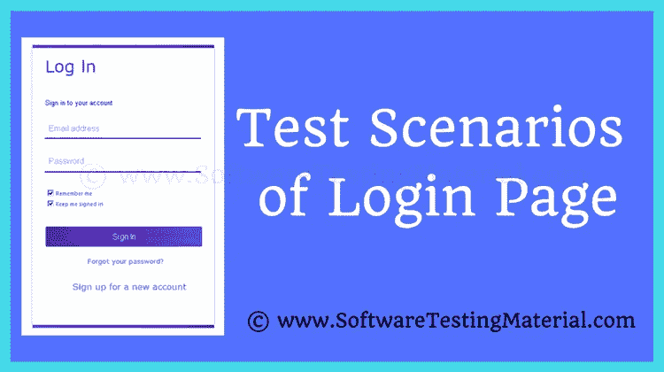

# 如何为登录页面编写测试用例

> 原文:[https://www . software testing material . com/test-scenarios-log in-page/](https://www.softwaretestingmaterial.com/test-scenarios-login-page/)

在任何应用程序中，“登录”是指拥有有效用户凭证的个人访问应用程序的过程。“登录”通常用于进入特定页面，侵入者无法看到。

在本帖中，我们将看到“登录页面的测试场景”。就安全性而言，登录页面的测试对于任何应用程序都是非常重要的。我们将尝试在这里涵盖最广泛使用的登录页面场景，包括功能测试用例、安全测试用例、UI 测试用例等等。

之前我们已经讨论了一些相关的帖子，这里有一些供你参考。

*   [带有详细解释的测试用例模板](https://www.softwaretestingmaterial.com/test-case-template-with-explanation/)
*   [带有详细解释的测试计划模板](https://www.softwaretestingmaterial.com/test-plan-template/)
*   [注册页面的测试用例](https://www.softwaretestingmaterial.com/test-scenarios-registration-form/)
*   [自动柜员机测试用例](https://www.softwaretestingmaterial.com/test-scenarios-login-page/)
*   [测试场景与测试用例](https://www.softwaretestingmaterial.com/test-scenario-vs-test-case/)
*   [测试策略与测试计划](https://www.softwaretestingmaterial.com/test-strategy-vs-test-plan/)

我们通常为我们测试的每个应用程序的登录页面编写测试用例。每个登录页面都应该包含以下元素。

### **登录页面的 UI 测试场景**

1.  验证登录屏幕是否包含用户名、密码、登录按钮、记住密码复选框、忘记密码链接和创建帐户链接等元素。
2.  验证用户名、密码等所有字段都有有效的占位符
3.  验证所有文本框是否都有最小和最大长度。
4.  验证当文本字段处于焦点或被填充时，标签是否向上浮动(如果是浮动标签)
5.  验证标签的字体样式和大小以及每个对象上的文本是否清晰可见。
6.  验证应用程序的用户界面(UI)是否有响应，以便适应不同的屏幕分辨率和设备。
7.  验证登录页面和登录页面中的所有字段在不同的浏览器中显示时没有中断

### **登录页面功能测试场景**

1.  验证光标聚焦在页面加载(登录页面)上的“用户名”文本框上
2.  验证选项卡功能是否正常工作
3.  验证 Enter/Tab 键是否可以替代登录按钮
4.  验证用户能够使用有效凭据登录
5.  验证用户不能使用无效的用户名和密码登录
6.  验证用户无法使用有效的用户名和无效的密码登录
7.  验证用户不能使用无效的用户名和有效的密码登录
8.  验证用户不能使用空白用户名或密码登录
9.  验证用户无法使用非活动凭据登录
10.  验证重置按钮是否清除了登录表单中所有文本框的数据
11.  验证登录凭证，主要是以加密格式存储在数据库中的密码
12.  验证成功登录后单击浏览器的后退按钮不会使用户进入注销模式
13.  验证当用户将用户名或密码留空时是否显示验证消息
14.  验证在超过用户名和密码字段的字符限制时是否显示验证消息
15.  验证在用户名和密码字段中输入特殊字符时是否显示验证消息
16.  验证默认情况下未选中“保持我登录”复选框(取决于业务逻辑，它可能被选中或取消选中)
17.  验证登录会话超时(会话超时)
18.  验证注销链接被重定向到登录/主页
19.  验证用户在成功登录后是否被重定向到适当的页面
20.  验证用户在单击忘记密码链接时是否被重定向到忘记密码页面
21.  验证用户在单击注册/创建帐户链接时是否被重定向到创建帐户页面
22.  验证用户在更改密码后应该能够使用新密码登录
23.  验证用户在更改密码后不能使用旧密码登录
24.  验证在尝试任何密码字符之前不应允许空格
25.  验证用户在一系列操作(如登录、关闭浏览器和重新打开应用程序)后是否仍然登录。
26.  验证在用户忘记密码时找回密码的方法

### **登录页面非功能性安全测试用例**

1.  验证在成功注销后单击浏览器的后退按钮不会将用户带入登录模式
2.  验证不成功登录尝试的总次数是否有限制(无效尝试的次数应基于业务逻辑。根据业务逻辑，将要求用户输入验证码并重试，否则用户将被阻止)
3.  验证在密码字段中输入的密码是否为加密形式(掩码格式)。
4.  验证密码可以复制粘贴。系统不应该允许用户复制粘贴密码。
5.  验证“密码”字段中的加密字符在被复制时不允许解密
6.  验证默认情况下“记住密码”复选框未被选中(取决于业务逻辑，它可能被选中或未被选中)
7.  通过查看页面源代码，验证登录表单是否泄露了任何安全信息
8.  验证登录页面易受 SQL 注入攻击。
9.  验证跨站点脚本(XSS)漏洞是否对登录页面有效。黑客可以利用 XSS 漏洞绕过访问控制。

### **登录页面的性能测试用例**

1.  验证在登录页面中输入有效的用户名和密码后，应用程序加载主页需要多长时间。

### **验证码&cookie 的测试用例(**如果登录页面上有验证码** )**

1.  验证当用户不输入验证码时是否有客户端验证
2.  验证验证码的刷新链接正在生成新的验证码
3.  验证验证码是否区分大小写
4.  验证验证码是否有音频支持
5.  如果是银行应用程序，请验证虚拟键盘是否可用并正常工作以输入登录凭据。
6.  在银行应用程序中，验证通过 OTP 的双向身份验证是否正常工作。
7.  验证 SSL 证书是否已实施
    **Cookie—[查看此贴，了解更多与网站 Cookie 测试相关的测试案例](https://www.softwaretestingmaterial.com/website-cookie-testing/)**
8.  当浏览器 cookies 被清除时，验证用户能够登录。当 cookies 被清除时，系统不应该允许用户自动登录。
9.  当浏览器 cookies 关闭时，验证登录功能。

> 必读:[注册表单的测试场景](https://www.softwaretestingmaterial.com/test-scenarios-registration-form)

为应用程序编写测试用例需要一点实践。一个写得好的测试用例应该允许任何测试人员理解和执行测试，并使测试过程更顺利，从长远来看节省大量时间。之前我们已经发布了一个关于如何编写测试用例的视频。我正在总结这篇文章“测试场景登录页面/登录表单的测试场景”。

喜欢这个帖子？别忘了分享一下！如果您有疑问，请在下面评论。

下面是几篇精选的文章供你接下来阅读:

*   [如何写好缺陷报告](https://www.softwaretestingmaterial.com/write-good-bug-report/)
*   [你为什么选择软件测试作为职业](https://www.softwaretestingmaterial.com/choose-software-testing-as-a-career/)
*   [测试计划模板详解](https://www.softwaretestingmaterial.com/test-plan-template/)
*   [Web Cookie 测试——Cookie 测试的测试用例](https://www.softwaretestingmaterial.com/website-cookie-testing/)