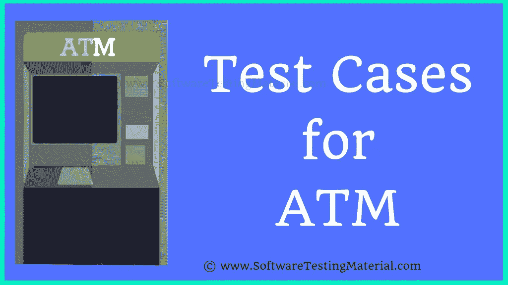

# 如何为 ATM 写测试用例(测试场景 ATM 机)

> 原文:[https://www . software testing material . com/how-to-write-test-cases-for-ATM/](https://www.softwaretestingmaterial.com/how-to-write-test-cases-for-atm/)

在这篇文章中，我们将学习如何为 ATM 机编写测试用例。之前我们已经讨论了一些相关的帖子，这里有一些供你参考。

*   [带有详细解释的测试用例模板](https://www.softwaretestingmaterial.com/test-case-template-with-explanation/)
*   [注册页面的测试用例](https://www.softwaretestingmaterial.com/test-scenarios-registration-form/)
*   [登录页面的测试用例](https://www.softwaretestingmaterial.com/test-scenarios-login-page/)
*   [测试场景与测试用例](https://www.softwaretestingmaterial.com/test-scenario-vs-test-case/)
*   [测试策略与测试计划](https://www.softwaretestingmaterial.com/test-strategy-vs-test-plan/)

ATM 机 24×7 工作，与钱有关。我们需要测试它的准确性、可靠性和性能。

在这里，我们将通过涵盖 ATM 机的主要方面来列出 ATM 的大多数测试场景。以下是 ATM 机的测试案例。该列表包括正面和负面测试场景登录页面。

### 自动柜员机的测试案例:

1.验证“ATM 卡插入槽”是否符合规格
2。验证 ATM 机是否接受卡和 PIN 码详情
3。通过错误插入卡来验证错误信息
4。通过插入无效卡(过期卡)来验证错误信息
5。通过输入不正确的 PIN 码
6 来验证错误信息。验证在插入有效的 ATM 卡
7 后是否要求用户输入 PIN。验证 PIN 已加密
8。验证当不正确的 PIN 尝试总数超过
9 时，是否有类似卡阻塞的动作发生。验证每个 PIN 请求仅允许用户进行一次现金提取交易
10。成功撤销
11 后，验证机器是否立即退出用户会话。当 ATM
12 中没有钱时验证消息。验证语言选择功能
13。通过输入一些有效金额
14 来验证现金提取功能。通过输入小于 100
15 的金额来验证现金提取功能。通过输入大于帐户中可用总余额的金额来验证现金提取功能。
16。通过输入大于每日限额的金额来验证现金提取功能
17。验证用户是否可以再次输入金额，以防输入的金额无效。应该显示一条正确的消息。
18。验证 ATM 机成功取出钱。
19。验证 ATM 机在取款后取出余额打印件
20。验证 ATM 屏幕
21 中显示的文本字体。验证屏幕按钮上的文本是否清晰可见。22。验证键盘
23 上所有按钮的功能。验证按钮上的文字是否清晰可见。24。验证 ATM 屏幕的触摸是否平滑且可操作
25。验证是否允许用户选择不同的账户类型，如储蓄、活期等。，
26。验证不同的操作组合，并检查在操作过程中是否会有电力损失。如果在交易过程中出现电力损失，则交易应被标记为无效，金额不应透露给其他人。27。验证现金分配器
28 的功能。验证收据打印机
29 的功能。验证收据
30 中打印的数据是否正确。验证系统注销需要多长时间。

为应用程序编写测试用例需要一点实践。一个写得好的测试用例应该允许任何测试人员理解和执行测试，使测试过程更顺利，并且从长远来看节省大量时间。之前我们已经发布了一个关于如何编写测试用例的视频。我正在总结这篇文章“ATM 机的测试案例”。

喜欢这个帖子？别忘了分享一下！如果您有疑问，请在下面评论。

下面是几篇精选的文章供你接下来阅读:

*   [如何写好缺陷报告](https://www.softwaretestingmaterial.com/write-good-bug-report/)
*   [你为什么选择软件测试作为职业](https://www.softwaretestingmaterial.com/choose-software-testing-as-a-career/)
*   [测试计划模板详解](https://www.softwaretestingmaterial.com/test-plan-template/)
*   [Web Cookie 测试——Cookie 测试的测试用例](https://www.softwaretestingmaterial.com/website-cookie-testing/)