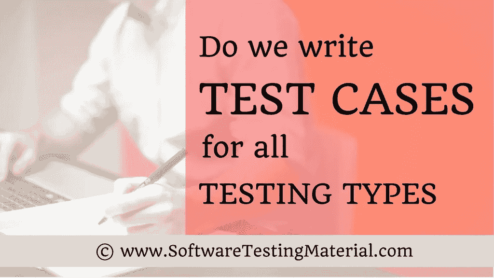

# 我们真的为所有测试类型编写了测试用例吗

> 原文:[https://www . software testing material . com/do-we-really-write-test-cases-for-all-testing-types/](https://www.softwaretestingmaterial.com/do-we-really-write-test-cases-for-all-testing-types/)

我们真的为所有测试类型编写了测试用例吗？写这篇文章是为了清除围绕着新一批软件测试人员的不确定性。大多数测试新手在开始学习编写测试用例时都会想到这个问题。

*   [什么是测试用例，如何编写测试用例](https://www.softwaretestingmaterial.com/test-case-template-with-explanation/)
*   [100 多种软件测试类型](https://www.softwaretestingmaterial.com/types-of-software-testing/)

根据 ISTQB，有四种软件测试类型，即

1.  功能的
2.  无功能的
3.  结构的
4.  与变更相关

功能测试类型:冒烟测试、健全性测试是功能测试中的一些测试类型。

**变更相关测试类型:**回归和重测测试类型属于变更相关测试类型。

让我们看看测试人员是否真的为所有类型的测试找到了正确的测试用例。在这里，我给出了一些测试类型的简短说明，我还指定了我们是否编写测试用例。在这篇文章中，我将把自己局限于广泛使用的测试类型。

*   [注册页面的测试场景](https://www.softwaretestingmaterial.com/test-scenarios-registration-form/)
*   [登录页面的测试场景](https://www.softwaretestingmaterial.com/test-scenarios-login-page/)

**选择编写测试用例的标准是什么？**

1.  我们需要在应用程序的每个构建版本上运行的测试
2.  我们使用多个数据值运行的测试
3.  耗费大量时间的测试
4.  涉及重复步骤的测试
5.  跨平台测试或[跨浏览器测试](https://www.softwaretestingmaterial.com/what-is-cross-browser-testing/)

查看下面的视频，看看“我们真的为所有测试类型编写了测试用例吗？”

[https://www.youtube.com/embed/NZuzWKEnjQY?rel=0](https://www.youtube.com/embed/NZuzWKEnjQY?rel=0)

冒烟测试:冒烟测试是一种测试，用来验证发布的版本是否可测试。
这只是为了测试开发团队发布的版本是否可测试。所以我们只测试登录等基本功能。为了进行冒烟测试，我们选择已经编写好的测试用例。我们并不是专门为了做冒烟测试而编写测试用例。

**健全性测试:**健全性测试是一种测试，将在发布阶段完成，以验证应用程序的主要功能，而无需深入。为了做到这一点，我们选择了我们已经写好的测试用例。和冒烟测试一样，我们并不特别为了进行健全性测试而编写测试用例。

[冒烟测试与健全性测试](https://www.softwaretestingmaterial.com/smoke-testing-vs-sanity-testing/)

**功能测试:**我们确实测试了软件应用程序的每一个功能，以确保每个功能的表现都符合需求文档中的规定。为了进行功能测试，我们需要编写测试用例。

**集成测试:** [集成测试](https://www.softwaretestingmaterial.com/integration-testing/)是测试两个软件单元之间接口的过程。为了进行集成测试，我们需要编写测试用例。

**系统测试:**测试完全集成的应用程序，以确保该应用程序是否按预期工作。为了进行系统测试，我们需要编写测试用例。

**验收测试:**这由最终用户和测试人员一起完成，以验证应用程序的功能。最有可能的是，验收测试将由客户来完成，因此他们可能会编写测试用例来进行验收测试。

**兼容性测试:**部署并检查应用程序在不同的环境组件组合中是否按预期运行。已经写好的测试用例将被用来做兼容性测试。

临时测试:临时测试与正式测试完全相反。这是一种非正式的测试类型。在即席测试中，测试人员随机测试应用程序，而不遵循任何文档和测试设计技术。所以，我们不写任何测试用例。

**性能测试:**性能与实现满足产品性能目标的响应时间、吞吐量和资源利用水平有关。即使我们使用像 LoadRunner 这样的工具，我们也会选取一些场景并编写测试用例来进行性能测试。性能测试用例不同于功能测试用例。

**可用性测试:**验证一个应用程序是否用户友好。主要重点将是应用程序的外观和感觉。我们按照一个清单来测试应用程序的外观和感觉。所以，我们不写具体的测试用例来做可用性测试。

**易访问性测试:**验证用户是否能够舒适地使用它。我们按照清单来测试应用程序的外观和感觉，就像可用性测试一样。所以，我们不写具体的测试用例来做可用性测试。

**可靠性测试:**就可靠性测试而言，我们确实对应用程序进行了长时间的持续测试，以验证应用程序的稳定性。我们不写手工测试用例来做可靠性测试。我们使用自动化工具通过挑选一些场景来完成这项工作。

**回归测试:**在修改后，对已经测试过的程序进行重复测试，以发现由于被测试软件或其他相关或不相关软件组件的变化而引入或暴露的任何缺陷。
我们使用已经写好的测试用例来做回归测试。所以，我们不写具体的测试用例来做回归测试。

[什么是回归测试，我们如何进行回归测试](https://www.softwaretestingmaterial.com/regression-testing/)

**重新测试:**我们进行重新测试，以确保在早期版本中发现并发布的缺陷在当前版本中得到修复。我们不写测试用例来做再测试。我们使用错误报告来做重新测试。

[什么是重新测试，我们什么时候进行重新测试](https://www.softwaretestingmaterial.com/retesting/)

**恢复测试:**我们进行恢复测试，以确定系统从崩溃中恢复的速度。为了进行恢复测试，我们编写测试用例。

**全球化测试:**全球化是一个设计软件应用程序的过程，使其可以适应各种语言和地区，而无需任何更改。为了进行全球化测试，我们编写测试用例。

**本地化测试:**本地化是通过添加本地特定组件，使全球化软件适应特定地区或语言的过程。是的，我们写测试用例来做本地化测试。

你觉得这个帖子怎么样？如果你喜欢，别忘了和你的朋友分享。

在这里，我亲手挑选了一些教程供你学习。

*   [手动测试教程](https://www.softwaretestingmaterial.com/manual-testing-tutorial/)
*   [敏捷测试教程](https://www.softwaretestingmaterial.com/agile/)
*   [SQL 教程](https://www.softwaretestingmaterial.com/sql-tutorial-complete/)
*   [硒教程](https://www.softwaretestingmaterial.com/selenium-tutorial/)
*   [API 测试教程](https://www.softwaretestingmaterial.com/api-testing/)
*   [Java 教程](https://www.softwaretestingmaterial.com/java-tutorial/)
*   [VBScript 教程](https://www.softwaretestingmaterial.com/vbscript-for-automation-qtp-uft-testing/)