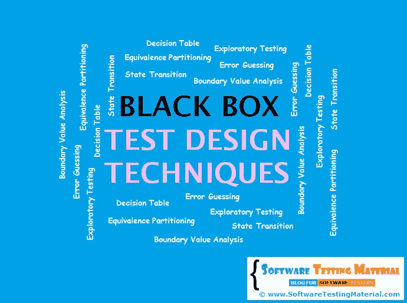

# 黑盒测试设计技术|软件测试材料

> 原文:[https://www . software testing material . com/black-box-test-design-techniques/](https://www.softwaretestingmaterial.com/black-box-test-design-techniques/)

黑盒测试设计技术作为行业中的最佳实践被广泛使用。黑盒测试设计技术用于以系统的方式挑选测试用例。通过使用这些技术，我们可以节省大量的测试时间，并获得良好的测试覆盖率。

**注意**:使用这些黑盒测试设计技术并不需要了解 AUT(被测应用程序)的内部结构(代码)。

### 以下是黑盒测试设计技术的列表:

这些测试设计技术用于从需求规格文档中导出测试用例，并且基于测试人员的专业知识:

请耐心等待。视频将在一段时间后加载。

让我们详细看看每种技术。

### **等价划分:**

它也被称为等价类划分(ECP)。

利用等价划分测试设计技术，我们将测试条件划分为类(组)。在每一组中，我们只测试一个条件。假设一组中的所有条件都以相同的方式工作。如果一个组中的一个条件有效，那么该组中的所有条件都有效，反之亦然。它减少了大量的返工，并且给出了良好的测试覆盖率。我们可以通过减少必须开发的测试用例的总数来节省大量时间。

**例如:**一个字段应该接受数值。在这种情况下，我们将测试条件分为输入数值、输入字母数值、输入字母，等等。而不是测试诸如 0、1、2、3 等数值。

点击这里查看关于[等价类划分](https://www.softwaretestingmaterial.com/equivalence-partitioning-testing-technique/)的详细帖子。

### **边界值分析:**

使用边界值分析(BVA)，我们将测试条件作为划分，通过获取划分的边界值来设计测试用例。两个分区之间的边界是应用程序行为变化的地方。边界两侧的测试条件称为边界值。在这种情况下，我们必须获得有效边界(来自有效分区)和无效边界(来自无效分区)。

例如:如果我们想测试一个只接受大于 10 小于 20 的字段，那么我们把边界取为 10-1，10，10+1，20-1，20，20+1。我们没有使用大量的测试数据，而是使用 9、10、11、19、20 和 21。

点击这里查看关于[边界值分析](https://www.softwaretestingmaterial.com/boundary-value-analysis-testing-technique/)的详细帖子。

### **决策表:**

决策表又称因果表。这种测试技术适用于输入之间有逻辑关系的功能(if-else 逻辑)。在决策表技术中，我们处理输入的组合。为了用决策表识别测试用例，我们考虑条件和动作。我们把条件作为输入，把行动作为输出。

点击此处查看[决策表](https://www.softwaretestingmaterial.com/decision-table-test-design-technique/)上的详细帖子。

### **状态转换测试:**

使用状态转换测试，我们从需要测试不同系统转换的应用程序中挑选测试用例。当应用程序对相同的输入给出不同的输出时，我们可以应用这一点，这取决于在早期状态下发生了什么。

一些例子是自动售货机，交通灯。

当正确的硬币组合被投入时，自动售货机分发产品。

当汽车行驶/等待时，交通灯将改变顺序

点击这里查看关于[状态转换测试](https://www.softwaretestingmaterial.com/state-transition-test-design-technique/)的详细帖子。

### **探索性测试:**

通常这个过程将由领域专家来执行。他们仅仅通过探索应用程序的功能来执行测试，而不了解需求。

当使用这种技术时，测试人员可以探索和学习系统。在这种类型的测试中，会很快发现严重程度高的错误。

### **错误猜测:**

错误猜测是一种测试技术，用于根据测试人员以前的经验发现软件应用程序中的错误。在错误猜测中，我们不遵循任何特定的规则。

一些例子是:

*   提交表单但不输入值。
*   输入无效值，如在数值字段中输入字母。