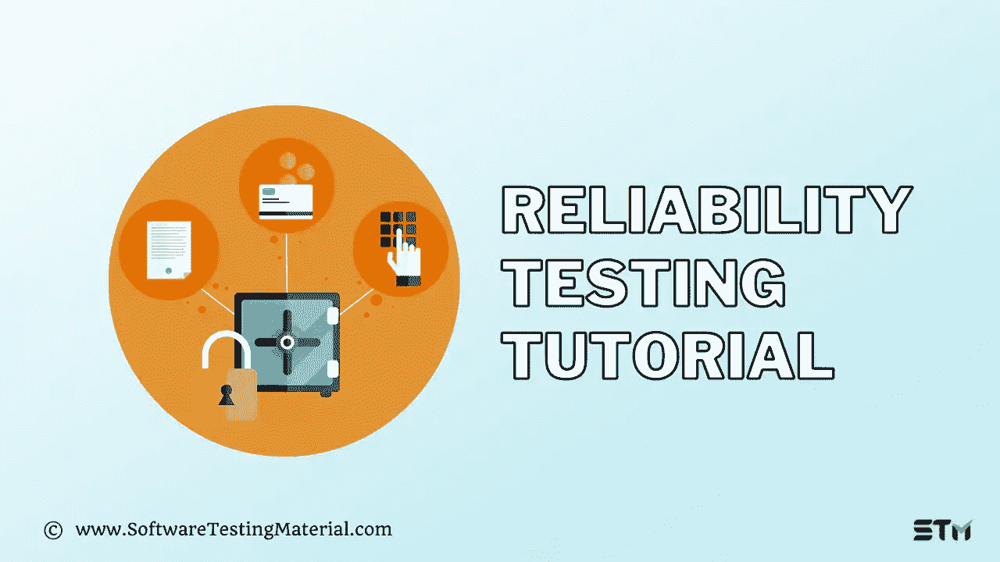

# 软件测试中的可靠性测试|完全指南

> 原文:[https://www . software testing material . com/reliability-testing/](https://www.softwaretestingmaterial.com/reliability-testing/)



[软件测试](https://www.softwaretestingmaterial.com/software-testing/)最重要的方面是它的可靠性。软件测试人员负责确保软件的所有部分在发布给客户和最终用户之前都能正常工作。

测试人员做到这一点的方法之一是对代码进行可靠性测试。这些类型的测试确保当其他组件被添加或更改到程序中时，bug 不会在将来造成系统故障。

这篇文章讨论了如何通过对代码进行可靠性测试来执行可靠的软件测试，从而在发布之前修复在这些检查中发现的任何错误！

<button class="kb-table-of-contents-title-btn kb-table-of-contents-toggle" aria-expanded="false" aria-label="Expand Table of Contents">Table of Contents</button>

*   什么是可靠性测试？
*   为什么可靠性测试很重要？
*   [影响可靠性测试的因素有哪些？](#what-are-the-factors-influencing-reliability-testing)
*   可靠性测试中使用的方法有哪些？
    *   [方法#1:重测信度](#approach-1-testretest-reliability)
    *   [方法#2:并行表单可靠性](#-approach-2--parallel-forms-reliability)
    *   [方法#3:决策一致性](#-approach-3--decision-consistency)
    *   [方法#4:评分者可靠性](#-approach-4--interrater-reliability)
*   可靠性测试有哪些不同的类型？
    *   [1。功能测试](#1-feature-testing)
    *   [2。回归测试](#2-regression-testing)
    *   [3。负载测试](#3-load-testing)
*   你如何进行可靠性测试？
    *   [步骤#1:建模](#step-1-modelling)
    *   [步骤#2:测量](#step-2-measurement)
    *   [第三步:改进](#step-3-improvement)
*   [我们什么时候使用可靠性测试？](#when-we-use-reliability-testing)
*   可靠性测试有哪些例子？
*   我应该使用哪种可靠性工具？
*   [结论](#conclusion)


## 什么是可靠性测试？

可靠性测试是一种软件测试过程，它验证软件在特定时间内在给定环境中是否以无错误的方式运行。

*   创建每次都能准确运行的可靠软件。
*   在交付之前检测并修复软件中的问题
*   确保软件满足客户的需求。
*   发现软件设计和功能中的问题。
*   发现缺陷趋势中的模式。

## 为什么可靠性测试很重要？

可靠性测试有助于在软件交付给最终用户之前发现问题。除此之外，进行可靠性测试还有其他几个原因，如下所列。

*   它有助于发现重复故障的持续结构。
*   它可以确定特定时间段内发生的故障数量。
*   它揭示了失败的主要原因。
*   它降低了失败的风险。
*   它甚至允许我们估计未来的失败。
*   它确保我们交付高质量的产品。

## **影响可靠性测试的因素有哪些？**

在进行可靠性测试时，很少有因素会影响测试的过程和结果。作为一名[软件测试人员](https://www.softwaretestingmaterial.com/how-to-become-a-software-tester/)，在执行这些测试时，你必须意识到这些基本要素。

可靠性测试受以下三个因素的影响:

*   当前系统中的问题数量。
*   用户如何操作系统。
*   测试团队执行的测试数量。

## 可靠性测试中使用的方法有哪些？

为了确保系统中的所有缺陷和故障都在可靠性测试期间得到识别和纠正，我们遵循三种方法。


1.  重测信度
2.  平行形式可靠性
3.  决策一致性
4.  评分者间信度

很难评估可靠性的准确性。上述这些方法通常用于评估应用程序。

### **方法#1:重测信度**

在这里，测试团队会在短时间内使用各种技术对软件进行测试和再测试。这有助于我们通过在合理的时间间隔内验证两次并评估两次输出来评估应用程序的可靠性和可信性。

### **方法二:** **平行形式可靠性**

我们用这种方法来检查系统的一致性。两个不同的组同时测试相同的函数，以验证结果的一致性。

### **方法三:** **决策一致性**

这是基于应用程序的决策一致性对重测信度和平行形式测试的输出进行评估和分类的最终过程。

### **方法#4:** **评分者信度**

这是一种特殊的测试类型，其中有多个测试人员或小组来测试应用程序。在这里，软件由不同的观察者验证。因此，我们可以洞察应用程序的一致性。

## 可靠性测试有哪些不同的类型？

可靠性测试通过在短时间内执行模拟真实世界使用的操作，帮助我们发现系统的故障率。

有许多类型的测试用于验证软件的可靠性。下面列出了最常用的方法。


### **1。功能测试**

在特性测试中，你必须至少验证一次每个功能，也就是说，它们必须被执行。你必须确保模块之间的交互更少。此外，检查每个操作是否正确执行。

### **2。回归测试**

在[回归测试](https://www.softwaretestingmaterial.com/regression-testing/)中，你检查当系统中一个新的特性被更新时，是否有任何新的 bug 被引入。您应该在每次新的软件更新后执行回归测试，以确保系统保持一致且没有错误。

### **3。负载测试**

在负载测试中，您检查软件在高工作负载下是否按预期工作。执行该测试是为了确定应用程序的可持续性，确保系统的性能不会下降。

## 你如何进行可靠性测试？

我们应该创建一个适当的计划并管理它来执行可靠性测试。由于这是一个复杂的过程，执行可靠性测试的成本可能会相对较高。

为了实现可靠性测试，我们必须创建和收集一些元素，比如测试点、测试时间表、测试环境的数据等等。

你必须遵循某些方面来执行可靠性测试。

*   你必须确定可靠性目标。
*   你必须确保使用测试结果来推动决策。
*   您应该创建一个计划并执行测试。
*   此外，不要忘记培养一个有效的个人资料。

在可靠性测试中可能有一些你应该知道的限制。

*   执行测试的环境。
*   测量无错误操作的时间。
*   无错误操作的可能性。

此外，我们可以将可靠性测试分为三个部分。


*   **第一步:**建模
*   **第二步:**测量
*   **第三步:**改进

### **步骤#1:建模**

通过应用一个合适的软件可靠性模型，我们可以获得有意义的结果。在实践中有各种各样的模型，但是我们不能通过只应用一个模型来获得必要的结果。我们可以使用假设和抽象来简化问题。

我们可以进一步将此分为两类。

1.  预测模型
2.  估计模型

#### **1。预测模型**

*   在预测模型中，我们使用历史数据来预测结果。
*   通常，这些是在 [SDLC 或测试周期](https://www.softwaretestingmaterial.com/sdlc-software-development-life-cycle/)之前创建的。
*   它只能预测未来的可靠性。

#### **2。估算模型**

*   通常，这些评估模型是在软件开发生命周期的后期创建的。
*   该模型中使用了当前开发周期的当前数据。
*   它预测了系统现在和将来的可靠性。

### **步骤#2:测量**

我们不能直接测量软件的可靠性，所以我们使用其他因素来估计它。软件可靠性度量分为 4 类。

1.  产品指标
2.  故障和失效度量
3.  过程度量
4.  项目管理指标

#### **1。产品指标**

在软件可靠性度量中，产品度量是四种不同度量的组合。

*   复杂性
*   功能点度量
*   软件大小
*   测试覆盖度量

##### 一、复杂性

复杂性度量是通过将代码简化为图形表示来理解程序结构复杂性的方法。

复杂性是至关重要的，因为它直接关系到软件的可靠性。

##### **二。功能点指标**

在产品度量中，功能点度量关注软件的功能。

它将对输入、输出、主文件等进行计数。

独立于编程语言，它计算交付给用户的功能。

##### **三世。软件大小**

它计算用于测量软件大小的代码行。

请注意，它只考虑源代码，不考虑注释或其他不可执行的语句。

##### **四。测试覆盖度量**

它通过对软件产品进行全面的[测试来评估故障和可靠性。](https://www.softwaretestingmaterial.com/product-testing/)

#### **2。故障和失效指标**

*   这是一个用来检查系统是否没有 bug 的指标
*   在这里，我们收集了产品发布前和发布后报告的错误的详细信息，以及修复这些错误所需的时间。
*   使用这些数据，我们分析总结并衡量结果。

用于这些指标的关键参数如下所示。

```java
<strong><em>MTBF = MTTF + MTTR</em></strong>
```

**MTTF:** 平均故障时间

MTTF 是两次连续失败之间的时间

MTTR: 平均修复时间

MTTR 是修复故障的时间

**MTBF:** 平均故障间隔时间

#### **3。流程指标**

过程在创建软件中起着关键作用，因此软件的质量与过程度量直接相关。

它通过不断地评估和监控来提高应用程序的可靠性和质量。

#### **4。项目管理指标**

我们知道恰当地管理项目可以产生高质量的软件。

管理中更好的开发过程、风险管理过程、配置管理过程等因素可以提高软件的可靠性。

### **第三步:改进**

可靠性测试的最后一个类别是改进。

所做的改进基于我们在周期中面临的问题。

根据应用程序的复杂性和问题的影响，改进会有所不同。

但是我们在实现这些改进时会受到时间和预算的限制，这就是为什么在软件的可靠性方面投入的精力较少。

## **我们什么时候使用可靠性测试？**

与其他测试相比，可靠性测试的成本可能很高。因此，如果您的团队有时间和预算来进行测试，请确保执行了适当的计划和管理。

可靠性的正确测试程序如下:

**步骤#1:** 从计划测试开始。

**步骤#2:** 在运行任何测试之前，设定故障率目标。

第三步:记下结果的假设和抽象。

第四步:开始开发软件的功能和补丁。

**步骤#5:** 执行测试

**步骤#6:** 收集、分析、监控和跟踪故障率。

**步骤#7:** 执行步骤 3-6 完成步骤 2 中设定的目标。

## 可靠性测试有哪些例子？

让我们考虑一个网站的例子，一旦用户打开网站，它会提示他们输入登录信息和注册表单。

使用可靠性测试方法，我们可以在一定的时间间隔内重复测试应用程序(测试-再测试)。我们可以用两个不同的测试团队同时测试表单。使用度量标准评估结果，以确定特定表单的可靠性。

这里有一个清单，你可以用它来评估你的系统的可靠性。

*   验证你当前的失败率。
*   验证软件中可能有多少缺陷。
*   估计解决问题所需的时间
*   验证执行测试以获得所需故障率所需的时间。

## 我应该使用哪种可靠性工具？

一些好的可靠性测试工具有 CASRE(计算机辅助软件可靠性评估工具)、SOFTREL、SoREL(软件可靠性分析和预测)、SMERFS、WEIBULL++等等

## **结论**

您已经了解了什么是可靠性测试以及可能影响它的因素。我们希望您现在能更好地了解如何对您的产品或服务进行这种类型的测试，以及何时应该使用它。

你必须记住，客户可能愿意容忍一些小错误，但绝不会容忍关键错误。

因此，应用程序的质量直接关系到应用程序的成功。

该软件必须高度可靠，以创造一个高质量的产品。尽管它可能有点贵，但它提供了更好的投资回报率。

**相关帖子:**

*   [非功能性测试教程](https://www.softwaretestingmaterial.com/non-functional-testing/)
*   [软件架构中的质量属性是什么](https://www.softwaretestingmaterial.com/quality-attributes-in-software-architecture/)
*   [软件测试度量——产品度量&过程度量](https://www.softwaretestingmaterial.com/test-metrics/)
*   [PDCA 循环|计划检查行动循环的详细指南](https://www.softwaretestingmaterial.com/pdca-cycle/)