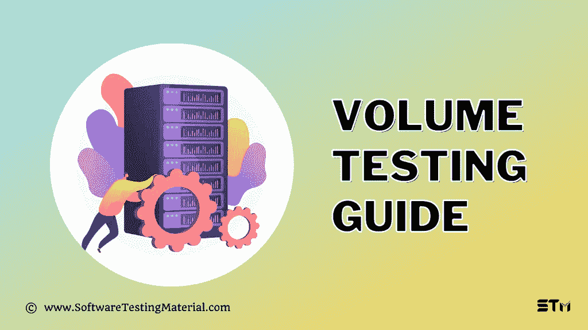

# 容量测试指南|您应该知道的内容

> 原文:[https://www.softwaretestingmaterial.com/volume-testing/](https://www.softwaretestingmaterial.com/volume-testing/)

在[软件测试教程](https://www.softwaretestingmaterial.com/manual-testing-tutorial/)的这篇文章中，我们将学习什么是容量测试，容量测试的目的，如何执行，以及以下内容。

*   [什么是带实例的体积测试？](#h-what-is-volume-testing-with-example)
*   [负载测试和容量测试的区别？](#h-difference-between-load-testing-and-volume-testing)
*   [体积测试的目的是什么？](#h-what-is-the-purpose-of-volume-testing)
*   [如何进行体积测试？](#h-how-to-perform-volume-testing)
*   [批量测试的挑战](#h-challenges-in-volume-testing)
*   执行容量测试的最佳实践？
*   [体积测试的优势？](#h-advantages-of-volume-testing)
*   [卷测的弊端？](#h-disadvantages-of-volume-testing)
*   [用于批量测试的自动化工具有哪些？](#h-what-are-the-automation-tools-used-for-volume-testing)
*   [结论](#h-conclusion)

## **什么是带实例的体积测试？**

容量测试是在软件应用受到大量数据时验证其性能，它是一种[非功能测试](https://www.softwaretestingmaterial.com/non-functional-testing/)，属于[性能测试](https://www.softwaretestingmaterial.com/performance-testing-tutorial/)。

容积测试也称为**淹没测试**。

通过大幅增加数据负载，我们可以很容易地找出系统需要改进的地方，并验证软件在这种情况下的工作效率。

通过在大量数据下观察应用程序的性能、响应时间和功能特征，容量测试可以降低这种风险。这些测试的结果可以提交给开发团队，进行相应的修改以确保产品的质量。

## **负载测试和容量测试的区别？**

尽管容量测试和负载测试有很大的不同，但还是有一些混淆，因为它们都在性能测试之下，并且都处理大量的数据。

| 容量测试 | 负载测试 |
| --- | --- |
| 在处理大量数据时，系统应该按照预期运行 | 通过逐渐增加负载直到达到最大阈值来检查系统的性能 |
| 验证系统对预期容量的响应时间 | 增加负载时验证系统的性能 |
| 这是通过增加数据量来实现的 | 这是通过增加应用程序的用户数量来实现的 |
| 测量系统的吞吐量 | 衡量系统的性能 |
| 验证系统的容量 | 验证软件的稳定性 |
| 专注于数据存储和数据丢失 | 关注安全性 |

## **体积测试的目的是什么？**

*   评估系统的容量/体积
*   检测和最小化与数据库相关的问题
*   认识到海量信息可能带来的失败。
*   在早期发现与数据丢失和存储相关的问题
*   要找到系统开始降低性能的确切数据点，我们可以了解数据库的阈值。
*   当数据库达到一定的极限时，评估与数据库容量相关的风险。
*   检查系统响应时间。
*   来识别系统的行为。
*   为了防止系统故障

## **如何进行体积测试？**

**测试数据收集:**通常业务分析师会收集大量可能在软件应用程序中使用的数据。

计划:测试团队必须创建一个合适的测试计划，他们确保测试模拟实时环境，这也包括硬件。

**执行:**由于是非功能性测试，所以使用自动化工具进行批量测试。

在执行过程中，测试团队确保他们检查了所有的场景。下面是他们在批量测试中要验证的内容列表。

1.  验证软件应用程序中各种负载的日志。
2.  验证应用程序在数据库负载为低、高和中等时的响应时间。
3.  批量上传大量数据时，验证数据库中当前数据的持久性。
4.  验证数据库中的数据是否没有丢失或被覆盖。
5.  验证是否有任何拒绝访问应用程序的崩溃或阻止程序。
6.  验证是否存在任何与数据库容量变化相关的内存问题。
7.  当数据存在任何与数据量增加相关的问题时，验证是否收到适当的通知或警告消息。

**报告:**将准备关于容量测试结果的详细报告，并与利益相关方分享。

## **批量测试的挑战**

*   如果我们处理的是关系数据库，那么填充数据库会很有挑战性，因为 RDBMS 有一个健壮的结构，并且有几十个相邻的表。
*   测试人员必须处理一系列数据集，如有效数据、无效数据、错误数据、边界数据、缺失值等。
*   处理大量数据时，自动化可能会变得复杂，收集、验证、维护和管理大量数据集可能会面临挑战
*   必须对系统进行监控并记录结果，这需要大量的注意力和耐心才能获得准确的结果

## 执行容量测试的最佳实践？

*   测试人员应该对如何使用数据库有详细的了解。
*   当执行容量测试时，测试人员应该小心处理新的构建。
*   团队应该确保在进入批量测试之前执行手动测试
*   建议在容量测试之前执行愉快的场景。
*   为了获得最大的测试量，测试人员应该错开用户的数量来增加测试量。
*   通过停止所有服务器来验证服务器和应用程序日志，这可以清楚地了解其影响。
*   测试团队应该调整他们的思考时间来解决许可限制。
*   一旦建立了基线，就应该分析用例以获得任何性能改进。
*   如果出现性能瓶颈，我们可以通过再次重复容量测试来深入研究这个问题。

## **体积测试的优势？**

*   体积测试有助于我们提高客户满意度，由于体积过大，系统出现故障或降低速度的可能性很大，这可能会影响客户满意度。容量测试有助于我们避免这种情况。
*   容量测试可以通过识别大量数据引起的问题来降低系统维护的成本。
*   当系统暴露于高数据量时，容量测试有助于准确监控系统响应时间减少的时间。
*   容量测试可以向客户或顾客保证软件应用程序将在具有大量数据的真实世界中有效地工作。
*   当用大量数据更新应用程序数据时，容量测试确保没有数据丢失，并且上传的数据存储在正确的表中，这反过来又必须更新数据库中的多个表。
*   容量测试可以为我们提供关于数据量的未来预测，并帮助我们确定系统是否能够处理它，这有助于确定项目的可伸缩性。
*   容量测试为我们提供了软件顺利运行所需的硬件的清晰画面，它包括内存、CPU 存储等
*   容量测试帮助我们节省了大量的钱，这些钱可能会花在应急计划上。
*   容量测试可以帮助我们找到在开发过程中没有发现的各种瓶颈场景。
*   容量测试可以帮助我们评估系统性能失败的总体风险。

## **卷测的弊端？**

*   批量测试可能非常耗时且成本高昂，因为它是非功能性测试类型，需要自动化工具和熟练的资源。
*   要实现容量测试，测试团队应该熟悉数据库概念，包括培训和学习新概念，这会增加成本和时间。
*   对于小规模的项目来说，容量测试可能是不必要的。
*   收集测试数据，为精确的数据量准备测试用例可能是不可能的，也不可能预测将来可能与系统交互的精确数据量。
*   为体积测试模拟真实世界数据的确切类型可能是不可能的。
*   容量测试可能会延迟产品的发布，因为它执行特定的容量测试以覆盖所有测试场景，团队必须创建脚本并执行这些脚本，这可能会妨碍应用程序的发布时间。
*   不可能复制真实世界的环境，所以努力可能是徒劳的。

## **用于批量测试的自动化工具有哪些？**

容量测试既可以手动完成，也可以通过自动化完成。市场上有几种自动化工具，包括开源的和商业的。一些容量测试工具如下。

*   [Dbfit](https://github.com/dbfit/dbfit)
*   [锤 DB](https://hammerdb.com/)
*   [JdbcSlim](https://github.com/six42/jdbcslim)
*   [鼻子地图](https://github.com/codingo/NoSQLMap)
*   [Ruby PLSQL 规范](https://github.com/rsim/ruby-plsql-spec)

## **结论**

容量测试可以为我们提供对应用程序容量的信心，这将在现实世界中发布。当产品需要实时使用时，这可能是非常关键的。它既可以手动执行，也可以通过自动化执行。但它确实带来了一些挑战，例如很难生成内存碎片，密钥生成本质上是动态的，很难维护数据的关系完整性，并且很难复制精确的生产环境。尽管如此，理解产品的本质和任何功能测试一样重要。

**相关帖子:**

*   [性能测试和性能测试的类型](https://www.softwaretestingmaterial.com/performance-testing-types/)
*   [什么是软件测试中的验证和确认](https://www.softwaretestingmaterial.com/verification-and-validation/)
*   [性能测试工具(负载测试工具)](https://www.softwaretestingmaterial.com/performance-testing-tools/)
*   [最佳 Web 应用测试工具](https://www.softwaretestingmaterial.com/web-application-testing-tools/)
*   [Web 应用测试教程(如何测试一个网站)](https://www.softwaretestingmaterial.com/web-application-testing-tutorial/)