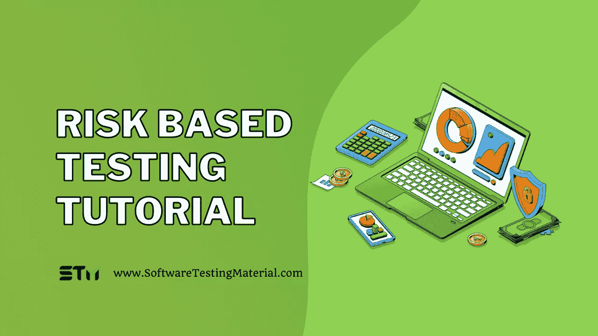

# 基于风险的测试指南:如何进行基于风险的测试

> 原文:[https://www.softwaretestingmaterial.com/risk-based-testing/](https://www.softwaretestingmaterial.com/risk-based-testing/)

这篇博文将涵盖什么是基于风险的测试，如何进行测试以及以下内容

Table of Contents <button class="kb-table-of-contents-icon-trigger kb-table-of-contents-toggle" aria-expanded="true" aria-label="Collapse Table of Contents">*   什么是风险？
*   [什么是产品风险？](#what-is-a-product-risk)
*   什么是项目风险？
*   什么是基于风险的测试？
*   什么是敏捷中基于风险的测试？
*   基于风险的测试的目的是什么？
*   什么时候执行基于风险的测试？
*   基于风险的测试涉及什么流程？
*   [如何识别风险？](#how-to-identify-risk)
*   [如何评估风险？](#how-to-assess-risk)
*   [如何减轻风险？](#how-to-mitigate-risk)
*   如何执行基于风险的测试？
*   基于风险的测试中有哪些不同的测试技术？
*   基于风险的测试中使用了哪些不同的指标？
*   基于风险的测试方法有什么好处？
*   [结论](#conclusion)</button> 

## 什么是风险？

风险可以定义为意外事件的概率和后果。

在[软件测试](https://www.softwaretestingmaterial.com/software-testing/)的环境中，风险会以紧张的时间表、不确定的项目范围、不足的资源、持续变化的资源等形式出现。通常，测试是开发应用程序的最后阶段，所以它总是在压力和严格的时间限制下进行。

当你在一个项目中构建或者测试一个软件产品的时候，总会有风险存在。我们可以用两种类型的风险来理解这一点——产品风险和项目风险。

*   在产品中使用新技术，如新的编程语言、数据库服务器、新的集成等。
*   升级或迁移会影响软件产品的多个方面。
*   不熟悉产品的新开发人员或开发团队。

## 什么是项目风险？

可能影响项目的意外事件是项目风险，这里的风险对项目既有正面影响也有负面影响。

项目风险的一些例子有:

*   在最后一分钟需求的巨大变化。
*   延迟获取测试构建、不可用的测试环境、延迟修复测试构建和环境中的问题。
*   诸如缺乏技术知识、员工短缺等问题。

## 什么是基于风险的测试？

既然我们已经看到了什么是风险以及风险的类型，那么让我们来看看什么是基于风险的测试。

基于风险的测试是一种测试方法，它基于软件产品中风险的可能性和影响来管理、优先化和执行测试活动。

它以这样一种方式组织测试，即在部署时去除剩余级别的产品风险。通过在项目的早期阶段这样做，我们可以识别产品风险，这有助于我们专注于计划、规范、准备和执行。

## 什么是敏捷中基于风险的测试？

敏捷是一种以速度和灵活性著称的 [SDLC](https://www.softwaretestingmaterial.com/sdlc-software-development-life-cycle/) 模型。在敏捷中，我们计划一个 1 到 4 周的冲刺(一个团队工作来创建一个原型，一个可行的版本或者一个新的模块添加到系统中的短时间)。很难在短时间内彻底测试出每个功能。

基于风险的测试利用这样的风险来区分优先级，并突出我们必须在正确的时间执行的正确的测试集。它集中测试具有最大影响和失败可能性的功能。

因此，基于风险的测试策略在敏捷方法中尤其有用，用于测试分析、计划、评估、设计、执行和结果报告。

## 基于风险的测试的目的是什么？

*   创建并建立一个框架，促进不同利益相关者之间就当前风险进行清晰的讨论。它将帮助您定义术语，并就使风险可见和可操作的共同语言达成一致。
*   解决客户的需求，如业务特征、时间、质量、成本等，以及开发团队的需求，如范围、时间表、维护等。
*   提供一个清晰的框架来决定如何在不影响软件质量的情况下管理预算、协商时间表、避免延迟等。
*   向客户强调重要的特性和问题，这反过来创建了测试需求的层次结构。

## 什么时候执行基于风险的测试？

我们可以针对以下场景执行基于风险的测试:

*   当项目中存在与时间、成本和资源相关的限制时。
*   当项目因新技术和复杂结构而充满[测试挑战](https://www.softwaretestingmaterial.com/mobile-app-testing-challenges/)时。
*   当项目对于测试团队来说是全新的时候，这涉及到大量需要准确识别的风险。

## 基于风险的测试涉及什么流程？

执行基于风险的测试的过程可以分为 3 个步骤:

1.  风险辨认
2.  风险评估
3.  风险缓解

## **如何识别风险？**

解决问题的第一步是识别问题。

我们应该与过去面临许多风险的软件架构师和开发人员进行清晰的沟通，以了解项目中的脆弱区域。除此之外，我们的测试团队将分析需求、设计规范和其他文档，以识别潜在的风险。

我们还应该意识到随着项目的进展可能会暴露出来的风险。作为一个测试团队，我们应该为这种情况做好准备，并根据情况灵活处理。

## **如何评估风险？**

我们可以通过首先对风险进行分类来评估风险。

**严重:**顾名思义，这必须是第一要务，应立即采取措施隔离风险。其他活动应停止，直到风险降低到低或中等水平。

**高:**我们要隔离、消除、替代风险，实施风险控制。如果我们不能立即解决它，我们应该定义严格的时间表来解决这些问题。

**中:**这些都是合理的，我们必须实施可操作的步骤来尽量减少这些。

低:这些不会产生任何重大问题，但是我们应该定期检查这些风险是否得到控制。

接下来，我们必须确定这些风险的概率和影响。

| 风险 | 可能性 | 影响 |
| --- | --- | --- |
| 排得紧紧的时间表 | 高的 | 高的 |
| 资源短缺 | 中等 | 高的 |
| 在最后阶段发现的缺陷 | 中等 | 高的 |
| 未定义范围 | 中等 | 中等 |
| 天灾 | 低的 | 中等 |

一个真实的例子是新冠肺炎，这个疫情对商业有着巨大的影响。现在，它被认为是规划、预算、时间表和资源时的一个因素。

## **如何减轻风险？**

一旦我们确定并评估了风险，下一步就是解决或减轻风险。缓解处理风险并减轻其影响。

根据每个模块的风险级别，我们可以决定我们将要分配的测试活动的工作量，例如测试设计、执行和调试。这将集中测试高风险模块，并对低风险模块使用不太详细的技术。

## 如何执行基于风险的测试？

步骤 1: 我们可以从风险评估开始，在我们的应用程序中创建一个主要组件的列表。写下应用程序中的 10 到 15 个关键功能，并标记它们的风险级别、概率和影响。

**步骤 2:** 现在我们可以根据风险评估来映射我们的测试覆盖，以识别我们覆盖中的缺口。理想的情况是对高风险和中等风险区域有足够的覆盖，如果没有，我们应该立即解决它们。

**步骤 3:** 除此之外，我们还必须与产品管理和开发团队沟通，以了解将要实施的关键功能，以及其影响和风险。

**步骤 4:** 接下来，通过向高风险领域分配更多的测试资源来构建您的测试计划。通常，新开发的特性会给整个应用程序带来更高的风险，所以您可以从这一点入手。

第五步:当我们继续这样做的时候，我们将从我们的努力中学习，与我们的团队更好地沟通，并调整我们的测试计划。最终，我们将到达高测试覆盖率和低风险的地方

## 基于风险的测试中有哪些不同的测试技术？

*   产品风险管理(PRisMa)-它用于确定适当的[测试策略](https://www.softwaretestingmaterial.com/test-strategy-vs-test-plan/)和测试设计技术，以这种方式它首先优先考虑高级风险模块。
*   实用风险分析和管理(PRAM)——它包含了有助于分析和管理项目相关风险的流程、技术和方法。它基于风险优先级数(RPN)的计算。
*   系统软件测试(SST)——它需要需求规格作为风险分析的输入。

## 基于风险的测试中使用了哪些不同的指标？

*   计划的与执行的测试用例的数量。
*   测试案例的数量–通过与失败
*   识别的风险数量——每个风险的状态和严重性
*   关键风险的数量–仍未解决
*   测试环境停机的实例
*   测试总结报告
*   测试覆盖报告
*   付出的努力–计划与实际
*   进度变化-计划与实际
*   风险识别的百分比
*   风险缓解的百分比

## 基于风险的测试方法有什么好处？

*   它创建了一个更加结构化的、定义良好的范围、优先级和时间表，也就是说，我们将清楚地知道何时开始/停止测试。
*   它提高了业务绩效，降低了负面评价的可能性，并且通常将风险的影响最小化。
*   我们可以专注于关键的部分，从而提高效率并减少测试用例的数量。
*   它通过降低大量风险来降低总体成本。
*   它通过测试不断调整有问题的区域。

## **结论**

基于风险的测试是一种协作努力，开发团队和测试团队一起减少风险。他们评估并计算每个模块中的风险级别，根据高-低级别风险制定优先级。它避免了过度测试，过度测试会降低项目的速度，从而优化过程的效率。

**相关帖子:**

*   [测试策略与测试计划——测试策略与测试计划之间的差异](https://www.softwaretestingmaterial.com/test-strategy-vs-test-plan/)
*   [安全测试教程|软件测试资料](https://www.softwaretestingmaterial.com/security-testing-tutorial/)
*   [带详细解释的软件测试计划模板【样本测试计划文档】](https://www.softwaretestingmaterial.com/test-plan-template/)
*   [如何最小化测试 QA 外包风险|软件测试资料](https://www.softwaretestingmaterial.com/how-to-minimize-testing-qa-outsourcing-risks-software-testing-material/)
*   [编写测试策略的完整指南【示例测试策略文档】](https://www.softwaretestingmaterial.com/test-strategy/)