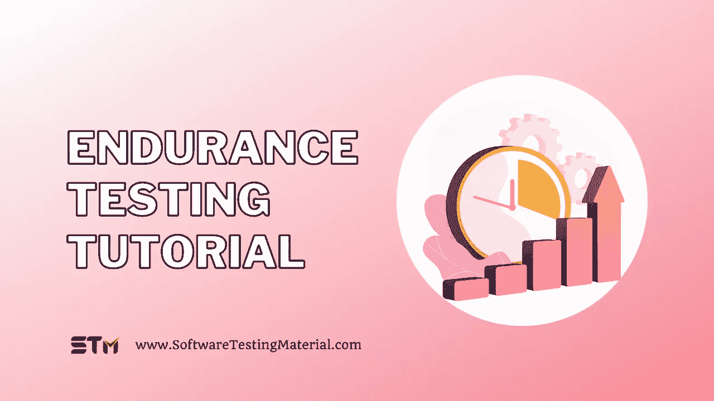

# 耐久性测试指南:如何进行耐久性测试

> 原文:[https://www.softwaretestingmaterial.com/endurance-testing/](https://www.softwaretestingmaterial.com/endurance-testing/)

这篇博文将涵盖什么是耐力测试，如何进行耐力测试以及以下内容

Table of Contents <button class="kb-table-of-contents-icon-trigger kb-table-of-contents-toggle" aria-expanded="true" aria-label="Collapse Table of Contents">*   [什么是耐力测试？](#h-what-is-endurance-testing)
*   我们为什么要做耐力测试？
*   [如何进行耐力测试？](#how-to-perform-endurance-testing)
    *   [步骤#1:测试计划](#step-1-test-planning)
    *   [步骤#2:测试用例设计](#step-2-test-case-design)
    *   [步骤#3:测试环境](#step-3-testing-environment)
    *   [步骤#4:测试执行](#step-4-test-execution)
    *   [步骤#5:关闭](#step-5-closure)
*   [耐力测试要监控什么？](#what-to-monitor-in-endurance-testing)
*   [耐久性测试的优势](#advantages-of-endurance-testing)
*   [耐久性测试的缺点](#disadvantages-of-endurance-testing)
*   [耐久性测试的实时示例](#realtime-example-of-endurance-testing)</button> 

## **什么是耐力测试？**

耐久性测试属于[非功能性测试](https://www.softwaretestingmaterial.com/non-functional-testing/)，它检查系统在特定负载条件下长时间的性能。我们可以评估系统行为，以确保软件能够处理扩展的负载，而不会降低响应。它也被称为浸泡测试。

在这里，我们将根据要求进行更长时间的耐久性测试，可以是 12 小时或 72 小时，甚至更长。这就是耐久性测试不同于其他[类型的性能测试](https://www.softwaretestingmaterial.com/performance-testing-types/)的原因，如压力或负载测试，它在一段较长的时间内监控系统的稳定性。

*   这是一种非功能性的测试，所以我们使用自动化工具，如 Apache Jmeter、LoadRunner、Appavance IQ 等。
*   由于它必须不间断地运行很长一段时间，我们可以把它安排在周末。
*   耐久性测试中发现的主要问题是内存泄漏、连接问题、响应时间下降等。
*   在耐久性测试中，我们密切监控内存利用率和性能下降，以识别潜在的漏洞和弱点。
*   开始耐久性测试的最佳时间是在部署之前和负载测试之后。

> ***不要错过:** [功能测试 vs 非功能测试](https://www.softwaretestingmaterial.com/functional-testing-vs-non-functional-testing/)*

## 我们为什么要做耐力测试？

当客户使用我们的应用程序时，会逐渐出现内存泄漏。在短期内，这不会影响系统，但随着时间的推移，日志文件会增加，导致磁盘空间不足，垃圾清理过程可能会增加维护成本。

*   耐久性测试确保软件应用程序足够有效地处理这种增加的负载，而不会出现响应时间故障。
*   它检查在这种极端条件下是否有任何内存泄漏。
*   这有助于我们确保产品的坚固性和稳定性。
*   它监视系统在长时间使用下的表现。
*   它还可以识别数据库连接问题。
*   它检查文件处理程序是否被回收。
*   它确保日志循环是适当的。

## **如何进行耐力测试？**

在进入耐久性测试之前，我们必须通过业务需求和系统需求来确定我们是否需要耐久性测试。如果我们已经进行了耐久性测试，并且我们只是向软件添加了一个新功能，那么可能不需要它，因为响应时间可能会因测试时间延长而降低。但如果是新的应用，就有必要了。

请注意，我们应该以一种有组织的、系统的和有计划的方式来执行耐久性测试，而不是临时的。因此，它通常由知道如何创建和执行全面测试计划的性能测试专家来完成。

我们可以按照以下步骤进行耐久性测试:

### **步骤#1:测试计划**

我们开始[创建测试计划](https://www.softwaretestingmaterial.com/test-plan-template/)，最终确定完成测试的资源需求、成本和预计时间。与此同时，我们决定我们将使用什么样的测试方法，手动或自动化或两者都用，策略，工具，我们将执行我们需要的测试多长时间。

其他要求，如硬件、软件、网络和执行耐久性测试所需的其他项目都已列出。

> ***不要错过:** [测试策略 vs 测试方案](https://www.softwaretestingmaterial.com/test-strategy-vs-test-plan/)*

### **步骤#2:测试用例设计**

在这一步中，我们创建、设计、评审并最终确定测试用例。我们基于这一步构建了一个测试策略。此外，我们还确定了在耐久性测试期间应用于系统的时间框架、断点、负载和压力。

### **步骤#3:测试环境**

在这一步，我们创建测试环境，根据测试计划，我们收集所有要求，如硬件、软件、工具、操作系统、网络等。我们的目标是创建一个类似于生产环境的环境

### **步骤#4:测试执行**

在这一步中，我们执行执行，如果您在测试过程中发现任何错误，您可以记录下来并创建一个错误报告。我们已经看到性能是否随着时间的推移而保持一致，任何外部接口是否会影响应用程序，任何尚未解决的小问题等等。

### **步骤#5:关闭**

这里，当测试周期满足退出标准时，执行结束。我们将创建一个报告，其中包含已确定的问题，调查结果和应用程序的最终报告。

## **耐力测试要监控什么？**

使用收集的使用统计数据和站点的日常负载，我们可以确定峰值负载。有了这些历史数据作为我们的参考，我们就可以计算出在测试过程中我们将要应用于系统的平均负载。如果是新应用程序，数据可能不可用，那么可以考虑 50%、60%或 70 %的负载。

**内存泄漏:**我们必须检查软件应用程序中是否有内存泄漏，它经常会使您的应用程序或操作系统崩溃。

**正常响应时间:**我们必须监控软件的响应时间，因为长时间使用会影响系统性能，导致响应时间效率降低。

**系统不同层之间的连接关闭:**我们必须查看系统模块的不同层是否正确关闭。如果关闭不成功，它可能会暂停应用程序中的部分或全部模块。

成功关闭测试数据库:我们必须检查数据库是否正确关闭，否则可能会导致我们的应用程序崩溃。

**响应时间退化:**我们可以检测响应时间退化，这将帮助开发人员解决问题，并提供一个可靠的系统。

## **耐久性测试的优势**

*   它帮助我们找到与内存泄漏相关的错误。
*   它确保了软件应用程序的健壮性。
*   一旦我们发现并修复了错误，构建更好的基础设施还有一个额外的好处。
*   它帮助我们找到与性能相关的问题，并检查软件的耐用性。
*   它检查系统随时间的可持续性。
*   它降低了维护成本，因为我们在早期就发现了这些问题。
*   它揭示了我们在进行其他性能测试时可能没有发现的问题。
*   它可以给我们一个精确的值，告诉我们系统可以承受多长时间的负载。
*   它让我们对应用程序充满信心，并让客户满意。

## **耐久性测试的缺点**

*   耐力测试可能很耗时。
*   我们需要拥有自动化知识和自动化工具的专家，因为这无法手动完成。
*   这可能会花费很多，因为我们必须长时间运行该系统。
*   在进行耐久性测试时，我们必须将测试环境与现场环境隔离开来，因为这可能会影响现场环境的性能。这导致我们建立另一个与当前基础设施无关的基础设施。
*   我们往往不知道有多大的负荷值得施加。
*   如果我们对系统过度施压，可能会导致永久的数据丢失或损坏
*   最终用户可能会注意到这些未处理的异常。

## **耐久性测试的实时示例**

在理想情况下，耐久性测试应该在不同的负载下运行尽可能长的时间，以了解系统在哪里变得不稳定。但是我们只能使用给定的工具、环境和资源，并且有时间表。

这里有一个耐久性测试的实时例子。

假设宣布了封锁，客户无法访问银行的物理位置。所以大量的交易会发生在网上。银行网站和移动应用程序应该有足够的能力来长期处理如此庞大的一组交易。我们必须确保系统能够顺利运行，没有任何数据泄漏或中断。

为了避免最后一刻的失败，我们可以对我们的银行应用程序进行耐久性测试。

我们可以从在 1 小时内处理 1000 个事务开始，看看系统如何处理这样的请求。稍后我们可以在 1 小时内将交易增加到 2000 笔。我们可能会根据给定的需求增加测试的负载和持续时间。

另一个例子是像谷歌这样的搜索引擎。全世界有数百万人会使用它。它有不同的场景，如搜索栏长时间闲置，用户在搜索过程中退出或无人看管，大力搜索信息等等。其他例子包括社交媒体、电子邮件服务、游戏应用等，这些将有数百万用户长期访问和使用。

因此，我们必须确保我们的应用程序具有高响应时间、良好的数据库和系统层连接性，同时不牺牲内存。耐久性测试可能很耗时，需要大量资源，但如果做得好，我们可以确保系统的高端性能。

**相关帖子:**

*   [负载测试教程|软件测试资料](https://www.softwaretestingmaterial.com/load-testing-tutorial/)
*   [12 款最佳性能测试工具|负载测试工具](https://www.softwaretestingmaterial.com/performance-testing-tools/)
*   [最佳 Web 应用测试工具(免费和付费)](https://www.softwaretestingmaterial.com/web-application-testing-tools/)
*   [自动化测试教程|软件测试材料](https://www.softwaretestingmaterial.com/automation-testing-tutorial/)
*   [性能测试教程|软件测试资料](https://www.softwaretestingmaterial.com/performance-testing-tutorial/)