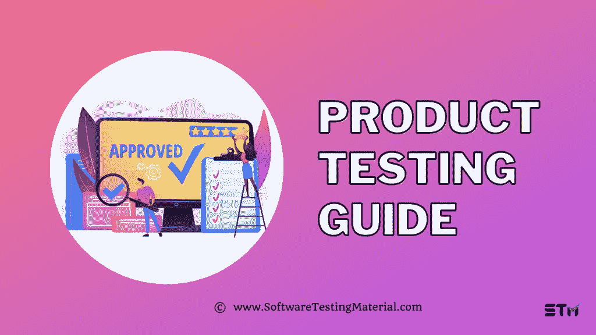

# 产品测试指南|您应该知道的

> 原文:[https://www.softwaretestingmaterial.com/product-testing/](https://www.softwaretestingmaterial.com/product-testing/)

在[软件测试教程](https://www.softwaretestingmaterial.com/manual-testing-tutorial/)的这篇文章中，我们将学习什么是产品测试，产品测试方法的类型，以及以下内容。

Table of Contents <button class="kb-table-of-contents-icon-trigger kb-table-of-contents-toggle" aria-expanded="true" aria-label="Collapse Table of Contents">*   [什么是产品测试？](#h-what-is-product-testing)
*   [产品测试方法的种类](#h-types-of-product-testing-approaches)
    *   [室内使用测试](#h-in-home-usage-test)
    *   [中心位置测试](#h-central-location-test)
*   [产品测试研究阶段的类型](#h-types-of-product-testing-research-stages)
    *   [消费前:](#h-before-consumption)
    *   [消费期间:](#h-during-consumption)
    *   [消费后:](#h-after-consumption)
*   [产品测试的用途](#h-uses-of-product-testing)
*   [产品测试的好处](#h-benefits-of-product-testing)
*   [为什么产品测试很重要？](#h-why-is-product-testing-important)
*   [产品测试阶段](#h-stages-of-product-testing)
*   [如何成为一名产品测试员？](#h-how-to-become-a-product-tester)
*   [什么是产品测试站点？](#h-what-is-a-product-testing-site)
*   [公司会为产品测试付费吗？](#h-do-companies-pay-for-product-testing)
*   产品测试是一项真正的工作吗？
*   [产品检测合法吗？](#h-is-product-testing-legal)
*   [顶级产品测试站点列表](#h-list-of-top-product-testing-sites)
    *   [#1。文代尔研究公司](#h-1-vindale-research)
    *   [#2。松果研究](#h-2-pinecone-research)
    *   [#3。美国消费者意见](#h-3-american-consumer-opinion)
    *   [#4。用户测试](#h-4-usertesting)
    *   [#5。影响者](#h-5-influenster)
    *   [#6。JJ 的朋友&的邻居](#h-6-jj-friends-neighbors)
    *   [#7。测试版测试](#h-7-beta-testing)
    *   [8 .卸料〔t1〕](#h-8-bzzagent)
    *   [#9。社会性](#h-9-social-nature)
    *   [#10。布鲁克斯](#h-10-brooks)
    *   [#11。笑脸 360](#h-11-smiley-360)
    *   [#12。发声点](#h-12-vocal-point)
    *   [13 号。品头论足〔t1〕](#h-13-pinchme)
    *   [#14。托鲁纳影响者](#h-14-toluna-influencers)
    *   [#15。我说](#h-15-i-say)</button> 

## **什么是产品测试？**

产品测试可以定义为测量产品属性或性能的过程。在开发产品之前，这有助于公司确保产品满足各种客户的需求。他们将清楚地知道产品中到底需要实现什么，即了解客户的共同需求，以使产品更好。

产品测试允许品牌收集关于消费者在使用产品时的潜在行为、偏好、期望和反应的信息。不管是线上产品还是实体产品，产品测试帮助你收集目标消费者的体验。

## **产品测试方法的种类**

产品测试有两种方法，尽管这两种方法所使用的研究和方法是相同的，但还是有一些不同。产品测试的两种测试方法是

*   受控环境可以是公共空间，如超市、商场或公司的实验室，这些目标消费者在这里消费产品，并被要求分享他们的体验。
*   这种类型的研究通常由传统的市场研究公司进行。

## **产品测试研究阶段的类型**

**步骤 1:** 确定产品测试研究的目标受众。
**第二步:**选择要实施的产品测试类型。
**第三步:**明确研究的目标。

通常，产品测试会发现产品的故障或测试新产品，因此产品测试的目标可以分为以下几类:

*   未实现的产品目标
*   客户反馈不佳
*   新功能开发
*   新产品开发

公司要求这些产品测试人员填写一份问卷或写下他们在不同消费时间段的体验，以了解消费者的行为或了解消费者互动/使用产品的感受。所以它们大致分为三个部分

1.  消费前
2.  消费期间
3.  消费后

### **消费前:**

在这里，他们检查消费者在看到产品或其包装时的最初反应。这有助于公司在使用产品之前了解客户的期望，整个产品体验从这种森林印象开始。他们可能会问你一些简单的问题。

*   告诉我们你对产品外观的看法？
*   请告诉我们您对该产品的看法。
*   告诉我们你对产品气味的看法？

### **消费期间:**

基于产品的类型，消费者开始使用产品或者更确切地说是消费产品。这是公司从用户那里获得重要见解的地方，因为他们可以看到产品是如何被真实用户使用的。

**示例:**让我们以一个需要进行产品测试的食品为例，示例问题可能是

*   告诉我们您在准备该产品时使用了哪些厨房工具？
*   告诉我们您在烹饪/食用/清洁产品时做了哪些活动？
*   你能在准备/吃产品的时候拍个视频吗？

### **消费后:**

在这一阶段，消费者向品牌提供总体反馈。他们评估消费者的影响和可用性。

*   告诉我们您对该产品的总体体验？
*   告诉我们你有多需要这个产品？
*   请告诉我们，与您最常购买的产品相比，您会选择该产品吗？
*   告诉我们您认为该产品是什么品牌？

## **产品测试的用途**

*   提供对系统级功能的深入了解
*   帮助公司了解他们的产品能承受什么
*   可以帮助团队在产品售出的早期阶段识别缺陷。
*   确保消费者得到高质量的产品。

## **产品测试的好处**

*   产品测试可以提供一个机会，在没有实际营销的情况下将产品介绍给它的理想用户。
*   它可以为类似的竞争产品提供竞争优势。
*   它提供了真实用户对产品的重要反馈。
*   可以提供实际客户支出的数据
*   消除全面启动的风险。

## **为什么产品测试很重要？**

*   帮助演示概念证明。
*   有助于确定产品是否达到预期目的。
*   给研发部明确的数据。
*   识别并解决当前产品的问题
*   找出产品中潜在的成本节约。

## **产品测试阶段**

在产品测试中，测试的不同阶段通常是基于产品的独特需求而设计的。

1.  选择产品
2.  选择指标
3.  将产品与调查一起发送
4.  测试产品
5.  收集反馈
6.  分析结果

## **如何成为一名产品测试员？**

*   首先，你必须在一个产品测试网站上注册。
*   您将被要求填写调查，以确认您是否是该产品的目标受众。
*   一旦你的应用被选中，你将会收到一个产品或者被要求去某个地方测试产品
*   他们会问你对产品的反馈，你应该诚实地回答你对产品的感觉。

## **什么是产品测试站点？**

产品测试网站寻求像您这样的客户对公司想要在市场上推出的新产品的反馈。您将测试这些公司的几种产品和服务，并分享您的真实反馈。

## **公司会为产品测试付费吗？**

是的，你可以从产品评论中获得报酬。这些公司向参与者提供现金、优惠、折扣代码、赠品或礼品卡。测试产品是完全合法和免费的。

## 产品测试是一项真正的工作吗？

品牌准备向他们的测试客户支付数百美元来审查他们的产品，并在将这些产品投放市场之前从这些真正的消费者那里获得反馈。这有助于品牌在推出新产品之前了解目标市场的情况。

## **产品检测合法吗？**

是的，产品测试是公司在将产品或服务推向市场之前获得真实用户反馈的一种方式。为了进行产品测试，这些公司会给你一个免费的实物产品来交换你的反馈。在测试期结束时，他们会让你保留这个项目。反过来，他们为你提供积分，你可以兑换成礼品卡、优惠券、优惠，有时甚至是现金。

## **顶级产品测试站点列表**

### **#1。文代尔研究公司**

工作方式:你必须分享自己的人口统计信息。他们会将你匹配到付费调查。通常情况下，当您符合资格的新调查到来时，您会收到一封电子邮件。你也可以选择在他们网站的列表中浏览当前的调查。

**测试项目示例:**房主调查、心脏健康研究、体育调查等。

**使用的支付选项:** Paypal

[Download Vindale Research](https://www.vindale.com/v/index.jsp "Vindale Research")[Go to top](#)

### **#2。** **松果研究**

工作原理:松果研究团队会邀请你参加特定的调查。你必须填写调查，这些答案应该基于你的想法和意见，一旦测试完成，他们会给你完成任务的奖励点。

**使用的支付方式:**礼品卡，银行转账。

[Pinecone Research](https://members.pineconeresearch.com/#/Homepage "Pinecone Research")[Go to top](#)

### **#3。美国消费者意见**

工作原理:你必须参加一个名为筛选者的简短调查，通常只有几分钟的时间。您将获得 5-50 分之间的报酬，或者您将参加电子礼品卡抽奖。有时会有后续调查，它们需要 5 分钟或更长时间才能完成，您将始终获得积分。一旦您履行了他们协议的所有条款，您就可以兑换您的积分

**使用的支付选项:**现金(美国或加拿大)、超级钱包基金或 PayPal 基金，或参加抽奖(美国)

[American Consumer Opinion](https://www.acop.com/ "American Consumer Opinion")[Go to top](#)

### **#4。用户测试**

工作原理:你必须注册一个用户测试网站，参加一个基本的测试，包括对你的电脑屏幕进行屏幕录制，并说出你对网站的看法。一旦你通过测试，你会得到网站可用性测试的定期调查，你将根据会话的长度支付

**测试项目示例:**手机应用和网站的可用性测试。

**使用的支付选项:** Paypal

[UserTesting](https://www.usertesting.com/get-paid-to-test "UserTesting")[Go to top](#)

### **#5。影响者**

**工作方式:**你必须下载 influenster 应用程序，注册并填写你的个人资料，然后填写一份出现在你仪表盘上的小问卷，连接你的社交媒体账户，并填写一份评论者个人资料

**测试项目示例:**美容产品-面部、身体、指甲、唇妆和香水

使用的付款方式:您将免费获得全尺寸产品

[Influenster](https://www.influenster.com/ "Influenster")[Go to top](#)

### **#6。JJ 的朋友&的邻居**

工作原理:你已经在网站上注册了。他们会根据你的人口统计给你一份调查，你必须阅读简要说明，看看这项研究是否让你感兴趣。打开调查链接，完成筛选问卷。一旦您被选中，您将收到一封电子邮件，确认您的参与以及后续步骤。

**测试项目示例:**闻新沐浴露系列的香味，评估新的睫毛加长睫毛膏，或测试牙线类型等。

**使用的支付选项:**预付 Visa 卡

[JJ Friends & Neighbors](https://jjfriendsandneighbors.com/ "JJ Friends & Neighbors")[Go to top](#)

### **#7。测试版测试**

**工作原理:**你必须按照网站要求的所有细节注册，一旦注册，你就会收到来自网站的调查。如果你的个人资料符合他们的需求，你将被邀请对新应用、网站和硬件进行测试。

**测试项目举例:**你要测试新的应用、网站、硬件。

**使用的支付选项:** Paypal

[Beta Testing](https://betatesting.com/beta-testers "Beta Testing")[Go to top](#)

### **8 .卸料〔t1〕**

**运作方式:**注册后，你将收到一件产品，并在社交媒体上分享你的体验。

**测试项目示例:**美容产品和服务

**使用的支付选项:**您可以通过 Paypal 兑换我的积分

[BzzAgent](https://www.bzzagent.com/ "BzzAgent")[Go to top](#)

### **#9。社会性**

工作方式:你必须注册并在社交媒体上分享你的真实评论

**检测项目示例:**食品、健康、美容、家居、婴儿、宠物中的天然产品。

**使用的支付选项:**免费产品和优惠券

[Social Nature](https://www.socialnature.com/products/?country=US "Social Nature")[Go to top](#)

### **#10。布鲁克斯**

工作原理:很简单:他们给你送来装备，你用它。你所要做的就是在早上慢跑时，在比赛当天，在阳光下和雪地里使用他们的齿轮。只要在你跑步的任何地方使用它，并给他们反馈什么有效，什么无效。

**测试项目示例:**跑鞋

**使用的支付选项:**未指定

[Brooks](http://www.brooksrunning.com/en_us/programs/beta-runners#application "Brooks")[Go to top](#)

### **#11。笑脸 360**

**如何运作:**你必须有资格尝试产品和服务。一旦你得到了这些产品，与朋友、smiley 成员和品牌分享你的反馈。您将获得积分和徽章，以提高您的社区地位。

**测试项目示例:**家居产品

**使用的支付选项:**免费产品

[Smiley 360](https://smiley.socialmedialink.com/members/sign_in#/ "Smiley 360")[Go to top](#)

### **#12。发声点**

**工作原理-** 它将根据您的具体家庭习惯为您提供调查，这些调查不到 10 分钟。

**测试项目示例-** 家居用品

**使用的支付选项-** 礼品卡

[Vocal Point](https://www.vocalpoint.com/ "Vocal Point")[Go to top](#)

### **13 号。品头论足〔t1〕**

**工作方式:**注册，填写调查问卷，您将收到基于您偏好的产品，并在本网站上分享您对这些产品的真实意见。

**测试项目示例:**个人护理品、宠物、食品和饮料

**使用的支付选项:**优惠券、折扣和优惠

[PINCHme](https://www.pinchme.com/ "PINCHme")[Go to top](#)

### **#14。托鲁纳影响者**

**如何运作-** 你要在这个平台上填写调查，与社区互动，玩游戏，甚至看视频才能赚钱。

**测试项目示例:**个人银行、购物习惯、电影、旅游、体育和其他

**使用的支付选项:** Tesco、AmazonGift 卡、PayPal

[Toluna Influencers](https://us.toluna.com/ "Toluna Influencers")[Go to top](#)

### **#15。我说**

**工作方式:**你必须注册并填写调查问卷，每月至少会收到一份调查问卷，你将获得这些调查问卷的积分并兑换积分。

**测试项目示例:**食物、生活方式等

**使用的支付选项:** Paytm，xoxoday 凭证

[i-say](https://social.i-say.com/ "i-say")[Go to top](#)

**相关帖子:**

*   [测试指南](https://www.softwaretestingmaterial.com/beta-testing-a-detailed-guide/)
*   [阿尔法测试指南](https://www.softwaretestingmaterial.com/alpha-testing/)
*   [用户验收测试指南](https://www.softwaretestingmaterial.com/user-acceptance-testing-uat/)
*   [Salesforce 测试指南](https://www.softwaretestingmaterial.com/salesforce-testing/)
*   [验收测试指南](https://www.softwaretestingmaterial.com/acceptance-testing/)