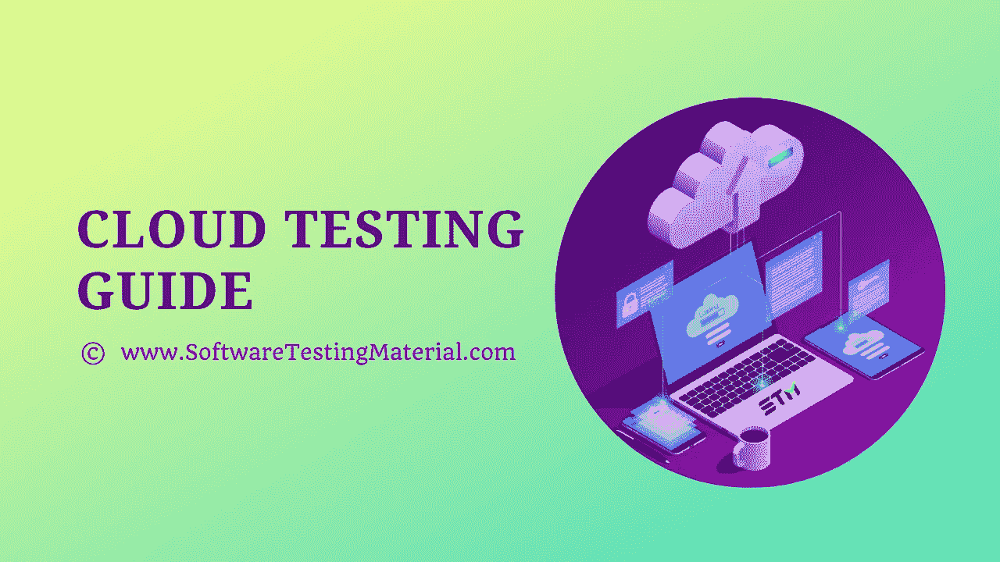

# 云测试——详细指南

> 原文:[https://www.softwaretestingmaterial.com/cloud-testing/](https://www.softwaretestingmaterial.com/cloud-testing/)

在本云测试指南中，我们将了解以下内容。

*   [什么是云计算？](#h-what-is-cloud-computing)
*   [云计算模式](#h-cloud-computing-models)
*   [什么是云测试？](#h-what-is-cloud-testing)
*   [在云环境下测试什么？](#h-what-is-tested-in-cloud-environment)
*   [基于云的测试工具](#h-cloud-based-testing-tools)
*   [云环境中的挑战](#h-challenges-in-cloud-environment)
*   [成为云测试员所需的技能](#h-skills-required-to-be-a-cloud-tester)
    *   [基本功](#h-basic-skills)
    *   [云计算技能](#h-cloud-computing-skills)
*   [云测试的优势](#h-benefits-of-cloud-testing)
    *   [可用性](#h-availability)
    *   [经济高效的自动化测试](#h-cost-effective-automation-testing)
    *   [团队合作](#h-teamwork)
    *   [工具和 IT 服务易于使用](#h-tools-and-it-services-are-easy-to-use)
    *   [与开发团队合作很容易](#h-collaboration-with-the-development-team-is-easy)
    *   [质量达标](#h-quality-is-achieved)
    *   [多重环境测试](#h-multiple-environment-testing)
    *   [支持敏捷开发](#h-supports-agile-development)
*   [云测试 vs 传统测试](#h-cloud-testing-vs-traditional-testing)
*   [如何做云测试](#h-how-to-do-cloud-testing)
*   [云测试的类型](#h-types-of-cloud-testing)

在了解之前，**云测试**让我们先了解一下什么是**云计算。**

## **什么是云计算？**

云计算是按需交付计算服务，如服务器、数据存储、数据库、网络、软件等。，通常是通过互联网和现收现付的方式。

这些服务和存储由不同的云提供商提供。为了利用这些服务，公司向非常经济高效的云提供商付费，因为如果公司使用内部服务器存储、数据库、应用程序和服务，将会花费公司一大笔钱。

如果云计算没有出现，他们可以采用内部软件开发模型。

由于云计算，在服务器、服务、数据库、网络或任何你从个人电脑或自己的服务器上获得的东西上租用或占有一个租用的空间或存储空间是非常容易的。

希望你明白什么是云计算。让我们看看谁是市场上所有顶级的云提供商。

以下是排名靠前的云提供商列表

1.  亚马逊网络服务
2.  微软云
3.  谷歌云平台
4.  IBM 云
5.  虚拟机
6.  阿里云

## **云计算模式**

云计算机提供商遵循两种模式

1.  云计算服务模式
2.  云计算部署模型

就像一个正常的[软件开发模型](https://www.softwaretestingmaterial.com/sdlc-software-development-life-cycle/)一样，有几种云计算服务模型。云提供商采用这些模式，向不同的组织提供服务，以远程满足他们的计算需求。

以下是模型。

下图显示了 **IaaS** (基础设施即服务) **PaaS** (平台即服务)和 **SaaS** (软件即服务)与个人计算的区别。

[图像来源](https://www.mindk.com/blog/wp-content/uploads/2018/11/paas-saas-iaas.png)

**公共云:**这种云可供公共环境中的个人和组织使用

**私有云:**该云仅适用于单个组织。

**混合云:**这种云是两种或两种以上云(私有云、公共云或社区云)的混合。

**社区云:**这种云由特定的组织共享，帮助一些社区的特定关注点。

## **什么是云测试？**

云测试也称为基于云的测试。

云测试是[软件测试](https://www.softwaretestingmaterial.com/software-testing/)的一个子集，它使用基于云的工具来模拟真实世界的网络流量，以测试基于云的网络应用。

它验证和确认 web 应用程序的性能、可靠性、可伸缩性、互操作性、灾难恢复和安全性。

如今，大多数应用程序都是使用云环境开发的。我们必须有一个好的云测试策略来测试基于云的应用程序。

## **在云环境下测试什么？**

在进行内部测试时，软件测试是在内部服务器、软件和硬件上进行的。

而在云环境中，软件测试是在云或云提供商提供的虚拟环境中进行的。

以下是主要在云环境中执行的[测试类型](https://www.softwaretestingmaterial.com/types-of-software-testing/)

**1。功能测试:**在云上测试应用程序的功能流，以验证业务需求得到满足，并且应用程序的每个主要和次要功能方面都给出了预期的输出。

**2。浏览器兼容性:**验证应用程序在云环境下的多种浏览器和浏览器版本上工作。

**3。操作系统兼容性测试:**应用程序在各种操作系统上进行测试，如 Windows、Linux、Mac、Android、IOs 和 Windows。

**4。负载和性能测试:** [负载测试](https://www.softwaretestingmaterial.com/load-testing-tutorial/)在云环境中变得非常重要，它可以检查应用程序在处理预期数量的用户时的性能，并检查响应时间和识别瓶颈。

**5。压力和容量测试:**测试是在高负载下进行的，使用大量数据，以确定当用户超过预期时应用程序的性能。在应用程序崩溃的情况下，可以采取适当的措施。

**6。安全测试:**检查云应用是否安全，测试人员做授权和认证测试， [API 测试](https://www.softwaretestingmaterial.com/api-testing/)，数据库测试，网络访问测试，合规性测试等。,

以下是在云环境中进行测试的步骤

由于云测试的日益流行，我们可以在市场上看到许多基于云的测试工具。

这里有一些非常流行的基于云的软件测试工具。

## **基于云的测试工具**

以下是广泛使用的几种工具。

*   SOASTA 云测试
*   负载风暴
*   火焰测量器
*   涅索斯
*   App Thwack
*   Jenkins 开发@云
*   Xamarin 测试云
*   测试工具
*   AppPerfect

这些是用于测试 web 或移动应用程序性能和功能测试的工具。这些工具中的大多数都提供了记录和回放功能，以记录性能测试场景，并在报告中突出显示性能瓶颈。

还有一些安全测试工具

*   Wireshark
*   涅索斯
*   Nmap(消歧义)

## **云环境中的挑战**

**安全挑战:**公司将数据托管在云环境中。云环境归第三方所有。这是公司最大的担忧，因为它可能导致机密数据的泄露、病毒攻击和应用程序逻辑的窃取。这可能是因为云供应商可能不了解行业安全标准。

**应对不同云模型的挑战:**由于竞争激烈的技术和需求，如今组织正在采用不同供应商的多种云模型。维护安全性、同步性、速度、应用程序可用性和可扩展性变得越来越困难，因为现在软件不是托管在单个云上。

**缺乏云测试工具方面的专业知识:**虽然云计算已经非常流行，并且像巨人一样成长，但是仍然很难找到技术全面的资源或专家。因此，利用云测试工具变得很有挑战性。

**预算挑战:**有时，组织意识不到隐藏的成本，或者无法预测云环境和服务的使用情况，直到云供应商提出令人惊讶的成本要素，这些成本要素可能会扰乱企业的整体预算。对于作为新手进入云计算的组织来说，这变得非常具有挑战性。

**与合规性相关的挑战:**与竞争对手相比，每个云供应商都试图为客户提供更好、更完善的服务。为了给他们的计算环境提供更好的安全性和准确性，他们选择监管合规性，如果任何组织使用他们的云，那么该组织也必须遵循这些监管合规性。对于一些组织来说，这有时会成为一个挑战。

**与性能相关的问题:**由于服务器停机，许多企业损失了利润，主要问题是组织在更换云供应商之前无法做任何改进。这个问题给许多企业造成了很大的失败，对于那些业务完全在互联网上的组织来说，这确实是一个很大的挑战。

## **成为云测试员所需的技能**

作为一名云测试人员，需要一些基础测试技能以及一些云计算相关的技能。以下是技巧

### **基本功**

*   测试基础
*   测试管理——测试用例、错误报告、错误生命周期
*   功能测试
*   操作系统和跨浏览器兼容性测试

### **云计算技能**

*   开发运维与敏捷方法。
*   云环境的自动化工具
*   性能试验
*   安全测试
*   可用性测试
*   灾难恢复测试
*   可扩展性测试

## **云测试的优势**

### **可用性**

如今，团队位于世界各地的不同位置，由于基于云计算，测试团队和整个团队可以很容易地从任何位置访问应用程序。它是全天候可用的。

### **经济高效的自动化测试**

当任何公司采用基于云的计算时，它会以比公司许可的工具便宜得多的价格获得工具和环境。在传统测试中，公司必须为每个用户购买工具或许可证。而在基于云的环境中，他们需要在“使用工具”时付费。

### **团队合作**

来自世界任何角落的任何测试人员都可以在任何时间测试应用程序，团队的工作将同步进行，并且以更快的方式获得结果。因此，它有助于管理层以快速执行的方式按时交付项目。

### **工具和 IT 服务易于使用**

在基于云的环境中，测试团队不需要担心安装或设置问题。所有这些服务都是由云供应商提供的，一切都包含在他们的服务中。测试人员必须提交票据或查询来安装所需的工具，并且该请求将在相当长的时间内完成。

### **与开发团队合作很容易**

由于持续集成，与开发团队协作非常容易。

一旦开发团队部署了代码，测试团队就立即测试应用程序。一旦测试人员提出任何问题，重新部署和重新测试就会立即完成。

由于执行速度更快，每个阶段都进行得非常顺利，整个产品发布变得更快。

### **质量达标**

由于更快的执行，部署测试团队获得了额外的时间来测试隐藏的场景，并且进行多轮回归测试导致了更好的测试覆盖率。由于有足够的时间，他们可以找到更真实的场景并进行端到端测试。由此实现了应用程序的整体质量

### **多重环境测试**

由于基于云的计算，可以在各种操作系统、各种浏览器、各种硬件设备和不同的网络带宽上测试应用程序。测试团队很容易识别真实的性能测试场景。他们可以通过添加成千上万的虚拟用户来执行负载测试、容量测试和压力测试。

### **支持敏捷开发**

基于云的环境支持敏捷开发，其中整个团队(开发和测试团队)参与整个开发过程。基于云的环境提供了利用所有[敏捷实践](https://www.softwaretestingmaterial.com/how-to-succeed-as-agile-qa/)及其优势的便利。

## **云测试 vs 传统测试**

| 云测试 | 传统测试 |
| --- | --- |
| 支持敏捷方法，因为持续集成在云计算中非常容易。 | 敏捷是受支持的，但是持续的集成完全依赖于环境可用性和团队协作。 |
| 自动化很容易，工具的安装非常快，这是由云供应商提供的 IT 服务台完成的。 | 自动化依赖于工具的可用性和由测试团队自己完成的安装设置。 |
| 安全测试非常重要，测试工程师的技能扮演着重要的角色。当应用程序的重要数据出现在云上时，就有可能出现数据泄漏或黑客攻击。 | 在应用程序通常部署在自有服务器上的前提或传统测试中，安全性不是主要问题。 |
| 性能测试很简单，工具可用，在云上生成真实的测试场景是可能的。 | 使用任何工具进行性能测试，并且需要许可证来生成虚拟用户数量。 |
| 使用不同的机器、操作系统、浏览器或不同的移动模拟器进行兼容性测试很容易。 | 兼容性测试仅限于可用的资源，如果客户没有特别要求，通常会跳过这种类型的测试。 |
| 云测试被认为是功能性和非功能性测试场景的全面覆盖，更容易、更具可伸缩性且结果迅速。它伴随着深度测试，真实世界的场景被捕获和测试。 | 内部测试更侧重于功能性测试，非功能性测试仅在客户明确提及、或通常被忽略、或仅考虑更高级别的测试场景时进行。 |
| 云环境测试具有成本效益，因为它使用“按使用付费”模式。 | 内部测试成本很高，因为每个工具公司都必须获得许可，而且有些时候工具没有被完全利用。 |

## **如何做云测试**

就像传统测试一样，测试用例、测试场景都是为云测试开发的。

以下是执行的测试步骤

**1。准备测试计划和测试场景**

高级用户场景是根据业务目标创建的。

**2。设计测试用例**

测试用例是在指定步骤和预期结果的用户场景的基础上准备的。

**3。选择云服务提供商**

根据需要和可行性，选择云服务提供商。

**4。设置基础设施**

团队为测试设置所有的测试环境和基础设施。

**5。利用云服务器**

创建虚拟用户，并利用云供应商提供的所有服务。

**6。开始测试**

测试是在应用程序上完成的，所有类型的测试用例都是在功能、性能和安全性上执行的。记录、修复和重新测试问题。

7 .**。监控测试目标**

进行多轮测试，进行监控，如果达到测试目标，则停止测试。

**8。交付结果**

交付测试结果并签署云测试。

## **云测试的类型**

通过以下测试类型执行的总体云测试。

*   **特定应用测试**(功能性和非功能性)
*   **网络测试**(速度和带宽测试)
*   **恢复测试**(灾难恢复、备份、存储和基础设施合规性测试)

下面是一些在云环境中非常重要的其他测试类型。

**可用性**

*   应用程序应该在计划的时间段内对所有最终用户可用

**安全**

*   授权和认证测试
*   机密
*   完整
*   认可

**性能&可扩展性测试**

*   正常用户负载下的测试
*   在高用户负载下测试
*   容量测试
*   压力测试
*   检查应用程序性能当资源增加或减少时，资源可以是 CPU、硬盘、网络协议、数据库服务器等。

**云合规性测试**

*   云合规性意味着每个云供应商都必须遵守的规则和法规。例如，医疗保健行业必须遵守一套规则“HIPAA ”,它有严格的指导原则和安全协议，每个云供应商都必须遵守。同样，不同的行业有不同的安全协议要遵循，云供应商应该遵守这些协议，并在合规性文档中列出。

**多租户测试**

*   多租户是基于云的计算的重要特征，这意味着在云环境中，多个客户端在互不了解的情况下使用单个资源，并且它们的数据彼此分离。在这种情况下，必须进行数据安全性测试，以便仅检查相关数据或授权用户能够访问数据，并且如果多个租户正在使用资源，数据将得到充分保护。

**总之**

在今天的情况下，云计算的需求很大，因为它提供了各种好处，如可伸缩性、灵活性和成本效益。尽管如此，这项技术是新的，由于与此相关的挑战，一些组织没有充分利用这项技术。

尽管如此，组织正在学习并向云计算环境转移，这是未来的趋势。作为一名测试工程师，这是一条学习新事物的好途径，并且和开发人员一样挣钱。

**相关帖子:**

*   [测试人员众包测试指南](https://www.softwaretestingmaterial.com/crowdsourced-testing-guide/)
*   [ETL 测试指南](https://www.softwaretestingmaterial.com/etl-testing/)
*   [ETL 工具](https://www.softwaretestingmaterial.com/etl-tools/)
*   [人工智能软件](https://www.softwaretestingmaterial.com/artificial-intelligence-software/)