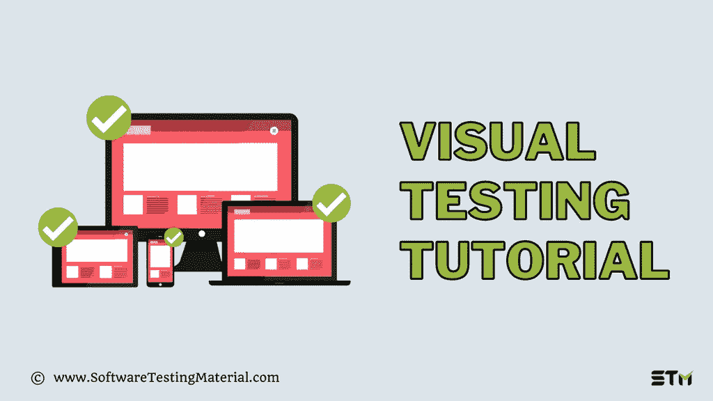

# 2022 年终极自动化视觉测试教程

> 原文:[https://www.softwaretestingmaterial.com/visual-testing/](https://www.softwaretestingmaterial.com/visual-testing/)

在数字技术时代，人们可以在不同的设备上访问自己喜欢的网站和应用程序。

企业应该确保优化他们的网站用户界面和 UX，以获得完美的图片发布。

在本文中，我们将了解自动化视觉测试，以及它如何帮助我们向最终用户交付更好的用户界面(UI)和用户体验(UX)。

Table of Contents <button class="kb-table-of-contents-icon-trigger kb-table-of-contents-toggle" aria-expanded="true" aria-label="Collapse Table of Contents">*   [什么是视觉测试](#h-what-is-visual-testing)
*   [什么是视觉缺陷](#what-are-visual-bugs)
*   [为什么要进行视觉测试](#why-visual-testing)
*   [为什么我们不能通过功能测试发现视觉缺陷](#why-cant-we-find-visual-bugs-with-functional-testing-)
*   [什么是手动视觉测试](#what-is-manual-visual-teting)
*   [什么是自动化视觉测试](#what-is-automated-visual-testing-)
*   [手动视觉测试与自动视觉测试](#manual-visual-testing-vs-automated-visual-testing)
*   [自动化视觉测试工具的优势](#advantages-of-automated-visual-testing-tools)
*   [视觉测试过程如何工作](#how-the-visual-testing-process-works)
*   [流行的商业视觉测试工具](#popular-commercial-visual-testing-tools)
*   [结论](#conclusion)
*   [常见问题解答:视觉测试](#faq-visual-testing)
    *   什么是最好的基于代码/脚本的开源可视化验证工具？
    *   [基于配置的开源可视化 UI 测试工具有哪些](#what-are-the-best-configuration-based-opensource-visual-ui-testing-tools-)</button> 

通常，进入生产的缺陷通常是 UI 缺陷。

## **什么是视觉测试**

**视觉测试**又称**视觉检查**或**视觉回归测试**或**视觉 UI 测试**。

[软件开发中的视觉测试](https://www.softwaretestingmaterial.com/sdlc-software-development-life-cycle/)是一个审查和检测应用程序中 UI 变化的过程。【T2

视觉回归测试确保 web 或移动应用程序的图形用户界面(GUI)在不同的浏览器和不同的屏幕宽度上正确显示，并且对最终用户可见。

视觉测试的目的是检查应用程序的可见输出，并将其与相应的预期结果进行比较。

一旦开发人员创建了一个应用程序，QAs 通过在多种浏览器、操作系统、设备和屏幕分辨率上验证它来确保该应用程序没有视觉缺陷。

## **什么是视觉缺陷**

视觉错误是 web 或移动应用程序中界面的设计或布局问题。当它们弹出时，用户可能会在应用程序中遇到问题。这些视觉缺陷破坏了应用程序的用户体验。

**一些常见的用户界面缺陷如下:**

1.  字体问题(未知标记代替文本)
2.  对齐问题
3.  布局问题
4.  渲染问题
5.  重叠元素
6.  响应布局问题

如果大多数用户在访问你的网站或应用程序时遇到负面体验，他们就不会再回到你的网站或应用程序。

一个成功的组织需要不断地监控这些类型的问题，以确保他们的客户仍然拥有最佳的用户体验。否则，他们将面临无法提高客户满意度的风险，并对收入、服务订阅和总体绩效产生负面影响。

如果一个视觉缺陷限制了用户访问应用程序的关键功能，那么我们应该将其报告为**功能缺陷**。

> ***必读:** [功能测试 vs 非功能测试](https://www.softwaretestingmaterial.com/functional-testing-vs-non-functional-testing/)*

## **为什么要进行视觉测试**

假设你正在访问一个电子商务网站在您的桌面上，并增加了一些项目到您的购物车。之后的某个时候你已经打开了相同的电子商务网站在您的手机上添加一些更多的项目。但由于产品图像与“添加到购物车”按钮重叠的问题，您无法添加项目。

显然，这将破坏你的电子商务网站的经验，你会继续与另一个网站。

视觉测试在修复视觉缺陷和提供更好的用户体验方面起着至关重要的作用。

为了进行可视化测试，我们需要在多种浏览器、操作系统、屏幕尺寸等环境下测试应用程序。,

请记住，用户界面中的错误会导致销售损失。

## **为什么我们不能通过功能测试发现视觉缺陷**

通过功能测试，我们可以确保应用程序逻辑按预期运行，但是我们无法在 GUI 级别发现可视化错误。

功能测试测量功能行为，但不能检测由重新划分子条目或 CSS 更改引起的更改。其中视觉测试可以发现由呈现子条目或 CSS 变化引起的变化。

**功能测试:**确保软件按预期运行。

视觉测试:它确保软件看起来像预期的那样。

在[开发周期](https://www.softwaretestingmaterial.com/sdlc-software-development-life-cycle/)的早期实施视觉测试，以及[功能测试](https://www.softwaretestingmaterial.com/functional-testing/)，可以让我们在向最终用户发布应用之前找到并修复视觉缺陷。

软件团队通常会花费大量的时间和精力来开发满足最终用户需求的网站。

尽管如果网站不能提供跨平台、跨设备、跨浏览器的一致的用户体验，这些努力就白费了。

为了保持积极的品牌价值，网站应该跨平台、设备和浏览器保持统一。

我们可以手动或者使用自动化工具来进行视觉测试。让我们看看哪种类型的视觉测试给出更好的结果。

## **什么是手动视觉测试**

开发人员或 QA 通过将设计预期与各种设备、操作系统、浏览器和屏幕尺寸上的视觉输出进行比较，手动查找视觉缺陷，并通过截图记录差异。

*   通过手动视觉验证测试来发现微小的 UI 变化并不容易。
*   这是一个耗时的过程
*   这是一项昂贵的任务，并且由于人为干预而容易出错
*   不可能通过手动视觉测试在所有设备排列中测试应用。

可视化回归测试通常是用 Selenium WebDriver 这样的自动化测试框架编写的，但是也可以通过比较应用程序中相同页面的两组截图来手动运行。

当创建一个自动化的可视化回归测试不可行或者不划算时，就使用带有手工功能测试的可视化回归测试。

手动视觉测试是乏味且耗时的任务。

为了克服这些问题，我们选择了[自动化视觉测试工具](https://www.softwaretestingmaterial.com/visual-testing-tools/)。

自动化视觉测试来了。

## **什么是自动化视觉测试**

自动化视觉测试将帮助我们快速测试我们的应用程序，以及它在覆盖率、时间和网站或移动应用程序的整体质量方面的可伸缩性。

自动化视觉回归测试允许测试人员自动化测试，监控软件应用程序的视觉方面，如网页、桌面用户界面或移动应用程序。

自动视觉检查是创建自动测试以验证应用程序的用户界面是否已被更改的过程。

## **手动视觉测试与自动视觉测试**

| 人工视觉测试 | 自动化视觉测试 |
| --- | --- |
| 不需要投资视觉测试工具。 | 需要投资视觉测试解决方案。 |
| 需要手动比较各种设备的视觉输出。 | 不需要手动比较各种设备的视觉输出。 |
| 比自动化测试慢。 | 比手工测试快得多。 |
| 与自动化视觉测试相比，无法找到更多的视觉缺陷。 | 与人工视觉测试相比，能够发现更多的视觉缺陷。 |

## **自动化视觉测试工具的优势**

自动化视觉回归测试工具“逐个像素”地相互比较图像，以寻找由于错误或不良做法导致的变化，并允许公司确保这些变化不会对最终产品体验产生负面影响。

1.  允许用单个可视快照替换数百个断言。
2.  自动化视觉测试跨浏览器、屏幕和设备测试 UI。
3.  节省手动测试花费的时间和资源。
4.  跨多个平台、设备、浏览器和操作系统执行 UI 测试。

## **视觉测试过程如何工作**

执行视觉测试是为了将软件的用户界面截图与基线图像进行比较，以查看是否发生了任何变化。

**步骤#1:** 运行被测应用程序(AUT)并截图。

**步骤#2:** 跨浏览器、操作系统、屏幕尺寸和设备渲染截图。

**步骤#3:** 将截图与基线图像进行比较，并分析视觉变化。

**步骤#4:** 如果检测到任何视觉变化，报告差异

**步骤#5:** 根据需要更新基线图像。

## **流行的商业视觉测试工具**

如果您有兴趣购买视觉测试解决方案，请查看下面提供此服务的供应商列表。下面是关于[最佳视觉测试工具](https://www.softwaretestingmaterial.com/visual-testing-tools/)的详细指南。

*   **appli tools—**最适合桌面-网络应用视觉测试。
*   **Percy(browser stack)–**最适合 web 应用视觉测试。
*   **kobi ton—**最适合移动测试团队。

## **结论**

视觉测试是一种软件质量保证的方法，它分析用户如何与你的网站或应用程序交互。它检查网站是否符合可用性和可访问性标准，并寻找网站导航、图形、字体、配色方案等方面的缺陷。

自动化的可视化测试工具非常棒，因为它们允许你一次在多个平台上进行测试，而不需要你自己手工去做。

如果这篇文章激发了你对自动化视觉测试工具的兴趣，你可以查看我们关于市场上最佳视觉回归测试工具的详细指南。

## **常见问题解答:视觉测试**

### 什么是最好的基于代码/脚本的开源可视化验证工具？

以下是基于代码/脚本的可视化测试工具列表，这些工具可以免费使用并且是开源的。

#1。 [FBSnapshotTestCase](https://github.com/facebookarchive/ios-snapshot-test-case) (使用 XCTest)
#2。[双子](https://github.com/gemini-testing/gemini)(使用 JS DSL)
#3。[针](https://github.com/python-needle/needle)(使用 Python)
#4。[幻像](https://github.com/HuddleEng/PhantomCSS)(使用 CapserJs)
#5。 [Pix-Diff](https://github.com/koola/pix-diff) (使用 JS 和量角器)
#6。 [Rspec 页面回归](https://github.com/rprt/rspec-page-regression)(使用 Capibara)
#7。[硒视觉差异](https://github.com/kreyssel/selenium2-visualdiff)(使用 Java 和 WD)
#8。 [Specter](https://github.com/samuelgilman/specter) (采用 JS DSL)
#9。[visual exception](https://github.com/Codeception/VisualCeption)**(使用 PHP 和 code exception)
# 10。 [Vizregress](https://github.com/chwilliamson/Vizregress) (用途。NET 和 WD)**

 **### **基于配置的开源可视化 UI 测试工具有哪些**

以下是基于配置的可视化验证工具列表，这些工具可以免费使用并且是开源的。

#1。 [BaskstopJS](https://github.com/garris/BackstopJS)
#2。 [CSSCritic](https://github.com/cburgmer/csscritic)
#3。 [CSS 目测](https://github.com/davidjnelson/css-visual-test)
#4。[咕哝摄影箱](https://github.com/stefanjudis/grunt-photobox)
#5。[葱](https://github.com/mobomo/green_onion)葱
#6。[咕噜-维果](https://www.npmjs.com/products)
#7。[盖伦框架](http://galenframework.com/)
#8。[狗头人](https://github.com/yahoo/kobold)
#9。[抓拍对比](https://github.com/craigtaub/snapandcompare)
#10。 [VIFF](https://github.com/winsonwq/viff)**