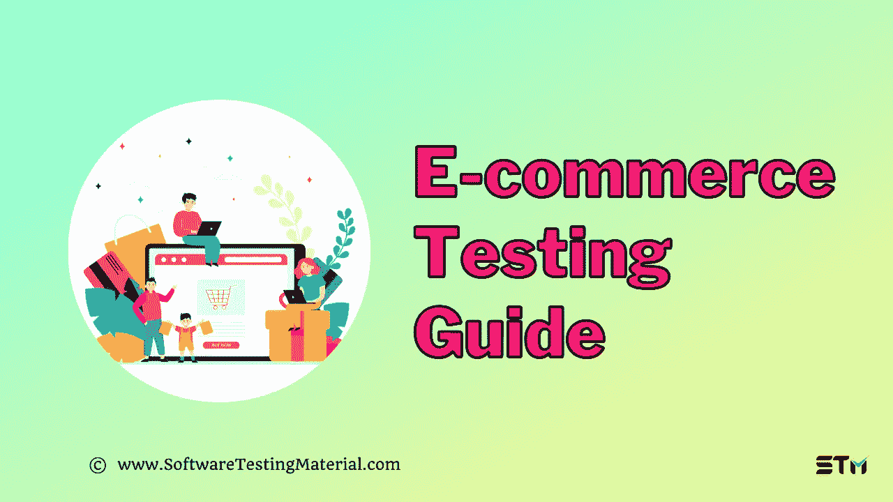

# 电子商务测试指南:如何测试电子商务网站

> 原文:[https://www.softwaretestingmaterial.com/ecommerce-testing/](https://www.softwaretestingmaterial.com/ecommerce-testing/)

在[软件测试教程](https://www.softwaretestingmaterial.com/manual-testing-tutorial/)的这篇文章中，我们将学习什么是电子商务测试，电子商务测试的不同类型，电子商务测试的好处，等等。

<button class="kb-table-of-contents-title-btn kb-table-of-contents-toggle" aria-expanded="false" aria-label="Expand Table of Contents">Table of Contents</button>

*   [什么是电子商务？](#h-what-is-e-commerce)
*   什么是电子商务测试？
*   [电子商务测试的好处](#h-benefits-of-e-commerce-testing)
*   有哪些不同类型的电子商务商业模式？
    *   [#1。企业对企业(B2B)模式](#h-1-business-to-business-b2b-model)
    *   [#2。企业对消费者(B2C)模式](#h-2-business-to-consumer-b2c-model)
    *   [#3。客户对企业(C2B)模式](#h-3-customers-to-business-c2b-model)
    *   [#4。客户对客户(C2C)模式](#h-4-customer-to-customer-c2c-model)
    *   [#5。消费者对政府(C2A)模式](#h-5-consumer-to-administration-c2a-model)
*   [如何编写电子商务网站测试用例](#h-how-to-write-e-commerce-website-test-cases)
    *   [#1。主页测试案例](#h-1-homepage-test-cases)
    *   [#2。搜索测试用例](#h-2-search-test-cases)
    *   [#3。产品详情页面](#h-3-product-details-page)
    *   [#4。推荐产品](#h-4-recommended-products)
    *   [#5。付款](#h-5-payments)
    *   [#6。购物车](#h-6-shopping-cart)
    *   [#7。后序测试用例](#h-7-post-order-test-cases)
    *   [#8。一般测试案例](#h-8-general-test-cases)
    *   [#9。SEO 清单](#h-9-seo-checklist)
*   [在电子商务应用中需要测试的特性](#h-features-to-be-tested-in-an-e-commerce-application)
    *   [#1。针对不同用户场景的网站功能](#h-1-website-functionality-for-different-user-scenarios)
    *   [#2。申请工作流程](#h-2-application-workflow)
    *   [#3。与网络浏览器的兼容性](#h-3-compatibility-with-web-browsers)
    *   [#4。移动响应能力](#h-4-mobile-responsiveness)
    *   [#5。性能测试](#h-5-performance-testing)
    *   [#6。安全和漏洞评估](#h-6-security-and-vulnerability-assessments)
    *   [#7。社交媒体整合](#h-7-social-media-integration)
    *   [#8。SEO 相关方面](#h-8-seo-related-aspects)
*   [电子商务测试的挑战](#h-challenges-of-e-commerce-testing)
*   [电子商务网站的有用工具](#h-useful-tools-for-e-commerce-site)
*   [电子商务测试常见问题解答](#ecommerce-testing-faqs)
    *   在电子商务应用程序或网站上执行的测试类型有哪些？
    *   我应该在电子商务网站上测试什么？
    *   如何为一个网站写一个测试用例？
*   [结论:](#conclusion)

## **什么是电子商务？**

电子商务(又名电子商务或互联网商务)是指在网上购买或销售商品和服务，以及转移资金和数据以完成交易。

## 什么是电子商务测试？

电子商务测试有助于评估电子商务(在线购物)应用程序的特性和功能，以确保电子商务网站/应用程序的准确运行功能符合预期。

它关注用户体验、安全交易、移动响应、客户数据安全、加载时间等关键因素。

## **电子商务测试的好处**

*   它保护企业免受代价高昂的失败。
*   确保电子商务网站和应用程序中的每个页面/模块都经过全面测试。
*   在将产品发布到实际环境之前，帮助验证和确认产品。
*   帮助向最终用户发布用户友好的应用程序。
*   确保应用程序对其用户具有高可见性
*   降低与交易相关的风险，确保交易安全可靠。
*   安全-保护产品免受入侵者和黑客的攻击。
*   提高电子商务商店的质量，因为它减少了对关键修复的需求

## 有哪些不同类型的电子商务商业模式？

电子商务网站的商业模式类似于任何其他市场，该模式根据谁买谁卖而变化。通常，基于电子商务的企业分为以下五类。

*   企业对企业(B2B)模式
*   企业对客户(B2C)模式
*   客户对客户(C2C)模式
*   客户对企业(C2B)模式
*   消费者对管理(C2A)模式

### **#1。企业对企业(B2B)模式**

在 B2B 商业模式中，顾名思义，一家企业向其他公司出售其产品或服务。通常，这些都是为了加强另一家公司的业务实践。

《出埃及记》Salesforce，调查猴，阿里巴巴，SAP 等。

### **#2。企业对消费者(B2C)模式**

在 B2C 商业模式中，直接顾客将是焦点。这非常简单，类似于零售市场、网站或应用程序销售客户购买的产品。

《出埃及记》亚马逊、Nykaa、Policy Bazaar 等。

### **#3。客户对企业(C2B)模式**

在 C2B 的商业模式中，个人或个体企业家向企业出售他们的产品或服务。

《出埃及记》自由平面设计师、UI/UX 设计师、作家、艺术家等。

### **#4。客户对客户(C2C)模式**

在 C2C 商业模式中，客户使用在线平台相互购买和销售产品。通常，第三方网站会帮助这些消费者促成此类交易。

《出埃及记》Olx、Craigslist、易贝、Etsy 等。

### **#5。消费者对政府(C2A)模式**

在这种 C2A 商业模式中，交易发生在政府、学校、医院等行政机构之间，这里的消费者是公民、学生/家长等。

《出埃及记》税收、学费支付、电子医疗、电子投票、政府收集公民反馈表、进行在线调查(为人口普查)。

## **如何编写电子商务网站测试用例**

基本的测试技术可以用来测试电子商务网站和应用程序。除了这些测试技术，还有更多专门针对电子商务的[测试策略](https://www.softwaretestingmaterial.com/test-strategy/)。下面给出的测试用例是通用的，也就是说，它们可以应用于大多数电子商务网站。测试电子商务商店的基本组件如下。

让我们看看如何为电子商务应用程序编写测试用例。

### **#1。主页测试案例**

主页是整个电子商务网站最重要的组成部分，它是一个强大的营销工具。

在这里，软件测试工程师应该关注品牌标志、顶部导航、关键字搜索、登录和未登录用户的页面行为。测试工程师应该检查页面布局、内容可见性、横幅、传送带和其他功能。

下面是一个流行的电子商务网站(亚马逊)的样本主页。在这里，我用红色框突出显示了主页上的英雄图像。

**样本测试用例**

*   页面加载时间应在可接受的范围内。
*   英雄图像应该在规定的时间间隔内自动滚动。
*   英雄形象可点击吗？如果是，是否重定向到目标页面？
*   注册/登录按钮应该是可见的，容易找到。
*   主页上提供的链接应该重定向到目标页面。
*   顶部导航，汉堡菜单，类别，子类别应该清楚地列出来。
*   主页上的颜色编码应与品牌详情保持一致。
*   基本的关键字搜索应该导致相应的产品。

### **#2。搜索测试用例**

搜索功能是任何电子商务商店中最常用的功能，即使有最详尽的产品列表和易于使用的导航。因此，搜索算法必须进化，变得更先进、更精确。

测试工程师应该关注使用搜索栏列出的产品是否相关。

下面是一个流行的电子商务网站(亚马逊)的示例搜索框(用红色框突出显示)。

**样本测试用例**

*   输入产品名称、品牌名称或类别名称等关键词时，应看到相关产品，例如 iPhone、笔记本电脑、[最佳软件测试书籍](https://www.softwaretestingmaterial.com/software-testing-books/)
*   使用特定关键字搜索时，应显示直接匹配或相关产品。
*   搜索结果应该显示产品名称、图片、客户评论和价格细节。
*   当使用特定类别页面进行搜索时，应该显示相应类别的结果。
*   列表的顶部应该总是有最相关的产品。
*   即使一个产品被列在几个类别中，它也应该只在搜索结果中出现一次。
*   当在搜索栏中键入的关键字有错别字时，应列出建议。
*   应该有一个选项来选择每页显示的结果数量。
*   导航应该可用于多页结果。
*   排序选项应该可以根据品牌名称、价格、评论或评级等对结果进行排序。,
*   通过使用品牌、可用性、定价、客户评级等过滤产品来检查过滤器功能。,
*   通过使用流行度、相关性、价格从高到低、价格从低到高等对产品进行排序来检查排序功能。,
*   通过将项目添加到收藏夹/愿望列表功能进行检查。
*   检查“添加到比较”功能

### **#3。产品详情页面**

产品详情页面是结账流程的起点。产品详细信息页面在单个页面中包含了最多的详细信息。

很容易在单个页面上进行详尽的测试，而忽略了更大的画面。

测试工程师应该关注图像质量、购买按钮或添加到购物车按钮、客户评论、价格细节等。

下面是一个流行的电子商务网站(亚马逊)的样本产品详情页面。

**样本测试用例**

*   内容细节，如产品名称，描述，图像，价格细节(如有折扣)，问答应该看到。
*   客户评论星和评论文本应该可用。
*   “添加到购物车”按钮应该很容易找到。
*   检查“添加到购物车”功能。
*   类似的产品或者客户也买过这款应该可以看到。
*   产品图像应该有一个缩放选项。
*   产品展示页面应该在不同的设备上保持一致
*   产品的可用性应该是准确的，如果缺货，应该看到一个适当的信息
*   数量选择器、尺寸选择器、颜色选择器和另一个变量选择器应该可用，并按预期工作。
*   单击“添加到购物车”按钮时，产品应添加到购物车中

### **#4。推荐产品**

推荐产品是页面中最重要的部分，但也是测试中最被忽视的部分。顾客购买后，会有一个跟进环节，向他们展示更多与购买相关的产品。如果顾客开始从那里购买，利润会增加更多。

测试工程师必须关注推荐产品与购买产品的相关性。

下面是一个流行的电子商务网站(亚马逊)的推荐产品部分的样本。

**样本测试用例**

*   购买后应立即看到推荐的产品。
*   推荐的产品应该与客户购买的产品相关。

### **#5。付款**

客户离开电子商务商店的最常见原因之一是交易失败和支付失败。

测试工程师应该从客户的角度将它可视化，验证它的需求和接受标准。

下面是一个流行的电子商务网站(亚马逊)的示例支付流程部分。

**样本测试用例**

*   付款流程应该适用于所有不同的付款方式
*   一个存储的付款选项应该在结帐流程中可用
*   支付选项，如签证，万事达卡，贝宝，合众国际社应与他们的标志可见。
*   应用额外的优惠或折扣代码会降低购买价格。
*   购买完成后，不应保存密码、CVV、动态口令等敏感信息
*   在存储客户的信用卡信息或任何其他私人信息时，执行安全测试是必须的
*   以客人身份结账时，购物流程应顺畅，并允许客人在付款后进行登记
*   安全交易应该发生，并应在支付后提示客户回到电子商务应用程序/网站。
*   与付款相关的交易 id 和详细信息应与订单详细信息一起保存。
*   通过使用您提供的每种付款方式进行测试付款来进行检查。
*   使用各种付款方式，如借记卡、信用卡、网上银行、PayPal 等，检查付款是否正确。,
*   验证无效付款。
*   确认取消订单。

### **#6。购物车**

购物车功能是电子商务网站的重要功能之一，因为它可以帮助客户从网站的不同部分添加要购买的物品，并一起购买。购物车功能是结账流程的重要组成部分。

测试工程师应该关注基于时间框架的复杂计算，这些时间框架基于促销优惠、折扣代码、凭证等。

下面是一个流行的电子商务网站(亚马逊)的样本购物车部分。

**样本测试用例**

*   结帐功能应该按预期工作。
*   当点击购买按钮时，商品应该被添加到购物车中，然后继续购物按钮应该与继续购买按钮一起出现。
*   如果单个产品的数量超过一个，价格和质量也要相应变化。
*   运费、税费等细节应与产品价格一起显示。
*   应该有一个从购物车中删除项目的明确选项。
*   当客户在购物车中添加/删除新商品时，订单价格应该更新。
*   客户应该能够从商店的任何类别添加项目到购物车。
*   通过向购物车添加商品进行检查
*   通过从购物车中移除产品进行检查
*   通过改变数量进行检查
*   通过选择交付选项进行检查
*   检查增值税和运输成本加起来是否正确
*   查看立即支付测试案例
*   通过进入结帐流程进行检查
*   验证结帐和支付测试案例
*   检查最终要支付的金额–确保在扣除产品价格、增值税、运费和任何其他费用后，该值是正确的。
*   通过更改订购的产品、更改交付选项等进行检查。，并确保最终金额正确更新。

### **#7。后序测试用例**

后订单通常是客户购买产品后的后续会议。通常，它包括订单确认详情、关于购买的电子邮件信息、订单跟踪、发货详情和退货程序。测试工程师应该关注订单后用例的重要方面，比如取消订单、退回产品、跟踪细节、订单汇总细节等。

**样本测试用例**

*   客户应该会收到短信/邮件形式的订单确认消息。
*   顾客应该可以选择取消订单。
*   取消订单和退货应提示产品取消/退货的原因。
*   订单 id 和摘要中给出的详细信息应该是同一组记录。
*   客户应该能够查看过去购买的购买历史。
*   检查付款退款情况。
*   检查退款确认邮件是否成功发送给收件人。
*   客户应该能够跟踪订单

### **#8。一般测试案例**

电子商务网站/应用程序的一般测试用例应该以详细的方式覆盖适当的范围，并且应该经过深思熟虑地组合。尤其是基本的用户界面、登录功能、分类导航的便利性、整体工作流程等。，将属于一般测试用例。

**样本测试用例**

*   用户应该能够在所有设备上浏览不同类别的所有产品。
*   网站中的链接和横幅应该重定向到它们相应的位置，没有链接应该被打破
*   电子商务商店的品牌标志和名称应该是可见的。
*   列出的类别应该有一个一致的模式，文本应该易于理解。
*   分类页面上列出的产品总数应该是准确的。\
*   用户注册–登录/注册案例
*   会话到期–如果用户长时间不活动，则系统应该自动注销用户。
*   验证我的帐户页面和个人资料管理功能
*   检查客户、销售人员、超级管理员、管理员、支持人员等的用户基础场景测试
*   检查后端到前端[集成测试](https://www.softwaretestingmaterial.com/integration-testing/)
*   在所有浏览器和版本中保持基本的理智，如 Internet Explorer、Chrome、Firefox、Safari 等。,
*   查看关于我们、运输信息、退货政策、条款和条件、隐私政策等页面。,
*   应正确管理折扣或促销代码。

### **#9。SEO** **清单**

每个电子商务网站的所有者都希望，当用户搜索某个产品时，他们的产品应该放在谷歌搜索结果的顶部。只有一个适当的搜索引擎优化的电子商务商店可以在搜索排名中名列前茅。

测试人员需要按照搜索引擎优化清单来优化网站的搜索引擎。

**样本测试用例**

*   验证 URL 的结构。
*   验证每个页面和产品页面的唯一标题标签。
*   验证标题标签应包括产品名称和类别。
*   验证每个页面和产品页面的元描述标签。
*   验证 robots.txt 文件是否存在。
*   验证图像中是否添加了替代文本。
*   验证内部链接以帮助指数化。
*   验证是否有 XML 站点地图。

## **在电子商务应用中需要测试的特性**

电子商务应用的成功取决于两个关键因素，功能性和可用性。

如果电子商务是用户友好的，容易从不同的设备访问，更多的用户会使用商店，这将转化为销售。

从用户的角度考虑，用户会从一个有很多 bug 的应用程序中进行货币交易吗？

因此，任何电子商务商店的成功取决于应用程序的质量。

作为测试工程师，我们应该确保下面列表中的每个特性都经过了彻底的测试。

### **#1。针对不同用户场景的网站功能**

电子商务应用程序可能有不同类型的用户，如授权和未授权用户、卖家、送货人、销售代表、商店经理、代销商等等，这取决于企业的类型。

测试团队应该确保每个用户场景及其功能的用例都被覆盖

> 不要错过:[功能测试](https://www.softwaretestingmaterial.com/functional-testing/)

### **#2。** **申请工作流程**

电子商务应用程序应该有明确定义的工作流程，应该在要求中详细说明。

客户应该有一个积极的用户体验，因为我们已经从用户的角度验证了工作流程。

工作流程包括登录/注册、搜索、排序、过滤、产品描述页面、购物车、结账、支付网关、订单确认等。

### **#3。** **与网络浏览器的兼容性**

电子商务网站应该在每个浏览器上工作，即商店应该是稳定的，与各种浏览器兼容。

Chrome、Firefox、Safari、Edge、Internet Explorer、Opera 等浏览器应该以相同的方式运行，电子商务商店的功能和特性应该在不同浏览器之间保持一致。

> **不要错过:** [跨浏览器测试指南](https://www.softwaretestingmaterial.com/what-is-cross-browser-testing/)和[跨浏览器测试清单](https://www.softwaretestingmaterial.com/cross-browser-testing-checklist/)

### **#4。** **移动响应能力**

如今，电子商务网站从移动设备获得的流量超过了桌面平台。

在数据门户网站最近发布的一项调查中，近 46.6 亿人使用互联网，92.6%的人使用移动设备访问互联网。

因此，现在是我们开始在不同分辨率的移动设备上测试我们的应用程序以满足客户需求的时候了。

我们应该测试网站设计的响应性及其可用性和功能性。

> 查看我们关于[移动应用测试](https://www.softwaretestingmaterial.com/mobile-app-testing-guide/)的详细教程

### **#5。** **性能测试**

对于一个电子商务应用程序，性能测试是实现完美的功能和技术性能所必需的。

性能测试带来了在其他类型的测试中可能没有发现的错误。

测试工程师应该尝试不同的测试，如负载测试、压力测试、峰值测试、耐用性测试、容量测试等，因为所有这些测试都有助于评估网站的带宽、容量(尤其是在假期)和促销活动。

性能测试包括测试各种参数，如网页的加载速度、流量负载容限、吞吐量、数据传输速率、效率、数据库性能、错误处理、正常运行时间等等

> **不要错过:** [性能测试指南](https://www.softwaretestingmaterial.com/performance-testing-tutorial/)

### **#6。** **安全和漏洞评估**

电子商务网站拥有用户的敏感信息，如姓名、年龄、出生日期、地址、银行信息等等。因此，安全性测试是电子商务测试中的重中之重。

不同的方法如 SQL 注入、SAST、DAST、道德黑客等被用来检查系统的漏洞。

如果发现与应用程序安全性相关的错误，甚至会导致业务失败。

> **不要错过:** [安全测试指南](https://www.softwaretestingmaterial.com/security-testing-tutorial/)

### **#7。** **社交媒体整合**

电子商务网站整合社交媒体非常有用，因为社交媒体是围绕品牌参与和创建社区的强大工具。

电子商务通过社交标志选项、社交分享小工具、社交反馈、社交媒体中的广告重定向到电子商务商店等等来利用社交媒体的力量。这些整合与网站的架构和工作流程保持一致，以获得最佳策略。

### **#8。** **SEO 相关方面**

电子商务网站应该有很高的搜索能见度，以推动网站的流量。

测试工程师应该检查 SEO 策略，如标题标签、元描述、URL 结构、图片 alt 标签等，是否以客户可以轻松找到网站的方式放置。

## **电子商务测试的挑战**

*   在销售、假期、促销活动期间，电子商务网站/应用程序不断变化和发展，因此每 3 个月就会有一个新的 UI 变化和附加功能，这可能会成为开发人员和测试工程师的瓶颈。网站的不断变化使得自动化变得不可能
*   通常，电子商务网站与第三方网站集成，这种集成使得在第三方网站宕机时很难进行端到端测试，可能需要一段时间才能确定问题是来自我们的网站还是第三方网站。
*   在黑色星期五和网络星期一这样的销售季节，企业总是低估网站的用户数量，这是由于糟糕的性能测试或人们不太专注于性能测试。
*   顾客的偏好随时都在变化，不是每个人都以准确的方式使用网站，跟踪每次购买并存储他们的行为可能很困难。
*   网站的可用性是非常主观的，初学者可能需要一个教程部件来了解网站如何工作，而有经验的购买者可能会发现它们是不必要的，可用性和用户体验各不相同，用户友好性的上下文会根据用户而变化，所以很难保证我们的可用性测试是有效的
*   测试团队可能理解软件需求和正在实现的功能，但不一定理解业务模型及其需求。
*   随着网站以更快的速度发展，测试团队必须专注于改变测试用例和自动化框架。
*   每次技术发展时，测试人员都会创建一个新的环境
*   为了验证所有细节，应向测试团队提供运费、税务细节和信用卡
*   黑客攻击和入侵对于新网站来说很常见，但企业并不总是提供适当的工具和资金来使用这些工具。
*   即使电子商务网站对用户来说看起来很简单，但它有非常复杂的集成
*   回归套装必须在自动化和手动执行中运行，以验证更新的影响。
*   自动化测试的可行性非常低，因为电子商务有一个动态的环境，但手动测试可能非常耗时，并且有可能出现人为错误

> **必读:** [职业从手工转向自动化](https://www.softwaretestingmaterial.com/career-shift-from-manual-to-automation-testing/)

## **电子商务网站的有用工具**

以下是帮助电子商务网站开发者分析网站设计以提高转化率的工具。

**#1。** **[优化](https://www.optimizely.com/) :** 它帮助开发者在网站上构建和运行 A/B 测试。
**#2。HotJar :** 它有助于展示用户如何真正使用网站，收集用户反馈，将更多的访问者转化为客户。
**#3。[用户测试](https://www.usertesting.com/solutions/product) :** 它是按需人类洞察的领先提供商。它允许您的应用程序由真实用户进行测试。

## **电子商务测试常见问题解答**

### 在电子商务应用程序或网站上执行的测试类型有哪些？

保持质量的电子商务功能测试，包括登录、搜索和过滤器、搜索结果页面、订单详情页面、购物车、交易和促销代码、订单确认页面、订单跟踪

提高稳定性的电子商务性能测试，包括负载、压力、容量、可伸缩性、峰值测试

提高使用安全性的电子商务安全测试，包括渗透、漏洞测试、安全审计、安全扫描、漏洞扫描、道德黑客、风险评估

无缝交易的电子商务支付测试，包括功能、集成、性能、 安全性、可用性、兼容性、本地化测试

针对一致应用体验的电子商务兼容性测试，其中包括向前&向后测试

### 我应该在电子商务网站上测试什么？

应对电子商务应用程序进行测试，以纠正登录/注册、搜索、结账、购物车、支付网关、内容、链接、格式、可访问性、[cookie](https://www.softwaretestingmaterial.com/website-cookie-testing/)、社交按钮、分析和其他设置中的问题

### 如何为一个网站写一个测试用例？

为电子商务网站编写测试用例与一般情况下编写测试用例是一样的。查看关于如何编写测试用例的指南。

## **结论:**

测试电子商务网站和移动应用程序是电子商务应用程序开发的重要组成部分。它有助于更好的用户体验、用户数据安全、移动响应能力、安全性、快速加载时间以及许多其他积极因素。

**相关帖子:**

*   [跨浏览器测试清单|软件测试材料](https://www.softwaretestingmaterial.com/cross-browser-testing-checklist/)
*   [产品测试指南|您应该知道的内容](https://www.softwaretestingmaterial.com/product-testing/)
*   [什么是跨浏览器测试|软件测试材料](https://www.softwaretestingmaterial.com/what-is-cross-browser-testing/)
*   [软件开发生命周期的 V 模型](https://www.softwaretestingmaterial.com/v-model-in-sdlc/)
*   [软件开发生命周期的瀑布模型](https://www.softwaretestingmaterial.com/waterfall-model-in-sdlc/)