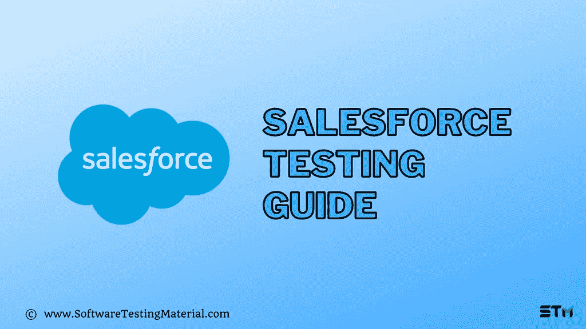

# Salesforce 测试|全面指南

> 原文:[https://www.softwaretestingmaterial.com/salesforce-testing/](https://www.softwaretestingmaterial.com/salesforce-testing/)

在本 Salesforce 测试教程中，我们将学习什么是 Salesforce 测试，如何执行 Salesforce 测试，以及以下详细概念。

*   [什么是 Salesforce？](#h-what-is-salesforce)
*   [使用 Salesforce 的好处](#h-benefits-of-using-salesforce)
*   [什么是 SalesForce 测试](#h-what-is-salesforce-testing)
*   [为什么要进行 Salesforce 测试](#h-why-salesforce-testing)
*   [销售人员测试的类型](#h-types-of-salesforce-testing)
*   [sales force 中的测试级别](#h-levels-of-testing-in-salesforce)
    *   [单元测试](#h-unit-testing)
    *   [系统测试](#h-system-testing)
    *   [用户验收测试](#h-user-acceptance-testing)
    *   [生产测试](#h-production-testing)
    *   [回归测试](#h-regression-testing)
*   [Salesforce 测试流程](#h-salesforce-testing-process)
*   [Salesforce 测试挑战](#h-salesforce-testing-challenges)
*   【Salesforce 测试的最佳实践
*   【Salesforce 测试场景示例
*   [sales force 测试自动化中使用的工具有哪些？](#h-what-are-the-tools-used-in-salesforce-test-automation)
*   Salesforce 测试人员的角色是什么？
*   [结论](#h-conclusion)

## **什么是 Salesforce？**

[Salesforce](https://www.softwaretestingmaterial.com/go/salesforce/) 是一款基于云的软件，提供客户关系管理服务，帮助企业简化销售和营销运营。

Salesforce 以 CRM 软件的软件即服务(SaaS)起家。Salesforce 现在提供几种软件解决方案，如营销、自动化、分析以及应用程序开发。由于他们自动提供升级，我们不必担心应用程序或基础架构。现在，Salesforce 是世界上排名第一的 CRM 软件。超过 150，000 家公司使用 Salesforce.com 进行客户关系管理。

Salesforce.com 拥有多租户架构，客户不必担心软件升级，因为它有助于多个客户共享最新版本的通用技术。这种形式的架构有助于我们的组织更加关注创新，而不是维护技术

SDFC 最大的特点之一就是一切都可以根据顾客的需求定制。Salesforce 测试确保这些增强和功能更新不会失败或危及您的 Salesforce 环境的其他元素。

## **为什么要进行 Salesforce 测试**

*   它在早期阶段识别缺陷，并具有高质量的测试准确性。
*   它有助于为定制功能提供稳定性。
*   它通过测试定制来最小化业务风险。
*   它确保内部或外部环境集成测试的功能完好无损。
*   它增加了端到端测试的测试覆盖率。
*   它验证第三方 API 与 Salesforce 的集成以满足业务需求。
*   它验证了为客户服务设计的案例管理工作流。

## **销售人员测试的类型**

**手动测试-** 在 Salesforce 手动测试中，测试团队在应用程序中执行功能测试、集成测试、回归测试、快乐路径测试和系统测试。他们遵循测试这些应用程序的传统方法。

> 不要错过我们的[手动测试指南](https://www.softwaretestingmaterial.com/manual-testing-tutorial/)

**自动化测试-** 在 Salesforce 自动化测试中，测试团队使用了各种自动化工具，如 [Selenium](https://www.softwaretestingmaterial.com/selenium-tutorial/) 、[cumber](https://www.softwaretestingmaterial.com/cucumber-bdd-for-automation-testing/)、惠普统一功能测试(UFT)、AssureClick 等。

> 不要错过我们的[自动化测试指南](https://www.softwaretestingmaterial.com/automation-testing-tutorial/)

## **sales force 中的测试级别**

### **单元测试**

*   Salesforce 开发人员在开发过程中执行单元测试。
*   开发人员可以通过 Apex 中的[测试框架](https://www.softwaretestingmaterial.com/types-test-automation-frameworks/)编写、运行和检查测试用例的结果，这有助于开发人员确定代码覆盖率。
*   代码覆盖率应该至少达到 75%才能将 apex 代码转移到生产环境中。
*   单元测试使用 Apex 代码，用“testMethod”关键字进行注释。

> **不要错过:** [单元测试指南](https://www.softwaretestingmaterial.com/unit-testing/)

### **系统测试**

*   Salesforce 顾问在应用程序中执行端到端测试。
*   专家顾问从端到端测试系统，以检查后端运行的技术流程。
*   他们对应用程序的特定输出使用几个测试脚本。
*   这有助于我们发现现有 salesforce 系统中自动化规则的问题，如工作流、验证、分配等，这些规则难以根据组织的需求定制功能。

> **阅读更多:** [系统测试指南](https://www.softwaretestingmaterial.com/system-testing/)

### **用户验收测试**

*   Salesforce 用户即实时使用它的最终用户将测试应用程序。
*   测试是在类似生产的环境中进行的，用户只能看到他们需要看到的元素。
*   用户验收测试的目标是消除影响用户体验的错误。
*   UAT 是将代码投入生产之前的最后一级测试。

> **阅读更多:** [用户验收测试指南](https://www.softwaretestingmaterial.com/user-acceptance-testing-uat/)

### **生产测试**

*   测试团队和最终用户都在生产环境中执行测试。
*   这类似于系统测试，他们端到端地测试系统，以确保开发团队完成的配置和定制在生产环境中完美地工作。
*   由于测试是在实时系统中进行的，所以在测试生产环境时，我们必须非常小心。

> **阅读更多:** [验收测试指南](https://www.softwaretestingmaterial.com/acceptance-testing/)

### **回归测试**

*   手动测试人员和自动化测试人员都执行回归测试。
*   一旦代码被部署到现场，开发团队就开始创建新的特性或者修复在给定时间内没有修复的错误。
*   当这些新的变化被开发出来时，回归测试有助于检查这些新的特性是否影响任何现有的特性。
*   测试团队使用自动化脚本进行回归测试，因为系统现在应该是稳定的，所有重复的任务都被分配给自动化脚本。

> **阅读更多:** [回归测试指南](https://www.softwaretestingmaterial.com/regression-testing/)

## **Salesforce 测试流程**

测试 Salesforce 应用程序与测试任何普通应用程序没有什么不同。但是，在 Salesforce 中，我们应该了解 Salesforce 配置/管理设置以测试需求。

Salesforce 测试与任何 web 应用程序测试一样，测试人员必须关注 Salesforce 基础架构细节，如配置和管理设置，以测试需求。

由于 Salesforce 应用程序是从现有的 Salesforce 应用程序定制和配置的，因此系统的基础结构与从头开始开发的应用程序完全不同。
测试团队必须关注定制功能以及这些功能如何与内置的 Salesforce 功能交互。

开发团队和测试团队应该就定制的特性进行清晰的沟通。基于这些交互，用户故事、测试场景、测试脚本和测试用例被创建。应该对测试过程中构建的可定制功能有一个清晰的认识。不同级别的测试在沙盒环境(测试环境)中执行，代码在真实环境中部署。

在开始测试流程之前，QA 团队应了解 salesforce 角色和功能的基础知识，并应熟悉以下功能。

*   创建账户。
*   创建与客户相关的联系人。
*   将创建的联系人作为外部用户启用。
*   向外部用户分配产品许可证。
*   创建内部用户。
*   将 SalesForceDotCom(SFDC)产品许可证分配给内部和外部用户。
*   检查所有页面布局。
*   验证详细页的所有相关列表。
*   检查相关列表中的所有列。
*   创建测试数据以执行测试。
*   与开发团队紧密合作，设计、构建和测试应用程序。
*   为缺陷修复和产品改进提供指导。
*   提供新的想法和信息以增强系统。
*   对整个项目的主要期限进行优先排序和评估。
*   向业务和开发团队提供详细的文档。
*   为客户组织培训课程/演示。

## **Salesforce 测试挑战**

*   由于 salesforce 应用程序有多种类型的用户，为不同的角色、功能和设置编写测试用例可能会很繁琐。
*   Salesforce 是一个动态环境，它在运行时生成 ids，基于 ids 的字段定位器需要不断维护，因为它会对 Apex 代码带来更改。
*   即使 Salesforce 应用程序是高度可定制的，开发人员也不能更改某些功能，即使它们不是必需的。
*   每次 Salesforce 软件更新时，都应该更新和维护测试套件。

## 【Salesforce 测试的最佳实践

QA 团队必须参与项目的早期阶段，这有助于团队增加测试覆盖率和测试的多样性。

开发人员必须在将代码移交给测试团队之前负责单元测试，关键的错误在最初阶段就得到修复。

使用正确的测试工具可以帮助测试的整体质量，例如，selenium for automation testing，因为它具有成本效益。

涉众和开发人员一起进行测试用例演练，以减少功能中的误解，开发团队可以评估代码的效率。

## 【Salesforce 测试场景示例

*   检查是否记录了销售线索/客户的联系信息。
*   检查联系人是否被标记为活动/非活动。
*   检查是否有任何公司可以被标记为客户或潜在客户。
*   检查是否可以在网络表单的帮助下获取销售线索。
*   检查报价是否不等于零。
*   一旦电子邮件发出，检查交易是否完成。
*   检查被退回的邮件是否得到处理。
*   检查与第三方软件的集成是否正常工作。
*   检查计费服务是否按预期工作。
*   检查联系人、业务机会和潜在客户管理中是否没有重复记录。
*   检查移动工作流是否按预期工作。
*   检查未授权用户的文件访问功能是否不可用。

## **sales force 测试自动化中使用的工具有哪些？**

希望在 Salesforce 上利用 UI 测试自动化的公司面临一些挑战，如使用什么工具，当从 Salesforce Classic 迁移到 Salesforce Lightning 时，所选工具在更新自动化时如何有用。

以下是广泛使用的 SalesForce 测试工具

*   Selenium WebDriver
*   webdriver 我
*   UFT(统一功能测试)
*   测试工具
*   黄瓜
*   Provar
*   悦世
*   文思创新
*   灯具
*   TestCraft(魔兽世界)

## Salesforce 测试人员的角色是什么？

Salesforce 测试人员的角色通常被称为“质量工程师”，作为通常的“[质量保证](https://www.softwaretestingmaterial.com/quality-assurance-vs-quality-control/)”的替代，因为 Salesforce 要求软件测试人员应该是成熟的工程师。Salesforce 测试人员的角色不仅仅局限于审查代码以发现错误，还包括设计、维护和扩展复杂的测试框架。

通常，Salesforce 项目核心团队由以下资源组成

*   商业分析员
*   项目经理/Scrum 大师
*   质量分析师/销售人员测试员
*   开发商
*   管理员

Salesforce 测试人员的一些重要角色和职责如下

*   从头开始设置测试环境的能力
*   测试人员应该理解应用程序的功能
*   参与代码审查和发布过程。
*   需要有良好的沟通技巧，以便与开发人员和利益相关者进行良好的沟通，并了解团队构建的功能。
*   单元测试、功能测试、集成测试、负载测试、安全测试和部署测试的实践经验。
*   应该能够创建积极和消极的测试场景。
*   如果第三方应用程序与 SalesForce 集成，需要执行兼容性测试
*   能够使用负载测试工具，如 JMeter，确保复杂的流程给出一致的结果
*   能够执行基于角色的测试，以确保不同用户角色的数据的一致性。
*   使用 Selenium 等工具进行 Salesforce 自动化测试。
*   生成关于未决生产问题、产品更新的报告

[Try Salesforce](https://www.softwaretestingmaterial.com/go/salesforce/)

## **结论**

如今，组织变得越来越以客户为中心，好的 CRM 软件可以帮助他们获得更多的销售和利润。Salesforce 是一种广泛使用的 CRM，具有大量内置功能，可以根据组织的需求配置和定制额外功能。

仅仅关注开发阶段是不够的。测试被配置和定制的代码和特性也很重要。Salesforce 测试人员应该非常精通各种 Salesforce 术语。

Salesforce Tester 作为一种职业选择有着快速增长的前景。拥有 ADM 201 认证可以极大地促进他们的职业发展。有测试背景的可以成为未来的业务分析师。

**相关帖子:**

*   [大数据测试](https://www.softwaretestingmaterial.com/big-data-testing/)
*   [区块链测试](https://www.softwaretestingmaterial.com/blockchain-testing-tutorial/)
*   [云测试](https://www.softwaretestingmaterial.com/cloud-testing/)
*   [ETL 测试](https://www.softwaretestingmaterial.com/etl-testing-interview-questions/)