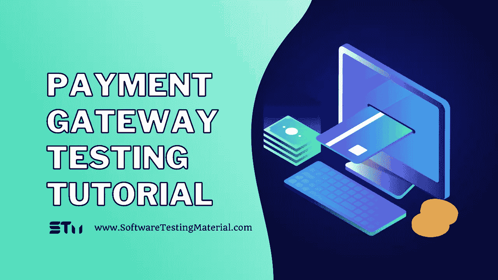

# 支付网关测试指南:如何测试支付网关功能

> 原文:[https://www . software testing material . com/payment-gateway-testing/](https://www.softwaretestingmaterial.com/payment-gateway-testing/)

这篇博文将涵盖什么是支付网关测试，如何进行测试以及以下内容

## **什么是支付网关？**

支付网关是一种帮助我们在线完成货币交易的服务，它接受信用卡、借记卡、网上银行和其他来自客户的支付方式来执行交易。

支付网关服务对卡号、CVV、密码、pin 码等敏感信息进行加密。这些都与电子商务平台整合在一起进行支付。

随着电子商务平台中数字支付的兴起，我们应该为客户提供安全和用户友好的支付网关，这些网关可以承受高负载而不会出现任何性能故障。支付网关的一些常见例子有 Paypal、Paytm、Razor pay、Instamojo 等。

## **为什么要测试支付网关？**

支付网关测试

*   确保客户在付款时体验顺畅。
*   确保客户向相应的网站成功付款。
*   检查、核对并减少客户在支付过程中可能面临的技术问题。
*   评估客户的数据是否易受外部第三方的攻击。
*   避免数据故障，保护我们客户的财务信息免受黑客攻击。
*   通过识别和修复安全事件来保护公司的声誉和诚信。
*   增加客户的信任和忠诚度
*   提高支付过程的速度、准确性和安全性。

## **支付网关测试中使用的基本术语是什么？**

**商家-** 商家是销售产品或服务的个人或[公司](https://www.softwaretestingmaterial.com/performance-testing-companies/)，他们可以是服务提供商、产品销售商、电子商务商店等。他们接受网上支付。

**收单银行-** 这是商户的银行，当客户通过支付网关付款时，金额将被记入收单银行。

**发卡行-** 发卡行是客户的银行，当商家收到付款时，将从发卡行扣除金额。

**交易-** 是在支付网关的收银台进行的支付。它生成一个唯一的 ID，称为交易 ID。

**授权-** 支付网关向客户账户(发卡行)发送授权请求，扣款。授权请求可能被发卡银行拒绝或批准。

**认证-** 是银行验证支付客户身份的方法，可以是 CVV、OTP、PIN、密码等。

> **不要错过:** [软件测试(A-Z)术语](https://www.softwaretestingmaterial.com/software-testing-terms/) & [100+软件测试类型](https://www.softwaretestingmaterial.com/types-of-software-testing/)

## **支付网关测试需要什么前提条件？**

*   收集虚拟借记卡/信用卡信息的[测试数据](https://www.softwaretestingmaterial.com/big-data-testing/)。
*   收集与我们将要测试的支付网关类型相关的信息。
*   最终确定支付网关流程性能测试的参数。
*   收集关于支付网关中可能出现的错误代码的信息，这样我们就可以知道错误是来自我们这边还是与支付网关有关。
*   建立一个沙盒环境来验证支付处理器，而无需实际支付金额。

## **如何测试支付网关的功能？**

在开始如何测试支付网关的功能之前，我们先来看看支付网关的交易流程是如何工作的。

**步骤#1:** 客户选择一个产品或服务，并获得支付页面。

第二步:他们输入信用卡的详细信息，如号码、CVV、有效期等。该信息被安全地传递到支付网关。

**步骤#3:** 支付网关在将数据发送给收单银行之前，会对卡的详细信息进行加密，并执行欺诈检查。

**步骤#4:** 收单银行将信息安全地发送到卡组织，进行另一次欺诈检查，并将其发送到发卡银行。

**步骤#5:** 发卡银行进行另一次欺诈筛查并授权交易。批准/拒绝消息通过卡方案发送给收单机构。

**步骤#6:** 支付网关接收该接受/拒绝消息，该消息将该消息传送给商家。如果付款获得批准，收单方从发行银行收取付款，并将资金存入商户账户。

现在我们知道了支付网关的工作原理，让我们看看如何测试它。

## **支付网关需要哪些类型的测试？**

### **#1。功能测试**

在支付网关中，我们对新的或不太成熟的系统进行功能测试。这是至关重要的，因为它确保系统功能齐全，其功能按预期运行。它有助于验证应用程序和网关。

> **延伸阅读:** [功能测试教程](https://www.softwaretestingmaterial.com/functional-testing/)

### **#2。安全测试**

安全测试确保支付网关在支付过程中保护其处理的数据。它保护系统免受网络攻击，黑客和其他安全漏洞。我们应该确保妥善处理客户提供的敏感信息。

> **延伸阅读:** [安全检测教程](https://www.softwaretestingmaterial.com/security-testing-tutorial/)

### **#3。性能测试**

在支付网关中，性能测试确保应用程序在大量用户同时提交支付时不会失败。这种类型的测试是至关重要的，尤其是在大销售或假日季节。它确保系统即使在负载很大的情况下也能正常工作。

> **延伸阅读:** [性能测试教程](https://www.softwaretestingmaterial.com/performance-testing-tutorial/)

### **#4。集成测试**

通常，电子商务平台或任何其他需要支付的应用程序都需要将支付网关集成到系统中。集成测试确保支付网关与商家网站无缝集成。在这里，我们测试订单下达、支付处理、订单确认，即所需的完整交易流程功能。

> **延伸阅读:** [集成测试教程](https://www.softwaretestingmaterial.com/integration-testing/)

## **支付网关测试的样本测试用例**

### **支付网关基于功能的测试用例**

*   如果可以，请检查每个付款选项是否可选，以及文本框是否可输入。
*   验证保存的信用卡/借记卡在支付页面上是否可用。
*   检查是否可以将卡设置为默认卡。
*   检查客户在成功/不成功支付后是否收到相应的通知邮件和文本。
*   验证支付完成后，支付网关是否重定向回应用程序。
*   检查金额、税收、折扣、商店积分等是否计算正确。
*   检查系统是否根据用户的请求更改了货币和语言格式。
*   检查当任何必填字段为空时，支付是否无法进行。
*   在支付过程中，当网络断开时，检查系统的行为。
*   检查是否有重复付款发生
*   验证卡号+到期日+ CVV 的有效和无效数据的不同组合。
*   检查每个支付选项是否被导向各自的支付流程。

### **支付网关基于性能的测试用例**

*   当几个用户试图同时完成一笔交易时，检查支付网关的性能。
*   检查处理器是否快速响应
*   检查应用程序到达支付网关的时间是否符合要求。
*   核实在退款过程中是否将相同的金额贷记给客户，同时检查退款的时间框架是否符合条款和条件。
*   检查交易细节是否以正确的格式在数据库中更新。

### **支付网关的基于 UI 的测试用例**

*   验证标签和盒子是否可见
*   检查进入时卡号是否被屏蔽。
*   检查支付网关公司标志/名称是否可见。
*   验证所有支付选项是否可见。
*   验证配色方案是否符合规格。
*   检查支付成功/失败时是否出现正确的信息。
*   检查促销代码、礼品卡、优惠券部分是否可见。
*   验证客户输入的所有错误是否都以红色突出显示。

### **支付网关基于安全的测试用例**

*   检查卡的详细信息是否被屏蔽。
*   检查敏感信息是否被加密。
*   检查应用程序是否不受跨站点脚本、欺骗等的影响。
*   核实网上交易是否发生在像 HTTPS 这样的安全渠道。
*   验证应用程序的所有防欺诈/安全设置。
*   从客户的银行详细信息中验证客户在启动交易时是否收到了 OTP。
*   此外，使用多个卡链接到同一个帐户中的不同电话号码来验证相同的场景。

## **支付网关清单**

*   检查您是否拥有支付网关所需的所有测试数据、各种重复的卡详细信息、银行 id、礼品卡等。
*   收集支付钱包的测试数据。
*   检查您是否有与错误代码相关的文档。
*   彻底验证所有基于支付的功能和设置。
*   确保所有弹出消息工作正常。
*   验证防欺诈措施运行良好。
*   检查会话到期情况。
*   检查应用程序和支付网关之间的集成。
*   检查支付网关在中断时的行为。

## **最佳支付网关列表**

1.  贝宝
2.  种类
3.  亚马逊支付
4.  尖叫吧
5.  2 结账
6.  Authorize.Net
7.  帕扎
8.  安全支付
9.  BlueSnap
10.  brain tree–paypal 服务
11.  RazorPay
12.  CCAvenue

## **结论**

支付是在线客户整体体验中最重要的一步。它包含了所有的敏感信息。即使是支付网关中的一个小问题也会让客户感到沮丧，并破坏品牌的声誉。所以你应该全面地计划，[彻底地测试，直到应用程序](https://www.softwaretestingmaterial.com/web-application-testing-tutorial/)完美无缺。

**相关帖子:**

*   电子商务测试指南:如何测试一个电子商务网站
*   [产品测试指南|您应该知道的内容](https://www.softwaretestingmaterial.com/product-testing/)
*   [最佳预约日程安排软件(免费和付费)](https://www.softwaretestingmaterial.com/appointment-scheduling-software/)
*   [人工智能和物联网是数字化转型的实际推动者](https://www.softwaretestingmaterial.com/ai-and-iot-are-the-practical-enablers-of-digital-transformation/)
*   [数据库测试教程-完全初学者指南](https://www.softwaretestingmaterial.com/database-testing/)