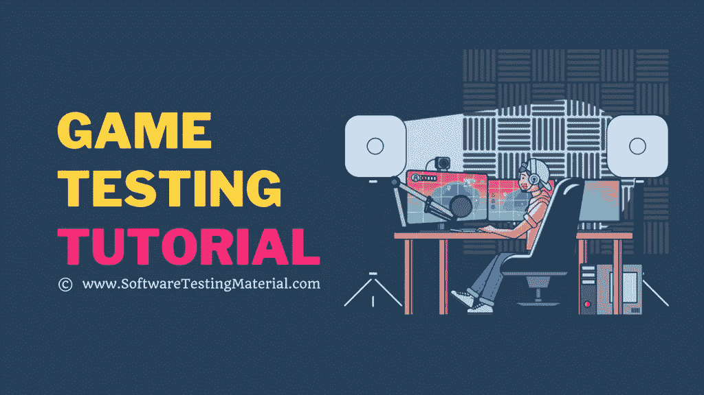

# 游戏测试 101——终极初学者指南

> 原文:[https://www.softwaretestingmaterial.com/game-testing/](https://www.softwaretestingmaterial.com/game-testing/)

这个终极**游戏测试教程**将教你如何开始一个令人兴奋的游戏测试新职业所需要知道的一切！全面了解需要什么，并从今天开始您的旅程。

在本游戏测试教程中，我们将学习什么是游戏测试以及下面的

<button class="kb-table-of-contents-title-btn kb-table-of-contents-toggle" aria-expanded="false" aria-label="Expand Table of Contents">目录</button>

*   [What is a game test?](#h-what-is-game-testing)
*   [Who is the game tester?](#h-who-is-a-game-tester)
*   [What is the life cycle of game development & Explain its stages?](#h-what-is-game-development-life-cycle-explain-its-phases)
    *   [#1。 Concept analysis](#h-1-concept-analysis)
    *   [#2。 Game planning](#h-2-game-planning)
    *   [#3。 Game development](#h-3-game-development)
    *   [#4。 Test](#h-4-game-testing)
    *   [5 号。预生产(Alpha/Beta)](#h-5-pre-production-alpha-beta)
    *   [# 6。 Pre-launch](#h-6-pre-launch)
    *   [#7。 Start](#h-7-launch)
    *   [[No.8]. Patch/upgrade](#h-8-patch-upgrade)
*   [What are the stages of the game testing life cycle?](#h-what-are-the-phases-of-the-game-testing-life-cycle)
    *   [#1。 Plan](#h-1-plan)
    *   [#2。 Prepare](#h-2-prepare)
    *   [#3。 Execute](#h-3-perform)
    *   [#4。 Report](#h-4-report)
    *   [#5。 Repair](#h-5-repair)
    *   [#6。 Repeat](#h-6-repeat)
*   [What roles are there in game development & to explain each role?](#h-what-are-the-roles-in-game-development-explain-each-role)
    *   [#1。 Artist](#h-1-concept-artist)
    *   [#2。 Animator](#2-animator)
    *   [#3。 Producer](#h-3-producer)
    *   [#4。 Project Manager](#h-4-project-manager)
    *   [#5。 Game programmer](#h-5-game-programmers)
    *   [#6。 Game designer](#h-6-game-designers)
    *   [#7。 The artist](#h-7-game-artists)
    *   [#8。 Grade 9 designer](#h-8-level-designer)
    *   [。 Tester](#h-9-game-testers)
    *   [#10。 Writing/Narrative Design](#10-writing--narrative-design)
    *   [#11。 Recorder](#11-sound-engineer)
    *   [#12。 Marketing/public relations](#12-marketing--pr)
*   [What are the types of game tests?](#h-what-are-the-types-of-game-testing)
    *   [#1。 Test](#h-1-functionality-testing)
    *   [#2。 Combination](#h-2-combinatorial-testing)
    *   [#3。 Clean room inspection](#h-3-clean-room-testing)
    *   [#4。 Test](#h-4-tree-testing)
    *   [#5。 Play](#h-5-play-testing)
    *   [#6。 Compatibility test](#h-6-compatibility-testing)
*   [How is the game test different from other software tests](#h-how-game-testing-is-different-from-other-software-testing)
    *   [Game test vs software test](#h-game-testing-vs-software-testing)
*   [How to test a game?](#h-how-do-you-test-a-game)
    *   [Step #1: Collect requirements](#h-step-1-gather-the-requirement)
    *   [Step #2: Prepare test strategy](#h-step-2-prepare-the-test-strategy)
    *   [Step #3: Design test case](#h-step-3-design-test-cases)
    *   [Step #4: Execute test case](#h-step-4-execute-test-cases)
    *   [Step #5: Record the result](#h-step-5-record-the-results)
        *   [Sample game test case](#h-sample-game-testing-test-cases)
        *   [Game Test List](#h-game-testing-checklist)
    *   [What are the bug types of in-game testing?](#h-what-are-the-types-of-bugs-in-game-testing)
        *   [#1。 Collapse](#h-1-crash)
        *   [#2。 General](#h-2-general)
        *   [#3。 Minor](#h-3-minor)
        *   [#4。 Serious](#h-4-severe)
        *   [#5。 Graph](#h-5-graphics)
        *   [#6。 Sound](#h-6-sound)
        *   [#7。 Collision](#h-7-collisions)
    *   [What are the risks of game testing?](#h-what-are-the-risks-in-game-testing)
    *   [Conclusion](#h-conclusion)

随着游戏行业的快速发展，游戏测试的范围也越来越广。根据 Statista 的研究，预计 2025 年全球游戏市场将达到每年 2688 亿美元，高于 2021 年的 1780 亿美元。

<figcaption>Source: [Statista](https://www.statista.com/statistics/292056/video-game-market-value-worldwide/)</figcaption>

为了跟上游戏行业的发展和变化，各公司正在相互竞争，以满足用户的需求并预测未来的趋势。

## **什么是游戏测试？**

游戏测试是发现游戏应用程序中的错误和偏差的过程。

它确保应用程序在市场上部署时没有错误。

游戏测试的主要目标是交付高质量的产品。

如果游戏有瑕疵，将会招致用户的强烈批评，从而导致销量大幅下降

## **谁是游戏测试员？**

游戏测试员是指通过多次玩游戏来测试视频游戏，以发现游戏中的错误、错误或故障的人。

作为一名游戏测试人员，您需要在不同的场景中反复玩和测试游戏，并记录错误以及如何重现这些问题。

你应该熟悉所有的游戏平台、硬件和类型，比如 Xbox、Playstation、Nintendo Wii 和 PC 平台。知道如何玩角色扮演游戏、大型多人在线游戏、动作游戏和学习游戏。

既然你知道了什么是游戏测试，谁是游戏测试员。我们来看看什么是**游戏测试生命周期**和**游戏开发生命周期**。

> ***不要错过:**如何成为游戏测试员——详细指南*

## 什么是游戏开发生命周期&解释它的阶段？

在进入游戏测试生命周期(GTLC)之前，让我们看看游戏开发生命周期，以便更好地理解。

游戏开发生命周期(GDLC)不同于[软件开发生命周期(SDLC)](https://www.softwaretestingmaterial.com/sdlc-software-development-life-cycle/) 。

通常，开发软件是为了解决问题，而开发游戏是为了娱乐。

### **#1。概念分析**

在这个计划阶段，我们会仔细检查游戏的想法或概念。为了理解游戏的概念，我们将通过故事板，设置和环境。这个过程在程序员、设计师和美工开发游戏的后期会很有帮助。

### **#2。游戏策划**

一旦我们最终确定了概念，我们就创建三个文档来继续开发过程。

游戏设计文档(GDD) :它包含了关于用户界面、特性、角色、图形、声音等等的细节。

**技术设计文档:**包含使用的编程语言、工具、软件、系统中可重复使用的组件等细节。

项目计划:它包含计划细节，如时间表、预算、里程碑、可交付成果等。

### **#3。游戏开发**

基于文档和评论，我们构建了一个原型。一旦得到团队的批准，程序员就开始开发应用程序。游戏设计者和艺术家创建游戏的用户界面、环境和音效。

### **#4。游戏测试**

测试是 GDLC 的关键阶段。它包括严格测试游戏的每一个场景，并记录下你遇到的每一个缺陷。我们执行多种可能性来发现 bug，而不仅仅是评估游戏是否吸引人和好玩。

### **#5。预生产(阿尔法/贝塔)**

在阿尔法里程碑，我们将有一个可行的游戏版本，所有的主要功能和人物设置，一些资产可能是暂时的。我们测试产品并获得主管的批准。

然后，我们修复在 alpha 阶段发现的问题，并在 Beta 版本中开发所需的资产。在这里，管理层可能决定使用实时用户来测试应用程序，以了解他们的体验。

### **#6。预发布**

在这种预发布状态下，在测试版中发现的错误得到解决，并准备好投放市场。

### **#7。发射**

在这个阶段，我们向市场发布游戏。所有的最后更新和润色都发生在发布日期之前。

### **#8。补丁/升级**

这个阶段属于后期制作，在这里我们修复一些 bug，修补那些问题，升级内容，引入新的关卡，等等。

## **游戏测试生命周期有哪些阶段？**

游戏测试生命周期是游戏开发生命周期的一部分，GTLC 由 6 个阶段组成。它就像创建您要做的事情的初始计划、准备测试环境一样简单。开始执行测试，报告 bug，等待它们被修复，然后重复这个循环。

游戏测试分为 6 个阶段，解释如下:

### **#1。计划**

在这个阶段，您将收集关于新特性、已修复的旧错误、新补丁以及构建中其他元素的信息。然后，您决定其他方面，如谁将参与测试，收集所需的设备，以及设置测试区域

### **#2。准备**

在准备阶段，您将获得来自不同团队的正确信息和资源。代码、测试文档和测试环境由它们各自的所有者更新。开发团队向 QA 团队更新构建中已经修复的 bug。

### **#3。执行**

在这个表演阶段，你将开始大范围搜寻 bug。您必须重新测试旧的错误，并测试其他方法来重现它们。如果你发现了一个缺陷，多围绕这个 bug 进行测试，收集更多关于这个 bug 的信息，写出一份详细而精确的 bug 报告。

### **#4。报告**

在报告阶段，您必须为您在测试时发现的错误构建报告。你应该详细地写下你在哪里发现了这个 bug，如何重现它，并确保它被传递给修复它的人。

例如，如果纹理加载不正确，必须将其分配给建模器。

### **#5。修理**

在修复阶段，你必须与开发团队合作来修复 bug。您必须参与到与开发人员的讨论中，以确保他们了解哪里出了问题，以及修复 bug 所需的其他信息

### **#6。重复**

在这个阶段，您重复从阶段 1 开始的相同过程。您将获得一个更新的版本，其中包含新功能和错误修复。这个过程重复进行，直到游戏应用在市场上发布。

## **游戏开发中有哪些角色&解释每个角色？**

基于各种因素，如公司的规模，预算，功能，故事，等等，角色可以有所不同，这里有一些游戏开发中的关键角色。

### **#1。概念艺术家**

概念艺术家的角色需要他们为游戏创造一个初始的外观和基调。他们创造了一个视觉表现的想法，在艺术部门讨论的早期发展阶段。

### **#2。动画师**

动画师使用 3D 艺术家创建的模型，并附加一个结构使模型在游戏中移动。动画师为每个模型添加更多的动作，并创建各种动画。

### **#3。制片人**

游戏制作人的职责包括处理游戏的商业和营销方面，如预算管理。

### **#4。项目经理**

他们监督开发过程，确保项目达到每个里程碑。项目经理处理设计团队和执行人员之间的沟通，并确保他们解决问题和计算潜在的风险。为了确保顺利的发布过程，产品经理必须监控和解决各种店面的需求，如本地化、评级、元数据和商店艺术。

### **#5。游戏程序员**

程序员为游戏开发代码以使其流畅运行。他们创建用户界面、图形，包括程序的逻辑，给游戏添加音乐，为用户开发最佳体验。

### **#6。游戏设计师**

他们负责创造故事情节、角色、对话、剧本和游戏规则。他们是设计障碍和建立游戏难度的人。

### **#7。游戏艺术家**

他们包括开发游戏用户界面的声音设计师、音频工程师、动画师、3D 艺术家等。

### **#8。关卡设计师**

他们参与游戏的世界建设，他们创造环境，建立界限，保持一贯的风格，设置物理限制，所有这些都基于概念艺术和游戏设计文档。

### **#9。游戏测试人员**

他们多次玩这个游戏，并对发现的 bug 做详细的报告。他们测试游戏，以确保玩家在玩游戏时不会遇到任何故障或问题。游戏测试员也被称为质量保证测试员。

### **#10。写作/叙事设计**

编剧为玩家创作文本，供他们在屏幕上阅读，也用于画外音。叙事设计师是工作室工作的一个新成员，他们使用工具让玩家通过身临其境的叙事元素进步，并帮助塑造他们的体验。

### **#11。音响工程师**

音响工程师(通常被称为音响设计师或音频工程师)是专门从事游戏中语音编辑和音频合并的人。他们还负责音效的复杂细节，比如确保它们与背景音乐相协调。

### **#12。营销/公关**

营销对任何企业来说都是至关重要的一部分，现在许多公司内部都有营销人员。新闻稿由公共关系经理处理，而社区经理负责社交媒体和其他社区渠道等领域。

## **游戏测试有哪些类型？**

### **#1。功能测试**

在游戏测试中，执行功能测试意味着根据给定的规范验证应用程序的可工作性。这通常有助于发现资产完整性、GUI、音频-视频同步等一般性问题。这是一种黑盒测试技术。

***关键特性:***

*   检查应用程序是否按照需求文档运行
*   它验证图形设计，视听效果，游戏性问题，所以它需要很多时间，有时会变得复杂。
*   验证各种场景，如安装、社交共享、支付网关支持、是否在最小化模式下工作等。

### **#2。组合测试**

它是一种测试技术，使用输入参数的多种组合来验证应用程序的每种可能组合和边界。

组合测试非常适用于游戏测试，因为它可以提高效率，提供更好的质量，降低成本等。

***关键特性***

*   用每一种可能的参数组合来验证应用程序，如游戏功能、元素、事件、设置、游戏选项、角色属性、定制选项等。
*   它使用这三种方法:类别划分测试、成对测试和基于目录的测试。从而生成用于测试的组合。
*   由于这种系统化的方法，我们可以很容易地生成易于遵循的报告。

### **#3。洁净室测试**

它有助于确保游戏软件的性能和可靠性。您可以使用洁净室测试技术来确定 bug 和小错误背后的主要原因。

***关键特性***

*   这里，编程在正式规范之后开始。
*   它是数学推理、设计改进和统计推理的结合，同时生成测试用例。
*   洁净室测试的主要目标是生产缺陷可以忽略的软件。

### **#4。采油树测试**

这是一种类似于可用性测试的游戏测试方法，它帮助我们组织测试用例，并为给定的代码变更集合选择更适合的测试集合。

***关键特性***

*   它可以在设计页面布局或导航菜单之前进行。
*   它提高了对游戏中复杂特性的整体理解
*   不需要绘制线框或准备任何测试内容，它只需要任务和树，即指令和菜单。
*   它关注潜在的偏差，尤其是当功能与其他游戏规则、功能和其他元素交互时。

### **#5。播放测试**

这是一种游戏测试技术，测试人员作为真实用户玩游戏来分析游戏应用程序的质量。在这里，您可以玩游戏的未完成版本，以验证游戏的功能性工作流程以及非功能性方面，如娱乐价值、难度级别、关卡设计等。

***关键特征***

*   它专注于判断游戏而不是寻找应用程序中的 bug。
*   它检查游戏是否结构良好，是否以角色为中心。
*   它验证了有趣的元素，挑战，故事情节，看看它是否是创新的，吸引人的和以玩家为中心的。

### **#6。兼容性测试**

这是游戏应用程序中最关键的因素，它应该在不同的设备和不同的屏幕尺寸上工作，而不影响用户体验的质量。

游戏应用程序应该兼容各种设备，或者即使是 Xbox 这样的单一设备，所有版本的应用程序都应该一致。

***关键特性***

*   它通过比较不同屏幕尺寸的设计、文本和功能来验证应用程序的用户界面。
*   它检查应用程序在不同操作系统、浏览器和设备下的性能。
*   它确认了应用程序在不同平台上的稳定性、可工作性、可伸缩性和可用性。

除了这些测试技术之外，游戏测试技术实现还包括特别测试、本地化测试、性能测试、浸泡测试、恢复测试、安全测试等。

## **游戏测试与其他软件测试有何不同**

### **游戏测试 vs 软件测试**

| 游戏测试 | 软件测试 |
| --- | --- |
| 游戏测试不使用很多自动化脚本。 | 在软件测试中，自动化脚本和框架被广泛使用。 |
| 游戏测试不需要太多的技术或专业知识。 | 软件测试只能由熟练的专业人员来完成。 |
| 测试员不需要专业学位就能成为游戏测试员。 | 测试人员应该满足一定的资格才能成为软件测试人员。 |
| 游戏行业高度依赖硬件平台，因此测试在控制台、PC、移动设备、网站和应用程序，甚至社交媒体以及各种屏幕尺寸和操作系统中进行。 | 在软件测试中，它依赖于特定的客户端或客户，所以一般来说，它会在 PC 和移动设备上进行测试。 |

## 如何测试一款游戏？

下面是一步一步的测试游戏的过程

### **步骤#1:收集需求**

你必须收集和理解细节，如故事板，建筑，游戏中涉及的角色，游戏背后的概念，适用的规则和阶段。

### **步骤#2:准备测试策略**

您必须做出决策并记录细节，如所需的时间表、测试人员、测试周期的数量、范围内、范围外、测试类型、基于风险的测试分析、服务水平协议、风险和缓解、缺陷记录过程、报告过程。

### **步骤#3:设计测试用例**

您应该考虑正面和负面的测试案例。测试游戏应用的一些有效方法是关键路径测试、异常路径测试和基本黑盒测试技术。

### 步骤#4:执行测试用例

在这里，执行测试用例来发现 bug。为了获得更好的结果，进行了 alpha 测试、beta 测试和相应的年龄组测试。

### **步骤#5:记录结果**

一切都以视频和截图的形式记录下来，以便更好地了解应用程序的使用情况。这些细节得到应用程序行为的分析。

### **步骤#6:维护缺陷日志**

这对于记录、审查、区分优先级、分类和有效地跟踪 bug 非常有帮助。

## **如何为游戏编写测试用例？**

测试游戏应用时，需要关注某些关键领域，这些领域会直接影响性能兼容性和用户评级。所以我们必须基于这些重要的因素来创建测试用例。

*   用户界面和功能
*   图形性能
*   可用性和游戏体验
*   多人游戏功能
*   社交媒体整合
*   担保和其他负债

### **示例游戏测试用例**

*   验证背景音乐和声音效果。
*   验证动画的清晰度。
*   验证角色动作的流畅性
*   验证分数计算的准确性。
*   验证应用程序的菜单和主页
*   验证游戏中的内容

### **游戏测试清单**

*   检查声音效果是否与动作同步。
*   检查游戏在纵向和横向模式下的功能是否一致。
*   检查应用程序的入职视觉效果。
*   检查动画、动作、角色和设定的质量。
*   检查对话、描述、消息、通知等内容。
*   查看玩家档案、记分牌、排行榜和其他社区活动等功能。
*   检查在不同应用程序之间切换时游戏是否恢复。
*   检查游戏逻辑和应用程序的人物和背景的连续性。
*   重新启动应用程序后，检查数据是否被存储和检索。
*   检查应用程序的安装，应该没有任何错误。

## **游戏内测试的 bug 类型有哪些？**

我们知道没有一个应用程序是没有错误的，这同样适用于游戏。但是在游戏领域要付出更高的代价，因为每个错误都会影响用户的体验。

### **#1。崩溃**

这是当游戏冻结或停止和关闭。它极大地影响了用户体验，因此这些错误具有最高的优先级。

### **#2。常规**

它不会阻止用户继续游戏，但仍然会扰乱游戏的工作流程。

### **#3。次要**

这些都是微不足道的错误，不会影响游戏的任何其他方面，但会影响用户的体验，比如说角色头像不能改变发型。

### **#4。严重**

在这种情况下，玩家的移动可能会被阻止，或者某些功能如跳跃、躲避或拿武器可能不会发生，除非整个系统崩溃。

### **#5。图形**

游戏中任何用户界面元素的角色、物体和背景都可能出现问题。

### **#6。声音**

这是当声音被延迟，错过，放错地方，或者当音量变化不一致等等。

### **#7。碰撞**

这些有缺陷的设计在游戏的 3d 世界中相互重叠或碰撞。

## **游戏测试有哪些风险？**

游戏行业是一个高利润的行业，但是开发和在市场上发布的成本很高。发布该产品存在巨大的风险，因为它必须符合游戏社区的质量标准。

游戏应用程序失败的原因有很多。以下是执行游戏测试有风险的一些原因。

*   游戏应用程序很复杂；测试每一种可能的排列和组合既昂贵又冗长，而且人力不可能做到。
*   如果游戏不能为用户创造引人入胜的体验，也就是说，如果它不好玩，不容易上瘾，那么失败的可能性很大。
*   甚至音乐、独特的故事情节、人物、竞争力和美学等非技术方面也对其成功发挥了巨大作用。
*   并不是每个公司都有足够的预算来组建庞大的测试团队、工具和设备。
*   视觉设计、游戏体验、易用性和控制必须吸引目标受众。

## **结论**

游戏测试对于游戏的成功来说是非常重要和不可或缺的。

游戏测试员的角色是玩完整个游戏，以开放的心态尝试所有的功能；寻找设计中乍一看可能不明显的缺陷或错误。

对于游戏测试人员来说，重要的是不仅要了解人们如何玩游戏，还要了解他们需要从你的游戏体验中得到什么，这样他们才能给你关于游戏效果和满意度的反馈。

有几种类型的游戏可以测试——手机游戏、PC/网络游戏、VR 游戏(虚拟现实)、主机视频游戏。现在连 AR(增强现实)都有了！

如果你有兴趣成为一名视频游戏测试员，请继续阅读我们的博客文章，看看需要什么以及在哪里可以找到空缺。

**相关帖子:**

*   [如何成为一名游戏测试员](https://www.softwaretestingmaterial.com/how-to-become-a-game-tester/)
*   [游戏测试面试问题&答案](https://www.softwaretestingmaterial.com/game-testing-interview-questions/)
*   [如何成为一名软件测试员](https://www.softwaretestingmaterial.com/how-to-become-a-software-tester/)
*   你为什么选择软件测试作为职业？
*   [从手工测试到自动化测试的职业转变](https://www.softwaretestingmaterial.com/career-shift-from-manual-to-automation-testing/)
*   [公司众包测试指南&测试人员](https://www.softwaretestingmaterial.com/crowdsourced-testing-guide/)
*   [15+最佳 Windows 10 视频播放器 Windows PC 媒体播放器](https://www.softwaretestingmaterial.com/video-player-windows/)
*   [10+最佳 Mac 视频播放器 Mac OS 媒体播放器](https://www.softwaretestingmaterial.com/video-player-mac/)
*   【Windows PC 最佳安卓模拟器& Mac(免费和付费)
*   [带示例的 Git 初学者教程](https://www.softwaretestingmaterial.com/git-tutorial/)