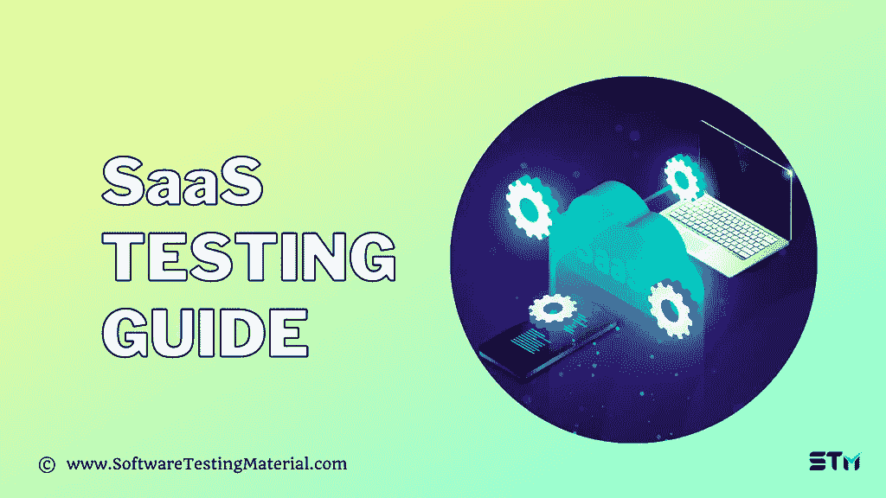

# SaaS 测试指南:你应该知道什么

> 原文:[https://www.softwaretestingmaterial.com/saas-testing/](https://www.softwaretestingmaterial.com/saas-testing/)

如果你刚刚开始学习 SaaS 测试的概念，这是了解什么是 SaaS，什么是 SaaS 测试和以下内容的地方。

*   什么是 SaaS？
*   SaaS 有哪些例子？
*   SaaS 在测试什么？
*   [选择 SaaS 测试的原因:](#h-reasons-behind-opting-for-saas-testing)
*   [SaaS 测试挑战](#h-saas-testing-challenges)
    *   [但是，SaaS 用户应该按照以下步骤应对这些挑战:](#h-however-a-saas-user-should-address-these-challenges-by-following-some-steps)
*   [按照惯例测试 SaaS 产品:](#h-follow-the-practices-to-test-saas-products)
*   [SaaS 测试工具:](#h-saas-testing-tools)
    *   [实践测试:](#h-practitest)
    *   [qTest:](#h-qtest)
    *   [测量值:](#h-qmetry)
*   [结论:](#h-conclusion)

## 什么是 SaaS？

软件即服务，也称为 SaaS，是一种基于云的服务，软件供应商通过互联网提供应用程序即服务。

它是基于订阅的(比如说 SaaS 用户订阅应用程序而不是购买它)，并且不需要安装和维护复杂的软件和硬件。软件供应商确实负责托管和维护服务器、数据库和应用程序代码。用户可以通过网络浏览器和互联网连接从任何兼容设备登录并访问 SaaS 应用程序。

SaaS 应用程序也称为基于云的软件、基于网络的软件、按需软件或托管软件。

## SaaS 在测试什么？

进行 SaaS 测试是为了确保使用软件即服务模型构建的应用程序能够按预期运行。做 SaaS 测试的测试人员应该做功能测试和非功能测试。

因此，我们需要遵循以下测试类型来测试 SaaS 应用程序。

*   功能测试
*   性能试验
*   安全测试
*   负载测试
*   压力测试
*   兼容性测试
*   可靠性测试
*   可扩展性测试
*   网络测试
*   可用性测试
*   集成和迁移测试

## **选择 SaaS 测试的原因:**

人们认为 SaaS 提供了最敏捷、最高效的产品。SaaS 应用程序测试是对 SaaS 软件的验证，以了解其性能、安全性和兼容性。除了质量检查，以下是你应该去 SaaS 测试的一些原因。

*   成本节约
*   更好的可扩展性
*   易于恢复
*   更好的可达性
*   资源扩展和定价方面的卓越弹性
*   SaaS 应用程序开发的升级和安装过程非常简单明了。

## **SaaS**T2【测试挑战

在运行测试时，用户肯定会面临一些挑战。对于不同种类的测试，这些挑战是不同的。以下是用户自然面临的一些挑战。

*   在很短的时间内升级和发布并不能提供充足的时间来检查应用程序的可靠性、效率和安全性。
*   与应用程序的用户界面相关联的后端组件经常需要进行验证。
*   许多用户行为和个人细节出现在这个地方。因此，很难完全保密客户的详细信息。
*   SaaS 应用程序需要对应用程序的性能进行测试，但这方面的实际挑战和压力是确定最常用的领域，并对来自不同地方的大量用户进行测试。
*   在集成和迁移 SaaS 应用程序的时候，保持测试材料的完整性和流动性变得非常困难。

每当有一个新的发布，SaaS 测试人员必须测试所有的许可因素，包括应用程序的用户数量、使用和功能。

这里不太可能有标准的应用程序。

### **但是，SaaS 用户应该按照以下步骤应对这些挑战:**

1.  可以激活自动化来避免频繁更新和安装的危险。
2.  根据观察结果，确定经常访问的应用程序领域。当有时间限制时，这将有助于改进性能测试。

用户应该在集成时选择强加密，以保证数据的安全。

## **按照惯例测试 SaaS 产品:**

*   人们应该留出资源和时间来衡量 SaaS 应用程序的性能。
*   用户还需要确保 SaaS 能够工作的环境和工作环境。
*   用户和客户是你需要满足的主要人群。你的产品的设计应该是这样的，在系统崩溃的时候，客户不会遭受太多的损失。你需要有一个替代计划来为你的客户进行这个项目。
*   随着频繁的发布，在每个发布中留出一些时间进行探索性测试，这有助于获得新的测试用例和 bug。
*   性能升级测试是非常必要的。频繁升级和更改 SaaS 应用平台的数据迁移测试也至关重要。
*   通常有必要与第三方 API 建立连接。这有助于恢复用户的效率、性能和安全性。您需要为您的测试自动化工作设置一个评估。当执行一项任务时，只需根据完成测试所需的时间来设置警报。
*   用户必须事先知道他将使用哪些工具进行 SaaS 测试。

## **SaaS 测试工具:**

SaaS 测试是一个严格的过程，需要大量的时间和精力来执行。应该注意 SaaS 应用程序测试所需的信息和步骤。SaaS 测试需要四个基本工具。

### **实践测试:**

PractiTest 是一个端到端的 SaaS 测试管理平台，它将您所有的 QA 工作、流程、团队和工具集中到一个平台中，以桥接孤岛、统一沟通，并在您的组织中实现一个真实的来源。

借助 PractiTest，您可以根据可定制报告、实时仪表板和动态过滤器视图提供的端到端可见性，做出明智的数据驱动型决策。

提高团队的生产力；重用测试元素以消除重复任务，基于人工智能生成的见解规划团队的工作，并使您的团队专注于真正重要的事情。

PractiTest 帮助您将测试操作与业务目标相结合，并更快地交付更好的产品。

### **qTest:**

*   它允许测试人员添加注释和记号来创建一个详细的缺陷表。
*   它提供了一个易于访问的仪表板。
*   qTest 提供了可扩展的测试解决方案和轻松的通信。这也是一种基于云的测试技术。
*   人们可以与其他用户分享这个工具，并可能获得免费试用。
*   人们可以设法跟踪项目、过程和测试结果。

### **测量值:**

度量是项目需求、过程和缺陷之间的联系。人们可以跟踪测试的整个执行过程。该工具提供了一些功能:

*   测试的过程和结果非常清晰，人们可以记录结果。
*   通过执行页面，测试用例可以被实时修改。
*   旧的测试用例可以在当前测试中重用。这提供了很大的灵活性。
*   很容易找到并管理在之前的测试参数中解决的问题。

程序每次都可能不同。为了获得清晰的测试结果，QMetry 可以帮助消除以前的登录。管理好基础工具很有必要。我们还需要跟踪各种 SaaS 平台。

## **结论:**

像所有其他企业一样，SaaS 也是为利润动机而建立的。因此，与最大数量的客户保持联系应该是 SaaS 应用程序开发者的首要目标。供应商必须注意他销售的产品的质量。SaaS 测试是一个总括项目，在这个项目下，相当多的任务被快速连续地执行。这些包括安全性、负载、性能、跨浏览器和功能测试。随着云测试的出现，SaaS 测试有了进步。到目前为止给出的全部建议对于有效地执行 SaaS 测试非常有帮助。

**作者简介:** Harikrishna Kundariya，营销人员、开发人员、物联网、聊天机器人&区块链专家、设计师、联合创始人、移动应用开发公司 eSparkBiz Technologies 董事。他的 8+经验使他能够为基于物联网和聊天机器人的新创企业提供数字化解决方案。

**关注他:** [网站](https://www.esparkinfo.com/)，[推特](https://twitter.com/eSparkBiz)，[脸书](https://www.facebook.com/esparkbiz)， [LinkedIn](https://www.linkedin.com/in/harikrishna-kundariya-7a71693a/)

这篇文章最近由 STM 管理员更新。

**相关帖子:**

*   [Salesforce 测试指南](https://www.softwaretestingmaterial.com/salesforce-testing/)
*   [SOA 测试指南](https://www.softwaretestingmaterial.com/soa-testing/)
*   [最佳性能测试工具(负载测试工具)](https://www.softwaretestingmaterial.com/performance-testing-tools/)
*   [最佳 Web 应用测试工具](https://www.softwaretestingmaterial.com/web-application-testing-tools/)
*   [开发人员需要克服的最重要的移动应用测试挑战](https://www.softwaretestingmaterial.com/mobile-app-testing-challenges/)