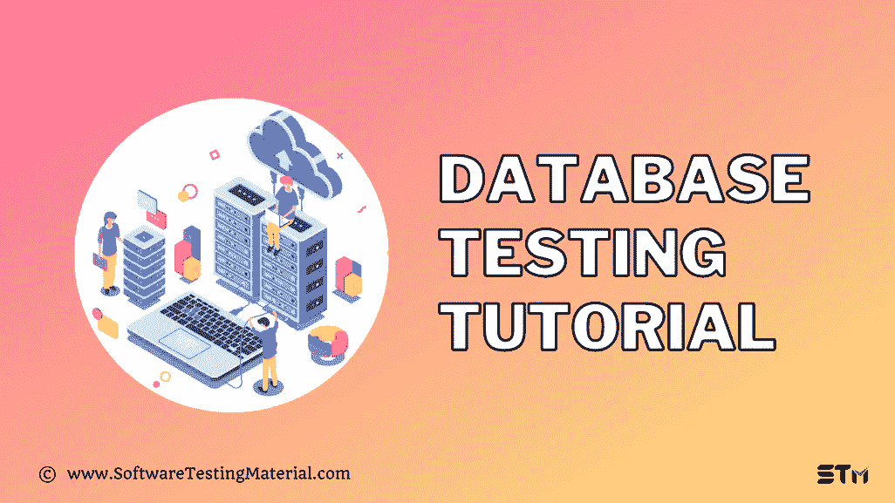

# 数据库测试教程——完全初学者指南

> 原文:[https://www.softwaretestingmaterial.com/database-testing/](https://www.softwaretestingmaterial.com/database-testing/)



在这个数据库测试指南中，我们将讨论你需要知道的关于数据库测试的一切。


*   [什么是数据库测试？](#h-what-is-meant-by-database-testing)
*   数据库测试的好处是什么？
*   [有哪些不同的数据库测试类型？](#h-what-are-the-different-database-testing-types)
    *   [#1。结构测试](#h-1-structural-testing)
    *   [#2。功能测试](#h-2-functional-testing)
    *   [#3。非功能性测试](#h-3-non-functional-testing)
*   数据库测试期间需要检查哪些因素？
    *   [数据映射](#h-data-mapping)
    *   [数据完整性](#h-data-integrity)
    *   [业务规则的准确性](#h-accuracy-of-business-rules)
    *   [交易属性](#h-transaction-properties)
    *   [数据库模式](#h-database-schema)
    *   [交易](#h-transactions)
    *   [存储过程](#h-stored-procedure)
    *   [字段约束](#h-field-constraints)
    *   [触发器](#h-triggers)
*   你如何进行数据库测试？
*   [如何编写数据库测试的测试用例？](#h-how-do-you-write-test-cases-for-database-testing)
    *   [样本测试用例:](#h-sample-test-cases)
*   我们如何自动化数据库测试？
*   哪些工具用于数据库测试？
*   [数据库测试的优势是什么？](#h-what-are-the-advantages-of-database-testing)
*   [数据库测试的缺点是什么？](#h-what-are-the-disadvantages-of-database-testing)
*   [数据库测试的实时例子。](#h-real-time-examples-of-database-testing)


## **什么是数据库测试？**

数据库测试通过验证模式、表、触发器等来检查数据的完整性和一致性。正在测试的应用程序数据库的。在数据库测试中，我们创建复杂的查询来对数据库执行负载或压力测试，并验证数据库的响应性。

数据库中的问题可能会导致崩溃或数据泄露，我们知道保护用户数据隐私的重要性。因此，执行数据库测试以确保数据完整性、一致性等是至关重要的。，正在维护。

通过执行数据库测试，我们可以保证应用程序的安全性和可靠性，因为它暴露了数据库中的 T2 漏洞。

*   结构测试
*   功能测试
*   非功能测试


您还应该确保您的测试涵盖数据库活动，如数据完整性、数据有效性、触发器和数据库中的功能。

### **#1。结构测试**

*   结构化数据库测试处理最终用户无法访问的测试组件。
*   结构化测试验证主要用于存储的数据存储库中的组件，如表和列测试、存储过程和视图测试、检查触发器等。
*   要执行这个测试，您应该掌握大量的 SQL 查询知识。

#### **模式测试**

*   数据库中的模式测试确保应用程序的后端和前端的模式映射是相似的，并验证各种模式格式。
*   该模式表示整个数据库的逻辑视图，即我们的数据库的映射，因此它为实际的查询过程提供了方向，使我们能够获取准确的数据。
*   模式测试包括验证与数据库相关的几种模式格式，它还有助于发现数据库中未映射的对象，如表、视图、列等。
*   它还验证环境中的异构数据库与整个应用程序映射的一致性。
*   模式测试也称为映射测试。

#### **数据库/列测试**

*   在数据库/列测试中，我们将验证数据库的结构及其特性列，并验证它们是否一致。
*   它验证系统后端和用户界面的所有应用程序级别上的字段长度和命名约定是否匹配。
*   它还检查是否必须考虑任何未使用或未映射的表和列，并验证它们的存在。
*   它通过检查应用程序后端的数据类型和数据长度来验证用户界面摘要视图的效率和正确性。
*   它检查主键和外键是否有各自的表，以及它们是否按照域标准设置。
*   甚至还应该考虑 not null 或其他独特的特征。

#### **触发测试**

*   触发测试验证数据库代码工作的过程流，并确保它没有错误。
*   它验证应用程序中的更新、插入、删除触发器等功能。
*   检查，触发器是否被执行，满足要求的条件。
*   执行触发器时验证数据更新。
*   测试人员必须确保在触发器的编码阶段遵循编码惯例。

#### **存储过程和视图测试**

*   在这种类型的测试中，它检查所有存储过程的编码标准、异常和错误处理。
*   它通过在应用程序中应用适当的数据来确保条件、循环和其他功能包含在编码中。
*   它检查从数据库的相应表中提取数据时，是否正确应用了 TRIM 操作。
*   它根据需求验证存储过程模块的整体集成。
*   验证错误处理和异常过程。

#### **表格和列测试**

*   它检查数据库中数据类型的应用程序字段值的前端。
*   它将数据字段的长度与数据库中应用程序数据类型的长度进行比较。
*   它检查数据库中是否有任何未映射的表或列。
*   它验证数据库表和列中的命名约定是否符合业务需求。
*   它按照要求检查数据库中给定的键和索引(主键和外键)。
*   它验证主键和相应的外键之间的关联。
*   它检查是否维护了唯一键和非空键的特征。
*   它验证键和索引的长度和数据类型。

#### **数据库服务器验证**

*   它检查数据库的服务器配置是否符合业务需求。
*   它确保用户只能执行所需的特定级别的操作。
*   它确保数据库服务器能够处理基于业务需求规范所允许的最大数量的用户事务。

#### **按键和索引测试**

*   它检查数据库的主键和外键约束。
*   它验证表中的外键引用。
*   它检查键和索引是否基于命名约定。
*   它验证必填字段的大小和长度。
*   它确保在所需的表中创建的聚集索引和非聚集索引符合业务需求。

### **#2。功能测试**

功能测试关注的是最终用户在应用程序中执行的事务和操作等功能。它确保这些功能符合业务需求。

#### **黑盒测试**

*   数据库中的黑盒测试包括检查数据完整性和基本功能。
*   该测试中的测试用例包括在执行功能时验证传入和传出的数据。
*   该测试使用各种技术，如边界值分析、等价划分、因果图绘制技术等，来测试数据库中的功能。
*   黑盒测试相对简单且成本低廉，可以在测试的早期阶段进行。
*   这里的主要缺点是，只能发现一些错误，而且我们不知道应该测试多少。

> **必读:** [黑盒测试](https://www.softwaretestingmaterial.com/black-box-and-white-box-testing/)

#### **白盒测试**

*   数据库中的白盒测试侧重于用户不知道的内部结构和规范细节。
*   它处理检查支持数据重构的数据库触发器和逻辑视图。
*   在该测试中，通过进行模块测试来验证数据库功能、触发器、视图、SQL 查询等。
*   它有助于验证数据库表、数据模型、数据库模式等。，甚至检查参照完整性的规则。
*   它通过选择默认的表视图来检查应用程序的数据库一致性。
*   这种测试使用各种技术，如条件覆盖、决策覆盖、语句覆盖等。验证数据库的内部级别编码。
*   关于白盒测试最好的部分是它检测编码错误，这有助于消除数据库中的内部错误。
*   但是白盒测试不包括 SQL 语句。

> **必读:** [白盒测试](https://www.softwaretestingmaterial.com/white-box-testing/)

### **#3。非功能性测试**

非功能性测试执行负载测试、压力测试、检查满足业务规范的最低系统要求、检测风险以及优化数据库的性能。

#### **负载测试**

*   负载测试验证数据库中运行最多的事务的影响，它检查此类事务的性能影响。
*   它检查远程多个用户执行转换的响应时间。
*   它验证从数据库中获取特定记录所花费的时间。

> 查看我们关于[负载测试](https://www.softwaretestingmaterial.com/load-testing-tutorial/)的详细指南

#### **压力测试**

*   压力测试有助于识别系统的断点。
*   它通过加载应用程序直到系统失败来找到这个断点。
*   LoadRunner 和 WinRunner 通常用于压力测试。

> 查看我们关于[功能测试与非功能测试](https://www.softwaretestingmaterial.com/functional-testing-vs-non-functional-testing/)的详细指南

## 数据库测试期间需要检查哪些因素？

数据库测试的主要目标是验证数据映射、数据完整性、业务规则的准确性和事务属性。

### **数据映射**

它处理在用户界面和应用程序后端之间来回传递的数据。

数据库测试评估在前端触发的任何动作是否在后端被成功调用。

### **数据完整性**

它关注数据的一致性和准确性，如果数据库中的数据被更新或修改，它应该在所有表格和屏幕中可用。

数据库测试验证用于访问、管理和更新数据库以进行 CRUD 操作(创建、检索、更新、删除)的所有过程、操作和方法。

### **业务规则的准确性**

复杂的数据库导致复杂的组件，如存储过程、触发器、合理的约束等。

数据库测试通过创建适当的 SQL 命令来检查复杂对象，从而确保业务规则的准确性。

### **交易属性**

数据库中的每个事务都应该支持 ACID 属性，这样事务才能成功。


**原子性:**它意味着事务是成功还是失败，它只能存在于这两种状态，即使一小部分失败它也全部失败。

**一致性:**它确保数据库即使在事务后从一个有效状态变为另一个有效状态后，也必须处于一致状态。

隔离:它确保多个事务同时发生而不会相互影响。

**持久性:**如果交易被提交，任何外部因素都不应影响这些变化。

### **数据库模式**

它是一个抽象的设计，显示了数据是如何存储在数据库中的，即数据是如何组织的，以及与其他数据相关联的关系。

### **交易**

事务是程序的一个小单元，它在数据库中执行低级任务。

### **存储过程**

它可以被定义为一组 SQL 语句，这些语句被反复存储和重用。

### **字段约束**

它可以定义为用于限制存储数据类型的规则，以保持数据的完整性和一致性。

### **触发器**

它可以被定义为当事件发生时自动执行的存储程序。

## 你如何进行数据库测试？

数据库测试过程类似于测试其他应用程序。但是我们可以使用几种工具和技术来测试我们的数据库，但是这些方法会根据应用程序、查询和其他因素而变化。尽管如此，执行测试的基本步骤仍然是相同的。

**第一步:**准备环境
**第二步:**执行案例
**第三步:**检查测试结果。
**第四步:**对照预期结果进行验证。
**第五步:**报告结果

在执行数据库测试时，我们将使用各种 SQL 语句。因此，要执行复杂的查询，对 SQL、DDL、DCL 和 DML 有很强的掌握是必要的，在这种情况下，它们就是测试用例。此外，确保您的测试监控应用程序的数据映射和 ACID 属性。

要手动执行数据库测试，我们必须执行以下步骤。

*   在本地系统中打开 SQL server。
*   打开查询分析器，编写命令并检索数据。
*   将检索到的数据与预期结果进行比较。
*   您可以更新或删除系统中的数据，以检查应用程序在这种情况下的行为。
*   在这里，我们可以编写复杂的查询来验证预期的输出。

测试人员应该精通 SQL 和数据库查询来执行数据库测试。

## **如何编写数据库测试的测试用例？**

数据库测试是一种灰箱测试，因为我们必须验证后端以及获取应用程序中数据的用户界面。大多数软件应用程序都有多个数据库，你必须了解这些数据库是如何相互关联的。

编写数据库测试用例的基本准则是:

1.  首先，你必须理解应用程序的需求。
2.  收集所有表的详细信息，无论它们是否使用联接、游标、触发器、存储过程、输入和输出参数。
3.  开始为这些表编写测试用例，确保您有多个输入值来覆盖所有路径。

### **样本测试用例:**

*   验证是否可以使用查询显示数据库名称、设备详细信息、设备日志和转储设备详细信息、存储空间。
*   验证在应用程序中单击提交按钮时，用户界面中输入的详细信息是否保存在数据库中。
*   验证主键和外键是否不接受空值。
*   验证系统中从前端到后端的端到端数据流。
*   使用日志文件验证是否存在任何死锁、内存不足、数据损坏等情况。

## 我们如何自动化数据库测试？

随着数据大小、异构环境和数据复杂性的增加，数据库测试可能会变得复杂，手动提供全面的覆盖可能会很累。对于数据库测试，我们可以关注关键领域，如自动化中的数据模式、数据完整性和基本用户界面功能。

在自动化数据库测试时，无论使用何种工具和技术，您都必须遵循以下基本步骤:

1.  确定需要测试的内容。
2.  准备测试脚本
3.  确定优先测试用例。
4.  运行测试。
5.  报告调查结果。
6.  监控测试结果。
7.  交叉验证 UI 测试报告的结果

## 哪些工具用于数据库测试？

一些用于数据库测试的工具:

*   数据工厂
*   模拟更新
*   DTM 数据发生器
*   微软
*   tsql(SQL)
*   数据库
*   SQL 测试
*   Oracle SQL 开发人员
*   NoSQLUnit
*   文本标签
*   笨蛋
*   猎户星座

## **数据库测试的优势是什么？**

*   数据库测试允许我们在开发的早期阶段发现错误，这些问题在开发的后期阶段可能会非常昂贵。
*   它为系统提供了更高的测试覆盖率。
*   它通过检查场景来防止未经授权的访问、数据泄漏等，从而帮助保护用户的信息。
*   它保证了软件的安全性和质量。
*   它减轻了数据库后端的复杂性，因此开发人员增加了视图和存储过程的使用。
*   它通过定期检查数据的完整性和一致性来增加数据的健壮性。
*   它可以防止死锁、数据损坏、数据泄漏等。

## **数据库测试的缺点是什么？**

*   当手动执行时，数据库测试可能会非常复杂，数据大小、多个关系数据库、数据复杂性等的增加会使测试变得困难。
*   自动化工具会增加项目的成本。
*   要执行数据库测试，测试人员需要深入了解数据库，以及与数据相关的应用程序的功能和需求。
*   数据库中的变化需要在测试计划中不断更新。
*   当数据库很大时，很难确定要测试的关键项目。

## **数据库测试的实时例子。**

用于数据库测试的 SQL 查询:

*   从雇员数据库中获取最新数据

```java
SELECT TOP 1* FROM EMPLOYEE ORDER BY JOINING_DATE DESC
```

*   检查重复记录

```java
SELECT * FROM EMPLOYEE GROUP BY E_ID HAVING COUNT (*)&gt;1.
```

> 不要错过这个[针对软件测试人员的 SQL 教程](https://www.softwaretestingmaterial.com/sql-tutorial-complete/)。

**相关帖子:**

*   [30+数据库测试面试问答](https://www.softwaretestingmaterial.com/database-testing-interview-questions/)
*   [Postman 中的 JSON 模式验证](https://www.softwaretestingmaterial.com/json-schema-validation-in-postman/)
*   [100 多种软件测试——终极清单](https://www.softwaretestingmaterial.com/types-of-software-testing/)
*   [SQL Drop–SQL 教程|软件测试材料](https://www.softwaretestingmaterial.com/sql-drop-table/)
*   [SQL 创建数据库-SQL 教程|软件测试资料](https://www.softwaretestingmaterial.com/sql-create-database/)