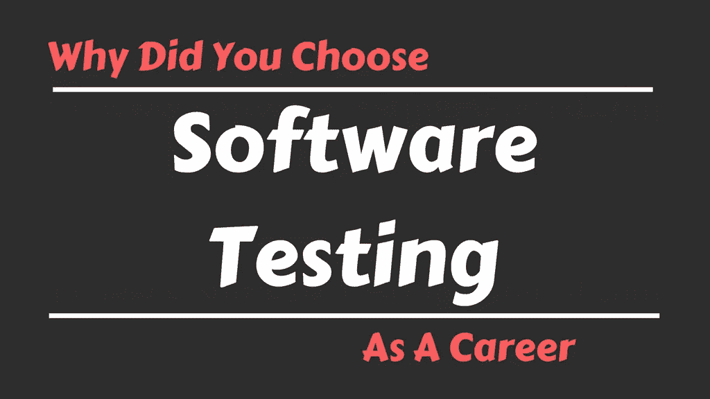

# 你为什么选择软件测试作为职业？

> 原文:[https://www . software testing material . com/choose-software-testing-as-a-career/](https://www.softwaretestingmaterial.com/choose-software-testing-as-a-career/)

“你为什么选择软件测试作为职业”是面试过程中最常见的问题之一。所以准备好一个能给面试官留下深刻印象的答案。记下一些与你自己的优势和经验相关的要点，准备好答案。面试的时候不要死记硬背回答。

我们通常会收到来自读者的电子邮件，如下所述。

*   对于大一新生来说，软件测试是一个好的职业选择吗？
*   我怎样才能在软件测试职业生涯中获得更多的成长？
*   软件测试和软件开发哪个工作岗位比较好？
*   软件测试职业是个好的选择吗？
*   软件测试员的工作真的是一份低调的工作吗？

每个职业道路都是独一无二的，我们不能否认这一点。如果你想成为一名软件测试员，或者你已经是一名软件测试员，那么你必须给出一些好的答案，给面试官留下深刻印象。

一去不复返的日子，请看下面指向上述神话。如果你在选择软件测试作为职业时很混乱，那么这些点会让你坚定地选择软件测试作为职业(或者)如果你已经是一名软件测试员，并担心你的职业发展，那么这些点会证明你选择了一条正确的职业道路。

查看下面的视频，看看“你为什么选择软件测试作为职业”

[https://www.youtube.com/embed/X9xpLu-eJPA?rel=0](https://www.youtube.com/embed/X9xpLu-eJPA?rel=0)

请耐心等待。视频将在一段时间后加载。

1.  不是每个人都能考的。一个人应该需要良好的分析技能才能成为一名软件测试人员。你需要擅长报告和说服他人的沟通技巧。
2.  刚开始事业的时候工资可能会少一些。与开发人员相比，有经验的测试人员获得相同水平的软件包。与开发人员相比，许多公司给自动化测试人员提供了更高的薪水。
3.  一个不会编码的人可以成为软件测试员，这在业内是一个古老的神话。录制和回放的日子已经一去不复返了。这是一个自动化时代。自动化测试人员编写代码来自动化脚本。
4.  成长——测试人员将成为测试领导、项目领导、自动化架构师、测试经理等。最终，每个人都会晋升到经理级别。

> 必读:[软件测试人员 SQL 教程](https://www.softwaretestingmaterial.com/sql-tutorial-complete/)

## 将软件测试作为职业——我为什么选择它？

一个简单的答案是我喜欢成为一名软件测试员。所以，我选择了软件测试作为职业。关于我为什么热爱做软件测试人员，选择软件测试作为职业，我想再提几点。

我喜欢解决逻辑难题。测试是一种解决逻辑难题的方法。如果我们点头表示软件中没有错误并准备发布，我们将获得直接进入市场的软件。我们，测试人员是网关的保护者。我们不仅找到了虫子。在压力测试方面，我们也破坏了系统。

我喜欢帮助别人。🙂我自豪地说，作为一名软件测试人员，我确实帮助向市场发布了一个高质量的产品。我可以帮助找出隐藏在软件中的错误。即使开发者尽最大努力发布一个好的产品，也会有一些错误。

我喜欢接受挑战。在很多项目中，我们需要在没有规范文档的情况下做测试。探索系统并找到漏洞是一个巨大的挑战。领域知识也是测试人员面临的最大挑战之一。我们，测试人员，探索系统，努力理解和发现错误，并报告修复和交付高质量的产品到市场。

我也喜欢写代码。对，我是自动化测试员。谁说一个不会编码的人可以选择软件测试这个职业。作为一名自动化测试人员，我编写代码来发现系统中的错误，并参与交付高质量的产品。

> 必读:[100 大Selenium面试问题](https://www.softwaretestingmaterial.com/selenium-interview-questions/)

我喜欢与人交流。作为一名软件测试人员，我可以获得很多与人交流的机会(不仅仅是同事，我还可以与利益相关者讨论)。测试人员需要知道他们将要测试的应用程序的所有部分。所以我们也需要与客户讨论，以获得更多领域知识的信息。通过这种方式，我们可以认识很多人来分享知识。

我喜欢在一个交付优质产品的团队中工作。顾客花很多钱购买一件产品。如果产品没有达到预期效果，没有顾客会满意。我扮演的角色是提供高质量的产品，不仅让客户满意，还让客户高兴。

> 必读:[软件开发中的敏捷 Scrum 方法论](https://www.softwaretestingmaterial.com/agile-scrum-methodology/)

**结束语:***我的工作帮助股东睡得更好。*

你喜欢选择软件测试作为职业吗？如果是，那就开始准备简历吧。我已经为新生和有经验的专业人士张贴了一些简历样本。点击此处[软件测试人员简历样本](https://www.softwaretestingmaterial.com/sample-resume-for-software-testers-freshers-and-experienced/)获取简历样本，并根据您的要求进行修改。

**相关文章:**

*   [什么是软件测试？](https://www.softwaretestingmaterial.com/software-testing/)
*   [手动测试教程](https://www.softwaretestingmaterial.com/manual-testing-tutorial/)
*   [自动化测试教程](https://www.softwaretestingmaterial.com/automation-testing-tutorial/)
*   [Selenium教程](https://www.softwaretestingmaterial.com/selenium-tutorial/)
*   [人工测试面试问题](https://www.softwaretestingmaterial.com/100-software-testing-interview-questions/)
*   [Selenium面试问题](https://www.softwaretestingmaterial.com/selenium-interview-questions/)