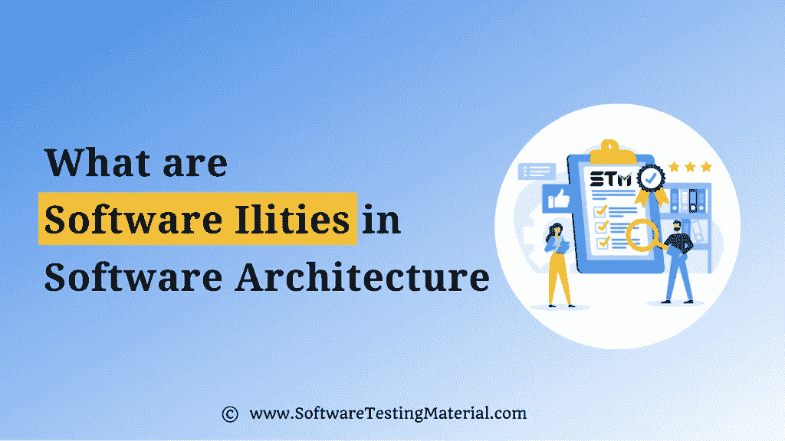

# 软件架构中的质量属性是什么

> 原文:[https://www . software testing material . com/quality-attributes-in-software-architecture/](https://www.softwaretestingmaterial.com/quality-attributes-in-software-architecture/)

软件质量属性(也称为非功能需求)帮助软件架构师评估软件应用程序的性能。

这些质量属性决定了软件质量的好坏。

这些质量属性有时也被称为“能力”,在大多数与系统能力共享相关的词的后缀之后，例如可用性、可靠性、可伸缩性、可测试性等。,

软件应用程序应该运行良好，并满足其利益相关者给出的规范。

如上图所示，功能需求只是冰山一角。

离开质量属性的后果导致技术债和质量问题增加。

## **软件架构中的软件功能**

让我们看看[软件架构](https://www.softwaretestingmaterial.com/software-architecture/)

*   [Software architecture](#h-software-ilities-in-software-architecture)
    *   List of quality attributes in [1) Availability](#h-1-usability)
    *   [2) Reliability](#h-2-reliability)
    *   [3) Availability](#h-3-availability)
    *   [4) Portability](#h-4-portability)
    *   [5) Testability](#h-5-testability)

*   [10) Supportability](#h-10-supportability)
*   [11) Interoperability](#h-11-interoperability)
*   [12) Performance](#h-12-performance)
*   [13) Safety](#h-13-security)

您必须根据您的项目需求来确定这些系统质量属性的优先级。

### **1)可用性**

它被描述为用户如何有效地利用一个系统，以及用户学习操作或控制该系统的难易程度。众所周知的可用性原则是 KISS(保持简单愚蠢)。软件应用应该是用户友好的。

### **2)可靠性**

它是一个系统持续运行一段时间的能力

### **3)可用性**

它是可用系统时间与系统运行所需或预期的总工作时间之比。

### **4)便携性**

它是一个软件应用程序在许多平台上运行的能力，如数据可移植性、托管、查看等。,

### **5)可测试性**

它显示了系统或组件执行测试的便利程度，以确定是否满足预定义的测试标准。

### **6)可扩展性**

它是系统在不降低性能的情况下处理因使用量增加而产生的压力需求的能力。

### **7)灵活性**

它是系统适应未来变化的能力

### 8)可重用性

它是利用现有的软件 I 多一个软件与小或没有变化。这是一个成本效益和时间节省的质量属性。

### **9)可维护性**

它是软件应用程序易于维护和支持成本效益变化的能力。

### **10)可支持性**

它是一个系统满足必要的要求和需要来识别和解决问题的能力。

### **11)互操作性**

它是两个或多个系统轻松通信或交换数据并使用已交换数据的能力。

### **12)性能**

它是系统在一定时间内对各种行为作出反应的能力

### **13)安全**

它是系统抵御或阻止破坏系统的恶意或未经授权的尝试，同时为合法用户提供访问的能力。

**总之:**

软件解决方案中的系统质量属性提高了 IT 系统的 ROI(投资回报),也产生了质量更好的应用程序。

这不是一个详尽的质量属性列表。想进一步深入阅读，可以查看[这个链接](https://en.wikipedia.org/wiki/List_of_system_quality_attributes)。

**相关帖子:**

*   [什么是软件测试](https://www.softwaretestingmaterial.com/software-testing/)
*   [软件架构——一层、二层、三层& N 层](https://www.softwaretestingmaterial.com/software-architecture/)
*   [质量保证与质量控制](https://www.softwaretestingmaterial.com/quality-assurance-vs-quality-control/)
*   [什么是功能测试](https://www.softwaretestingmaterial.com/functional-testing/)
*   [什么是非功能测试](https://www.softwaretestingmaterial.com/non-functional-testing/)
*   [如何在软件开发中成功成为敏捷 QA](https://www.softwaretestingmaterial.com/how-to-succeed-as-agile-qa/)