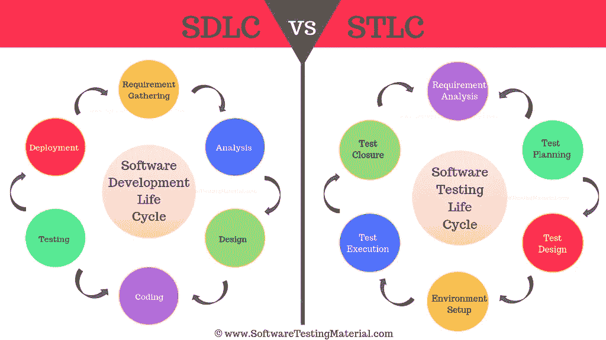

# SDLC 与 STLC:有什么区别

> [https://www . software sprinkmaterial . com/SDLC-vs-STL/](https://www.softwaretestingmaterial.com/sdlc-vs-stlc/)

因此，在本文中，我将比较[软件开发生命周期](https://www.softwaretestingmaterial.com/sdlc-software-development-life-cycle/)和[软件测试生命周期](https://www.softwaretestingmaterial.com/stlc-software-testing-life-cycle/) (SDLC 与 STLC)。让我们来看看本文将要讨论的内容

<button class="kb-table-of-contents-title-btn kb-table-of-contents-toggle" aria-expanded="false" aria-label="Expand Table of Contents">Table of Contents</button>

*   [什么是 SDLC？](#h-what-is-sdlc)
*   [SDLC 有哪些不同的阶段？](#h-what-are-the-different-phases-of-sdlc)
*   [为什么选择 SDLC？](#h-why-sdlc)
*   什么是软件测试生命周期？
*   STLC 有哪些不同的阶段？
*   [SDLC&STLC(SDLC vs STLC)有什么区别？](#h-what-is-the-difference-between-sdlc-stlc-sdlc-vs-stlc)
*   [常见问题的 STLC 与 SDLC](#h-faq-s-stlc-vs-sdlc)
    *   STLC 的 6 个阶段是什么？
    *   [STLC 是 SDLC 的一部分吗？](#is-stlc-a-part-of-sdlc)
    *   [什么是 V 型 SDLC？](#what-is-v-model-sdlc)

## **什么是 SDLC？**

**软件开发生命周期** (SDLC)旨在生产一个高质量的系统，满足或超过客户的期望，在当前和计划的信息技术基础设施中有效和高效地工作，并且维护成本低廉，增强成本有效。

## **SDLC 有哪些不同的阶段？**

软件测试生命周期的不同阶段是:

1.需求阶段
2。分析阶段
3。设计阶段
4。发展阶段
5。测试阶段
6。部署&维护阶段

*   它向所有参与的风险承担者提供了项目计划的可见性
*   它帮助我们规避项目风险
*   它允许我们跟踪和控制项目
*   直到所有的要求都达到了，它才结束

## 什么是软件测试生命周期？

软件测试生命周期( **STLC** )确定了执行什么测试活动以及何时完成这些测试活动。尽管不同组织之间的测试不同，但是有一个测试生命周期。

## STLC 有哪些不同的阶段？

软件测试生命周期的不同阶段是:

1.需求分析
2。测试计划
3。测试设计
4。测试环境设置
5。测试执行
6。测试结束

> [STLC–完整指南](https://www.softwaretestingmaterial.com/stlc-software-testing-life-cycle/)

## **SDLC&STLC(SDLC vs STLC)有什么区别？**

| 标准 | SDLC | stcc！stcc |
| --- | --- | --- |
| 起源 | 开发生命周期 | 测试生命周期 |
| 代表 | SDLC 代表软件开发生命周期 | STLC 代表软件测试生命周期 |
| 定义 | 软件开发生命周期(SDLC)旨在生产一个高质量的系统，该系统满足或超过客户的期望，在当前和计划的信息技术基础设施中有效和高效地工作，并且维护成本低廉，增强成本有效。 | 软件测试生命周期(STLC)确定执行什么测试活动以及何时完成这些测试活动。尽管不同组织之间的测试不同，但是有一个测试生命周期。 |
| 焦点 | 在开发和测试过程中 | 仅在测试过程中 |
| 关系 | 它被视为前身 | 它被视为后继者 |
| 阶段 | 需求收集、
分析、
设计、
编码、
测试、
部署&维护 | 需求分析，
测试计划，
测试设计，
环境设置，
测试执行，
测试结束 |
| 需求收集阶段 | 业务分析师收集需求并创建开发计划 | QA 团队分析需求文档并创建系统测试计划 |
| 设计阶段 | 开发团队根据需求开发软件的高层和低层设计 | 测试架构师或者测试领导通常会计划测试策略 |
| 编码阶段 | 实际代码是根据设计文档开发的 | QA 团队准备测试环境 |
| 测试阶段 | 实际测试在这个阶段完成。它包括单元、集成、系统、重测和回归测试等。，
开发团队也参与修复报告的错误 | 实际测试在这个阶段完成。缺陷报告和重新测试在这里完成 |
| 部署或维护阶段 | 开发团队参与支持和发布更新 | QA 团队执行回归套件来检查部署的维护代码 |
| 当它被执行时 | SDLC 阶段在 STLC 阶段之前执行 | STLC 阶段在 SDLC 阶段之后执行 |
| 结果 | 高质量的软件产品 | 一个没有错误的软件 |

## **常见问题的 STLC 与 SDLC**

### STLC 的 6 个阶段是什么？

软件测试生命周期的 6 个阶段如下:
**阶段 1:** 需求分析。
**第二阶段:**测试计划。
**第三阶段:**测试设计。
**阶段 4:** 测试环境设置。
**阶段 5:** 测试执行。
**第六阶段:**测试周期结束。

### **STLC 是 SDLC 的一部分吗？**

是的，软件测试生命周期是软件开发生命周期的一部分。SDLC 在完整的软件开发中起着重要的作用，而 STLC 仅限于测试阶段。所以 STLC 是 SDLC 的子集。

### **什么是 V 型 SDLC？**

v 模型是一种 SDLC 模型。v 模型是指验证和确认模型。在 V 形生命周期中，流程的执行以 V 形的顺序方式进行。

**相关帖子:**

*   [测试计划与测试策略](https://www.softwaretestingmaterial.com/test-strategy-vs-test-plan/)
*   [测试用例与测试场景](https://www.softwaretestingmaterial.com/test-scenario-vs-test-case/)
*   [冒烟测试与健全性测试](https://www.softwaretestingmaterial.com/smoke-testing-vs-sanity-testing/)
*   [手动测试教程](https://www.softwaretestingmaterial.com/manual-testing-tutorial/)
*   [100+人工测试面试题](https://www.softwaretestingmaterial.com/100-software-testing-interview-questions/)