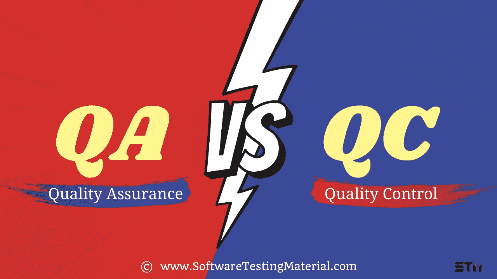

# 质量保证与质量控制的区别(QA 与 QC)

> 原文:[https://www . software testing material . com/quality-assurance-vs . quality-control/](https://www.softwaretestingmaterial.com/quality-assurance-vs-quality-control/)

在我们了解质量保证和质量控制的区别之前。首先，让我们了解以下主题以及质量保证和质量控制

*   [什么是品质？](#h-what-is-quality)
*   [什么是软件质量？](#h-what-is-software-quality)
*   [什么是质量管理？](#h-what-is-quality-management)
*   [什么是保证？](#h-what-is-assurance)
*   什么是质量保证？
*   [什么是控制？](#h-what-is-control)
*   什么是质量控制？
*   [质量控制与质量保证(QC 与 QA)的区别是什么](#h-what-is-the-difference-between-quality-control-vs-quality-assurance-qc-vs-qa)
*   [质量保证与质量控制对比](#h-quality-assurance-vs-quality-control-comparison)
*   [质量保证与质量控制信息图:](#h-qa-vs-qc-infographic)
*   [质量控制和质量保证流程的真实例子](#h-real-life-example-of-quality-control-and-quality-assurance-process)
    *   [问答示例:](#h-qa-example)
    *   [QC 示例:](#h-qc-example)

## **什么是品质？**

质量这个词有很多意思。如果你查字典，你会发现如下图所示的几个定义。

质量这个术语比它看起来要复杂得多。

字典定义不足以理解这个概念。

> 质量不是一种行为；这是一种习惯——亚里士多德

## **什么是软件质量？**

**[维基百科](https://en.wikipedia.org/wiki/Software_quality)这样描述软件质量:**

软件质量是一个假设的概念。

软件质量被定义为产品满足或超过客户的需求，并且没有缺陷。

一个软件质量的产品总是让客户对产品的功能、设计、可靠性、耐用性和价格感到满意。

## **什么是质量管理？**

质量管理确保一个组织、产品或服务不断追求卓越。

质量保证和质量控制概念都是质量管理的一部分。

术语 QA 和 QC 经常互换使用。尽管这两个术语相似，但这两个概念之间还是有一些差异。

在本文中，我们将向您详细展示 QA 和 QC 之间的区别。

## **什么是保证？**

如果你在字典中查找单词 assurance，你会发现如下图所示的几个定义。

保证是一个积极的声明，旨在给产品以信心。

它保证了产品将按照要求或期望无任何故障地工作。

## 什么是质量保证？

质量保证涉及面向过程的活动。它确保在用于制作软件应用程序的过程中防止缺陷。因此，当软件应用程序被开发时，缺陷不会出现。

质量保证有一个明确的循环，称为戴明循环或 PDCA 循环。

在此了解 [PDCA 循环](https://www.softwaretestingmaterial.com/pdca-cycle/)的各个阶段。

## **什么是控制？**

如果你在字典中查找单词 assurance，你会发现如下图所示的几个定义。

控制是通过对照规范测试输出来验证错误，以维持标准。

## 什么是质量控制？

质量控制涉及面向产品的活动。它执行程序或代码来识别软件应用程序中的缺陷。

## **质量** **控制** **vs 质量** **保证** **(** **QC vs QA)**

对于一个组织来说，认识到质量保证(QA)和质量控制(QC)的后果是至关重要的。这两种结构都是组织质量管理计划的必要组成部分。

通常，QA(质量保证)和 QC(质量控制)这两个术语相对来说是被个人使用的，尤其是那些刚接触[软件测试](https://www.softwaretestingmaterial.com/software-testing/)领域的人，不管怎样，这似乎是不对的。

质量保证和质量控制都是处理改进产品性质的一种方法，它们是软件开发的核心。

在任何情况下，两者都承担测试过程中的第一项工作。

质量保证和质量控制是相互联系的，但它们的启动依赖于不同的阶段。

在更高的程度上，质量保证是一种以过程为中心的方法，它以对错误或缺陷的预期为中心。这基本上意味着我们提出可信的计划和策略，以便在开发开始之前或者在开发的早期阶段发现越来越多的缺陷。

然而，质量控制是一种以产品为中心的方法，它以缺陷的识别为中心，当然也是根据它们的优先级尽快修复它们。

## **质量保证人** **ce vs 质量控制对比**

下面是一个综合表格，列出了质量控制和质量保证之间的明显差异，以便读者更好地理解:

| 质量保证 | 质量管理 |
| --- | --- |
| QA 使用静态测试技术，它属于验证范畴，这意味着确保产品是按照要求开发的。 | QC 使用一种动态测试技术，它属于验证范畴，这意味着在开发的产品中满足所有用户的期望。 |
| 质量保证旨在防止缺陷。 | 质量控制旨在识别和修复缺陷。 |
| QA 是一种预防性技术。 | 质量控制是一种矫正技术。 |
| 质量保证是一种基于程序的方法。 | QC 是一种基于产品的方法。 |
| 质量保证在质量控制之前完成。 | 质量控制只有在质量保证之后才能进行。 |
| QA 就是管理质量。 | QC 是验证质量。 |
| QA 负责整个软件开发生命周期。 | QC 负责软件测试生命周期。 |
| 所有团队成员都对质量保证负责。 | 大多数情况下，只有测试负责质量控制。 |
| QA 不参与执行测试。 | QC 参与执行测试。 |
| QA 是在过程的早期识别弱点的过程。 | 质量控制是在产品交付后(换句话说，在生产环境中)发现薄弱环节的过程。 |
| 质量保证通过提高开发中产品的质量，朝着软件开发的方向发展。 | 质量控制是用于确认交付的最终产品质量的策略安排。 |
| 质量保证在很大程度上是一项广泛的行动，在此过程中，建立长期的高质量管理框架——并调查这些框架是否有助于我们适应客户的先决条件——已经完成。以这种方式，质量保证是以过程为中心的。 | 质量控制更多的是与产品相关的程序，我们将确保客户的先决条件始终得到满足。从这个角度来说，QC 是以产品为中心的。 |
| 质量保证侧重于以防止缺陷出现的方式实施程序。 | 质量控制的重点是实施程序，以便从当前运行的系统中发现更多的缺陷，并最终修复它们，从而提高质量。 |
| 除了比较的目的之外，QA 包括对发现或记录的人工审计，例如质量计划或测试计划。 | 通常使用传统的操作软件或脚本的技术来执行 QC，只有在很短的时间内确定系统是否按照预期工作。 |
| 应用于质量保证的统计技术被称为统计过程控制(SPC)。 | 应用于质量控制的统计技术被称为统计质量控制(SQC)。 |
| QA 是一个低层次的活动，耗时较少。 | 质量控制是一项高层次的活动，需要花费更多的时间。 |
| WRT 软件，质量保证成为软件质量保证(SQA)。 | WRT 软件，QC 变成软件测试。 |

## **质量保证与质量控制信息图:**

## **质量控制和质量保证流程的真实例子**

### **问答示例:**

当我们开始一个新项目时，我们可能会面临一些困难，尤其是当我们使用新技术时。为了顺利工作，我们需要制定一些计划，让我们的团队成员接受新技术培训。

我们需要收集设计文档、技术和功能需求文档等。，与团队分享以熟悉新技术，这些文档将对团队中的新人有所帮助。

将准备一个测试策略来涵盖最终产品中可能出现的所有风险，并确保项目不会产生任何风险。

这个过程属于质量保证过程。

质量控制将在质量保证完成后开始。因此，我们必须确保 QA 过程尽可能多地防止缺陷。我们知道，如果及早发现，修复 bug 或缺陷的成本会更低

QA 旨在预防问题。

### **QC 示例:**

团队遵循质量保证过程中准备的文件。现在，当团队在产品上工作，以确保它是否按预期工作，并发现任何缺陷。然后团队必须报告缺陷来修复它们，以制造高质量的产品。这个过程属于质量控制过程。

质量控制旨在发现问题。

**结论:**

质量保证和质量控制使产品无缺陷，并确保它满足客户的期望和需求。

尽管事实上这两个程序的目标是相同的，但用来实现目标的方法显然是独特的。

总而言之，同等重视质量保证和质量控制将确保更高质量的产品。

我们进一步相信，质量是一个永无止境的过程，因为你提高质量，它将增加产量，加上它将创造一个良好的影响，并降低成本。

我们讨论了质量保证、质量控制和质量管理，其目标是通过检验活动有效地领导和实施质量体系，确保行业标准、客户规范和质量标准。

因此，质量对于组织的成功至关重要，这可以通过质量管理来实现。

一种方法将导致实现关注质量和控制的目标，这种方法应该在组织中严格实施。

**相关帖子:**

*   [什么是软件测试](https://www.softwaretestingmaterial.com/software-testing/)
*   [你为什么选择质量保证作为职业](https://www.softwaretestingmaterial.com/choose-software-testing-as-a-career/)
*   [什么是 SDET(测试中的软件开发工程师)](https://www.softwaretestingmaterial.com/sdet-software-development-engineer-in-test/)
*   [100 多种软件测试类型](https://www.softwaretestingmaterial.com/types-of-software-testing/)
*   [实时软件 QA 面试问题](https://www.softwaretestingmaterial.com/software-qa-interview-questions-answers/)
*   [热门软件测试面试问题](https://www.softwaretestingmaterial.com/100-software-testing-interview-questions/)