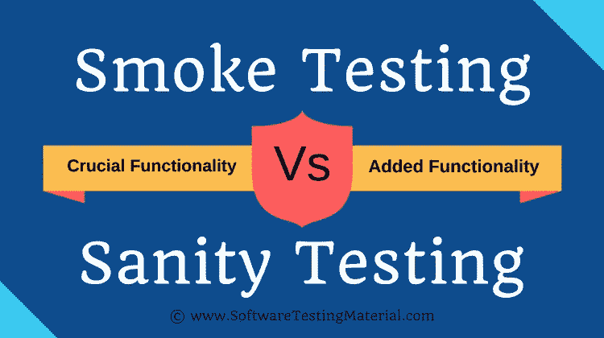

# 什么是冒烟测试和健全性测试？冒烟测试与健全性测试对比示例

> 原文:[https://www . software testing material . com/smoke-testing-vs-sanity-testing/](https://www.softwaretestingmaterial.com/smoke-testing-vs-sanity-testing/)

在本文中，我们将了解什么是冒烟测试和健全测试，以及冒烟测试和健全测试之间的区别。冒烟测试和健全性测试都有自己的目标和优先级。这两种[类型的测试](https://www.softwaretestingmaterial.com/types-of-software-testing/)在项目的成功中起着关键作用。

在构建发布之后，冒烟和健全性测试开始出现。当谈到冒烟测试和健全测试之间的区别时，新手测试人员会感到混乱。在本文中，让我们看看什么是冒烟测试和健全性测试，以及冒烟测试和健全性测试之间的区别，并通过实例来详细说明，以便于理解。希望在本文结束时，您会对健全性和冒烟测试有一个清晰的概念。

查看下面的视频，了解“冒烟测试与健全性测试”

如果你喜欢这个视频，那么请订阅我们的 YouTube 频道以获得更多的视频教程。

## **什么是软件测试中的冒烟测试？**

冒烟测试是为了确定我们从开发团队那里收到的构建是否是可测试的。它也被称为“第 0 天”检查。这是在“构建级别”完成的。

当关键特性不起作用或者关键错误还没有被修复时，不要浪费测试时间来简单地测试整个应用程序。这里，我们将重点关注主要和核心应用程序工作流。

## **如何进行烟尘测试？**

为了进行冒烟测试，我们不编写测试用例。我们只是从已经写好的测试用例中挑选必要的测试用例。

我们真的为所有测试类型编写了测试用例吗？在本文中，我们已经给出了选择测试类型来编写测试用例的清晰思路。

如前所述，在冒烟测试中，我们主要关注核心应用程序工作流。因此，我们从测试套件中挑选覆盖应用程序主要功能的测试用例。一般来说，我们选择最少数量的测试用例，这些测试用例的执行时间不会超过半个小时。

**实时示例:**假设你在一家电子商务网站工作。当一个新的版本发布测试时，作为一个软件 QA，你必须确保核心功能是否正常工作。因此，您尝试访问电子商务网站，并在购物车中添加一件商品来下订单。这是大多数电子商务网站的主要工作流程。如果这个流程有效，您可以说这个构建通过了。您可以继续在同一个构建上进行功能测试。

## **什么是软件测试中的健全性测试？**

健全性测试是在发布阶段完成的，目的是检查应用程序的主要功能，而不需要更深入。它也被称为回归测试的子集。它是在“发布级别”完成的。

有时由于发布时间的限制，严格的[回归测试](https://www.softwaretestingmaterial.com/difference-between-regression-and-retesting/)无法对构建进行，健全性测试通过检查主要功能来完成这一部分。

大多数时候，我们没有足够的时间来完成整个测试。特别是在[敏捷方法](https://www.softwaretestingmaterial.com/agile-scrum-methodology/)中，我们会受到来自产品所有者的压力，要求我们在几个小时或一天结束前完成测试。在这些场景中，我们选择健全性测试。健全性测试在这种情况下起着关键作用。

早些时候，我已经发布了一个关于“回归和重测之间的差异”的详细帖子。如果你没有浏览过，可以点击链接浏览。

## 如何进行完整性测试？

与冒烟测试一样，我们不为健全性测试编写单独的测试用例。我们只是从已经写好的测试用例中挑选必要的测试用例。

如前所述，它是回归测试的一个子集。当谈到健全性测试时，主要的焦点是确保计划的功能是否如预期的那样工作。

实时例子:我们举一个和上面一样的例子。假设你正在一个电子商务网站上工作。发布了一个与搜索功能相关的新特性。在这里，你的主要精力应该放在搜索功能上。一旦你确定搜索功能运行良好，你就可以继续其他主要功能，如支付流程。

**神智健全&烟雾测试流程:**

冒烟测试也称为**构建验证测试**

完整性测试也被称为**表面水平测试**

## **冒烟测试与健全性测试**

### **展示冒烟测试和健全性测试之间差异的示例:**

例如:在首次发布的项目中，开发团队发布用于测试的构建，而测试团队测试该构建。第一次测试构建是接受还是拒绝构建。我们称之为冒烟测试。如果测试团队接受了这个构建，那么这个特定的构建将进行进一步的测试。假设构建有 3 个模块，即登录，管理，员工。测试团队测试应用程序的主要功能，但不深入。我们称之为健全测试。

### **冒烟测试和健全性测试之间的更多差异:**

| 烟雾测试 | 健全性测试 |
| --- | --- |
| 冒烟测试是为了确定我们从开发团队那里收到的构建是否是可测试的 | 健全性测试是在发布阶段完成的，目的是检查应用程序的主要功能，而不需要更深入 |
| 冒烟测试由开发人员和测试人员共同执行 | 健全性测试是由测试人员单独执行的 |
| 冒烟测试从头到尾测试了整个应用程序 | 健全性测试只测试整个应用程序的特定组件 |
| 冒烟测试，构建可能稳定也可能不稳定 | 健全性测试，构建相对稳定 |
| 它是在初始构建时完成的。 | 它是在稳定的构建上完成的。 |
| 这是基本测试的一部分。 | 这是回归测试的一部分。 |
| 通常每次有新的构建版本时都会这样做。 | 当没有足够的时间进行深入测试时，就计划这样做。 |

## 我们会自动进行烟雾测试吗？

我收到了许多来自我的脸书和 T2 推特粉丝的询问。

是的，我们确实自动化了烟雾测试案例。节省了很多测试时间。假设您有 50-100 个冒烟测试用例。要执行这 50-100 个测试用例，可能需要大约 4-6 个小时。如果您有这些测试用例的自动化脚本，那么您可以在构建发布后执行它们，并在比您花费在手动执行冒烟测试用例更少的时间内确认构建是否通过。所以大多数团队自动化了冒烟测试案例。

**相关文章:**

*   [测试完成教程](https://www.softwaretestingmaterial.com/manual-testing-tutorial/)
*   [每个测试人员都应该知道的 100 多种测试类型](https://www.softwaretestingmaterial.com/types-of-software-testing/)
*   [人工测试面试问题](https://www.softwaretestingmaterial.com/100-software-testing-interview-questions/)
*   [QA 面试问题](https://www.softwaretestingmaterial.com/software-qa-interview-questions-answers/)